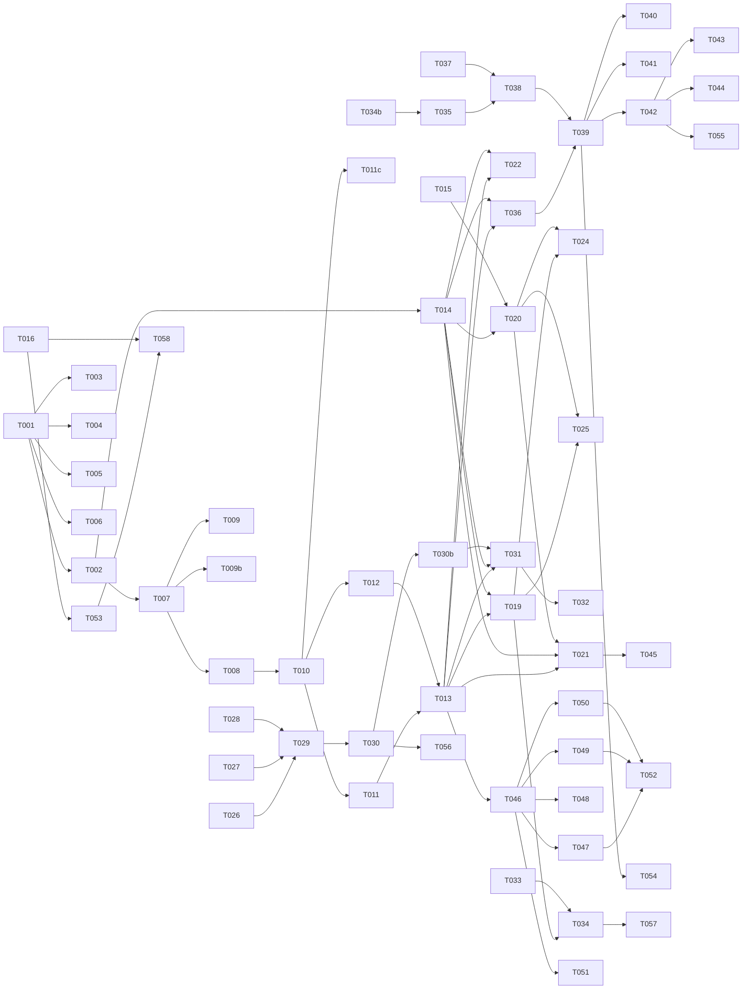

# Tasks: Twin Engine Foundation

**Input**: Design documents from `specs/001-twin-engine-foundation/`
**Prerequisites**: plan.md (required), spec.md (required), research.md, data-model.md, contracts/

**Organization**: Tasks grouped by user story. Each story independently implementable and testable.

## Format: `[ID] [AGENT] [Story?] Description`

## Agent Tags

| Tag | Agent | Domain |
|-----|-------|--------|
| `[SETUP]` | — (orchestrator) | Project init, shared config, scaffolding |
| `[DB]` | database-architect | Schema, migrations, seeds, indexes |
| `[BE]` | backend-specialist | API routes, services, middleware, server logic |
| `[OPS]` | devops-engineer | Docker, CI/CD, infra, deploy configs |
| `[E2E]` | test-engineer | Cross-boundary integration/E2E tests |
| `[SEC]` | security-auditor | Security audit, vulnerability review |

---

## Phase 1: Setup (Shared Infrastructure)

**Purpose**: Monorepo initialization, pnpm workspaces, shared types

- [x] T001 [SETUP] Initialize pnpm monorepo with `pnpm-workspace.yaml`, root `package.json` (private), `tsconfig.json` base config, `.gitignore`, `LICENSE` (Apache 2.0)
- [x] T002 [SETUP] Create `packages/shared/` with TypeScript types: `Persona`, `Conversation`, `Message`, `ChannelInstance`, `TrainingJob`, `UsageEvent`, `ChannelMessage`, `ChannelAdapter`, `PersonaTraits`, `ModelPreferences`, `MessageMetadata` — aligned with data-model.md
- [x] T003 [SETUP] Create `packages/shared/src/errors.ts` — typed error classes: `AppError`, `NotFoundError`, `UnauthorizedError`, `ConflictError`, `ValidationError`, `ServiceUnavailableError`
- [x] T004 [SETUP] Create `packages/shared/src/constants.ts` — channel types, training source types, job statuses, RAG collection naming convention function
- [x] T005 [SETUP] Create `drizzle.config.ts` at repo root pointing to `packages/core/src/models/`
- [x] T006 [SETUP] Create `packages/core/package.json`, `packages/api/package.json`, `packages/training/package.json`, `packages/memory/package.json`, `packages/cli/package.json`, `packages/channel-telegram/package.json`, `packages/channel-whatsapp/package.json` — each with TypeScript ESM config, vitest, relevant deps

---

## Phase 2: Foundational (Blocking Prerequisites)

**Purpose**: Core infrastructure that MUST be complete before ANY user story

**⚠️ CRITICAL**: No user story work can begin until this phase is complete

- [x] T007 [DB] Create Drizzle schema files in `packages/core/src/models/` — `tenants.ts`, `personas.ts`, `conversations.ts`, `messages.ts`, `channel-instances.ts`, `training-jobs.ts`, `usage-events.ts`, `relations.ts` — per data-model.md
- [x] T008 [DB] Create initial migration via `drizzle-kit generate` — SQL files in `drizzle/` directory
- [x] T009 [DB] Create RLS policy SQL files in `drizzle/rls/` — tenant_isolation for all tenant-scoped tables, tenant_isolation_messages for messages via EXISTS join
- [x] T009b [DB] Create `packages/core/src/models/api-tokens.ts` — Drizzle schema for `api_tokens` table: `id` (uuid PK), `tenant_id` (uuid FK), `name` (text), `token_hash` (text), `created_at`, `revoked_at` (nullable). Index on `token_hash`
- [x] T010 [BE] Create `packages/core/src/db.ts` — Drizzle + postgres connection pool. Tenant context via `withTenantContext<T>(tenantId: string, fn: (tx) => Promise<T>): Promise<T>` helper that wraps operations in `db.transaction()` and issues `SET LOCAL app.current_tenant = '<id>'` inside the transaction. `SET LOCAL` auto-resets on commit/rollback — prevents cross-tenant leakage in pooled connections. All repository methods MUST use this helper.
- [x] T011 [BE] Create `packages/core/src/middleware/tenant.ts` — Fastify plugin that extracts tenant context from: (1) `X-Tenant-ID` header, OR (2) JWT `tenant` claim (decoded by upstream gateway, passed as `X-Tenant-Claim` header). Validates tenant exists in reference table, sets `request.tenantId`. Missing both sources → 401
- [x] T011b [BE] Create `packages/core/src/middleware/auth.ts` — Bearer token authentication for standalone mode. Validates `Authorization: Bearer <token>` against `api_tokens` table (hash comparison). Maps token → `tenant_id`. If token present, `X-Tenant-ID` header must match token's tenant (or is auto-set). SaaS mode: this middleware is disabled, auth delegated to gateway. Controlled by `TWIN_AUTH_MODE=standalone|gateway` env var
- [x] T011c [BE] Create `packages/api/src/routes/tokens.ts` — `POST /v1/tokens` (create API token for tenant, return token in response body — shown once), `DELETE /v1/tokens/:id` (revoke token). Tenant-scoped. Token value: `crypto.randomBytes(32).toString('hex')`, stored as SHA-256 hash
- [x] T012 [BE] Create `packages/core/src/middleware/error-handler.ts` — Fastify error handler that maps `AppError` subclasses to HTTP status codes and OpenAI-shaped error bodies
- [x] T013 [BE] Create `packages/api/src/server.ts` — Fastify server factory: register CORS, tenant middleware, error handler, health route (`GET /v1/health`), multipart support (max file size 500MB, configurable via `TWIN_MAX_UPLOAD_BYTES`), pino logger with redact config (strip `req.body.messages[*].content`, `req.body.config.bot_token`, `res.body.choices[*].message.content`), per-tenant rate limiting via `@fastify/rate-limit` on `/v1/chat/completions` (default 60 req/min)
- [x] T014 [BE] Create `packages/core/src/services/persona-repository.ts` — Drizzle-based CRUD with `WHERE tenant_id = :id` on every query. Methods: `create`, `getById`, `getBySlug`, `list`, `update`, `delete`. `update` uses optimistic locking: `WHERE id = :id AND version = :expectedVersion`, increments version on success, throws `ConflictError(409)` on stale version. Slug uniqueness conflict → 409. All methods wrapped in `withTenantContext()` from T010
- [x] T015 [BE] Create `packages/memory/src/letta-client.ts` — Letta API client wrapper. Methods: `createAgent`, `getAgent`, `addMessage`, `getMemory`, `searchMemory`. Namespace: `tenant_{id}/persona_{id}/conv_{id}`. Graceful fallback when Letta unreachable
- [x] T016 [OPS] Create `infra/docker-compose.standalone.yml` — twin-engine-api (port 8090), postgres (5432), redis (6379). API depends_on postgres + redis
- [x] T017 [OPS] Create `infra/docker-compose.with-orchestra.yml` — twin-engine-api + postgres only. External redis/qdrant from orchestra
- [x] T018 [OPS] Create `infra/.env.example` with all required + optional config vars documented

**Checkpoint**: Foundation ready — user story implementation can begin

---

## Phase 3: User Story 1 — Create and chat with a digital twin via API (Priority: P1) 🎯 MVP

**Goal**: Persona CRUD + OpenAI-compatible chat completions endpoint with streaming
**Independent Test**: Create persona → chat via `/v1/chat/completions` → verify response uses persona's system prompt and recalls prior turns

### Implementation

- [x] T019 [BE] [US1] Create `packages/api/src/routes/personas.ts` — Fastify route handlers: `POST /v1/personas`, `GET /v1/personas`, `GET /v1/personas/:id`, `PATCH /v1/personas/:id`, `DELETE /v1/personas/:id`. Zod validation for create/update. Tenant-scoped via middleware
- [x] T020 [BE] [US1] Create `packages/core/src/services/chat-service.ts` — Core conversation logic: resolve persona by slug, build system prompt + traits context, call LLM via OmniRoute (or direct), integrate Letta memory (create/retrieve per conversation_id agent via letta-client), persist messages, create/update conversation record, emit usage event. Include Letta graceful fallback: if Letta unreachable, use in-context window only and flag degraded mode
- [x] T021 [BE] [US1] Create `packages/api/src/routes/chat-completions.ts` — `POST /v1/chat/completions` route: parse OpenAI-shaped request, resolve `model` → persona slug, delegate to chat-service. Support `stream: true` with SSE response (`text/event-stream`). Error: persona not found → OpenAI-shaped 404
- [x] T022 [BE] [US1] Create `packages/api/src/routes/conversations.ts` — `GET /v1/conversations` (list, tenant-scoped, paginated), `GET /v1/conversations/:id/messages` (paginated). Tenant isolation enforced
- [x] T023 [BE] [US1] Create `packages/core/src/services/usage-service.ts` — Record usage events to `usage_events` table. If `USAGE_EMISSION_ENDPOINT` is configured (OpenMeter or OmniRoute URL), POST usage payload to endpoint. Include acceptance test verifying both local persistence and HTTP emission (mocked)
- [x] T024 [E2E] [US1] Create `packages/api/tests/integration/personas.test.ts` — Integration tests: create persona, get persona, list personas, update persona, delete persona, tenant isolation (404 for wrong tenant)
- [x] T025 [E2E] [US1] Create `packages/api/tests/integration/chat-completions.test.ts` — Integration tests: non-streaming chat, streaming chat (SSE format), persona not found (404), missing tenant (401), multi-turn conversation memory

**Checkpoint**: User Story 1 fully functional — create persona and chat via OpenAI-compatible API

---

## Phase 4: User Story 2 — Train a twin from a real Telegram chat export (Priority: P1)

**Goal**: Training pipeline that ingests Telegram JSON / WhatsApp TXT / JSONL, extracts stylistic traits
**Independent Test**: Upload Telegram JSON → training job completes → persona `traits` populated with ≥5 extracted fields

### Implementation

- [x] T026 [BE] [US2] Create `packages/training/src/parsers/telegram-json.ts` — Stream-parse Telegram JSON export. Yield `{role, content, timestamp}` tuples. Handle >100MB files without OOM
- [x] T027 [BE] [US2] Create `packages/training/src/parsers/whatsapp-txt.ts` — Parse WhatsApp TXT export format. Same output schema as telegram parser
- [x] T028 [BE] [US2] Create `packages/training/src/parsers/generic-jsonl.ts` — Parse generic JSONL `{role, content, timestamp}` per line
- [x] T029 [BE] [US2] Create `packages/training/src/extractors/trait-extractor.ts` — Extract: `avg_sentence_length`, `sentence_length_distribution`, `emoji_density`, `emoji_top_used`, `top_phrases` (n-gram), `formality_score`, `response_latency_pattern`, `lexicon_size`. Respect `traits.manual_lock` keys
- [x] T030 [BE] [US2] Create `packages/training/src/jobs/training-job.ts` — BullMQ job processor: parse file → extract traits → read persona (with version) → merge traits → update WHERE version = :read_version; on conflict (no rows updated), re-read and retry up to 3 times; on persistent conflict, log warning + skip merge → update job status. Progress reporting via `twin.stream.training` stream
- [x] T030b [BE] [US2] Create `packages/shared/src/storage.ts` — File storage abstraction with backends: `local-fs` (single-container dev, writes to `/tmp/twin-uploads/`), `shared-volume` (Docker Compose, mounted volume), `s3` (production). BullMQ job payload carries storage ref (not bytes). Cleanup policy: delete file after job completes or fails. Max file size: 500MB enforced at multipart layer
- [x] T031 [BE] [US2] Create `packages/api/src/routes/training.ts` — `POST /v1/personas/:id/train` (multipart upload with 500MB hard cap, save file via storage abstraction from T030b, create BullMQ job with storage ref, return 202 with job ID), `GET /v1/training-jobs/:id` (status query, tenant-scoped)
- [x] T032 [E2E] [US2] Create `packages/training/tests/integration/training.test.ts` — Integration test: upload Telegram JSON sample → job completes → persona traits populated. Test corrupt file → job fails gracefully

**Checkpoint**: User Stories 1 AND 2 both work independently

---

## Phase 5: User Story 3 — Multi-tenant isolation enforced at every layer (Priority: P1)

**Goal**: Zero cross-tenant data leakage across all endpoints and storage layers
**Independent Test**: Create overlapping data for t1/t2 → assert zero leakage

### Implementation

- [x] T033 [E2E] [US3] Create `packages/api/tests/integration/isolation.test.ts` — Create personas with same slug for t1/t2, conversations, channels. Assert: each tenant sees only own data. Missing tenant → 401. Qdrant collection naming verified. Letta namespace verified
- [x] T034 [SEC] [US3] Audit tenant middleware — verify `X-Tenant-ID` header extraction, JWT claim fallback, no bypass paths. Verify RLS policies are enabled on all tenant-scoped tables

**Checkpoint**: Multi-tenant isolation proven by integration test

---

## Phase 6: User Story 4 — Telegram channel adapter (Priority: P2)

**Goal**: Telegram adapter connects via Telegraf, routes messages through Redis Streams
**Independent Test**: Configure bot → send message → reply arrives within 5 seconds

### Implementation

- [x] T035 [BE] [US4] Create `packages/core/src/services/channel-repository.ts` — CRUD for `channel_instances` table. Methods: `create`, `list`, `delete`, `updateStatus`
- [x] T036 [BE] [US4] Create `packages/api/src/routes/channels.ts` — `POST /v1/channels`, `GET /v1/channels`, `DELETE /v1/channels/:id`. Tenant-scoped
- [x] T037 [BE] [US4] Create `packages/core/src/services/channel-transport.ts` — Redis Streams + consumer groups wrapper: `publish(stream, payload)`, `consume(stream, group, handler)`. Inbound: `twin.stream.in`, outbound: `twin.stream.out`. Uses `XADD` for publish, `XREADGROUP` for consume with manual ACK after processing. Consumer group auto-created. Messages durable — redelivered on consumer crash
- [x] T038 [BE] [US4] Create `packages/core/src/services/channel-orchestrator.ts` — Consume from `twin.stream.in` consumer group, invoke chat-service (with Redlock mutex per conversation_id), publish response to `twin.stream.out`. Idempotency via Redis `SETNX` with 5 min TTL on key `dedup:{channel_id}:{message_id}` — distributed across all API pods. ACK message only after successful processing
- [x] T039 [BE] [US4] Create `packages/channel-telegram/src/telegram-adapter.ts` — Implement `ChannelAdapter` interface. Telegraf-based: connect (long-polling or webhook), onIncoming → publish to `twin.message.in.{channel_id}`, subscribe to `twin.message.out.{channel_id}` → send to Telegram. Reconnection with exponential backoff
- [x] T040 [BE] [US4] Create `packages/channel-telegram/src/index.ts` — CLI entry point: parse `--channel-id`, `--api-url`, `--redis-url` flags, instantiate adapter, connect
- [x] T041 [E2E] [US4] Create `packages/channel-telegram/tests/integration/telegram-adapter.test.ts` — Test: adapter connects, receives message, publishes to `twin.stream.in`, consumes from `twin.stream.out`, sends reply

**Checkpoint**: Telegram channel fully functional end-to-end

---

## Phase 7: User Story 5 — WhatsApp channel adapter via Evolution API (Priority: P2)

**Goal**: Same Redis Streams pattern as Telegram but for WhatsApp via Evolution API
**Independent Test**: Configure Evolution API → send WhatsApp message → receive response

### Implementation

- [x] T042 [BE] [US5] Create `packages/channel-whatsapp/src/whatsapp-adapter.ts` — Implement `ChannelAdapter`. Evolution API client: connect (subscribe to webhook), validate webhook signature against stored `evolution_webhook_secret` (reject mismatched with 401), onIncoming → publish to `twin.stream.in`, consume from `twin.stream.out` consumer group → send via Evolution REST. Retry with exponential backoff (max 5 attempts). Depends on T034b for config encryption
- [x] T043 [BE] [US5] Create `packages/channel-whatsapp/src/index.ts` — CLI entry point: same pattern as telegram
- [x] T044 [E2E] [US5] Create `packages/channel-whatsapp/tests/integration/whatsapp-adapter.test.ts` — Test: adapter lifecycle, webhook handling, outbound delivery, retry on 5xx

**Checkpoint**: Both Telegram and WhatsApp channels operational

---

## Phase 8: User Story 6 — OpenAI-compatible drop-in (Priority: P2)

**Goal**: Stock openai-python / openai-node SDKs work against twin-engine without modification
**Independent Test**: `openai.OpenAI(base_url="http://twin-engine:8090/v1").chat.completions.create(...)` works

### Implementation

- [x] T045 [E2E] [US6] Create `packages/api/tests/integration/openai-compat.test.ts` — Test with openai-node SDK: single-shot, streaming, system+user, multi-turn, model-not-found error shape. Verify response shape matches OpenAI spec exactly

**Checkpoint**: OpenAI compatibility verified by SDK test

---

## Phase 9: User Story 7 — CLI `twin` (Priority: P3)

**Goal**: `twin` CLI for persona management, training, channel control, conversation export
**Independent Test**: `twin persona list --tenant t1` prints table, `twin train start` kicks off job

### Implementation

- [x] T046 [BE] [US7] Create `packages/cli/src/index.ts` — CLI entry point with subcommand parser. Global flags: `--tenant-id`, `--api-url`, `--output`, `--quiet`
- [x] T047 [BE] [US7] Create `packages/cli/src/commands/persona.ts` — Subcommands: list, create, get, update, delete, import. Per cli-commands.md contract
- [x] T048 [BE] [US7] Create `packages/cli/src/commands/conversation.ts` — Subcommands: list, get, export. Output formats: json, table, markdown
- [x] T049 [BE] [US7] Create `packages/cli/src/commands/train.ts` — Subcommands: start, status, cancel. `--watch` flag for live polling
- [x] T050 [BE] [US7] Create `packages/cli/src/commands/channel.ts` — Subcommands: list, create, start, stop, restart, delete
- [x] T051 [BE] [US7] Create `packages/cli/src/commands/health.ts` — Health check command
- [x] T052 [E2E] [US7] Create `packages/cli/tests/integration/cli.test.ts` — Test: persona create + list + train start + health

**Checkpoint**: CLI fully functional

---

## Phase 10: Polish & Cross-Cutting

- [x] T053 [OPS] Create Dockerfile for `packages/api` — multi-stage build, ESM entrypoint
- [x] T054 [OPS] Create Dockerfile for `packages/channel-telegram` — standalone adapter image
- [x] T055 [OPS] Create Dockerfile for `packages/channel-whatsapp` — standalone adapter image
- [x] T056 [OPS] Create `packages/training/Dockerfile` — BullMQ worker image
- [x] T057 [SEC] Security audit: verify no secrets in config JSONB (encrypt bot tokens), verify RLS enabled on all tables, verify tenant middleware covers all routes, verify no raw SQL bypasses tenant filter
- [ ] T058 [OPS] Validate quickstart.md — run standalone path end-to-end in clean Docker environment

---

## Dependency Graph

### Dependencies

T001 → T002, T003, T004, T005, T006
T002 → T007, T014
T007 → T008, T009, T009b
T008 → T010
T010 → T011, T011c, T012
T011 + T012 → T013
T013 + T014 → T019, T021, T022, T031, T036
T014 → T020
T015 → T020
T020 → T021
T019 + T020 → T024, T025
T026 + T027 + T028 → T029
T029 → T030
T030 → T030b
T030b → T031
T031 → T032
T019 + T033 → T034
T034b → T035
T035 + T037 → T038
T036 + T038 → T039
T039 → T040, T041
T039 → T042
T042 → T043, T044
T021 → T045
T013 → T046
T046 → T047, T048, T049, T050, T051
T047 + T049 + T050 → T052
T016 → T053
T039 → T054
T042 → T055
T030 → T056
T034 → T057
T053 + T016 → T058

### Self-Validation Checklist

- [x] Every task ID in Dependencies exists in the task list above
- [x] No circular dependencies
- [x] No orphan task IDs
- [x] Fan-in uses `+` only, fan-out uses `,` only
- [x] No chained arrows on a single line

---

## Dependency Visualization

---

## Parallel Lanes

| Lane | Agent Flow | Tasks | Blocked By |
|------|-----------|-------|------------|
| 1 | [SETUP] | T001 → T002, T003, T004, T005, T006 | — |
| 2 | [DB] | T007 → T008, T009, T009b → T010 | T002 |
| 3 | [BE] core | T011, T012 → T013, T014 → T019, T020, T021, T022 | T010, T015 |
| 4 | [BE] training | T026, T027, T028 → T029 → T030 → T031 → T032 | T013 |
| 5 | [BE] channels | T035, T037 → T038 → T039 → T040, T041 → T042 → T043, T044 | T013 |
| 6 | [BE] CLI | T046 → T047, T048, T049, T050, T051 → T052 | T013 |
| 7 | [OPS] | T016, T017, T018 → T053, T054, T055, T056, T058 | T001 |
| 8 | [E2E] | T024, T025, T032, T033, T041, T044, T045, T052 | respective BE tasks |
| 9 | [SEC] | T034, T057 | T033, T039 |

---

## Agent Summary

| Agent | Task Count | Can Start After |
|-------|-----------|-----------------|
| [SETUP] | 6 | immediately |
| [DB] | 4 | T002 |
| [BE] | 31 | T010, T013, T014 |
| [OPS] | 8 | T001 |
| [E2E] | 8 | respective BE lanes |
| [SEC] | 2 | T033, T039 |

**Critical Path**: T001 → T002 → T007 → T008 → T010 → T011 + T012 → T013 → T019 → T020 → T021 → T025

**Total Tasks**: 63

---

## Agent Dispatch Plan

| Agent | Subagent | Skills | Input Context | Tasks | Files |
|-------|----------|--------|---------------|-------|-------|
| `[SETUP]` | — (orchestrator) | — | plan.md §structure, data-model.md §types | T001–T006 | `pnpm-workspace.yaml`, `package.json`, `packages/*/package.json`, `packages/shared/src/**` |
| `[DB]` | `database-architect` | `database-design` | data-model.md, plan.md §storage | T007–T009b | `packages/core/src/models/**`, `drizzle/**` |
| `[BE]` | `backend-specialist` | `api-patterns`, `system-design-patterns` | contracts/, data-model.md, research.md | T010–T015, T019–T031, T035–T051 | `packages/core/src/**`, `packages/api/src/**`, `packages/training/src/**`, `packages/channel-*/src/**`, `packages/cli/src/**`, `packages/memory/src/**` |
| `[OPS]` | `devops-engineer` | `deployment-procedures` | plan.md §infra, quickstart.md | T016–T018, T053–T056, T058 | `infra/**`, `Dockerfile` per package |
| `[E2E]` | `test-engineer` | `testing-patterns`, `webapp-testing` | contracts/, quickstart.md | T024, T025, T032, T033, T041, T044, T045, T052 | `packages/*/tests/**` |
| `[SEC]` | `security-auditor` | `vulnerability-scanner` | spec.md §isolation, data-model.md §RLS | T034, T057 | project-wide |

---

## Implementation Strategy

### MVP First (User Stories 1 + 3)

1. Complete Phase 1: Setup (T001–T006)
2. Complete Phase 2: Foundational (T007–T018)
3. Complete Phase 3: US1 — Persona CRUD + Chat (T019–T025)
4. Complete Phase 5: US3 — Multi-tenant isolation test (T033–T034)
5. **STOP and VALIDATE**: Persona create + chat + isolation test pass
6. Deploy/demo if ready

### Suggested MVP Scope

**MVP = Phase 1 + Phase 2 + Phase 3 + Phase 5 (US1 + US3)**

This delivers the core value proposition: create a persona and chat with it via OpenAI-compatible API, with proven multi-tenant isolation. Everything else (training, channels, CLI) builds on top.

---

## Notes

- `[BE]` handles both core business logic and API routes since this is a headless backend
- `[E2E]` tests use testcontainers for Docker-based Postgres + Redis
- `[SEC]` is included because spec explicitly requires multi-tenant isolation verification
- Phases are sync barriers — all tasks in a phase must complete before next phase
- Each user story independently completable and testable

### Deferred to v2

- **FR-030** (Hermes Agent delegation): Per-conversation Hermes session lifecycle. MAY requirement — no v1 task. Tracked for v2 as `packages/hermes/` package.
- **FR-020** (Adapter supervisor): Full process supervision with auto-restart. V1 adapters handle reconnect internally; external supervisor (Docker restart policy, systemd) covers crash recovery.
- **FR-014** (Sample conversation dataset): Algorithm specified but no v1 task implements it. Tracked for v1.1.
- **FR-007 RAG retrieval**: Qdrant collection strategy defined (shared `twin_engine_rag` with payload filtering) but no document ingestion endpoint or chat-time retrieval step. Tracked for v1.1.

### Tenant Deletion (FR-013 edge case)

Twin-engine does NOT own tenant lifecycle (per spec §Key Entities). Tenant deletion (soft-delete + cascade) is the responsibility of the SaaS shell (Dvoiniki). Twin-engine's `tenants` table is a reference table populated externally. If a tenant is soft-deleted externally, in-flight requests for that tenant will fail at the tenant validation step in middleware (T011) and return 401.
