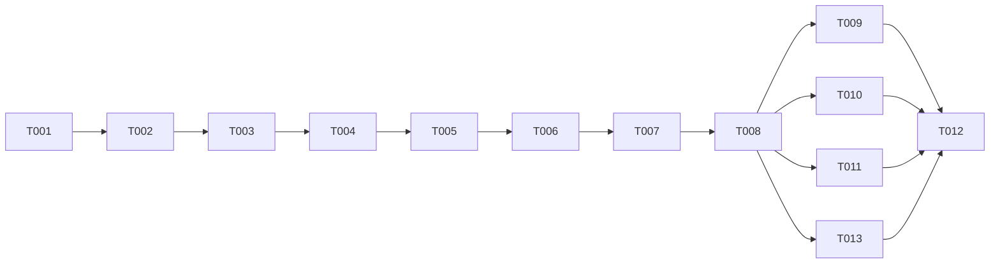

# Tasks: Real Streaming Completions

**Input**: Design documents from `/specs/002-streaming-completions/`
**Prerequisites**: plan.md (required), spec.md (required), contracts/streaming-sse.md

## Phase 1: Shared Types (Blocking Prerequisite)

**Purpose**: Shared types that both core and api packages depend on.

- [x] T001 [SETUP] Create `packages/shared/src/types/streaming.ts` — export `StreamChunk`, `StreamDelta`, `StreamUsage` types per `contracts/streaming-sse.md` §StreamChunk Type
- [x] T002 [SETUP] Re-export streaming types from `packages/shared/src/index.ts`

---

## Phase 2: Core Streaming Infrastructure (US1 + US2 + US3)

**Purpose**: `ChatService.completeStream()` and `callLLMStream()` — the core streaming engine.

**⚠️ CRITICAL**: No route work can begin until this phase is complete.

- [x] T003 [BE] [US1] Implement `callLLMStream()` private method in `packages/core/src/services/chat-service.ts`:
  - Accept `{messages, temperature, maxTokens, model, signal, streamOptions}`.
  - Execute `fetch` to LLM provider with `stream: true`.
  - Parse SSE response body safely via `TextDecoderStream` (to prevent splitting multi-byte UTF-8 chars on chunk boundaries) + line parser.
  - Yield `StreamChunk` per token (NFR-001: AsyncGenerator yields per chunk, inherently non-blocking).
  - Handle `stream_options.include_usage` yielding usage stats in final chunk.
  - Support `finish_reason: "length"` along with `"stop"`, passing them through transparently (M1).
  - Handle empty provider response streams (0 tokens) gracefully by yielding role chunk, finish_reason: "stop", and completion_tokens: 0 (M2).
  - Respect `AbortController.signal` and trigger connection abort immediately.
  - Use `TWIN_STREAM_TIMEOUT_MS` for timeouts.
  - Active stream buffer (unflushed network buffer) MUST NOT exceed 64KB per request (NFR-002). Note: The accumulated persistence string is exempt from this limit (L3).
- [x] T004 [BE] [US1+US2] Implement `completeStream()` public method in `packages/core/src/services/chat-service.ts`:
  - Validate request messages.
  - Check `signal.aborted` before performing any tasks to handle early abort (L2).
  - Create or fetch conversation (findOrCreateConversation) and Letta memory context.
  - Build system prompt including memory context.
  - Return `AsyncGenerator<StreamChunk>` yielding token deltas and returning `{ completed: boolean, content: string, usage?: UsageStats }` as its final completion value (C1).
  - Concurrently accumulate string content inside the generator, but do NOT persist inside the service layer (route layer owns this decision based on `completed` flag).
- [x] T005 [BE] [US3] Add `AbortController` propagation in `completeStream()` — accept `signal` param, pass to `callLLMStream()`. On abort, stop yielding, return `{ completed: false, content: accumulated }` to avoid partial data/usage persistence.

**Checkpoint**: Core streaming engine ready — `completeStream()` yields tokens in real-time.

---

## Phase 3: Route Layer Rewrite (US1 + US3 + US4)

**Purpose**: Rewrite `handleStream()` to use real streaming with abort + error handling.

- [x] T006 [BE] [US1] Rewrite `handleStream()` in `packages/api/src/routes/chat-completions.ts`:
  - Create `AbortController`, listen `request.raw.on('close')` → trigger `abort()`.
  - Set SSE headers: `writeHead(200, { 'Content-Type': 'text/event-stream', 'Cache-Control': 'no-cache', 'Connection': 'keep-alive', 'X-Accel-Buffering': 'no' })` (M5).
  - Iterate `chatService.completeStream()` using `for await`.
  - Format each `StreamChunk` to SSE (`data: ${JSON.stringify(chunk)}\n\n`).
  - **Split Strategy**: Ensure each `reply.raw.write()` payload is ≤16KB (NFR-003). If a single token delta JSON-encoded payload exceeds 16KB, split the text content into multiple smaller SSE chunks preserving the same `chunk.id` and metadata, flushing each immediately (H3).
  - **Backpressure Handling**: If `reply.raw.write()` returns `false`, pause iteration, register a `reply.raw.once('drain')` listener, and wait for the event before resuming.
  - **Backpressure Leak Cleanup**: On client disconnect or abort, explicitly unsubscribe any active `'drain'` listener using `reply.raw.off('drain', ...)` to prevent memory leaks (L1).
  - After generator completes cleanly (and returns `{ completed: true }`): call `persistMessages()` and `emitUsageEvent()`, write `data: [DONE]\n\n`, and close reply.
  - **Conversation Life Cycle Wording**: Newly created conversations remain in DB with `messageCount: 0` if aborted early before any message lands (M4).
- [x] T007 [BE] [US3+US4] Add error handling in `handleStream()` — catch errors from generator (provider error, timeout, parse error):
  - Early errors (before headers sent) → respond with standard JSON payload and correct HTTP error code (e.g. 503 Service Unavailable) (C2).
  - Mid-stream errors (after headers sent) → send structured SSE error event (`data: {"error":{"code":"...","message":"..."}}\n\n`) and call `reply.raw.end()` (C2).
  - On abort: skip persistence, clean up socket with `reply.raw.end()`, and unsubscribe any remaining listeners.
- [x] T008 [BE] [US1] Update `chatCompletionSchema` to accept `stream_options` field — `z.object({ include_usage: z.boolean().optional() }).optional()`, pass through to `completeStream()`.

**Checkpoint**: Route layer pipes real tokens. Stream=true works end-to-end.

---

## Phase 4: Verification

**Purpose**: Validate non-streaming regression + streaming correctness.

- [x] T009 [BE] Verify non-streaming path unchanged — run existing tests, confirm `stream: false` returns identical `ChatResponse` shape.
- [x] T010 [BE] Manual streaming test per `quickstart.md` — curl with `stream: true` and `stream_options: { include_usage: true }`, verify incremental chunks, cyrillic/emojis, usage in final chunk, `[DONE]` sentinel.
- [x] T011 [BE] Verify abort behavior — start stream, close client mid-response, confirm no lingering fetch, no partial usage_events row.
- [x] T012 [BE] `pnpm run validate` — tsc --noEmit passes across all packages.
- [x] T013 [BE] [E2E] Create automated integration tests for real streaming in `packages/api/tests/routes/chat-completions.test.ts` (M3):
  - Mock LLM provider sending incremental SSE stream.
  - Verify first chunk arrival latency/structure and subsequent deltas.
  - Verify correct parsing and streaming until `[DONE]`.
  - Assert inclusion of `usage` block on success.
  - Test abort flow, verifying that disconnect cancels upstream fetch and skips DB updates.

---

## Dependency Graph

### Dependencies

```
T001 → T002
T002 → T003
T003 → T004
T004 → T005
T005 → T006
T006 → T007
T007 → T008
T008 → T009, T010, T011, T013
T009 + T010 + T011 + T013 → T012
```

### Self-Validation Checklist

- [x] Every task ID in Dependencies exists in the task list above
- [x] No circular dependencies
- [x] No orphan task IDs
- [x] Fan-in uses `+` only, fan-out uses `,` only
- [x] No chained arrows on a single line

---

## Dependency Visualization



---

## Parallel Lanes

| Lane | Agent Flow | Tasks | Blocked By |
|------|-----------|-------|------------|
| 1 | [SETUP] | T001 → T002 | — |
| 2 | [BE] core | T003 → T004 → T005 | T002 |
| 3 | [BE] route | T006 → T007 → T008 | T005 |
| 4 | [BE] verify | T009, T010, T011, T013 → T012 | T008 |

**Note**: This is a linear feature — limited parallelism. Lanes 2 and 3 are sequential because route depends on core. Verification (lane 4) has 4 independent checks that can run in parallel.

---

## Agent Summary

| Agent | Task Count | Can Start After |
|-------|-----------|-----------------|
| [SETUP] | 2 | immediately |
| [BE] | 11 | T002 (sequential within BE) |

**Critical Path**: T001 → T002 → T003 → T004 → T005 → T006 → T007 → T008 → T013 → T012

**Estimated effort**: ~250 LOC across 5 files. Single BE agent can execute sequentially.

---

## Agent Dispatch Plan

| Agent | Subagent | Skills | Input Context | Tasks | Files |
|-------|----------|--------|---------------|-------|-------|
| `[SETUP]` | — (orchestrator) | — | contracts/streaming-sse.md §StreamChunk Type | T001, T002 | `packages/shared/src/types/streaming.ts`, `packages/shared/src/index.ts` |
| `[BE]` | `backend-specialist` | `api-patterns`, `nodejs-best-practices`, `testing-patterns` | plan.md §Data Flow + §Design Decisions, contracts/streaming-sse.md, spec.md §FR-001..FR-010 | T003–T013 | `packages/core/src/services/chat-service.ts`, `packages/api/src/routes/chat-completions.ts`, `packages/api/tests/routes/chat-completions.test.ts` |
