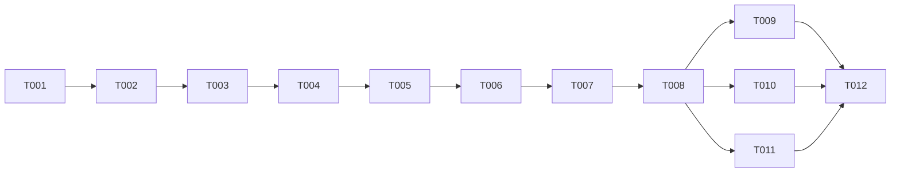

# Tasks: Real Streaming Completions

**Input**: Design documents from `/specs/002-streaming-completions/`
**Prerequisites**: plan.md (required), spec.md (required), contracts/streaming-sse.md

## Phase 1: Shared Types (Blocking Prerequisite)

**Purpose**: Shared types that both core and api packages depend on.

- [ ] T001 [SETUP] Create `packages/shared/src/types/streaming.ts` — export `StreamChunk`, `StreamDelta`, `StreamUsage` types per `contracts/streaming-sse.md` §StreamChunk Type
- [ ] T002 [SETUP] Re-export streaming types from `packages/shared/src/index.ts`

---

## Phase 2: Core Streaming Infrastructure (US1 + US2 + US3)

**Purpose**: `ChatService.completeStream()` and `callLLMStream()` — the core streaming engine.

**⚠️ CRITICAL**: No route work can begin until this phase is complete.

- [ ] T003 [BE] [US1] Implement `callLLMStream()` private method in `packages/core/src/services/chat-service.ts` — accept `{messages, temperature, maxTokens, model, signal, streamOptions}`, `fetch` with `stream: true`, parse SSE response body via `TextDecoderStream` + line parser, yield `StreamChunk` per token (NFR-001: AsyncGenerator yields per chunk, inherently non-blocking), handle `stream_options.include_usage`, respect `AbortController.signal`, timeout via `TWIN_STREAM_TIMEOUT_MS`, streaming buffer MUST NOT exceed 64KB per request (NFR-002)
- [ ] T004 [BE] [US1+US2] Implement `completeStream()` public method in `packages/core/src/services/chat-service.ts` — validate messages, create conversation (findOrCreateConversation), fetch Letta memory, build system prompt, accumulate `delta.content` from `callLLMStream()` yields, return `AsyncGenerator<StreamChunk>` that yields `{ completed: boolean, content: string, usage: UsageStats }` as its return value. Route layer owns persistence decision based on `completed` flag — do NOT persist inside the service layer
- [ ] T005 [BE] [US3] Add `AbortController` propagation in `completeStream()` — accept `signal` param, pass to `callLLMStream()`, on abort: stop yielding, set `completed: false` in return value, clean up

**Checkpoint**: Core streaming engine ready — `completeStream()` yields tokens in real-time.

---

## Phase 3: Route Layer Rewrite (US1 + US3 + US4)

**Purpose**: Rewrite `handleStream()` to use real streaming with abort + error handling.

- [ ] T006 [BE] [US1] Rewrite `handleStream()` in `packages/api/src/routes/chat-completions.ts` — create `AbortController`, listen `request.raw.on('close')` → abort, iterate `chatService.completeStream()` with `for await`, format each `StreamChunk` to SSE (`data: ${JSON.stringify(chunk)}\n\n`), ensure each `reply.raw.write()` call is ≤16KB (NFR-003), handle backpressure: when `reply.raw.write()` returns `false`, pause iteration and wait for `'drain'` event on `reply.raw` before resuming (NFR-002), after generator completes: check `{ completed }` flag → if `true`, call `persistMessages()` and `emitUsageEvent()`, write `data: [DONE]\n\n` at end
- [ ] T007 [BE] [US3+US4] Add error handling in `handleStream()` — catch errors from generator (provider error, timeout, parse error), distinguish early errors (before `writeHead(200)`) → return JSON error with HTTP status, vs mid-stream errors → send structured SSE error event then `reply.raw.end()`. On abort: skip persistence, clean up `reply.raw.end()`
- [ ] T008 [BE] [US1] Update `chatCompletionSchema` to accept `stream_options` field — `z.object({ include_usage: z.boolean().optional() }).optional()`, pass through to `completeStream()`

**Checkpoint**: Route layer pipes real tokens. Stream=true works end-to-end.

---

## Phase 4: Verification

**Purpose**: Validate non-streaming regression + streaming correctness.

- [ ] T009 [BE] Verify non-streaming path unchanged — run existing tests, confirm `stream: false` returns identical `ChatResponse` shape
- [ ] T010 [BE] Manual streaming test per `quickstart.md` — curl with `stream: true`, verify incremental chunks, usage in final chunk, `[DONE]` sentinel
- [ ] T011 [BE] Verify abort behavior — start stream, close client mid-response, confirm no lingering fetch, no partial usage_events row
- [ ] T012 [BE] `pnpm run validate` — tsc --noEmit passes across all packages

---

## Dependency Graph

### Dependencies

```
T001 → T002
T002 → T003
T003 → T004
T004 → T005
T005 → T006
T006 → T007
T007 → T008
T008 → T009, T010, T011
T009 + T010 + T011 → T012
```

### Self-Validation Checklist

- [x] Every task ID in Dependencies exists in the task list above
- [x] No circular dependencies
- [x] No orphan task IDs
- [x] Fan-in uses `+` only, fan-out uses `,` only
- [x] No chained arrows on a single line

---

## Dependency Visualization



---

## Parallel Lanes

| Lane | Agent Flow | Tasks | Blocked By |
|------|-----------|-------|------------|
| 1 | [SETUP] | T001 → T002 | — |
| 2 | [BE] core | T003 → T004 → T005 | T002 |
| 3 | [BE] route | T006 → T007 → T008 | T005 |
| 4 | [BE] verify | T009, T010, T011 → T012 | T008 |

**Note**: This is a linear feature — limited parallelism. Lanes 2 and 3 are sequential because route depends on core. Verification (lane 4) has 3 independent checks that can run in parallel.

---

## Agent Summary

| Agent | Task Count | Can Start After |
|-------|-----------|-----------------|
| [SETUP] | 2 | immediately |
| [BE] | 10 | T002 (sequential within BE) |

**Critical Path**: T001 → T002 → T003 → T004 → T005 → T006 → T007 → T008 → T012

**Estimated effort**: ~200 LOC across 4 files. Single BE agent can execute sequentially.

---

## Agent Dispatch Plan

| Agent | Subagent | Skills | Input Context | Tasks | Files |
|-------|----------|--------|---------------|-------|-------|
| `[SETUP]` | — (orchestrator) | — | contracts/streaming-sse.md §StreamChunk Type | T001, T002 | `packages/shared/src/types/streaming.ts`, `packages/shared/src/index.ts` |
| `[BE]` | `backend-specialist` | `api-patterns`, `nodejs-best-practices` | plan.md §Data Flow + §Design Decisions, contracts/streaming-sse.md, spec.md §FR-001..FR-010 | T003–T012 | `packages/core/src/services/chat-service.ts`, `packages/api/src/routes/chat-completions.ts` |

---

## Implementation Strategy

### MVP First (US1 Only)

1. T001–T002: Shared types
2. T003–T005: Core streaming (completeStream + callLLMStream + abort)
3. T006 + T008: Route rewrite (handleStream + schema)
4. T009–T012: Verify
5. **STOP** — US1 (real streaming) + US3 (abort) delivered

### Incremental Delivery

- US1 (P1): T001–T006, T008–T010, T012 → Real streaming works
- US2 (P1): Included in T004 (usage accounting is part of completeStream)
- US3 (P2): Included in T005 + T007 (abort + error handling)
- US4 (P2): Included in T007 (error propagation)

**Note**: All 4 user stories are tightly coupled — they share the same code paths. Delivering them together is more efficient than splitting.
