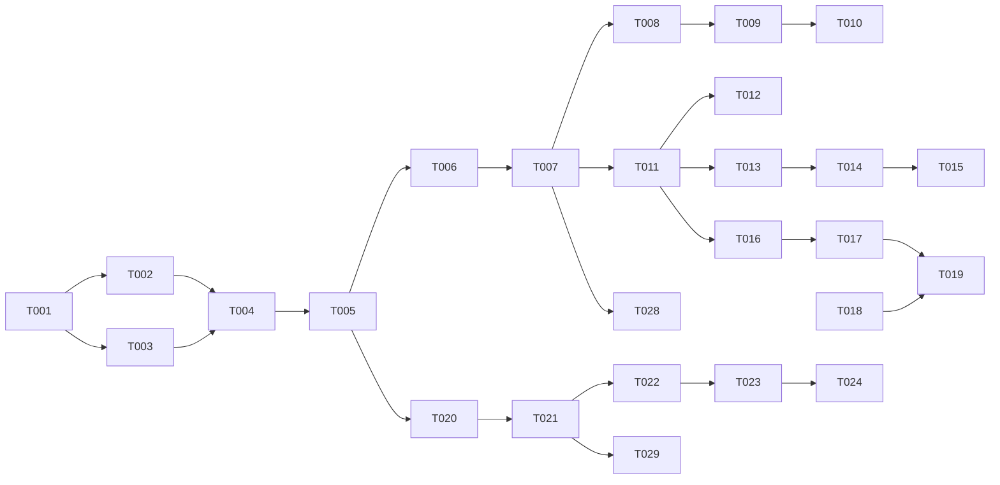

# Tasks: Script Funnels — Dialog Funnel Runtime

**Input**: Design documents from `specs/003-script-funnels/`
**Prerequisites**: `plan.md`, `spec.md`, `research.md`, `data-model.md`, `contracts/funnel-api.yaml`

## Agent Tags

| Tag | Agent | Domain |
|-----|-------|--------|
| `[SETUP]` | — (orchestrator) | Project init, shared types, dependencies |
| `[DB]` | database-architect | Drizzle schema, migrations |
| `[BE]` | backend-specialist | Funnel runtime, Scorer, Services, API routes |
| `[E2E]` | test-engineer | Integration and E2E tests |

## Phase 1: Setup & Shared Infrastructure

**Purpose**: Core types, dependencies, and database schema foundation

- [ ] T001 [SETUP] Add `natural` dependency to `packages/core/package.json` for `PorterStemmerRu`
- [ ] T002 [SETUP] Define funnel types in `packages/shared/src/types.ts`: `Funnel`, `Stage`, `Fragment`, `Slot`, `ConversationFunnelState`
- [ ] T003 [DB] Create Drizzle schema for funnels in `packages/core/src/models/funnels.ts`, `funnel-stages.ts`, `funnel-fragments.ts`, `funnel-slots.ts`, `conversation-funnel-states.ts`
- [ ] T004 [DB] Register new models in `packages/core/src/models/index.ts` and `relations.ts`
- [ ] T005 [DB] Generate and run Drizzle migration for funnel tables

**Checkpoint**: Shared types and database schema ready

---

## Phase 2: User Story 1 - Deterministic Fragment Selection (Priority: P1) 🎯 MVP

**Goal**: Select scripted replies using Russian stemmer without LLM call

**Independent Test**: Mock conversation state + message -> Scorer returns expected fragment content

### Implementation for User Story 1

- [ ] T006 [BE] [US1] Create `packages/core/src/services/funnel/scorer.ts` — Implement `FragmentScorer` with `natural.PorterStemmerRu`, exact match, synonym weighting, and objection weighting (FR-005).
- [ ] T007 [BE] [US1] Create `packages/core/src/services/funnel/funnel-runtime.ts` — Core runtime logic: load funnel definition once at turn start (snapshot isolation — research.md §13), use in-process LRU cache for immutable versions (research.md §8), invoke scorer, handle off-script behavior (`steer`, `abstain`, `catch_all` with `catch_all_fragment_id`) (FR-013).
- [ ] T008 [BE] [US1] Integrate `FunnelRuntime` into `ChatService.complete` and `ChatService.completeStream` in `packages/core/src/services/chat-service.ts` — check for funnel before LLM call. Scripted replies in streaming mode returned as single-chunk SSE event (research.md §6).
- [ ] T009 [BE] [US1] Implement selection diagnostics emitting chosen fragment and score signals (FR-019).
- [ ] T010 [E2E] [US1] Create `packages/api/tests/integration/funnel-matching.test.ts` — Verify deterministic matching for Russian messages with stems/synonyms, objection fragments, no-op regression (SC-009), and stemmer quality validation with curated Russian phrases (slang, diminutives, colloquialisms) per research.md §1.

**Checkpoint**: US1 functional — deterministic scripted replies work for single-stage funnels

---

## Phase 3: User Story 2 - Stage Progression & Stuck Safety (Priority: P2)

**Goal**: Track stages, advance on resolution, and fire stuck safety-net

**Independent Test**: Conversation advances stage on objective resolution; safety-net fires after N turns

### Implementation for User Story 2

- [ ] T011 [BE] [US2] Update `FunnelRuntime` to track `current_stage_id` and `consecutive_stuck_count` in `conversation_funnel_states` table.
- [ ] T012 [BE] [US2] Implement Stage Boost in `FragmentScorer` (current/next stage bonus).
- [ ] T013 [BE] [US2] Implement stage transition logic in `FunnelRuntime`: advance when `resolution_criteria` is met (FR-025), regress when winning fragment from earlier stage exceeds current-stage best by `stage_boost` margin (FR-008, research.md §10). Reset `consecutive_stuck_count` to 0 on any advancement or regression.
- [ ] T014 [BE] [US2] Implement Stuck Safety-Net (FR-009): detect threshold and trigger `stuckAction` (abstain, handoff, exit_stage).
- [ ] T015 [E2E] [US2] Create `packages/api/tests/integration/funnel-stages.test.ts` — Verify stage advancement and stuck safety-net activation.

**Checkpoint**: US2 functional — multi-stage funnels with safety-net are reliable

---

## Phase 4: User Story 3 - Async Slot Capture (Priority: P3)

**Goal**: Extract slots via async LLM call without blocking response

**Independent Test**: Slot is captured and verified 1-2 turns after being supplied in message

### Implementation for User Story 3

- [ ] T016 [BE] [US3] Implement `SlotVerificationService` in `packages/core/src/services/funnel/slot-verification.ts` — extract slots from message context using LLM. Include per-attempt timeout (15s), retry limit (max 2 retries), exponential backoff (1s, 2s), and circuit breaker (5 consecutive failures → 60s cooldown). See research.md §4.
- [ ] T017 [BE] [US3] Add `message.processed` async trigger behind `SlotVerificationTransport` interface: `EventEmitter` for dev (default), Redis queue via ioredis for production. Config: `SLOT_VERIFICATION_TRANSPORT=emitter|redis`. See research.md §4.
- [ ] T018 [BE] [US3] Implement concurrency-safe slot updates in `packages/core/src/services/funnel/funnel-repository.ts` (FR-012) using CAS with retry policy: max 3 retries, immediate retry, log+skip on exhaustion (research.md §3).
- [ ] T019 [E2E] [US3] Create `packages/api/tests/integration/funnel-slots.test.ts` — Verify slots are captured and concurrency is handled.

**Checkpoint**: US3 functional — lead data is captured asynchronously

---

## Phase 5: User Story 4 - Ingestion & Versioning (Priority: P4)

**Goal**: Ingest funnel definitions and pin in-flight conversations to versions

**Independent Test**: Ingest new version -> in-flight conversation continues on old; new conversation uses new

### Implementation for User Story 4

- [ ] T020 [BE] [US4] Create `packages/core/src/services/funnel/funnel-repository.ts` — Implement funnel definition + version CRUD with immutable version snapshots (research.md §7), soft-delete via `deleted_at` (FR-023), and validation logic (FR-017): reject stages with zero fragments (FR-026), validate `catch_all_fragment_id` when `off_script_behavior = catch_all`, validate `exit_stage_id` when `stuck_action = exit_stage`.
- [ ] T021 [BE] [US4] Create `packages/api/src/routes/funnels.ts` — Fastify routes for funnel ingestion mirroring persona pattern with strict Zod validation.
- [ ] T022 [BE] [US4] Implement version pinning in `FunnelRuntime` (FR-016) — conversations keep version until reset.
- [ ] T023 [BE] [US4] Implement `/v1/conversations/:id/funnel/reset` endpoint (FR-018).
- [ ] T024 [E2E] [US4] Create `packages/api/tests/integration/funnel-ingestion.test.ts` — Verify ingestion, versioning, reset logic, and tenant isolation (SC-007).

**Checkpoint**: US4 functional — funnels can be safely published and managed

---

## Phase 6: Polish & Verification

- [ ] T025 [SETUP] Final documentation updates in `specs/003-script-funnels/quickstart.md`
- [ ] T026 [BE] Code cleanup and performance audit of scorer hot path
- [ ] T027 [E2E] Run full integration test suite and validate `SC-001` latency goal
- [ ] T028 [BE] [US1] Implement per-conversation Redis advisory lock in `FunnelRuntime.processMessage()` for turn serialization (FR-027, research.md §11).
- [ ] T029 [BE] [US4] Implement funnel soft-delete endpoint `DELETE /v1/funnels/:id` with `deleted_at` semantics in repository and route (FR-023, research.md §12).

---

## Dependency Graph

### Dependencies

T001 → T002, T003              # project setup unlocks schema
T002 + T003 → T004             # types + schema before registration
T004 → T005                    # registration before migration
T005 → T006, T020              # migration before service/repo
T020 → T021                    # repo before api routes
T006 → T007                    # scorer before runtime
T007 → T008, T011              # runtime before integration/stages
T008 → T009                    # integration before diagnostics
T009 → T010                    # diagnostics before integration test
T011 → T012, T013              # runtime tracking before scoring/transitions
T013 → T014                    # transitions before safety-net
T014 → T015                    # safety-net before stage test
T011 → T016                    # state tracking before slot extraction
T016 → T017                    # extraction before async hook
T017 + T018 → T019             # hook + concurrency before slot test
T021 → T022                    # routes before version pinning
T022 → T023                    # versioning before reset endpoint
T023 → T024                    # reset before ingestion test
T007 → T028                    # runtime before turn serialization
T021 → T029                    # routes before soft-delete endpoint

---

## Dependency Visualization

---

## Parallel Lanes

| Lane | Agent Flow | Tasks | Blocked By |
|------|-----------|-------|------------|
| 1 | [SETUP] | T001, T002 | — |
| 2 | [DB] | T003 → T004 → T005 | T001, T002 |
| 3 | [BE] | T006 → T007 → T008 → T009, T028 | T005 |
| 4 | [BE] | T020 → T021 → T022 → T023, T029 | T005 |
| 5 | [BE] | T011 → T012, T013 → T014 | T007 |
| 6 | [BE] | T016 → T017 → T018 | T011 |
| 7 | [E2E] | T010, T015, T019, T024 | relevant BE tasks |

---

## Agent Summary

| Agent | Task Count | Can Start After |
|-------|-----------|-----------------|
| [SETUP] | 3 | immediately |
| [DB] | 3 | T001 |
| [BE] | 20 | T005 |
| [E2E] | 4 | T009, T014, T017, T023 |

**Critical Path**: T001 → T003 → T004 → T005 → T006 → T007 → T011 → T013 → T014 → T015

---

## Agent Dispatch Plan

| Agent | Subagent | Skills | Input Context | Tasks | Files |
|-------|----------|--------|---------------|-------|-------|
| `[SETUP]` | — | — | research.md §1 | T001, T002, T025 | `package.json`, `packages/shared/src/types.ts` |
| `[DB]` | `database-architect` | `database-design` | data-model.md | T003, T004, T005 | `packages/core/src/models/` |
| `[BE]` | `backend-specialist` | `api-patterns`, `system-design-patterns` | research.md §2-13, contracts/ | T006-T009, T011-T014, T016-T018, T020-T023, T026, T028-T029 | `packages/core/src/services/funnel/`, `packages/api/src/routes/` |
| `[E2E]` | `test-engineer` | `testing-patterns` | spec.md §User Scenarios | T010, T015, T019, T024, T027 | `packages/api/tests/integration/` |
