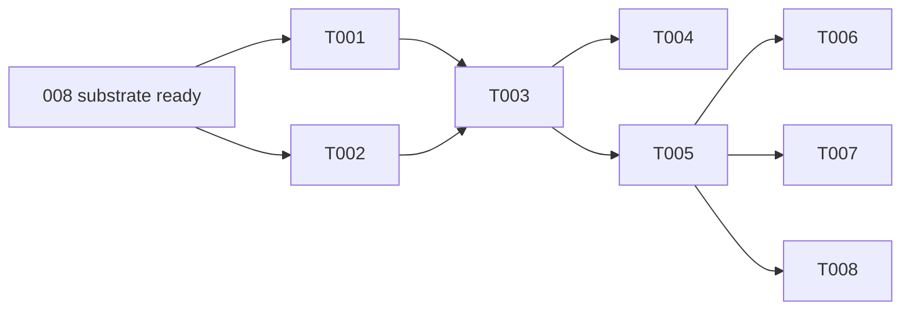

# Tasks: Fact Grounding (RAG Runtime)

**Input**: Design documents from `/specs/005-fact-grounding/`
**Prerequisites**: plan.md (required), spec.md (required for user stories), data-model.md, contracts/

## Format: `[ID] [AGENT] [Story?] Description`

## Phase 0: Prerequisite Barrier — 008 substrate (BLOCKING, cross-feature)

**Purpose**: 005 is a retrieval layer over the shared 008 substrate. It cannot start until that substrate exists. This phase is NOT 005 work — it is a hard dependency gate on `008-agent-builder`.

**005 T001/T003 are BLOCKED until ALL of the following 008 tasks complete (008 "substrate ready" checkpoint, after T008):**

| 008 Task | Provides |
|----------|----------|
| T002 | TEI sidecar (BGE-M3 + BGE-reranker-v2-m3) |
| T004 | pgvector extension + Drizzle `vector(1024)` type |
| T006 | `embedding-service.ts` (TEI client) |
| T007 | models `documents`, `document_chunks` |
| T008 | RLS policies + HNSW cosine indexes |

**005 ingest adapter (T002 below) additionally depends on 008 T020** (`document-service.ts` + BullMQ worker).

---

## Phase 1: User Story 1 — Fact Grounding Retrieval (Priority: P1) 🎯 MVP

**Goal**: Implement `IGroundingEngine` — async ingest delegation + vector-and-rerank retrieval with strict tenant isolation.

**Independent Test**: Ingest a test PDF (await `ready`), retrieve relevant context for a query, and confirm tenant B sees nothing of tenant A.

### Implementation for User Story 1

- [ ] T001 [BE] [US1] Vector+reranker retrieval in `packages/core/src/services/grounding/retrieval.ts` — HNSW cosine candidates (`vectorTopK=20`) filtered by `tenantId`+`personaId`, then BGE-reranker-v2-m3 → `rerankTopN=5`, drop below `minRerankScore=0.3`, pack into `contextBudgetTokens≈2000`. ALL DB access via `withTenantContext(tenantId, ...)`. NOT hybrid/FTS (deferred, spec §11). (spec §5)
- [ ] T002 [BE] [US1] Ingest adapter in `packages/core/src/services/grounding/ingest-adapter.ts` — delegate to 008 `document-service` (enqueue BullMQ parse→chunk→embed→store), return `{ documentId, status }`. Do NOT reimplement officeParser (dup of 008 T020). Enforce/relay limits: pdf·docx·txt, ≤10 MB, ≤10 docs/persona. (spec §6, §7)
- [ ] T003 [BE] [US1] Implement `GroundingEngine` matching `contracts/IGroundingEngine.ts` in `packages/core/src/services/grounding/GroundingEngine.ts` — wires T001+T002; `twinId` is passed directly as `personaId` (identity, no lookup) inside the tenant context. (spec §3, §4)
- [ ] T004 [BE] [US1] Register `GroundingEngine` in the core engine service registry (where other `engine.*` services are wired) so it is injected as `engine.grounding`.

### Tests for User Story 1

- [ ] T005 [BE] [US1] Happy-path integration in `packages/core/tests/integration/grounding/GroundingEngine.test.ts` — ingest test PDF, poll to `ready`, query returns ranked context.
- [ ] T006 [SEC] [US1] Tenant-isolation test in `packages/core/tests/integration/grounding/tenant-isolation.test.ts` — tenant A ingests; tenant B `query()` returns `[]` (RLS enforced via `withTenantContext`). (spec §4)
- [ ] T007 [BE] [US1] Failure-mode tests in `packages/core/tests/integration/grounding/ingest-failures.test.ts` — unsupported MIME (reject), >10 MB (reject), >10 docs (reject), parse failure → `status:'failed'` & not retrievable, embedder outage → no half-ingested document. (spec §7)
- [ ] T008 [BE] [US1] Retrieval-quality tests in `packages/core/tests/integration/grounding/retrieval-quality.test.ts` — empty query, no-match below `minRerankScore` → `[]`, rerank ordering (more relevant chunk ranks higher), reranker-down → vector-only fallback, `parsing` document not yet retrievable. (spec §5, §6)

**Checkpoint**: `IGroundingEngine` fully functional, tenant-safe, async-ingest aware.

---

## Dependency Graph

### Legend

- `→` means "unlocks" (left must complete before right can start)
- `+` means "all of these" (join point — ALL listed tasks must complete)

### Dependencies

> **Phase 0 gate (external):** T001 and T002 are blocked by the 008 "substrate ready" checkpoint (008 T002/T004/T006/T007/T008; T020 for ingest). Cross-feature prerequisite — not a 005 task ID.

T001 + T002 → T003
T003 → T004, T005
T005 → T006, T007, T008

### Self-Validation Checklist

> - [x] Every task ID in Dependencies exists in the task list above
> - [x] No circular dependencies (A→B→A)
> - [x] No orphan task IDs referenced that don't exist
> - [x] Fan-in uses `+` only, fan-out uses `,` only
> - [x] No chained arrows on a single line

---

## Dependency Visualization

> For visual rendering only — NOT for parsing by the orchestrator.

---

## Parallel Lanes

| Lane | Agent Flow | Tasks | Blocked By |
|------|-----------|-------|------------|
| 1 | [BE] | T001, T002 → T003 → T004, T005 | 008 substrate ready |
| 2 | [SEC]/[BE] tests | T006, T007, T008 | T005 |

---

## Agent Summary

| Agent | Task Count | Can Start After |
|-------|-----------|-----------------|
| [BE] | 7 | 008 substrate ready (T002/T004/T006/T007/T008; T020 for ingest) |
| [SEC] | 1 | T005 |

**Critical Path**: 008 substrate → T001/T002 → T003 → T005 → T006/T007/T008

---

## Agent Dispatch Plan

| Agent | Subagent | Skills | Input Context | Tasks | Files |
|-------|----------|--------|---------------|-------|-------|
| `[BE]` | `backend-specialist` | `api-patterns`, `system-design-patterns`, `database-design` | plan.md, contracts/, data-model.md, spec.md §4–§9 | T001–T005, T007, T008 | `packages/core/src/services/grounding/`, `packages/core/tests/integration/grounding/` |
| `[SEC]` | `security-auditor` | `vulnerability-scanner` | spec.md §4 (RLS), 008 RLS policy | T006 | `packages/core/tests/integration/grounding/` |

---

## Implementation Strategy

### MVP First (User Story 1 Only)

1. Confirm 008 substrate ready (Phase 0 gate).
2. Complete User Story 1 (T001–T008).
3. **STOP and VALIDATE**: ingestion (async, `ready`) + tenant-safe retrieval via integration tests.

### Parallel Agent Strategy (Claude Code)

1. `[BE]` begins T001 and T002 in parallel (after 008 substrate ready).
2. Unblock T003 when T001 and T002 complete.
3. Unblock T004 and T005 when T003 completes.
4. Run T006 ([SEC]) / T007 / T008 after T005.

---

## Notes

- `[AGENT]` tag assigns responsibility — domain agent writes both code and tests.
- 005 is a RETRIEVAL layer over 008's substrate. Ingest delegates to 008 `document-service` (T020) — no duplicate parser/embedding pipeline.
- Hybrid full-text search is DEFERRED (spec §11). Current scope: vector + reranker.
- Lane 2 tests use distinct files (`tenant-isolation` / `ingest-failures` / `retrieval-quality`) — no shared-file write race.
