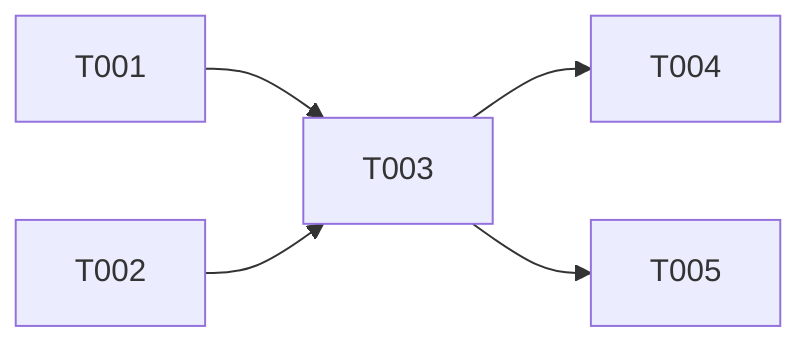

# Tasks: Fact Grounding (RAG Runtime)

**Input**: Design documents from `/specs/005-fact-grounding/`
**Prerequisites**: plan.md (required), spec.md (required for user stories), data-model.md, contracts/

## Format: `[ID] [AGENT] [Story?] Description`

## Phase 1: Setup (Shared Infrastructure)

**Purpose**: No specific setup required for this feature, as it utilizes the pgvector and embedding infrastructure established by `008-agent-builder`.

---

## Phase 2: User Story 1 - Fact Grounding Implementation (Priority: P1) 🎯 MVP

**Goal**: Implement the `IGroundingEngine` to provide document ingestion and hybrid vector search for the LLM runtime.

**Independent Test**: Successfully ingest a test PDF document and retrieve relevant context via hybrid search.

### Implementation for User Story 1

- [ ] T001 [BE] [US1] Create hybrid search logic over pgvector in `packages/core/src/services/grounding/hybrid-search.ts`
- [ ] T002 [BE] [US1] Implement TS-native parser using officeParser for PDF/DOCX/TXT in `packages/core/src/services/grounding/parsers.ts`
- [ ] T003 [BE] [US1] Implement `GroundingEngine` matching `IGroundingEngine` contract in `packages/core/src/services/grounding/GroundingEngine.ts`
- [ ] T004 [BE] [US1] Register `GroundingEngine` in core engine services
- [ ] T005 [BE] [US1] Add integration tests in `packages/core/tests/integration/grounding/GroundingEngine.test.ts`

**Checkpoint**: `IGroundingEngine` should be fully functional.

---

## Dependency Graph

### Legend

- `→` means "unlocks" (left must complete before right can start)
- `+` means "all of these" (join point — ALL listed tasks must complete)
- Tasks not listed here have no dependencies and can start immediately within their phase

### Format Rules (STRICT)

```
# VALID formats (one per line):
T001 → T002
T001 → T002, T003
T002 + T003 → T004
```

### Dependencies

T001 + T002 → T003
T003 → T004, T005

### Self-Validation Checklist

> The generator MUST verify before writing:
> - [x] Every task ID in Dependencies exists in the task list above
> - [x] No circular dependencies (A→B→A)
> - [x] No orphan task IDs referenced that don't exist
> - [x] Fan-in uses `+` only, fan-out uses `,` only
> - [x] No chained arrows on a single line

---

## Dependency Visualization

> Auto-generated from Dependencies section above. For visual rendering in GitHub/VS Code only — NOT for parsing by the orchestrator.



---

## Parallel Lanes

| Lane | Agent Flow | Tasks | Blocked By |
|------|-----------|-------|------------|
| 1 | [BE] | T001, T002 → T003 → T004, T005 | — |

---

## Agent Summary

| Agent | Task Count | Can Start After |
|-------|-----------|-----------------|
| [BE] | 5 | immediately |

**Critical Path**: T001/T002 → T003 → T004/T005

---

## Agent Dispatch Plan

| Agent | Subagent | Skills | Input Context | Tasks | Files |
|-------|----------|--------|---------------|-------|-------|
| `[BE]` | `backend-specialist` | `api-patterns`, `system-design-patterns` | plan.md §tech-stack, contracts/, data-model.md | T001, T002, T003, T004, T005 | `packages/core/src/services/grounding/`, `packages/core/tests/integration/grounding/` |

---

## Implementation Strategy

### MVP First (User Story 1 Only)

1. Complete User Story 1 (T001 - T005)
2. **STOP and VALIDATE**: Verify ingestion and retrieval via integration tests.

### Parallel Agent Strategy (Claude Code)

1. `[BE]` agent handles all tasks, beginning with parallel execution of T001 and T002.
2. Unblock T003 when T001 and T002 are complete.
3. Unblock T004 and T005 when T003 is complete.

---

## Notes

- `[AGENT]` tag assigns responsibility — domain agent writes both code and unit tests
- This feature relies heavily on the `008-agent-builder` shared infrastructure.
