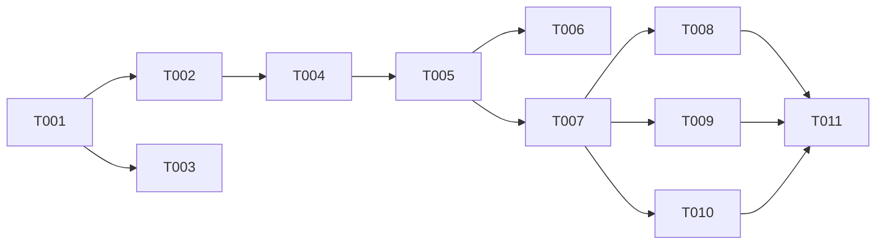

# Tasks: 006 MTProto Channel

**Input**: Design documents from `/specs/006-mtproto-channel/`
**Prerequisites**: plan.md, spec.md, research.md, data-model.md, contracts/

## Phase 1: Setup (Shared Infrastructure)

**Purpose**: Project initialization, basic structure, shared dependency installs

- [ ] T001 [SETUP] Create project structure for `packages/channel-telegram-mtproto` (package.json, tsconfig.json)
- [ ] T002 [SETUP] Install dependencies (`telegram` for GramJS, `vitest`, `typescript`)
- [ ] T003 [OPS] Configure linting and formatting tools for the new package

---

## Phase 2: Foundational (Blocking Prerequisites)

**Purpose**: Core infrastructure that MUST be complete before ANY user story can be implemented

- [ ] T004 [BE] Create core interfaces and options in `packages/channel-telegram-mtproto/src/types.ts` based on `contracts/`
- [ ] T005 [BE] Setup base `TwinChannel` skeleton implementing `IChannelAdapter` in `packages/channel-telegram-mtproto/src/adapter.ts`

**Checkpoint**: Foundation ready

---

## Phase 3: User Story 1 - MTProto Connection & Messages (Priority: P1) 🎯 MVP

**Goal**: Implement the Telegram MTProto adapter capable of logging in, listening to messages, applying allowlists, and handling rate limits.

### Tests for User Story 1

- [ ] T006 [BE] [US1] Unit test for TwinChannel initialization and allowlist filtering in `packages/channel-telegram-mtproto/test/adapter.spec.ts`

### Implementation for User Story 1

- [ ] T007 [BE] [US1] Implement MTProto connection logic (connect/disconnect) using session string in `src/client.ts`
- [ ] T008 [BE] [US1] Implement incoming message listener (`onMessage`) with allowlist filtering in `src/adapter.ts`
- [ ] T009 [BE] [US1] Implement `sendMessage` with FloodWait queuing/backoff in `src/adapter.ts`
- [ ] T010 [BE] [US1] Implement `setTyping` with periodic interval in `src/adapter.ts`
- [ ] T011 [BE] [US1] Export `TwinChannel` and interfaces in `src/index.ts`

**Checkpoint**: User Story 1 should be fully functional and testable independently

---

## Dependency Graph

### Legend

- `→` means "unlocks" (left must complete before right can start)
- `+` means "all of these" (join point — ALL listed tasks must complete)

### Dependencies

T001 → T002, T003
T002 → T004
T004 → T005
T005 → T006, T007
T007 → T008, T009, T010
T008 + T009 + T010 → T011

---

## Dependency Visualization

---

## Parallel Lanes

| Lane | Agent Flow | Tasks | Blocked By |
|------|-----------|-------|------------|
| 1 | [SETUP] | T001 → T002 | — |
| 2 | [OPS] | T003 | T001 |
| 3 | [BE] | T004 → T005 → T007 → T008, T009, T010 → T011 | T002 |
| 4 | [BE] | T006 | T005 |

---

## Agent Summary

| Agent | Task Count | Can Start After |
|-------|-----------|-----------------|
| [SETUP] | 2 | immediately |
| [OPS] | 1 | T001 |
| [BE] | 8 | T002 |

**Critical Path**: T001 → T002 → T004 → T005 → T007 → T008 → T011

---

## Agent Dispatch Plan

| Agent | Subagent | Skills | Input Context | Tasks | Files |
|-------|----------|--------|---------------|-------|-------|
| `[SETUP]` | — (orchestrator) | — | plan.md §structure | T001, T002 | `packages/channel-telegram-mtproto/package.json` |
| `[OPS]` | `devops-engineer` | `deployment-procedures` | plan.md §infra | T003 | `tsconfig.json`, `eslint` configs |
| `[BE]` | `backend-specialist` | `api-patterns`, `system-design-patterns` | contracts/, data-model.md | T004, T005, T006, T007, T008, T009, T010, T011 | `src/*.ts`, `test/*.ts` |
