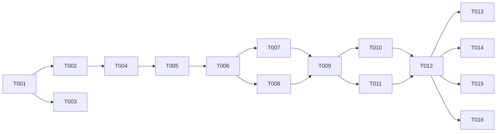

# Tasks: 006 MTProto Channel

**Input**: Design documents from `/specs/006-mtproto-channel/`
**Prerequisites**: plan.md, spec.md, research.md, data-model.md, contracts/

> **Reshaped after codex review** (F1–F8): align to the canonical `ChannelAdapter` (`@undrecreaitwins/shared`) as a **standalone** worker over `ChannelTransport`; add secrets-by-handle, idempotency/resync, RPC error policy, inbound eligibility, and risk-split tests.

## Phase 1: Setup

- [ ] T001 [SETUP] Create `packages/channel-telegram-mtproto` (package.json **name `@undrecreaitwins/channel-telegram-mtproto`** — codex F8; tsconfig.json), mirroring channel-telegram/channel-whatsapp metadata/scripts.
- [ ] T002 [SETUP] Install deps: `telegram` (GramJS), `vitest`, `typescript` + workspace deps `@undrecreaitwins/shared` (contract) and `@undrecreaitwins/core` (`ChannelTransport`). Confirm exact versions at install.
- [ ] T003 [OPS] Configure lint/format for the new package (mirror sibling channels).

---

## Phase 2: Foundational (Blocking)

- [ ] T004 [BE] `src/types.ts`: `MtprotoAdapterOptions`, `SecretResolver`, `AllowlistConfig`, `InvalidSessionError` per `contracts/`. **Import the canonical `ChannelAdapter`/`ChannelMessage`/`ChannelHealth` from `@undrecreaitwins/shared` — do NOT define a local adapter interface** (codex F1).
- [ ] T005 [BE] `src/adapter.ts`: `TelegramMtprotoAdapter implements ChannelAdapter` skeleton (connect/disconnect/onIncoming/send/health) + `ChannelTransport` wiring — publish `REDIS_STREAMS.INBOUND`, consume `REDIS_STREAMS.OUTBOUND` (group `channel-telegram-mtproto`). Standalone worker (codex F1/F5).

**Checkpoint**: compiles against the shared contract; transport wired.

---

## Phase 3: User Story 1 — MTProto bridge (P1) 🎯 MVP

**Goal**: a tenant-safe, crash-resilient userbot adapter that plugs into the Engine via the shared contract + transport.

### Implementation

- [ ] T006 [BE] [US1] `src/client.ts`: MTProto connect/disconnect; session resolved via `SecretResolver` (never raw/logged); DC-migration reconnect + session rebind (`PHONE/NETWORK/USER_MIGRATE`) (codex F3/F4).
- [ ] T007 [BE] [US1] Inbound listener → **eligibility filter** (ignore self/outgoing, edits, media-only, service, channel posts; allowlist `chats`+`senders`; normalized peer id) → map to canonical `ChannelMessage` → **idempotency dedup** `{channelId, externalMessageId}` (Redis) → publish INBOUND (codex F2/F6).
- [ ] T008 [BE] [US1] Outbound consumer → `send(message: ChannelMessage)` via `externalUserId`+`content`; **RPC error policy**: per-peer FloodWait queue (≤60s retry w/ retry-after, >60s drop + reject), account-wide circuit-breaker, non-retryable passthrough (codex F3). Typing-RPC throttled separately.
- [ ] T009 [BE] [US1] **Resync/idempotency** (codex F2): dedup store (TTL ~24h) + reconnect catch-up + gap handling → no double-reply.
- [ ] T010 [BE] [US1] **Secret lifecycle** (codex F4): resolve via `SecretResolver`; redacted structured logging (never serialize `apiHash`/`sessionString`/options); `InvalidSessionError` (no retry loop); logout/revoke hook; health → `error` on invalid session.
- [ ] T011 [BE] [US1] **Typing** (internal, §8): start on accepted inbound, refresh `typingIntervalMs`, stop on outbound send/timeout; clear all `typingTimers` on `disconnect` (no leak).
- [ ] T012 [BE] [US1] `health()` → `ChannelHealth` (active/degraded/disconnected/error); export `TelegramMtprotoAdapter` from `src/index.ts`.

### Tests (codex F7 — split by risk)

- [ ] T013 [BE] [US1] `test/contract.spec.ts`: implements shared `ChannelAdapter` (type-level), MTProto→`ChannelMessage` mapping, eligibility/loop-prevention (own-outgoing ignored, media-only, edits, mixed chats+senders allowlist).
- [ ] T014 [BE] [US1] `test/protocol.spec.ts`: FloodWait ≤60s (retry), >60s (drop+reject), queue overflow, DC-migration retry, non-retryable error.
- [ ] T015 [BE] [US1] `test/recovery.spec.ts`: disconnect during inbound and during outbound; duplicate inbound → single reply; gap after reconnect.
- [ ] T016 [SEC] [US1] `test/secrets.spec.ts`: no `apiHash`/`sessionString` in logs/errors/options serialization; invalid session → `InvalidSessionError`; typing-timer cleanup on disconnect.

**Checkpoint**: adapter plugs into the Engine via the shared contract; survives FloodWait, migration, reconnect; leaks no secrets.

---

## Dependency Graph

### Legend
- `→` unlocks (left before right) · `+` join (ALL must complete)

### Dependencies

T001 → T002, T003
T002 → T004
T004 → T005
T005 → T006
T006 → T007, T008
T007 + T008 → T009
T009 → T010, T011
T010 + T011 → T012
T012 → T013, T014, T015, T016

### Self-validation
- All referenced IDs exist (T001–T016). ✔
- No cycles. ✔
- Fan-in uses `+`, fan-out uses `,`. ✔
- No chained arrows on one line. ✔

---

## Dependency Visualization

---

## Parallel Lanes

| Lane | Agent Flow | Tasks | Blocked By |
|------|-----------|-------|------------|
| 1 | [SETUP] | T001 → T002 | — |
| 2 | [OPS] | T003 | T001 |
| 3 | [BE] impl | T004 → T005 → T006 → T007, T008 → T009 → T010, T011 → T012 | T002 |
| 4 | [BE]/[SEC] tests | T013, T014, T015, T016 | T012 |

---

## Agent Summary

| Agent | Task Count | Can Start After |
|-------|-----------|-----------------|
| [SETUP] | 2 | immediately |
| [OPS] | 1 | T001 |
| [BE] | 12 | T002 |
| [SEC] | 1 | T012 |

**Critical Path**: T001 → T002 → T004 → T005 → T006 → T007/T008 → T009 → T010/T011 → T012 → tests

---

## Agent Dispatch Plan

| Agent | Subagent | Skills | Input Context | Tasks | Files |
|-------|----------|--------|---------------|-------|-------|
| `[SETUP]` | — (orchestrator) | — | plan.md §structure | T001, T002 | `packages/channel-telegram-mtproto/package.json`, `tsconfig.json` |
| `[OPS]` | `devops-engineer` | `deployment-procedures` | plan.md §infra | T003 | lint/format configs |
| `[BE]` | `backend-specialist` | `api-patterns`, `system-design-patterns` | contracts/, data-model.md, spec §2–§9, `@undrecreaitwins/shared` ChannelAdapter, existing channel-telegram adapter | T004–T015 | `src/*.ts`, `test/*.ts` |
| `[SEC]` | `security-auditor` | `vulnerability-scanner` | spec §4 (secrets) | T016 | `test/secrets.spec.ts` |
