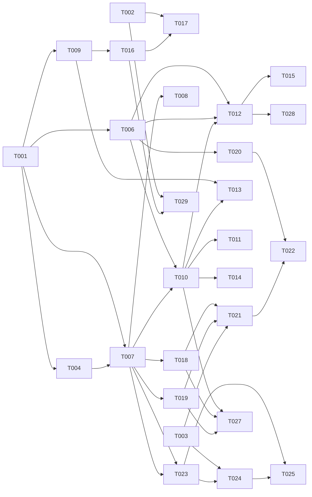

# Tasks: Agent Builder & Feedback Loop (008)

**Input**: [plan.md](./plan.md), [spec.md](./spec.md), [data-model.md](./data-model.md), recon `agent_builder_recon.md`
**Scope**: thin end-to-end (all 4 stories). Cross-repo: `[ENGINE]` undrecreaitwins · `[PRODUCT]` ai-twins/apps/web · `[OPS]` Langfuse.
**Tests**: included — engine is test-disciplined (Vitest), and SC-003/005/006/008 require verification.

## Format: `[ID] [AGENT] [Story] Description (path)`

Agent tags: `[SETUP]` orchestrator · `[DB]` database-architect · `[BE]` backend-specialist · `[FE]` frontend-specialist · `[OPS]` devops-engineer · `[E2E]` test-engineer.

---

## Phase 1: Setup (shared)

- [ ] T001 [SETUP] Add engine deps (**user-approved 2026-05-30**): `officeparser` (doc parsing), `langfuse` (observability SDK). **pgvector needs NO npm dep** — Postgres `CREATE EXTENSION vector` + Drizzle's native `vector` type (0.38+). **BGE-M3/reranker = NO in-process npm dep** — served over HTTP (proxy `/embeddings` or a TEI sidecar), called via `fetch`. Confirm exact versions at install time.
- [ ] T002 [OPS] Stand up self-hosted **Langfuse** (`langfuse/docker-compose.yml`: Postgres + ClickHouse + Redis) **+ a TEI sidecar** serving BGE-M3 + BGE-reranker (for T006). Engine env `LANGFUSE_*` + `EMBEDDINGS_URL` (names only). Document the operator Langfuse workflow (review / datasets / evals — FR-011 is adopted, not built).
- [ ] T003 [SETUP] Product: scaffold thin engine-client `ai-twins/apps/web/app/(dashboard)/assistants/lib/engine-client.ts` (fetch + `Authorization: Bearer` + `X-Tenant-ID`).

## Phase 2: Foundational (blocking sync barrier) ⚠️

- [ ] T004 [DB] Enable pgvector: `CREATE EXTENSION vector` migration + Drizzle custom `vector(1024)` type in `packages/core/src/db.ts`.
- [ ] T005 [NOTE] **(coordination, not a build task)** No callLLM extraction in 008 — the shared `llm-client.ts` is owned by **004-validators** (DD-001 / its T003); reuse it *if* a chat-style call is ever needed. 008's model calls are **embeddings + rerank** (`embedding-service.ts`, T006), independent — no three-way refactor.
- [ ] T006 [BE] `embedding-service.ts`: client calling the **TEI sidecar** (T002) that serves **BGE-M3** (embed) + **BGE-reranker-v2-m3** (rerank) over HTTP. (Use the model proxy only if it is confirmed to expose `/embeddings` — recon found it chat-only, so default to the sidecar.) **Net-new, long pole — de-risk first.**
- [ ] T007 [DB] Models: `documents`, `document_chunks`, `annotations` + `personas.annotationSimilarityThreshold`; re-export `models/index.ts` + `relations.ts` + `drizzle-kit generate`.
- [ ] T008 [DB] Reviewed `.sql`: RLS policies + HNSW cosine indexes on `annotations.embedding`, `document_chunks.embedding`.
- [ ] T009 [BE] `langfuse-service.ts`: fire-and-forget trace + one-way dataset push helpers (never block/throw on reply path).

**Checkpoint**: substrate ready — stories can begin.

## Phase 3: User Story 1 — Annotation feedback loop (P1) 🎯 MVP

**Goal**: correction → vectorize → retrieve → few-shot inject → corrected answer.
**Independent test**: submit correction via API, re-ask, get corrected answer; verdict recorded.

- [ ] T010 [BE] [US1] `annotation-service.ts`: normalized upsert (lower/trim/collapse), vectorize via T006, delete + vector cleanup (FR-001/002/004).
- [ ] T011 [BE] [US1] `routes/annotations.ts` (POST/GET/DELETE, inline Zod, AppError) + **wire into `buildServer()`** (FR-001).
- [ ] T012 [BE] [US1] `chat-service.buildSystemPrompt` (:315): retrieve top-k annotations (embed→pgvector cosine→rerank→threshold ≥ persona.annotationSimilarityThreshold) → inject ≤3 few-shot block after KB, before fragments (FR-003/017).
- [ ] T013 [BE] [US1] One-way push corrections → Langfuse dataset; store `langfuseDatasetItemId` (FR-012).
- [ ] T014 [BE] [US1] Integration test (vi.mock LLM+embed): correction → re-ask → corrected answer (SC-003); threshold filtering ignores low matches.
- [ ] T015 [E2E] [US1] Retrieval precision test on 20-question set (SC-005).

**Checkpoint**: feedback loop demonstrable end-to-end (engine-only).

## Phase 4: User Story 4 — Langfuse trace substrate (P2)

**Goal**: every reply emits a Langfuse trace; ops measures from Langfuse.
**Independent test**: reply → trace appears; Langfuse-down → reply unaffected.

- [ ] T016 [BE] [US4] Wire trace emit at `chat-service.emitUsageEvent` (:109): model, resolved prompt, latency, tokens, tenant+assistant tags — fire-and-forget (FR-010).
- [ ] T017 [E2E] [US4] Test: reply produces trace; simulate Langfuse-down → zero reply-path failure (SC-006).

## Phase 5: User Story 2 — Agent builder wizard (P1)

**Goal**: operator creates assistant (name/prompt/docs) in UI; docs parsed+vectorized async.
**Independent test**: run wizard, upload PDF, save → assistant + chunks persisted.

- [ ] T018 [BE] [US2] `routes/assistants.ts`: create/update core (name, prompt, threshold) — extend `/v1/personas` or new `/v1/assistants`; wire into `buildServer()` (FR-006).
- [ ] T019 [BE] [US2] `routes/documents.ts`: upload (enqueue BullMQ), GET, DELETE; enforce ≤10MB / PDF·DOCX·TXT / ≤10 per assistant (FR-007).
- [ ] T020 [BE] [US2] `document-service.ts` + BullMQ worker in `packages/training`: officeParser parse → **chunk (recursive splitter, ~512-token chunks, ~10% overlap)** → embed (T006) → store `document_chunks` (FR-007).
- [ ] T021 [FE] [US2] Wizard UI (name/prompt/docs upload) in `apps/web/app/(dashboard)/assistants/builder/` via engine-client.
- [ ] T022 [E2E] [US2] Integration: create assistant + upload PDF → chunks stored (SC-001).

## Phase 6: User Story 3 — Sandbox testing (P2)

**Goal**: in-admin chat on the real reply path; test threads gated; captures corrections.
**Independent test**: sandbox reply via real path; side-effects gated off.

- [ ] T023 [BE] [US3] `routes/sandbox.ts` → real reply path with `isTestThread`/`source`; gate CRM/billing/re-engagement side-effects (FR-008).
- [ ] T024 [FE] [US3] Sandbox chat UI + thumbs-down + corrected-answer capture (feeds US1) in `apps/web/.../assistants/sandbox/` (FR-009).
- [ ] T025 [E2E] [US3] Integration: sandbox reply via real path, side-effects excluded (SC-002).

## Phase 7: Polish & cross-cutting

- [ ] T026 [OPS] Update `specs/main/architecture.md` (pgvector / BGE-M3 / Langfuse / officeParser + 008 ref) — *deferred with snapshot*.
- [ ] T027 [E2E] Tenant-isolation test across assistants/annotations/documents — no cross-tenant read (SC-008).
- [ ] T028 [BE] Perf check: annotation retrieval < 300 ms added to reply (SC-004).
- [ ] T029 [BE] [US4] Provision/resolve a **Langfuse project per tenant** on tenant onboarding (FR-013); integration test confirms per-tenant trace isolation.

---

## Dependency Graph

### Dependencies

T001 → T004, T006, T007, T009
T002 → T017
T004 → T007
T006 → T010, T012, T020
T007 → T008, T010, T018, T019, T023
T009 → T013, T016
T002 + T016 → T029
T010 → T011, T013, T014
T006 + T010 → T012
T012 → T015, T028
T016 → T017
T018 + T019 → T021
T003 → T021, T024
T020 + T021 → T022
T007 → T023
T023 → T024
T023 + T024 → T025
T010 + T018 + T019 → T027

### Self-validation

- All referenced IDs exist (T001–T028). ✔
- No cycles. ✔
- Fan-in uses `+`, fan-out uses `,`. ✔
- No chained arrows on one line. ✔

---

## Dependency Visualization

---

## Parallel Lanes

| Lane | Agent | Tasks | Blocked By |
|------|-------|-------|------------|
| 1 | [SETUP] | T001, T003 | — |
| 2 | [OPS] | T002, T026 | — |
| 3 | [DB] | T004 → T007 → T008 | T001 |
| 4 | [BE] core | T006 → T010 → T012 | T001 |
| 5 | [BE] api | T009, T011, T013, T016, T018, T019, T023, T028 | T007 / T010 |
| 6 | [BE] jobs | T020 | T006 + T007 |
| 7 | [FE] | T021, T024 | T003 + API |
| 8 | [E2E] | T014, T015, T017, T022, T025, T027 | per-story |

---

## Agent Summary

| Agent | Tasks | Can start after |
|-------|------:|-----------------|
| [SETUP] | 2 | immediately |
| [OPS] | 2 | immediately (T002) |
| [DB] | 3 | T001 |
| [BE] | 13 | T001 (core) / T007 (api) |
| [FE] | 2 | T003 + API ready |
| [E2E] | 6 | per-story BE ready |

**Critical Path**: T001 → T006 → T010 → T012 → T014  *(embeddings net-new = long pole)*

---

## Agent Dispatch Plan

| Agent | Subagent | Skills | Input Context | Tasks | Files |
|-------|----------|--------|---------------|-------|-------|
| `[SETUP]` | — | — | plan.md §structure | T001, T003 | engine `package.json`; `apps/web/.../assistants/lib/` |
| `[OPS]` | devops-engineer | deployment-procedures | plan.md §ops, spec §OPS | T002, T026 | `langfuse/docker-compose.yml`, `specs/main/architecture.md` |
| `[DB]` | database-architect | database-design | data-model.md | T004, T007, T008 | `packages/core/src/models/`, `packages/core/src/db.ts`, `drizzle/` |
| `[BE]` | backend-specialist | api-patterns, system-design-patterns | data-model.md, plan.md §Phase1, recon | T005,T006,T009,T010,T011,T012,T013,T016,T018,T019,T020,T023,T028 | `packages/core/src/services/`, `packages/api/src/routes/`, `packages/api/src/server.ts`, `packages/training/` |
| `[FE]` | frontend-specialist | react-patterns, tailwind-patterns, frontend-design | plan.md §structure, spec §US2/US3 | T021, T024 | `ai-twins/apps/web/app/(dashboard)/assistants/` |
| `[E2E]` | test-engineer | testing-patterns, webapp-testing | spec §SC, data-model.md | T014,T015,T017,T022,T025,T027 | `packages/api/tests/integration/`, `apps/web` e2e |

---

## Implementation Strategy

### MVP first (US1 — the loop)
1. Phase 1 Setup → Phase 2 Foundational (sync barrier; **T006 embeddings is the long pole — de-risk first**).
2. Phase 3 US1 → **STOP & validate** (correction → corrected answer; T014/T015). This alone is demo-able.
3. Add US4 trace (T016) for measurement.

### Thin e2e completion (user-chosen scope)
4. US2 wizard (T018–T022) → operator can create.
5. US3 sandbox (T023–T025) → operator can test + capture corrections (closes the loop UI).
6. Polish: tenant-isolation (T027), perf (T028), arch doc (T026).

### Parallelization
- After T001: [DB] lane (T004→T007→T008) ∥ [BE] core (T005→T006) ∥ [OPS] T002.
- [FE] starts when its routes (T018/T019/T023) exist.
- [E2E] per story as BE lands.

---

## Notes / Watch-items (from plan §Risks)

- ✅ **005↔008 aligned** (2026-05-30): 005-fact-grounding edited onto the shared **pgvector + embedding-service**; Qdrant client dropped. The 005-owning session must pull it.
- **callLLM extraction is 004's job (DD-001), NOT 008's** — 008 reuses it if needed; 008's model calls are embeddings/rerank (T006), independent. No three-way conflict.
- **T006 embeddings (TEI sidecar)** is net-new and gates most RAG tasks — start it first.
- **`server.ts` / `buildServer()` is a shared seam** (analyze X1): 008's T011/T018/T019/T023 **+ 004 + 005** all register routes there. Use **append-only** registration with a single integration owner sequencing the edits — mirror 004; do not re-wire in parallel.
- **`chat-service.ts` sequencing** (analyze X3): T012 (`buildSystemPrompt`) and T016 (`emitUsageEvent`) edit the same file (different methods) — sequence within the [BE] lane.
- Snapshot/branch deferred; no commit without consent (analyze C1 — pending).
