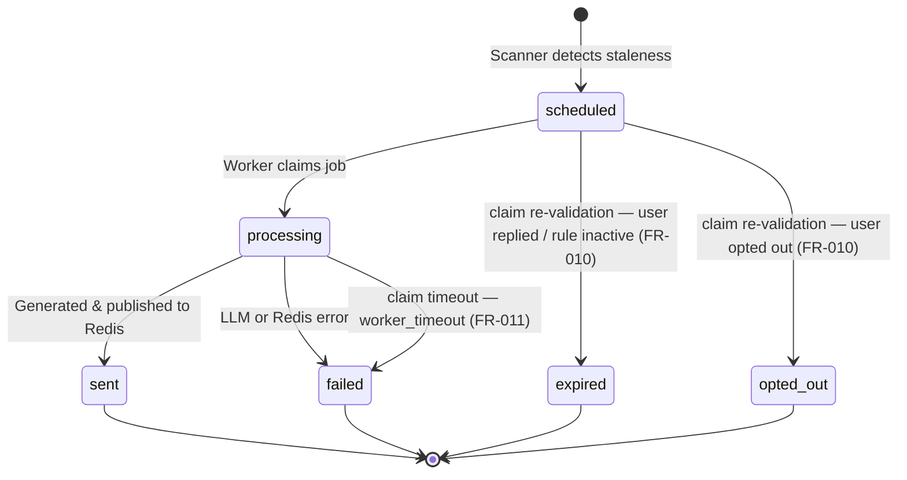

# Data Model: Re-engagement Runtime (009)

## Shared Entities (Product Authored, Engine Reads/Writes)

### FollowupRule (Read-Only)
The configuration authored in the Product.

| Field | Type | Description |
|-------|------|-------------|
| id | UUID | Primary key |
| tenantId | UUID | Tenant isolation |
| triggerStaleMinutes | Integer | Minutes of inactivity before trigger |
| conditions | JSONB | Scan filters per the **Conditions schema** below (e.g. `{"source": "telegram"}`) |
| backoff | JSONB | Array of minutes for retry backoff (e.g. `[1440, 2880, 4320]`). **Overflow**: when `attemptCount ≥ length`, use the last element. |
| maxAttempts | Integer | Maximum hooks to send for this rule |
| minIntervalMinutes | Integer | Cross-rule minimum minutes between ANY two hooks for the same conversation (anti-spam, FR-006). Default 1440 (24 h). |
| template | Text | Prompt/Template for hook generation |
| isActive | Boolean | Toggle |

#### Conditions schema (FR-002 / hermes H2)

`conditions` is a JSONB object of `field → matcher`. MVP-supported fields + operators (extensible):

| Field | Operator(s) | Semantics |
|-------|-------------|-----------|
| `source` (channel) | `eq`, `in` | conversation channel equals / in list |
| `tags` | `contains` | conversation `tags` array contains the value(s) |

Shorthand `{"source":"telegram"}` ≡ `{"source":{"eq":"telegram"}}`. Evaluated as additional `WHERE` clauses in the scan query (equality / JSON containment). New fields are added here **and** in the scanner's conditions evaluator (tasks T029).

### FollowupAttempt (Engine Written)
The execution log of re-engagement attempts.

| Field | Type | Description |
|-------|------|-------------|
| id | UUID | Primary key |
| conversationId | UUID | Reference to `conversations.id` |
| ruleId | UUID | Reference to `followup_rules.id` |
| tenantId | UUID | Tenant isolation |
| status | Enum | `scheduled`, `processing`, `sent`, `failed`, `opted_out`, `expired` |
| scheduledAt | Timestamp | When the hook should be generated/sent |
| sentAt | Timestamp | Actual send time |
| claimedAt | Timestamp | Set when a worker claims (`scheduled→processing`). Drives stuck-processing recovery (FR-011). |
| failureReason | Text | Error details if `failed` |
| idempotencyKey | Text | `convId:ruleId:cycleIndex` — **UNIQUE**. `cycleIndex` = `reengagementCount` at scheduling time (deterministic per dormancy cycle), NOT the count of hooks already sent. |

**Constraints**: `UNIQUE(idempotencyKey)` (equivalently `UNIQUE(tenantId, conversationId, ruleId, cycleIndex)`). Scheduling inserts with `ON CONFLICT DO NOTHING` — the constraint is the idempotency guard, NOT a check-then-insert. Worker-claim index: `(tenantId, status, scheduledAt)`.

## Engine Runtime Fields (Drizzle `conversations` table)

| Field | Type | Description |
|-------|------|-------------|
| needsReengagement | Boolean | Scanner pre-filter. Default `true` for active convos; set `false` on opt-out / close / human-handoff / all-active-rules-maxed; reset `true` on a new inbound user message (new dormancy cycle). |
| lastReengagementAt | Timestamp | Last successful hook sent |
| reengagementCount | Integer | Current cycle attempt count |
| optedOut | Boolean | User opt-out flag |

### Consumed base `conversations` fields (read-only — must exist in the base schema)

The runtime **reads** these existing engine columns; 009 does not own them but depends on them. Bind at implementation (T006/T010); if any is absent, add it in the T007 migration.

| Field | Type | Used for |
|-------|------|----------|
| `status` | enum | FR-007 exclusion: skip `closed` and **human-handled** states |
| `channelId` | text | delivery payload (`REDIS_STREAMS.OUTBOUND`) |
| `externalUserId` | text | delivery payload (recipient) |
| `lastMessageAt` | timestamptz | dormancy detection + claim-time re-validation (FR-010) |
| `tags` | text[] | Conditions schema `tags` matcher (FR-002) |

**Human-handled signal (FR-007)**: a conversation is "human-handled" when its base `status` denotes active operator/agent handling (the engine's hand-off status). The scanner excludes such conversations. If the base schema has no distinct hand-off status, T006/T007 adds the signal (a `status` value or `assignedOperatorId`).

## State Transitions (FollowupAttempt)

## Ownership per DD-RE-001

- `FollowupRule`: **Product** (Prisma) = Authority; **Engine** (Drizzle) = Reader.
- `FollowupAttempt`: **Engine** (Drizzle) = Sole Writer; **Product** (Prisma) = Reader.
- `conversations` fields: **Engine** (Drizzle) = Authority.
