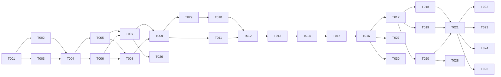

# Tasks: Re-engagement Runtime

**Input**: Design documents from `/specs/009-reengagement-runtime/`
**Prerequisites**: plan.md, spec.md, research.md, data-model.md, contracts/

## Agent Tags

| Tag | Agent | Domain |
|-----|-------|--------|
| `[SETUP]` | — (orchestrator) | Project init, shared config, scaffolding |
| `[DB]` | database-architect | Schema, migrations, seeds, indexes |
| `[BE]` | backend-specialist | API routes, services, worker logic |
| `[E2E]` | test-engineer | Integration/E2E/perf tests |
| `[OPS]` | devops-engineer | BullMQ config, environment setup, deployment |

---

## Phase 1: Setup (Shared Infrastructure)

- [ ] T001 [SETUP] Initialize `packages/shared/src/types/reengagement.ts` with Rule and Attempt interfaces
- [ ] T002 [SETUP] Create re-engagement service directory structure in `packages/core/src/services/reengagement/`
- [ ] T003 [OPS] Install `bullmq` and `@types/bullmq` in `packages/core` if missing

---

## Phase 2: Foundational (Blocking Prerequisites)

**⚠️ CRITICAL**: DD-RE-001 ownership resolution must happen first.

- [ ] T004 [DB] **BLOCKING GATE**: Resolve DD-RE-001 shared followup_* migration ownership with `ai-twins/006-reengagement-admin`. Coordinate with Product team BEFORE writing any migration.
- [ ] T005 [DB] Create Drizzle schema for `followup_rules` (read-only; incl. `minIntervalMinutes`, `conditions`) and `followup_attempts` (read-write; incl. `claimedAt`) in `packages/core/src/models/followups.ts`, with the **`UNIQUE(idempotencyKey)`** constraint and indexes `(tenant_id, status, scheduled_at)` + `(tenant_id, status, claimed_at)` (sweep).
- [ ] T006 [DB] Add runtime fields to `conversations`: `needsReengagement` (default `true` for active convos), `lastReengagementAt`, `reengagementCount`, `optedOut`. Also confirm the **consumed base fields** exist (`status` incl. closed + human-handoff states, `channelId`, `externalUserId`, `lastMessageAt`, `tags`); add any missing in the T007 migration (data-model §Consumed base fields).
- [ ] T007 [DB] Generate a reviewed `.sql` migration (Standing Order 5 — not auto-applied) for the conversation field updates (and shared tables if agreed in T004).
- [ ] T008 [OPS] Configure the BullMQ Redis **connection + env** (IORedis) for `ReengagementScanQueue`. Connection/env only — the repeatable scan-job **registration** and `worker.ts` logic are [BE]-owned (T016); per-attempt processing is DB-status-claim, not a per-attempt queue job.

**Checkpoint**: substrate ready — stories can begin.

---

## Phase 3: User Story 1 - Scan dormant conversations (Priority: P1) 🎯 MVP

**Goal**: Periodically scan for stale conversations and schedule attempts.

- [ ] T009 [BE] [US1] Implement `Scanner` service in `packages/core/src/services/reengagement/scanner.ts` per `scanner.contract.md`.
- [ ] T029 [BE] [US1] Implement the **conditions evaluator** (FR-002 / hermes H2): translate `rule.conditions` (Conditions schema — `source`/`tags`, ops `eq`/`in`/`contains`) into scan `WHERE` clauses (equality / JSON containment). Used by T010.
- [ ] T010 [BE] [US1] Implement batch querying for dormant conversations with tenant scoping; exclude `optedOut`, `closed`, human-handled, **and conversations with an open (`scheduled`/`processing`) attempt for the rule (FR-012, anti batch-poisoning)**; apply `rule.conditions` via T029.
- [ ] T011 [BE] [US1] Enforce idempotency via the DB `UNIQUE(idempotencyKey)` constraint — insert `FollowupAttempt` with `ON CONFLICT (idempotencyKey) DO NOTHING`. `idempotencyKey = convId:ruleId:cycleIndex`, `cycleIndex = reengagementCount` at schedule time (NOT sent-count). No check-then-insert.
- [ ] T012 [BE] [US1] Unit test for scanner: dormancy detection, tenant isolation, `ON CONFLICT` dedup (two racing scans → one row), conditions matching, and open-attempt exclusion (FR-012), in `packages/core/tests/reengagement/scanner.test.ts`.

---

## Phase 4: User Story 2 - Generate & deliver hook (Priority: P1) 🎯 MVP

**Goal**: Process scheduled attempts, generate hooks, and deliver to Redis.

- [ ] T013 [BE] [US2] Implement `Generator` in `generator.ts` per `hook-generator.contract.md`. **Prompt-injection guard (antigravity F5)**: history is untrusted — rule `template` is the only system instruction, history passed as delimited user/assistant turns; output sanity check before publish.
- [ ] T014 [BE] [US2] Integrate `Generator` with `llm.complete` under `TWIN_REENGAGE_LLM_TIMEOUT_MS` (default 30 s; timeout → `failed('llm_timeout')`, hermes M3) and `ChatService.persistMessages`.
- [ ] T015 [BE] [US2] Implement `Delivery` service in `delivery.ts` to publish hook to `REDIS_STREAMS.OUTBOUND` per `delivery.contract.md`.
- [ ] T016 [BE] [US2] Create `ReengagementWorker` in `worker.ts`: claim `scheduled` attempts via atomic `UPDATE status='scheduled'→'processing'` **setting `claimedAt`**; **re-validate eligibility at claim** — still dormant (`lastMessageAt ≤ scheduledAt`), not opted-out/closed/human-handled, rule still `isActive` → else `expired` (FR-010); register the repeatable BullMQ scan job (invokes `Scanner.runScan` per tenant) using the Redis connection from T008. Per `attempt-state-machine.contract.md`.
- [ ] T027 [BE] [US2] **Stuck-processing sweep (FR-011 — antigravity F1 / hermes C1)**: periodic job moving `processing` rows with `claimedAt + TWIN_REENGAGE_CLAIM_TIMEOUT_MS < now()` → `failed('worker_timeout')`, freeing the cycle budget. Unit-test crash/timeout recovery (a stuck row is reclaimed/failed, not orphaned).
- [ ] T017 [E2E] [US2] Integration test: end-to-end scan → generate → deliver in `packages/api/tests/integration/reengagement/e2e.test.ts`; assert no duplicate send under a racing/double-claim scenario.

---

## Phase 5: User Story 3 - Respect opt-out & anti-spam (Priority: P2)

**Goal**: Honor opt-out and backoff/maxAttempts/minInterval constraints.

- [ ] T018 [BE] [US3] Add backoff calculation to `Scanner` using `FollowupRule.backoff`; **overflow**: when `attemptCount ≥ len(backoff)` use the last element (hermes M2).
- [ ] T019 [BE] [US3] Implement `maxAttempts` check in `Scanner`.
- [ ] T020 [BE] [US3] Ensure the scan query skips `optedOut`, `closed`, and human-handled conversations; maintain the `needsReengagement` lifecycle (clear on opt-out / close / handoff / all-rules-maxed).
- [ ] T028 [BE] [US3] **Cross-rule anti-spam (FR-006 — hermes H1/H3)**: enforce `minIntervalMinutes` (skip if `now() - lastReengagementAt < minIntervalMinutes`) and schedule **at most ONE** attempt per conversation per scan across all rules. Unit-test: 3 matching rules → 1 hook.
- [ ] T021 [BE] [US3] Unit test: backoff (+ overflow), maxAttempts, and opt-out/closed/human-handled exclusion enforcement.
- [ ] T026 [BE] [US3] Re-cycling reset (FR-008): on inbound user-message persistence (chat path, e.g. `ChatService.persistMessages`), set `conversation.needsReengagement = true` and reset `reengagementCount = 0` for a fresh dormancy cycle. Unit-test: a maxed-out conversation becomes re-eligible after a new inbound message.

---

## Phase 6: Polish & Cross-Cutting Concerns

- [ ] T022 [OPS] Update `README.md` / `quickstart.md` with re-engagement worker start instructions.
- [ ] T023 [BE] Indexes: `(tenant_id, needs_reengagement, last_message_at)` for the scan, `(tenant_id, status, claimed_at)` for the sweep (FR-011), and support for the open-attempt exclusion lookup (FR-012).
- [ ] T024 [OPS] Final verification: run `quickstart.md` validation steps.
- [ ] T025 [E2E] Perf check (SC-002): per-attempt claim → Redis `OUTBOUND` publish p95 < 2 s; validate that **N-worker concurrency** drains a 10k backlog within the scan interval (hermes H4).
- [ ] T030 [OPS] Worker concurrency & recovery config (hermes H4): run **N worker processes** (`TWIN_REENGAGE_WORKERS`, default 4); set `TWIN_REENGAGE_CLAIM_TIMEOUT_MS` + `TWIN_REENGAGE_LLM_TIMEOUT_MS`; document horizontal scaling vs SC-002.

---

## Dependency Graph

### Dependencies

T001 → T002, T003
T002 + T003 → T004
T004 → T005, T006
T005 + T006 → T007, T008
T007 + T008 → T009
T009 → T011, T029
T029 → T010
T010 + T011 → T012
T012 → T013
T013 → T014
T014 → T015
T015 → T016
T016 → T017, T027, T030
T017 → T018, T019, T020
T018 + T019 + T020 → T021
T020 → T028
T007 → T026
T021 → T022, T023, T024, T025

---

## Parallel Lanes

| Lane | Agent Flow | Tasks | Blocked By |
|------|-----------|-------|------------|
| 1 | [SETUP] | T001, T002 | — |
| 2 | [OPS] | T003, T008, T022, T024, T030 | T001, T006 |
| 3 | [DB] | T004 → T005, T006 → T007 | T002 |
| 4 | [BE] | T009 → T029 → T010, T011 → T012 → T013 → T014 → T015 → T016 → T027; T018, T019, T020 → T021; T020 → T028; T023; T026 | T007, T008 |
| 5 | [E2E] | T017, T025 | T016 |

---

## Agent Summary

| Agent | Task Count | Can Start After |
|-------|-----------|-----------------|
| [SETUP] | 2 | immediately |
| [OPS] | 5 | T001 |
| [DB] | 4 | T002 |
| [BE] | 17 | T007 + T008 |
| [E2E] | 2 | T016 |

**Critical Path**: T004 → T005/T006 → T007/T008 → T009 → T029 → T010 → T012 → T013 → T014 → T015 → T016 → T017

---

## Agent Dispatch Plan

| Agent | Subagent | Skills | Input Context | Tasks | Files |
|-------|----------|--------|---------------|-------|-------|
| `[SETUP]` | — | — | plan.md §structure | T001, T002 | `packages/shared/`, `packages/core/src/services/reengagement/` |
| `[DB]` | `database-architect` | `database-design` | data-model.md, DD-RE-001 | T004, T005, T006, T007 | `packages/core/src/models/`, `drizzle/` |
| `[BE]` | `backend-specialist` | `api-patterns`, `system-design-patterns` | contracts/, data-model.md, spec §FR/Edge Cases | T009-T016, T018-T021, T023, T026, T027, T028, T029 | `packages/core/src/services/reengagement/`, chat persistence hook |
| `[OPS]` | `devops-engineer` | `deployment-procedures` | plan.md §Concurrency & Recovery | T003, T008, T022, T024, T030 | `packages/core/package.json`, `.env`, deploy config |
| `[E2E]` | `test-engineer` | `testing-patterns` | quickstart.md | T017, T025 | `packages/api/tests/integration/reengagement/` |
