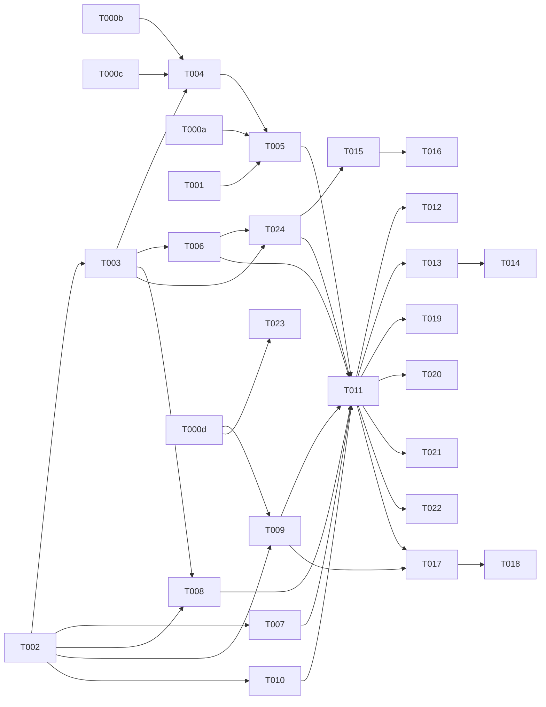

# Tasks: Hermes Executor (Agentic LLM Backend) — 010

**Input**: spec.md, plan.md, research.md, data-model.md, contracts/hermes-executor.contract.md, quickstart.md
**Decisions**: Topology C · always-agent (non-scripted) · real write-actions v1 · self-host `hermes-agent` (MIT) · Honcho working-mem + Postgres SoR · spawn/hibernate/warm-pool.
**Review-remediated 2026-06-03**: analyze (U1/I1/U2) + claude (F1–F14) + gemini (F1–F5).
**Integration verified 2026-06-03 (T000a, local smoke)**: shape = **ACP (turn) + engine-MCP (tools)** on `hermes-agent` **v0.15.1** (ndjson JSON-RPC/stdio; tools via engine MCP server; tool results auto-fenced; ACP auto-approves → confirm/dry-run enforced at MCP). Δ vs prior: executor = ACP client (not OpenAI-HTTP); new **T024** engine-MCP-server; **T000d** session-isolation gate; lifecycle = ACP resume; fallback via `LLM_PROVIDER_URL` (not `hermes proxy`).

## Agent Tags
`[SETUP]` orchestrator · `[DB]` database-architect · `[BE]` backend-specialist · `[OPS]` devops-engineer · `[E2E]` test-engineer · `[SEC]` security-auditor.

---

## Phase 0: Gates (blocking) ⚠️

- [X] T000a [BE] **Gate — integration contract (VERIFIED)**: shape = **ACP turn + engine-MCP tools** on `hermes-agent` v0.15.1. ndjson JSON-RPC/stdio; `initialize→session/new(mcpServers)→session/prompt→session/update→{stopReason,usage}`; tools namespaced `mcp_<server>_<tool>`, results auto-fenced; ACP auto-approves tool calls. Full findings in research.md §i. **Blocks T005.**
- [ ] T000b [SEC] **Gate — Honcho multi-tenant isolation**: per-`(tenant,persona,conversation)` namespace isolation + reconstructible from SoR. **Blocks T004.**
- [ ] T000c [SEC]/[OPS] **Gate — Honcho fitness** (claude F1/F10): scale (N tenants × M personas), failure modes (down/slow → cold-memory degrade holds), SoR→Honcho reconstruction round-trip. Fail → Plan B (engine-native memory). **Blocks T004.**
- [X] T000d [SEC]/[OPS] **Gate — cross-session isolation (RESULT 🔴 FAIL, smoke 2026-06-03)**: in one `hermes acp` process, session B retrieved a secret session A stored via the built-in `memory` tool → native memory is **process-global, not session-scoped** (cross-tenant leak). Memory-OFF re-test → **still leaks** (memory is durable + global + auto-injected at session load; disabling the tool only blocks writes). **Confirmed: process-per-tenant with an isolated memory store/HOME per tenant**; multi-session-per-tenant within a process is fine (same-tenant). **Gates T009/T023 pooling mode.**

## Phase 1: Setup

- [X] T001 [OPS] Stand up self-host **`hermes-agent`** (Docker baseline; eval Modal/Daytona for hibernate) + **Honcho**; env `HERMES_BASE_URL`/`HONCHO_URL`/`AGENT_LOOP_CAP`/`AGENT_MAX_EXECUTION_MS`/`TOOL_CALLBACK_TTL` (names only).
- [X] T002 [SETUP] Scaffold `packages/core/src/services/hermes/` (executor, **adapter (ACP)**, **mcp-server**, tool-gateway, guardrail, turn-router, agent-lifecycle, honcho-client).

## Phase 2: Foundational (blocking)

- [ ] T003 [DB] persona EXTEND (`agentEnabled`, `toolAllowlist` w/ `{id,isWrite,requiresConfirmation}`, `agentConfig`) + `agent_runs` (incl. `acpSessionRef`) + `action_audit` (**composite UNIQUE `(tenantId,idempotencyKey)`**, `status` pending/ok/failed/abandoned/denied/dry_run, sweep index) models; reviewed `.sql` migration (RLS + indexes, Standing Order 5).
- [ ] T004 [BE] `honcho-client.ts` — namespace per `(tenant,persona,conversation)`; hydrate + **SoR→Honcho reconstruction** (seed last-N + annotations; auto on health-miss/admin) + **lazy hydration** (gemini F5) + **Honcho-down → cold degrade** (claude F1). Gated by T000b, T000c.
- [ ] T005 [BE] `hermes-executor.ts` + `hermes-adapter.ts` — `runAgentTurn` drives an **ACP session** on a pooled `hermes acp` (ndjson JSON-RPC/stdio): `session/new` with `mcpServers:[engine-MCP]` → `session/prompt` → map `session/update` (`agent_message_chunk`→answer, `agent_thought_chunk`→thinking, `tool_call`/`tool_call_update`→audit/status, `usage`→metering) → resolve on `{stopReason}`. Inject context (persona+RAG 005+few-shot 008+history). **Hard `maxExecutionMs`** → abort turn → fallback (gemini F2). Gated by T000a, T001.
- [ ] T006 [BE] `tool-gateway.ts` — tool logic: allowlist + per-tenant write-permission + `withTenantContext` + audit (`action_audit`); **read tools first**. v1 **starter set** (`rag.search` native + `crm.read`/`calendar.read` stubs); broad integrations = future spec (claude F11). *(Surfaced to the agent via T024.)*
- [ ] T024 [BE] **`mcp-server.ts` — expose tool-gateway as an MCP server** (the agent's ONLY toolset): per-session, **tenant+persona scoped**; `tools/list`+`tools/call` → `executeTool`; native hermes terminal/browser/toolsets OFF; **confirm/dry-run + deny enforced HERE** (ACP auto-approves — T000a). Passed into the ACP session via `session/new.mcpServers`. Gated by T003, T006.
- [ ] T007 [BE] `guardrail.ts` — **validators (004) outbound gate** + budget/loop-cap + **fallback to `llm-client.complete()` via `LLM_PROVIDER_URL`/OmniRoute** (NOT `hermes proxy`) (FR-009).
- [ ] T008 [BE] `turn-router.ts` — scripted (003) → deterministic (Hermes may gen slot text **under stage control**, never drives transitions — I1/gemini F4); `agentEnabled` & non-scripted → Hermes (always-agent); else completion. Log routing. **Reads `persona.agentEnabled` ⇒ depends on T003** (claude F5).
- [ ] T009 [BE] `agent-lifecycle.ts` — **ACP-backed** pool: spawn/`session/new` or **resume** (ACP `sessionCapabilities.resume/fork/list`) / hibernate (drop/keep session) / evict + warm-pool of **live `hermes acp` processes** (Redis registry, keyed `(tenant,persona,conversation)`) **with documented default size** (load-bearing — claude F6; tuned T023). **Pool = process-per-tenant with an isolated memory store/HOME per tenant** (T000d 🔴: memory durable+global+auto-injected, even tool-off); multiple conversation sessions of the SAME tenant may share its process (same-tenant, not a leak).
- [ ] T010 [BE] Status-stream route (extends 002) wired into `buildServer()`; SSE from ACP `session/update` (thinking/tool/answer/**action_pending_approval**/done/timeout/budget_exceeded).

**Checkpoint**: executor(ACP) + adapter + MCP-server + gateway + guardrail + router + lifecycle + stream wired.

## Phase 3: User Story 1 — Agentic reply (P1) 🎯 MVP

- [ ] T011 [BE] [US1] Wire reply turn: router → executor(ACP) → tools via **engine-MCP (T024)** → guardrail(validators) → persist `agent_runs` (+`acpSessionRef`) → deliver validated answer; fallback on Hermes-outage/timeout.
- [ ] T012 [E2E] [US1] Multi-step/tool reply succeeds where completion can't; validators block non-compliant output; Hermes-down/timeout → fallback (degraded, not failed) (SC-001/004).

## Phase 4: User Story 2 — Hybrid routing (P1)

- [ ] T013 [BE] [US2] Scripted (003) turns deterministic; agent cannot skip/break funnel stage (stage-controlled gen only); routing logged.
- [ ] T014 [E2E] [US2] Funnel turn deterministic; non-scripted → Hermes; routing logged.

## Phase 5: User Story 4 — Write-actions (P1, C1)

- [ ] T015 [BE] [US4] **write-actions** in the engine-MCP tool path (T024) — **reserve→execute→finalize** idempotency (composite UNIQUE `(tenantId,idempotencyKey)`; reserve `pending` before side-effect; conflict ⇒ replay, no re-exec — U1) + **orphan TTL sweep** (`pending` past `TOOL_CALLBACK_TTL` → `abandoned`+reconcile — claude F2) + per-persona permission + audit + **high-stakes confirm/dry-run enforced at the MCP server** (`tools/call` returns dry-run/needs-confirmation, ACP won't prompt — T000a; claude F4/gemini F1); engine holds creds.
- [ ] T016 [SEC] [US4] Guard tests: non-allow-listed tool → `denied`; double-execute prevented (replay); **orphaned `pending` swept**; high-stakes → dry-run+confirm; **cross-tenant idempotency key collision isolated** (composite unique); secrets never reach the agent (NFR-2).

## Phase 6: User Story 3 — Agentic dožimy / dozhim (P2)

- [ ] T017 [BE] [US3] 009 scan → `lifecycle.spawn` → `runAgentTurn(kind:'dozhim')` → **009 anti-spam + validators gate** → send/suppress (audited) → hibernate. Agent never sends directly.
- [ ] T018 [E2E] [US3] No double-send/spam under autonomy; suppressed nudge logged (SC-002).

## Phase 7: Polish & cross-cutting

- [ ] T019 [BE] Metering (007): per-turn ACP `usage` + tool calls → OpenMeter; per-tenant budget + **boundary** (exhausted → finish in-flight, refuse new; per-turn cap → curtail+finalize — claude F13); over-budget → fallback (FR-008, SC-005).
- [ ] T020 [BE] Langfuse nested spans for agent loops; reconcile with hermes-agent tracing.
- [ ] T021 [SEC] Tenant isolation: Honcho namespace (per session/conversation) + Postgres RLS (composite-unique idempotency) + per-session engine-MCP scoped to `(tenant,persona)` — zero cross-tenant memory/runs/actions/tools (SC-003); concurrent same-persona turns isolated (claude F7).
- [ ] T022 [E2E] Cost-cap + abort + timeout: runaway loop → `loopCap` → `budget_exceeded`; `maxExecutionMs` → abort → fallback; abort mid-loop → no orphan write-action (replay + sweep) (FR-012/gemini F2).
- [ ] T023 [OPS] Hibernate/warm-pool **tuning** (default lands in T009) + serverless-persistence (Modal/Daytona) eval; **pooling = process-per-tenant** (T000d 🔴 FAIL); revisit session-sharing only if a memory-OFF (engine-MCP-only) re-test passes.

---

## Dependency Graph

### Dependencies

T000a + T000b + T000c + T000d → (gates)
T000b + T000c → T004
T000a → T005
T001 → T005
T002 → T003, T007, T008, T009, T010
T003 → T004, T006, T008, T024
T004 → T005
T006 → T024
T024 → T015
T005 + T006 + T007 + T008 + T009 + T010 + T024 → T011
T011 → T012, T013, T019, T020, T021, T022
T013 → T014
T015 → T016
T009 + T011 → T017
T017 → T018
T000d → T009, T023

### Self-validation
- All IDs (T000a–d, T001–T024) exist in the graph. ✔
- No cycles. ✔
- Fan-in `+`, fan-out `,`; no chained arrows on one line. ✔
- Gates (T000a/b/c/d) block core; `[SEC]`/`[E2E]` depend on impl. ✔
- T008 depends on T003 (reads `agentEnabled`); T024 (MCP) depends on T006 (gateway logic) + T003. ✔

---

## Parallel Lanes

| Lane | Agent Flow | Tasks | Blocked By |
|------|-----------|-------|------------|
| 0 | [BE]/[SEC]/[OPS] gates | T000a, T000b, T000c, T000d | — |
| 1 | [OPS] | T001, T023 | — |
| 2 | [SETUP] | T002 | — |
| 3 | [DB] | T003 | T002 |
| 4 | [BE] core | T004 → T005; T006 → **T024** → T015; T007, **T008 (needs T003)**, T009, T010 → **T011** → T013, T017, T019, T020 | gates, T001, T003 |
| 5 | [E2E]/[SEC] | T012, T014, T016, T018, T021, T022 | per-story impl |

---

## Agent Summary

| Agent | Task Count | Can Start After |
|-------|-----------|-----------------|
| [SETUP] | 1 | immediately |
| [OPS] | 2 (+gates T000c/d shared) | immediately (T001) |
| [DB] | 1 | T002 |
| [BE] | 16 (incl. gate T000a, +T024 MCP-server) | gates + T001/T003 |
| [SEC] | 5 (incl. gates T000b/c/d) | per-story / gate |
| [E2E] | 4 | per-story impl |

**Critical Path**: T000a/b/c → T004/T005 → T011 → T012 (agentic-reply MVP). Tools/write: T003 → T006 → **T024** → T015 → T016.

---

## Agent Dispatch Plan

| Agent | Subagent | Skills | Input Context | Tasks | Files |
|-------|----------|--------|---------------|-------|-------|
| `[SETUP]` | — | — | plan §structure | T002 | `packages/core/src/services/hermes/` |
| `[OPS]` | `devops-engineer` | `deployment-procedures`, `docker-expert` | plan §tech, research §d/§i | T001, T000c, T000d, T023 | orchestra compose (hermes-agent ACP, Honcho) |
| `[DB]` | `database-architect` | `database-design` | data-model.md | T003 | `packages/core/src/models/`, `drizzle/` |
| `[BE]` | `backend-specialist` | `api-patterns`, `system-design-patterns` | contracts/, research §i, spec §FR | T000a, T004-T011, T013, T015, T017, T019, T020, **T024** | `packages/core/src/services/hermes/` (incl. `hermes-adapter.ts` ACP, `mcp-server.ts`), `packages/api/` |
| `[SEC]` | `security-auditor` | `vulnerability-scanner`, `red-team-tactics` | spec §NFR, contract §security | T000b, T000c, T000d, T016, T021 | tests + `mcp-server.ts`/`tool-gateway.ts` review |
| `[E2E]` | `test-engineer` | `testing-patterns`, `webapp-testing` | quickstart §smoke, spec §SC | T012, T014, T018, T022 | `packages/api/tests/integration/hermes/` |

---

## Implementation Strategy

### MVP (US1)
Gates (T000a✔/b/c) → setup (T001✔/T002✔) → foundational (T003-T010 + **T024**) → **T011 agentic reply + fallback** → T012. STOP & validate: a real multi-step/tool answer via ACP+engine-MCP, validators gate, Hermes-down/timeout fallback.

### Then
US2 routing (T013/T014) · US4 write-actions (T015/T016, SEC-heavy) · US3 dožimy (T017/T018) · polish (metering/observability/isolation/cost-cap/lifecycle T019-T023) · T000d → pooling mode.

### Guardrails are NOT optional
validators-gate (T007/T011), engine-MCP tool-gateway = permission+idempotency(reserve→finalize, composite-unique)+orphan-sweep+confirm/dry-run+audit (T006/T024/T015), per-tenant budget+loop-cap+`maxExecutionMs` (T019/T005), tenant isolation (T021) — all v1, given always-agent + real write-actions.
