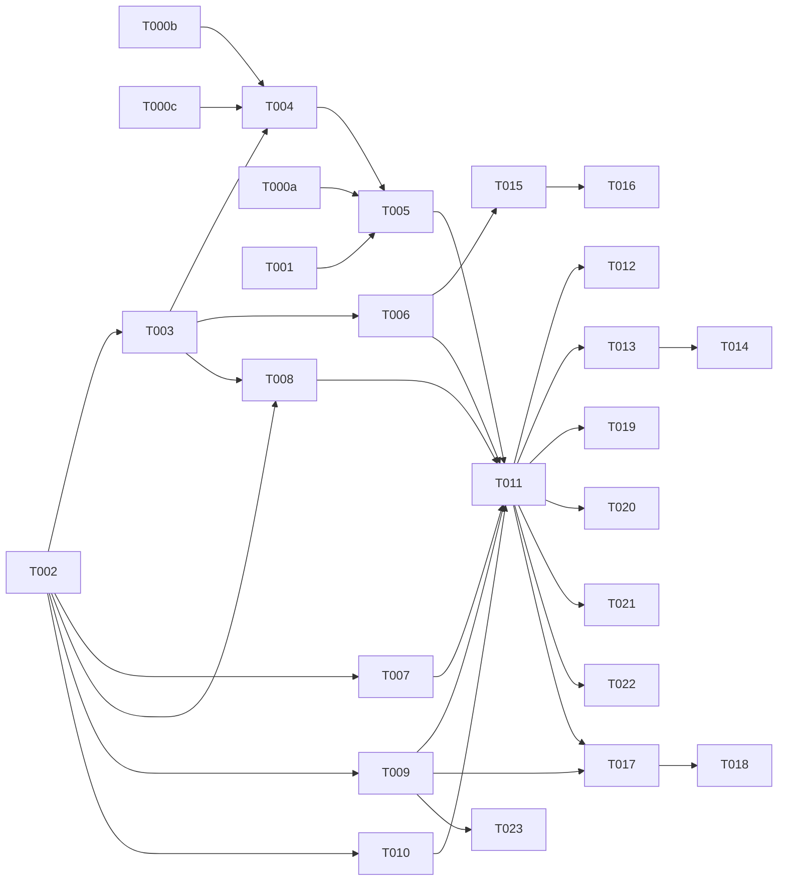

# Tasks: Hermes Executor (Agentic LLM Backend) — 010

**Input**: spec.md, plan.md, research.md, data-model.md, contracts/hermes-executor.contract.md, quickstart.md
**Decisions**: Topology C · always-agent (non-scripted) · real write-actions v1 · self-host `hermes-agent` (MIT) · Honcho working-mem + Postgres SoR · spawn-on-demand+hibernate+warm-pool.
**Review-remediated 2026-06-03**: analyze (U1/I1/U2) + claude (F1–F14) + gemini (F1–F5). Δ = T000c gate, T003→T008 dep, adapter layer, idempotency reserve-protocol + orphan TTL, confirm/dry-run handshake, hard timeout, reconstruction+lazy-hydrate, starter-tools scope, budget boundary.

## Agent Tags
`[SETUP]` orchestrator · `[DB]` database-architect · `[BE]` backend-specialist · `[OPS]` devops-engineer · `[E2E]` test-engineer · `[SEC]` security-auditor.

---

## Phase 0: Gates (blocking) ⚠️

- [X] T000a [BE] **Gate — pin `hermes-agent` v0.7.0 integration API** (self-host): run-turn endpoint, tool-callback mechanism, status streaming, session/memory handles. License MIT (research §a — GREEN). Pin the **version-upgrade strategy** (semver range / lockfile / adapter contract — claude F3). Record the exact contract in research.md. **Blocks T005.**
- [ ] T000b [SEC] **Gate — Honcho multi-tenant isolation**: confirm per-`(tenant,persona,conversation)` namespace isolation + that working memory is reconstructible from SoR (no record lives only in Honcho). **Blocks T004.**
- [ ] T000c [SEC]/[OPS] **Gate — Honcho fitness** (claude F1/F10): validate at expected scale (N tenants × M personas), failure modes (Honcho down/slow → cold-memory degrade path holds), and the **SoR→Honcho reconstruction round-trip** end-to-end. If Honcho fails → Plan B (engine-native working memory). **Blocks T004.**

## Phase 1: Setup

- [X] T001 [OPS] Stand up self-host **`hermes-agent`** (Docker baseline; eval Modal/Daytona serverless-persistence for hibernate) + **Honcho** in orchestra; env `HERMES_BASE_URL`/`HONCHO_URL`/`AGENT_LOOP_CAP`/`AGENT_MAX_EXECUTION_MS`/`TOOL_CALLBACK_TTL` (names only).
- [X] T002 [SETUP] Scaffold `packages/core/src/services/hermes/` (executor, **adapter**, tool-gateway, guardrail, turn-router, agent-lifecycle, honcho-client).

## Phase 2: Foundational (blocking)

- [ ] T003 [DB] persona EXTEND (`agentEnabled`, `toolAllowlist` w/ `{id,isWrite,requiresConfirmation}`, `agentConfig`) + `agent_runs` + `action_audit` (**UNIQUE(idempotencyKey)**, `status` pending/ok/failed/abandoned/denied/dry_run, sweep index) models; reviewed `.sql` migration (RLS + indexes, Standing Order 5).
- [ ] T004 [BE] `honcho-client.ts` — namespace per `(tenant,persona,conversation)`; hydrate + **SoR→Honcho reconstruction** (seed last-N messages + annotations on empty/stale; auto on health-miss or admin) + **lazy/background hydration** to cut TTFT (gemini F5) + **Honcho-down → cold-memory degrade** (claude F1). Gated by T000b, T000c.
- [ ] T005 [BE] `hermes-executor.ts` + `hermes-adapter.ts` — `runAgentTurn`: invoke self-host hermes-agent **through the adapter** (isolates v0.7.0 HTTP contract — claude F3) + inject context (persona+RAG 005+few-shot 008+history) + budget incl. **hard `maxExecutionMs`** (gemini F2) → on exceed emit `timeout` + force-abort → fallback; emit status events incl. `action_pending_approval` (contract §runAgentTurn). Gated by T000a, T001.
- [ ] T006 [BE] `tool-gateway.ts` — engine-mediated tools: allowlist + tenant-scope + audit (`action_audit`); **read tools first**. v1 ships a **starter tool set** (`rag.search` native + `crm.read`/`calendar.read` via **adapter stubs**); broad concrete integrations = future spec (claude F11). Native terminal/browser disabled unless allow-listed.
- [ ] T007 [BE] `guardrail.ts` — **validators (004) outbound gate** + budget/loop-cap + **fallback to `llm-client.complete()`** (FR-009).
- [ ] T008 [BE] `turn-router.ts` — scripted (003 funnel active) → deterministic (Hermes may generate slot text **under stage control**, never drives transitions — I1/gemini F4); `agentEnabled` & non-scripted → Hermes (always-agent); else completion. Log routing decision. **Reads `persona.agentEnabled` ⇒ depends on T003** (claude F5).
- [ ] T009 [BE] `agent-lifecycle.ts` — spawn-on-demand / hydrate(SoR+Honcho, lazy) / **suspend** (confirm-pause) / hibernate / evict + warm-pool (Redis state) **with a documented default pool size** (load-bearing per NFR — claude F6; tuned in T023).
- [ ] T010 [BE] Status-stream route (extends 002) wired into `buildServer()`; SSE step-events (thinking/tool/answer/**action_pending_approval**/done/timeout/budget_exceeded).

**Checkpoint**: executor + adapter + gateway + guardrail + router + lifecycle + stream wired.

## Phase 3: User Story 1 — Agentic reply (P1) 🎯 MVP

- [ ] T011 [BE] [US1] Wire reply turn: router → executor(adapter) → tool-gateway → guardrail(validators) → persist `agent_runs` → deliver validated answer; fallback on Hermes-outage/timeout.
- [ ] T012 [E2E] [US1] Multi-step/tool reply succeeds where completion can't; validators block non-compliant output; Hermes-down/timeout → fallback (degraded, not failed) (SC-001/004).

## Phase 4: User Story 2 — Hybrid routing (P1)

- [ ] T013 [BE] [US2] Scripted (003) turns stay deterministic; agent cannot skip/break funnel stage (stage-controlled generation only); routing decision logged.
- [ ] T014 [E2E] [US2] Funnel turn deterministic; non-scripted → Hermes; routing logged.

## Phase 5: User Story 4 — Write-actions (P1, C1)

- [ ] T015 [BE] [US4] tool-gateway **write-actions** — **reserve→execute→finalize** idempotency (UNIQUE key; reserve `pending` before side-effect; conflict ⇒ replay, no re-exec — U1) + **orphan TTL sweep** (`pending` past `TOOL_CALLBACK_TTL` → `abandoned` + reconcile — claude F2) + per-persona permission + audit + **high-stakes confirm/dry-run handshake**: dry-run → `action_pending_approval` → suspend session → approver accept/reject → resume (claude F4/gemini F1); engine holds creds (agent never does).
- [ ] T016 [SEC] [US4] Guard tests: non-allow-listed tool → `denied`; double-execute prevented (replay); **orphaned `pending` swept `abandoned`**; high-stakes → dry-run + pause→resume; secrets never reach the agent (NFR-2).

## Phase 6: User Story 3 — Agentic dožimy / dozhim (P2)

- [ ] T017 [BE] [US3] 009 scan → `lifecycle.spawn` → `runAgentTurn(kind:'dozhim')` → **009 anti-spam + validators gate** → send/suppress (audited) → hibernate. Agent never sends directly.
- [ ] T018 [E2E] [US3] No double-send/spam under autonomy (009 guards hold); suppressed nudge logged (SC-002).

## Phase 7: Polish & cross-cutting

- [ ] T019 [BE] Metering (007): per-turn llmCalls/toolCalls/tokens/cost → OpenMeter; per-tenant budget enforcement + **budget boundary** (exhausted → finish in-flight, refuse new; per-turn cap → curtail+finalize — claude F13); over-budget → fallback (FR-008, SC-005).
- [ ] T020 [BE] Langfuse nested spans for agent loops (observability); reconcile with hermes-agent tracing.
- [ ] T021 [SEC] Tenant isolation: Honcho namespace (incl. conversationId) + Postgres RLS + tool-gateway tenant-scope — zero cross-tenant memory/runs/actions (SC-003); concurrent same-persona turns isolated per-conversation (claude F7).
- [ ] T022 [E2E] Cost-cap + abort + timeout: runaway loop → `loopCap` → `budget_exceeded` → curtail/fallback; `maxExecutionMs` → force-abort → fallback; abort mid-loop → no orphan write-action (replay + sweep) (FR-012/gemini F2).
- [ ] T023 [OPS] Hibernate/warm-pool **tuning** (baseline default lands in T009) + serverless-persistence backend (Modal/Daytona) eval.

---

## Dependency Graph

### Dependencies

T000a + T000b + T000c → (gates)
T000b + T000c → T004
T000a → T005
T001 → T005
T002 → T003, T007, T008, T009, T010
T003 → T004, T006, T008
T004 → T005
T006 → T015
T005 + T006 + T007 + T008 + T009 + T010 → T011
T011 → T012, T013, T019, T020, T021, T022
T013 → T014
T015 → T016
T009 + T011 → T017
T017 → T018
T009 → T023

### Self-validation
- All IDs (T000a, T000b, T000c, T001–T023) exist in the graph. ✔
- No cycles. ✔
- Fan-in `+`, fan-out `,`; no chained arrows on one line. ✔
- Gates (T000a/b/c) block core; `[SEC]`/`[E2E]` depend on impl (not vice versa). ✔
- T008 now depends on T003 (reads `agentEnabled`) — claude F5 fixed. ✔

---

## Parallel Lanes

| Lane | Agent Flow | Tasks | Blocked By |
|------|-----------|-------|------------|
| 0 | [BE]/[SEC]/[OPS] gates | T000a, T000b, T000c | — |
| 1 | [OPS] | T001, T023 | — |
| 2 | [SETUP] | T002 | — |
| 3 | [DB] | T003 | T002 |
| 4 | [BE] core | T004 → T005; T006 → T015; T007, **T008 (needs T003)**, T009, T010 → **T011** → T013, T017, T019, T020 | gates, T001, T003 |
| 5 | [E2E]/[SEC] | T012, T014, T016, T018, T021, T022 | per-story impl |

---

## Agent Summary

| Agent | Task Count | Can Start After |
|-------|-----------|-----------------|
| [SETUP] | 1 | immediately |
| [OPS] | 2 (+gate T000c shared) | immediately (T001) |
| [DB] | 1 | T002 |
| [BE] | 15 (incl. gate T000a) | gates + T001/T003 |
| [SEC] | 4 (incl. gates T000b, T000c) | per-story / gate |
| [E2E] | 4 | per-story impl |

**Critical Path**: T000a/T000b/T000c → T004/T005 → T011 → T012 (agentic-reply MVP). Write-actions: T003 → T006 → T015 → T016.

---

## Agent Dispatch Plan

| Agent | Subagent | Skills | Input Context | Tasks | Files |
|-------|----------|--------|---------------|-------|-------|
| `[SETUP]` | — | — | plan §structure | T002 | `packages/core/src/services/hermes/` |
| `[OPS]` | `devops-engineer` | `deployment-procedures`, `docker-expert` | plan §tech, research §d | T001, T000c, T023 | orchestra compose (hermes-agent, Honcho) |
| `[DB]` | `database-architect` | `database-design` | data-model.md | T003 | `packages/core/src/models/`, `drizzle/` |
| `[BE]` | `backend-specialist` | `api-patterns`, `system-design-patterns` | contracts/, research, spec §FR | T000a, T004-T011, T013, T015, T017, T019, T020 | `packages/core/src/services/hermes/` (incl. `hermes-adapter.ts`), `packages/api/` |
| `[SEC]` | `security-auditor` | `vulnerability-scanner`, `red-team-tactics` | spec §NFR (isolation/secrets/actions), contract §security | T000b, T000c, T016, T021 | tests + `tool-gateway.ts` review |
| `[E2E]` | `test-engineer` | `testing-patterns`, `webapp-testing` | quickstart §smoke, spec §SC | T012, T014, T018, T022 | `packages/api/tests/integration/hermes/` |

---

## Implementation Strategy

### MVP (US1)
Gates (T000a/b/c) → setup (T001/T002) → foundational (T003-T010) → **T011 agentic reply + fallback** → T012. STOP & validate: a real multi-step/tool answer, validators gate, Hermes-down/timeout fallback.

### Then
US2 routing (T013/T014) · US4 write-actions (T015/T016, SEC-heavy) · US3 dožimy (T017/T018) · polish (metering/observability/isolation/cost-cap/lifecycle T019-T023).

### Guardrails are NOT optional
validators-gate (T007/T011), tool-gateway permission+idempotency(reserve→finalize)+orphan-sweep+audit (T006/T015), per-tenant budget+loop-cap+`maxExecutionMs` (T019/T005), tenant isolation (T021) — all v1, given always-agent + real write-actions.
