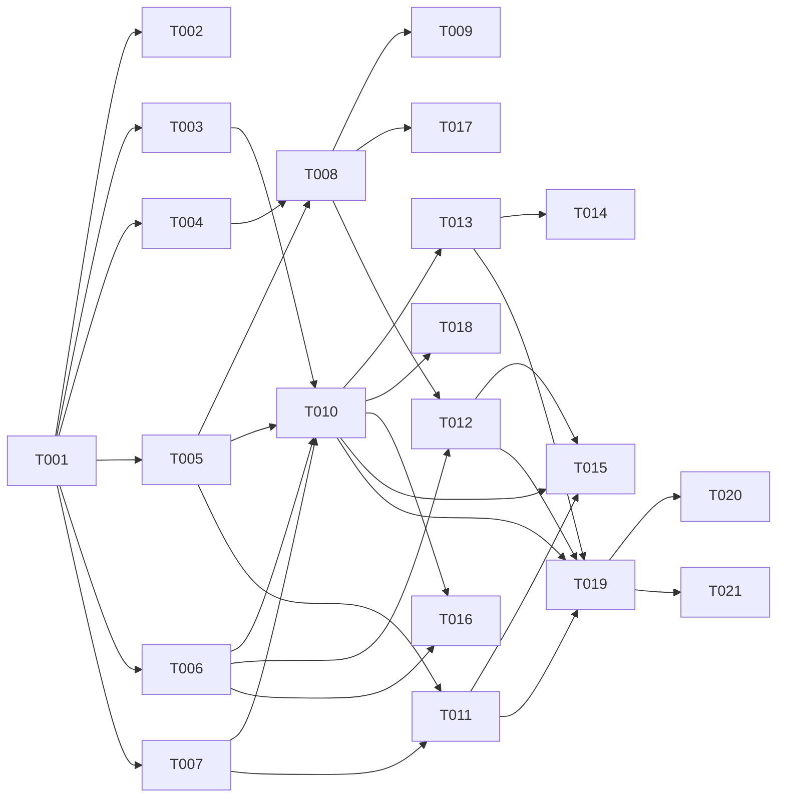

# Tasks: Per-Assistant LLM Provider Configuration (Runtime)

**Input**: Design documents from `specs/011-llm-configuration/`
**Prerequisites**: plan.md, spec.md, research.md, data-model.md, contracts/llm-provider.contract.md
**Tests**: spec NFR-6 requires E2E on the critical path → [E2E] included; security NFRs → [SEC] included.

## Phase 1: Setup

- [ ] T001 [SETUP] Scaffold `packages/core/src/services/llm-provider/` (provider-config.service, resolution, crypto, ssrf-guard, test-connection) + `services/retry/provider-retry.worker.ts` stub + internal API route stubs, per plan.md §structure
- [ ] T002 [OPS] Configure env/bindings (no secrets in repo): KMS envelope binding (007), BullMQ queue `llm-provider-retry`, SSRF allow/deny policy — document in `infra/.env.example`

---

## Phase 2: Foundational (Blocking Prerequisites)

**⚠️ Sync barrier — no user-story work until done. Includes the empirical gate.**

- [ ] T003 [BE] **Gate T000-LLM**: spike Hermes ACP `session/new` per-session model/provider/base_url override (research D1); record outcome → Strategy A (override) vs B (pool-by-config) in research.md
- [ ] T003b [BE] **(Conditional — if T003 = Strategy B)** Pool-keyed-by-config warm-pool manager: hash effective config → pool key; `MAX_DISTINCT_CONFIGS_PER_TENANT = 8` (env-tunable); LRU eviction on idle TTL (configurable, default 15 min); rejection on save if limit reached. Gated by T003 outcome. **Blocks T010 if Strategy B.**
- [ ] T004 [DB] Drizzle schema `llm_provider_config` + `tenant_llm_default` (data-model.md) with `UNIQUE(personaId)`/`UNIQUE(tenantId)`, `version` optimistic-lock col; generate reviewable migration `.sql` (no direct apply — Standing Order 5)
- [ ] T005 [BE] Crypto module `crypto.ts` — KMS-envelope encrypt/decrypt, decrypt-only-at-injection (research D2), typed errors, no plaintext logging
- [ ] T006 [BE] SSRF guard `ssrf-guard.ts` — reject loopback/private/link-local/cloud-metadata + DNS-resolve-and-pin (research D5), with unit tests
- [ ] T007 [BE] Resolution `resolution.ts` — `effective(tenant, persona) = override → tenantDefault → platformDefault` (data-model §resolution) with unit tests

**Checkpoint**: schema + crypto + SSRF + resolution + injection-strategy decided → stories can begin

---

## Phase 3: User Story 1 - Per-assistant provider applied on reply-path (P1) 🎯 MVP

**Goal**: operator-configured custom provider is stored (key encrypted) and the assistant's agentic + thin-completion turns actually run on it.
**Independent Test**: set an override → run a turn → trace/metering shows the configured `baseUrl`/`modelId`; validators still gate.

- [ ] T008 [BE] [US1] Provider-config service `provider-config.service.ts` — upsert/get/delete tenant-default + assistant-override, **write-only** key (encrypt via T005), optimistic-lock, typed inputs/outputs
- [ ] T009 [BE] [US1] Internal API GET/PUT/DELETE config (tenant + assistant), contracts §A, with Zod validation + structured errors + masked key (never return plaintext)
- [ ] T010 [BE] [US1] Inject effective config into Hermes executor (`hermes-executor.ts`/`hermes-adapter.ts`) via Strategy A or B (per T003) + coherence assertion (research D3) + metering `byok` tag (D6)
- [ ] T011 [BE] [US1] Extend thin-completion path (`llm-client.ts`) to honor the same assistant's effective config (FR-009 — no provider drift on fallback)
- [ ] T012 [BE] [US1] test-connection service+endpoint (`test-connection.ts`, contracts §A) — typed `ok/reason`, rate-limited, no key/raw-upstream leak. **Key merge**: if `apiKey` is omitted in the request (write-only UI), merge with the currently stored (decrypted) key for testing; test the effective merged state, not just the partial payload.

**Checkpoint**: MVP — configure + inject + apply works end-to-end

---

## Phase 4: User Story 2 - Durable-retry, no model-swap (P1)

**Goal**: provider outage on the prod path never loses a message and never silently swaps model.
**Independent Test**: break the provider → turn enqueues + retries same provider; restore → completes; exhaust window → dead-letter + alert.

- [ ] T013 [BE] [US2] BullMQ `provider-retry.worker.ts` — enqueue on `UPSTREAM_*` (prod path), exponential backoff, re-resolve + re-decrypt per attempt, **same provider**; refine 010 FR-009 (no thin-completion swap)
- [ ] T014 [BE] [US2] Dead-letter + operator alert on window exhaustion; keep sandbox/interactive path synchronous (typed error + manual retry, no enqueue)

**Checkpoint**: zero message loss, zero silent model-swap

---

## Phase 5: User Story 3 - Secret handling + SSRF (P1)

**Goal**: key never leaks/crosses tenants; user-supplied base URL can't reach the internal network.
**Independent Test**: grep logs/traces for key → zero; SSRF base_url → blocked; concurrent tenants → no cross-tenant key use.

- [ ] T015 [SEC] [US3] Secret-handling audit — key absent from logs/traces/error bodies/audit; decrypt-only-at-injection enforced; Langfuse/audit redaction (FR-011)
- [ ] T016 [SEC] [US3] SSRF + cross-tenant isolation audit — egress guard effective incl. DNS-rebind; pooled-process key/config isolation (research D3); no foreign/stale config served

---

## Phase 6: User Story 4 - Lifecycle + pooling coherence (P2)

**Goal**: config changes apply to next turns + queued retries; pooled processes never serve stale/foreign config.
**Independent Test**: update config mid-flight → next turn uses new; clear override → default → platform.

- [ ] T017 [BE] [US4] Config-change propagation — subsequent turns + queued retries use current effective config; clear-override→default, clear-both→platform (FR-011)
- [ ] T018 [BE] [US4] Pooling-coherence enforcement — hard assertion a pooled/warm process never serves a stale/foreign provider config (research D3) under Strategy A/B; idle TTL eviction + MAX_DISTINCT_CONFIGS limit (T003b if Strategy B)

---

## Phase 7: Polish & Cross-Cutting

- [ ] T019 [E2E] Integration suite — provider parity, durable-retry no-loss + dead-letter, cross-tenant isolation, SSRF block (NFR-6) in `packages/core` integration tests
- [ ] T020 [PERF] Warm-pool latency budget check post-injection (010 p95 ≤ ~8 s warm) for the chosen strategy
- [ ] T021 [DOC] Update contracts/quickstart + add 011 reference row to `specs/main/architecture.md` (apply on consent — file currently has uncommitted 010 changes)

---

## Dependency Graph

### Dependencies

T001 → T002, T003, T004, T005, T006, T007
T003 → T003b (conditional)
T004 + T005 → T008
T008 → T009, T017
T003 + T005 + T006 + T007 + T003b (if Strategy B) → T010
T005 + T007 → T011
T006 + T008 → T012
T010 → T013, T018
T006 + T010 → T016
T013 → T014
T010 + T011 + T012 → T015
T010 + T011 + T012 + T013 → T019
T019 → T020, T021

### Self-Validation

- [x] Every task ID in Dependencies exists (T001–T021)
- [x] No circular dependencies
- [x] No orphan IDs
- [x] Fan-in uses `+` only; fan-out uses `,` only
- [x] No chained arrows on a single line

---

## Dependency Visualization

---

## Parallel Lanes

| Lane | Agent Flow | Tasks | Blocked By |
|------|-----------|-------|------------|
| 1 | [SETUP]/[OPS] | T001, T002 | — |
| 2 | [DB] | T004 | T001 |
| 3 | [BE] primitives | T005, T006, T007 | T001 |
| 4 | [BE] gate | T003 | T001 |
| 5 | [BE] config/api | T008 → T009, T012, T017 | T004+T005 |
| 6 | [BE] inject/retry | T010 → T013 → T014; T011; T018 | T003+T005+T006+T007 |
| 7 | [SEC] | T015, T016 | impl tasks |
| 8 | [E2E]/[PERF]/[DOC] | T019 → T020, T021 | T010+T011+T012+T013 |

---

## Agent Summary

| Agent | Task Count | Can Start After |
|-------|-----------|-----------------|
| [SETUP] | 1 | immediately |
| [OPS] | 1 | T001 |
| [DB] | 1 | T001 |
| [BE] | 13 | T001 (gate/primitives), then per graph |
| [SEC] | 2 | T010+T011+T012 (and T016 after T006+T010) |
| [E2E] | 1 | T010+T011+T012+T013 |
| [PERF] | 1 | T019 |
| [DOC] | 1 | T019 |

**Total**: 21 tasks. **Critical Path**: T001 → T003 (gate) → T010 → T013 → T019 → T020

---

## Agent Dispatch Plan

| Agent | Subagent | Skills | Input Context | Tasks | Files |
|-------|----------|--------|---------------|-------|-------|
| `[SETUP]` | — (orchestrator) | — | plan.md §structure | T001 | `packages/core/src/services/llm-provider/`, `services/retry/` |
| `[OPS]` | devops-engineer | deployment-procedures | plan.md §constraints, research D2 | T002 | `infra/.env.example` |
| `[DB]` | database-architect | database-design | data-model.md | T004 | `packages/core/src/db/schema/llm-provider.ts`, migration `.sql` |
| `[BE]` | backend-specialist | api-patterns, system-design-patterns | contracts/, data-model.md, research D1–D6 | T003, T005–T013, T017, T018 | `services/llm-provider/`, `services/hermes/`, `services/retry/`, `llm-client.ts`, `api/` |
| `[SEC]` | security-auditor | vulnerability-scanner, red-team-tactics | spec §NFR, research D3/D5 | T015, T016 | project-wide (secrets, egress, pool) |
| `[E2E]` | test-engineer | testing-patterns | quickstart.md, contracts/ | T019 | `packages/core` integration tests |
| `[PERF]` | performance-optimizer | performance-profiling | plan.md §perf, 010 NFR | T020 | executor hot path |
| `[DOC]` | documentation-writer | documentation-templates | contracts/, quickstart.md | T021 | `specs/main/architecture.md` |

---

## Implementation Strategy

- **MVP** = Phase 1 + Phase 2 (incl. gate T000-LLM) + Phase 3 (US1). Delivers: configure provider (key encrypted) → inject → assistant runs on it.
- **Then** US2 (durable-retry) → US3 (security audits) → US4 (lifecycle/pooling) → Polish.
- **Gate-first**: T003 must resolve A vs B before T010 — do not build injection on an unverified ACP assumption.
- WRAP: each task < 500 LOC; migration is reviewable `.sql`; no secrets in code/logs.

## Notes

- Cross-spec: **DD-HXL-003 refines 010 FR-009** — verify no BYOK provider-failure path silently swaps to thin-completion.
- `[SEC]` is load-bearing here (BYOK key + SSRF + pool isolation) — not optional polish.
