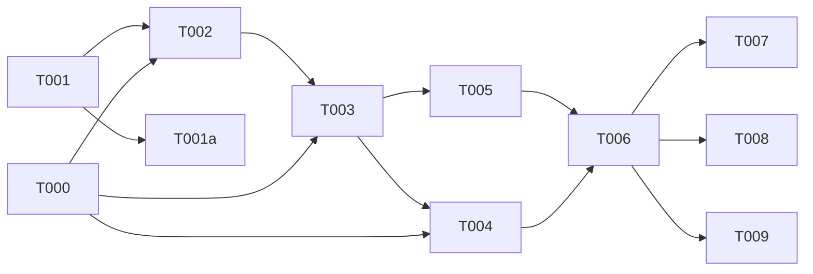

# Tasks: 012-openai-endpoint (Engine — Runtime)

**Input**: design from `/specs/012-openai-endpoint/` (spec.md, plan.md, research.md, contracts/openai-public.md)
**Pairs with**: Product `ai-twins/012-openai-endpoint` (key-management admin UI/BFF).

## Agent Tags

| Tag | Agent | Domain |
|-----|-------|--------|
| `[DB]` | database-architect | Drizzle schema, migration |
| `[BE]` | backend-specialist | API routes, services, middleware |
| `[SEC]` | security-auditor | key hashing, tenant isolation |
| `[E2E]` | test-engineer | Vitest integration tests |

---

## Phase 0: Decision gates (blocking) ⚠️

- [x] T000 [BE] **Gate: existing chat-completions surface** — confirm: (a) `chat-completions.ts` already handles `model = personaSlug` + `request.tenantId`; (b) `ChatService.complete/completeStream` accept `isTestThread` flag; (c) streaming SSE format is OpenAI-compatible. Verify by reading source. **Blocks T002, T003, T004.**

## Phase 1: Data model

- [x] T001 [DB] Create `packages/core/src/models/api-key.ts` — Drizzle `pgTable('workspace_api_keys')` with columns: `id` (uuid), `keyHash` (text, HMAC-SHA256), `keyPrefix` (text, `sk-aitw-...` first 12 chars), `name` (text), `workspaceId` (text, FK → tenants), `mode` (text: `test`|`live`), `expiresAt` (timestamp, nullable), `revokedAt` (timestamp, nullable), `createdAt` (timestamp), `lastUsedAt` (timestamp, nullable). Index on `keyHash` (unique), `workspaceId`. Register in `models/index.ts`.
- [ ] T001a [DB] Generate migration SQL via `pnpm db:generate` → `specs/012-openai-endpoint/migrations/` for review.

## Phase 2: Core service

- [x] T002 [BE] Create `packages/core/src/services/api-key.service.ts` — `ApiKeyService`:
  - `generateKey(workspaceId, name, mode, expiresAt?)`: generate `sk-aitw_<32-byte-hex>`, HMAC-SHA256 hash with `API_KEY_HMAC_SECRET`, store in DB, return `{ meta, plaintextKey }`.
  - `validateKey(plaintextKey)`: HMAC-SHA256 → lookup by `keyHash`, check `revokedAt IS NULL` and `expiresAt`, return key meta + workspaceId or null.
  - `listKeys(workspaceId)`: return all keys for workspace (no plaintext).
  - `revokeKey(keyId, workspaceId)`: set `revokedAt = now()`.
  - `rotateKey(keyId, workspaceId)`: revoke old + generate new (atomic transaction).
  - `touchLastUsed(keyId)`: update `lastUsedAt` on successful auth.
  - All methods tenant-scoped via `withTenantContext`.

## Phase 3: Auth middleware

- [x] T003 [BE] Create `packages/api/src/middleware/auth-public.ts` — Fastify plugin:
  - `onRequest` hook for public routes only.
  - Extract `Authorization: Bearer <key>`, call `ApiKeyService.validateKey()`.
  - On success: set `request.tenantId` from key's `workspaceId`, `request.apiKeyMeta` (mode, keyId).
  - On failure: return OpenAI-shaped 401 error.
  - **Must skip** for non-public routes (internal Bearer auth still applies).
  - Rate-limit check (per-key, in-memory sliding window for MVP; FR-006).

## Phase 4: Public routes

- [x] T004 [BE] Create `packages/api/src/routes/v1/openai/models.ts` — `GET /v1/models`:
  - Auth via `auth-public.ts`.
  - Query `PersonasRepository.listByTenant(request.tenantId)`.
  - Return OpenAI-shaped `{ object: "list", data: [...models] }` where each model = `{ id: "asst_<slug>", object: "model", owned_by: "ai-twins", ... }`.
  - Cache response per-tenant (TTL 30s, invalidated on assistant change — simple Map for MVP).
- [x] T005 [BE] Create `packages/api/src/routes/v1/openai/chat.ts` — `POST /v1/chat/completions`:
  - Auth via `auth-public.ts`.
  - Strip `asst_` prefix from `body.model` → `slug`. Validate starts with `asst_`.
  - Look up persona by slug within `request.tenantId`. 404 if not found.
  - Determine `isTestThread` from `request.apiKeyMeta.mode === "test"`.
  - Thread dedup: derive `externalThreadId` from `hash(messages[0].content + model)`. Find or create conversation.
  - Delegate to `ChatService.complete()` or `ChatService.completeStream()` (non-stream / stream).
  - Return OpenAI-shaped response (existing serialization already compatible).
  - `touchLastUsed(keyId)` on success.
- [x] T006 [BE] Register public routes in `server.ts` — add Fastify `register()` with `/v1` prefix, applying `auth-public.ts` only to public route group. Existing routes keep their current auth hooks. Ensure no conflict between public `/v1/chat/completions` (key-auth) and internal `/v1/chat/completions` (Bearer-auth) — use separate Fastify context or route-level differentiation.

## Phase 5: Tests

- [ ] T007 [E2E] Unit tests for `ApiKeyService`: generateKey → hash matches, validateKey → correct lookup, revokeKey → key invalidated, rotateKey → atomic, expired key → rejected.
- [ ] T008 [E2E] Integration tests for public routes:
  - `GET /v1/models` with valid key → returns workspace assistants.
  - `POST /v1/chat/completions` with valid key + `asst_<slug>` → returns reply.
  - Invalid key → 401.
  - Revoked key → 401.
  - Cross-workspace model → 404.
  - `test` mode → `isTestThread=true` in conversation.
  - Rate-limit exceeded → 429.
- [ ] T009 [SEC] Security tests: HMAC key derivation correctness, no timing attacks on hash comparison, cross-tenant isolation (key A cannot see/use workspace B's assistants), no plaintext in logs.

---

## Dependency Graph

### Dependencies

T000 → T002, T003, T004
T001 → T002
T001a → T001
T002 → T003
T003 → T004, T005
T004 → T006
T005 → T006
T006 → T007, T008, T009

### Self-validation
- All IDs (T000–T009, T001a) present in graph. ✔
- No cycles. ✔
- Gate T000 blocks core service + middleware + routes. ✔
- [SEC] (T009) depends on impl (T006). ✔

---

## Parallel Lanes

| Lane | Agent Flow | Tasks | Blocked By |
|------|-----------|-------|------------|
| 0 | [BE] gate | T000 | — |
| 1 | [DB] schema | T001 → T001a | — |
| 2 | [BE] service | T002 | T000, T001 |
| 3 | [BE] middleware | T003 | T000, T002 |
| 4 | [BE] routes | T004, T005 → T006 | T000, T003 |
| 5 | [E2E] | T007, T008 | T006 |
| 6 | [SEC] | T009 | T006 |

---

## Agent Summary

| Agent | Task Count | Can Start After |
|-------|-----------|-----------------|
| [DB] | 2 | immediately |
| [BE] | 7 | T000 gate immediately; T002+ after gate |
| [E2E] | 2 | T006 |
| [SEC] | 1 | T006 |

**Critical Path**: T000 → T002 → T003 → T005 → T006 → T008

---

## Implementation Strategy

- **Phase 0–1** (T000, T001): Verify existing surface + create DB schema. Parallel.
- **Phase 2** (T002): Core key management service.
- **Phase 3** (T003): Public auth middleware.
- **Phase 4** (T004–T006): Public routes + server registration.
- **Phase 5** (T007–T009): Tests + security validation.
