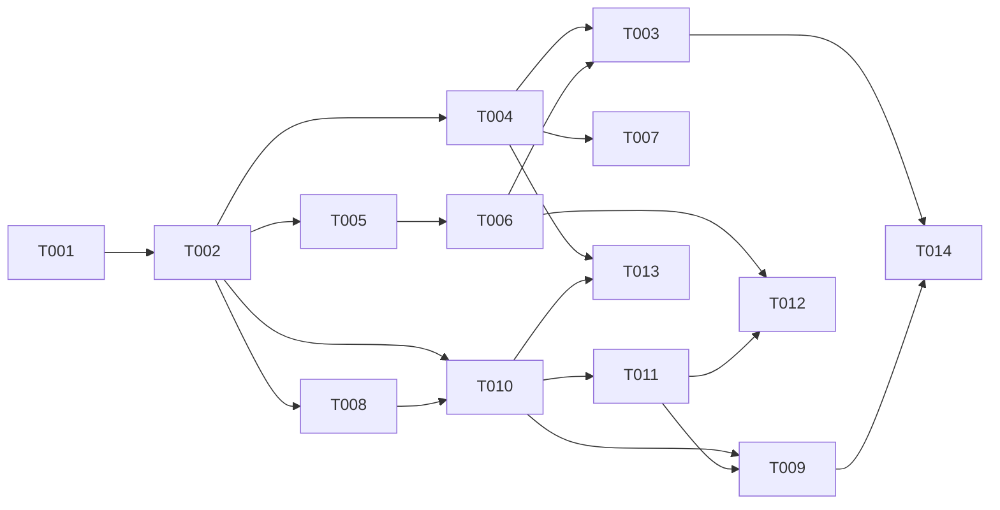

# Context for External Review: Agentic Loop Runtime Readiness (013)

This file consolidates all relevant SpecKit artifacts and project constraints for the feature `013-agentic-runtime-readiness`. It is intended for independent critical review by other AI agents.

---

## 1. Feature Specification (`spec.md`)

```markdown
# Feature Specification: Agentic Loop Runtime Readiness

**Feature Branch**: `013-agentic-runtime-readiness`
**Created**: 2026-06-07
**Status**: Draft
**Input**: User description: "на 2 хвоста" — the two runtime gaps that block the Hermes agentic loop (spec 010) from actually running after the standalone-compose image-namespace fix: (1) the Hermes CLI is not available to the engine runtime, and (2) the Honcho memory client speaks an API the deployed Honcho no longer serves, so twin memory silently degrades to a no-op.

## Context *(why this exists)*

Spec 010 (Hermes Executor) defined the agentic loop: the engine drives a per-tenant `hermes acp` subprocess (ACP/JSON-RPC over stdio) and stores working memory in Honcho. Two gaps prevent that loop from running in a deployed stack:

1. **Hermes runtime absence.** `HermesExecutor` requires `HERMES_ACP_CMD` and `spawn`s it on the first agentic turn ([hermes-executor.ts:86-95](../../packages/core/src/services/hermes/hermes-executor.ts), [hermes-adapter.ts:9](../../packages/core/src/services/hermes/hermes-adapter.ts)), but **nothing guarantees `hermes` is resolvable** where the engine runs. Hermes is a Python CLI (`hermes_cli`, installed today only in a dev-host venv). There is **no engine Dockerfile in the repo** (both compose files reference `packages/api/Dockerfile`, which does not exist), and there is **no startup preflight** — so a missing/incompatible Hermes surfaces as an opaque `spawn ENOENT` to the **first end-user turn**, not at boot.

2. **Honcho API drift.** `HonchoClient` targets the legacy `/apps/{appId}/users/{userId}/...` REST surface ([honcho-client.ts:31-58](../../packages/core/src/services/hermes/honcho-client.ts)). The deployed image is Honcho **v3.x** (`ghcr.io/plastic-labs/honcho:v3.0.9`), whose API is reorganised around workspaces/peers. Every call is wrapped in `try/catch` that returns `[]`/no-ops on failure, so memory **silently stops working** — turns succeed, but twins never persist or recall anything, and nothing reports the degradation.

This feature makes both gaps explicit, fail-loud where they should, and closed.

## Clarifications

### Session 2026-06-07
- **Q: Engine deployment model?** → **Both.** Ship a reproducible engine **container image** (new `packages/api/Dockerfile`, Node + Python, Hermes CLI on PATH) for prod-like one-command deploy, **and** keep a documented/verifiable **host prerequisite** path for local dev (today's venv). (resolves FR-004)
- **Q: Existing Honcho data on v3 cutover?** → **Disposable/fresh.** Honcho is reconstructible from the SoR (spec 010 §c); no data of record lives only there. Start clean on cutover, no data migration. (resolves FR-010)
- **Q: Version pinning?** → **Pin exact.** Hermes `0.15.1`; the Honcho client targets `v3.0.9` (matching the deployed image tag). No floating ranges. (resolves FR-011)
- **Q: Worker/channel Dockerfiles in scope?** → **No.** Engine + Hermes + Honcho memory only; the other three missing Dockerfiles belong to a separate "containerize the stack" feature. (sets scope boundary)

## User Scenarios & Testing *(mandatory)*

### User Story 1 - Agentic turns actually execute (Priority: P1)

As an **operator** deploying the Twin Engine, when a tenant's twin takes an agentic turn, the turn runs end-to-end instead of crashing because the Hermes runtime is missing.

**Why this priority**: Without a resolvable Hermes CLI, **every** agentic turn dies (`spawn ENOENT`). This is a hard, total blocker for the loop — nothing in spec 010 works. The failure is also invisible until a real user triggers it, which is the worst possible place to discover it.

**Independent Test**: Deploy the stack, send one message that routes to the agentic path, and observe a completed turn (streamed answer, `stopReason: end_turn`). Separately, deliberately break the Hermes runtime and confirm the engine refuses to start (or reports unhealthy) with an actionable error *before* any turn is attempted.

**Acceptance Scenarios**:

1. **Given** a correctly deployed engine runtime, **When** an agentic turn is dispatched, **Then** the engine spawns `hermes acp`, drives the ACP handshake, and the turn completes without a spawn/runtime error.
2. **Given** the Hermes CLI is absent or unresolvable on the engine's PATH, **When** the engine starts up, **Then** it fails fast with a clear, typed configuration error naming the missing dependency — it does **not** defer the failure to the first user turn.
3. **Given** a Hermes whose ACP protocol version is incompatible with what the engine speaks, **When** the engine performs its startup preflight, **Then** it reports the version incompatibility explicitly rather than failing mid-conversation.

---

### User Story 2 - Twins remember across turns (Priority: P2)

As an **end-user** talking to a twin, my working/user-model memory is actually written and recalled across turns, instead of being silently dropped.

**Why this priority**: Memory degrades *gracefully* today (turns still succeed), so this is not a total outage like US1 — but a twin with no memory is a degraded product, and the failure is **silent**, which means it can ship unnoticed. Fixing US1 makes the loop run; fixing US2 makes it useful.

**Independent Test**: With Honcho running, complete a turn that establishes a fact, then a later turn that should recall it; verify the recall reflects the stored fact (memory round-trip). Separately, stop Honcho and confirm turns still complete (degraded) **and** that the degradation is visible in logs/metrics/health.

**Acceptance Scenarios**:

1. **Given** a running deployed Honcho (v3), **When** the engine writes a message/insight for `(tenant, persona[, externalUser])` and later reads it back, **Then** the write and read succeed against the deployed API version (no silent no-op).
2. **Given** Honcho is unavailable, **When** an agentic turn runs, **Then** the turn still completes without memory, **and** the memory failure is logged and surfaced via a signal (metric/health), not swallowed invisibly.
3. **Given** two distinct tenants, **When** each writes memory, **Then** neither tenant can read the other's memory (per-tenant isolation holds in the v3 namespace model).

---

### Edge Cases

- **Hermes present but wrong version** → ACP protocol mismatch; preflight must catch it, not the first turn.
- **Hermes spawns but per-tenant isolation must hold** → spec 010 T000d showed Hermes' native memory is process-global (cross-tenant leak), mandating process-per-tenant with isolated `HERMES_HOME`. This feature MUST NOT regress that isolation.
- **Honcho endpoint shape differs in v3** → the migration must map the engine's `(tenant, persona, externalUser)` identity onto the v3 namespace primitives; the exact mapping is an implementation detail for the plan, but per-tenant isolation and SoR-reconstructibility (spec 010 §c) are invariants.
- **Pre-existing Honcho data in the old shape** → on first deploy against v3, legacy-shaped data may be unreadable. **Resolved (CQ2): store is disposable/fresh — rebuilt from SoR, no migration.**
- **Honcho transient errors vs hard API mismatch** → graceful degradation should cover transient outages, but a *permanent* API mismatch (wrong version) should be loud, not hidden behind the same `catch`.
- **Deployment model split** → the engine must work **both** in a container (image installs Hermes on PATH) and on a host (Hermes on host PATH) — both are in scope (CQ1). "On PATH" is resolved per the runtime context.

## Requirements *(mandatory)*

### Functional Requirements

- **FR-001**: The engine runtime environment MUST make the Hermes agent CLI resolvable such that the configured `HERMES_ACP_CMD` spawns successfully (no `ENOENT`).
- **FR-002**: The provided Hermes version MUST be compatible with the ACP wire protocol the engine speaks (ACP `protocolVersion 1`; reference baseline `hermes-agent` v0.15.1, verified in spec 010 §i).
- **FR-003**: The engine MUST verify Hermes availability **and** ACP compatibility at startup (preflight) and, on failure, surface a clear typed configuration error — it MUST NOT defer the failure to the first user turn.
- **FR-004**: The Hermes runtime MUST be provisioned for **both** engine deployment models (CQ1): (a) a reproducible engine **container image** — a new `packages/api/Dockerfile` (Node + Python) that installs the Hermes Python CLI on PATH — for prod-like one-command `compose up`; **and** (b) a **host-process** path — Hermes documented and verifiable as a host prerequisite for local dev.
- **FR-005**: The Honcho client MUST communicate using the API version served by the deployed Honcho image (v3.x), so that working/user-model memory is actually written and retrieved.
- **FR-006**: Honcho memory operations MUST remain non-fatal to a turn when Honcho is unavailable (graceful degradation preserved from current behaviour).
- **FR-007**: Honcho memory degradation/failure MUST be observable — logged AND surfaced via a signal (metric and/or health/readiness indicator) — so a silent no-op cannot ship unnoticed. A permanent API-version mismatch SHOULD be distinguishable from a transient outage.
- **FR-008**: Per-tenant memory isolation MUST hold in the Honcho v3 namespace model — one tenant MUST NOT be able to read another tenant's memory.
- **FR-009**: Honcho MUST remain reconstructible from the engine System of Record — nothing of record may live only in Honcho (portability invariant, spec 010 §c).
- **FR-010**: On cutover to Honcho v3 the existing store is treated as **disposable** (CQ2) — started fresh and rebuilt from the SoR (per FR-009); **no data migration** is required or performed.
- **FR-011**: Hermes version and the Honcho API target MUST be **pinned to exact versions** (CQ3): Hermes `0.15.1`; the Honcho client targets `v3.0.9` (matching the deployed image tag). No floating ranges — a runtime that boots today MUST boot identically tomorrow.

### Key Entities *(include if feature involves data)*

- **Engine Runtime Environment** — the process context (container or host) running `twin-engine-api`/workers; owns PATH and runtime env (`HERMES_ACP_CMD`, `HONCHO_URL`). Today: no container image exists for it.
- **Hermes Agent CLI** — external Python CLI (`hermes_cli`), ACP-capable, spawned process-per-tenant with an isolated `HERMES_HOME`. Not an npm dependency; not a prebuilt binary.
- **Honcho Memory Namespace** — the per-`(tenant, persona[, externalUser])` memory scope; in Honcho v3 expressed via its workspace/peer primitives. Holds working/user-model memory only; never data of record.

## Success Criteria *(mandatory)*

### Measurable Outcomes

- **SC-001**: A fresh deploy of the standalone stack reaches a state where an agentic turn completes end-to-end (no `ENOENT`, no missing-image build failure) in 100% of smoke runs.
- **SC-002**: A missing or incompatible Hermes runtime is reported at engine startup, before any user turn, with an actionable error — 0 cases where the failure first surfaces to an end-user.
- **SC-003**: A fact written to memory on one turn is retrievable on a subsequent turn (memory round-trip works) — 0% silent no-op when Honcho is healthy.
- **SC-004**: Cross-tenant memory read attempts return nothing belonging to the other tenant in 100% of isolation tests.
- **SC-005**: With Honcho stopped, 100% of agentic turns still complete (degraded, no memory), and the degradation is visible in logs and a health/metric signal.

## Out of Scope

- Full containerisation of the **worker** and **channel** services. Their Dockerfiles are also missing, but this feature is scoped (CQ4) to the **agentic loop runtime** — engine + Hermes + Honcho memory. The three other missing Dockerfiles (document-worker, channel-telegram, channel-whatsapp) belong to a separate "containerize the stack" feature; they are **not** needed for an agentic turn (SC-001).
- Re-architecting Hermes process pooling, BYOK injection, or the MCP tool-gateway (owned by spec 010).
- Honcho feature work beyond API-version compatibility (e.g. dialectic/insight tuning).

## Dependencies & Assumptions

- **Depends on** the standalone-compose image-namespace fix (honcho → `ghcr.io/plastic-labs/honcho:v3.0.9`; removal of the non-existent `nousresearch/hermes-agent` service) — done in the working tree on this branch.
- **Assumes** Honcho v3's API is the workspaces/peers model and differs structurally from the legacy apps/users surface the client uses. *(Confidence ~0.8 — to be verified during planning/research, not yet treated as fact.)*
- **Assumes** `hermes acp` runs headless on the target OS (Linux container or host); the Windows `prompt_toolkit` console issue documented for `hermes chat` does not affect the ACP stdio path (spec 010 §i verified `hermes acp --check` OK).
```

---

## 2. Implementation Plan (`plan.md`)

```markdown
# Implementation Plan: Agentic Loop Runtime Readiness

**Branch**: `013-agentic-runtime-readiness` | **Date**: 2026-06-07 | **Spec**: [spec.md](./spec.md)
**Input**: Feature specification from `/specs/013-agentic-runtime-readiness/spec.md`

## Summary

Make spec 010's Hermes agentic loop actually run in a deployed stack by closing two runtime gaps surfaced after the standalone-compose image-namespace fix:

- **US1 (P1)** — Provide the Hermes CLI to the engine runtime: a new engine **container image** (`packages/api/Dockerfile`, Node + Python, `hermes-agent[acp]==0.15.1` via pipx) **and** a documented **host-prereq** path (CQ1), plus a **startup preflight** so a missing/incompatible Hermes fails at boot — not as an opaque `spawn ENOENT` on the first user turn.
- **US2 (P2)** — Rewrite `honcho-client.ts` from the legacy `apps/users` API to **Honcho v3** (`workspaces/peers`, workspace-per-tenant) so working memory actually persists, with **observable degradation** (transient vs permanent mismatch) replacing the current silent no-op.

## Technical Context

**Language/Version**: TypeScript on **Node 20** (engine); **Python 3.12** for the Hermes CLI bundled in-image.
**Primary Dependencies**: `hermes-agent==0.15.1` (`[acp]` extra, installed via pipx); Honcho **v3.0.9** (`ghcr.io/plastic-labs/honcho`); Fastify engine + `buildServer()`; existing `node:child_process` ACP adapter; `pino`.
**Storage**: **No new engine DB entities, no migration.** Honcho v3 (external) holds working memory; Postgres stays the SoR (unchanged).
**Testing**: vitest (unit + integration); a **contract test** against a live honcho v3 instance (field names + `/v3` prefix); a deploy **smoke** (quickstart).
**Target Platform**: Linux **container** (compose) AND **host** process (dev) — both in scope.
**Project Type**: Backend service + container image (infra).
**Performance Goals**: preflight adds < ~2 s to boot; **no per-turn latency regression** (honcho stays off the critical path, fail-open).
**Constraints**: pin exact versions (CQ3); preserve T000d process-per-tenant Hermes isolation; preserve fail-open memory; honcho reconstructible from SoR.
**Scale/Scope**: surgical — 1 new Dockerfile, 1 client rewrite, 1 preflight hook, observability wiring, docs. **Engine-only** (CQ4).

## Constitution Check

*GATE: passes before Phase 0; re-checked after Phase 1.*

This repo **consumes** the upstream `clai-helpers` constitution; Principles **I–V** and **VIII** govern the *template repo* (source-of-truth discipline, transformer-not-fork, clai-helpers SemVer, token economy, self-maintaining `.claude/`) and are **N/A** to a twin-engine runtime feature. Applicable gates:

- **VI — Cross-AI Review Gate (NON-NEGOTIABLE)**: `/speckit.implement` blocks until `reviews/analyze.md` PASS + ≥2 external reviewers PASS. → honored downstream (not this command).
- **VII — Artifact Versioning**: stage tags via `snapshot-stage`. → branch `013-agentic-runtime-readiness` created; **snapshot/commit deferred** pending user consent (Standing Order #1), consistent with spec 010's practice.
- **Standing Orders honored**: no migrations executed (none needed — zero schema change); no secrets in code (honcho/hermes creds via env, `HONCHO_API_KEY` optional); exact version pins (no floating ranges).

**Result**: PASS, 0 violations. Complexity Tracking: empty.

## Project Structure

### Documentation (this feature)

```text
specs/013-agentic-runtime-readiness/
├── plan.md              # This file
├── research.md          # Phase 0 — Honcho v3 mapping, hermes install, preflight, observability
├── data-model.md        # Phase 1 — runtime entities + v3 namespace mapping (no DB)
├── quickstart.md        # Phase 1 — deploy + verify both stories (container + host)
├── contracts/
│   ├── honcho-v3-client.contract.md
│   └── hermes-runtime-preflight.contract.md
├── checklists/requirements.md
└── tasks.md             # Phase 2 (/speckit.tasks)
```

### Source Code (repository root)

```text
packages/api/
├── Dockerfile                         # NEW — engine image: node:20-bookworm-slim + python3 + pipx hermes-agent[acp]==0.15.1
└── src/                               # preflight wired into engine boot / buildServer() readiness

packages/core/src/services/hermes/
├── honcho-client.ts                   # REWRITE — legacy apps/users → Honcho v3 workspaces/peers
└── hermes-preflight.ts                # NEW — `hermes acp --check` + ACP protocolVersion assert at startup

infra/
├── docker-compose.standalone.yml      # engine `build:` already references packages/api/Dockerfile (verify it builds)
└── .env.example                       # HONCHO_API_KEY (optional) — already cleaned of dead HERMES_* in clarify

specs/main/architecture.md             # update: feature 013 row + engine-image (Node+Python) note
```

**Structure Decision**: surgical edits inside the existing `packages/core` hermes service + a new `packages/api/Dockerfile`. **No new package**, no new DB. The two tails are independent (US1 = runtime/image + preflight; US2 = client rewrite), so they parallelise cleanly across `[OPS]` and `[BE]`.

## Complexity Tracking

> No constitution violations — section intentionally empty.
```

---

## 3. Task List (`tasks.md`)

```markdown
---
description: "Task list — Agentic Loop Runtime Readiness (013), agent routing + dependency graph"
---

# Tasks: Agentic Loop Runtime Readiness — 013

**Input**: spec.md, plan.md, research.md, data-model.md, contracts/{honcho-v3-client,hermes-runtime-preflight}.contract.md, quickstart.md
**Decisions**: deploy = container + host (CQ1) · honcho data = fresh (CQ2) · pin exact hermes `0.15.1` / honcho `v3.0.9` (CQ3) · engine-only, worker/channel Dockerfiles deferred (CQ4).
**Two independent tails**: US1 = runtime/image + preflight (`[OPS]`/`[BE]`); US2 = honcho v3 client + observability (`[BE]`/`[E2E]`). No cross-story barrier — they parallelise.

## Agent Tags
`[SETUP]` orchestrator · `[BE]` backend-specialist · `[OPS]` devops-engineer · `[E2E]` test-engineer · `[SEC]` security-auditor.

## Task Statuses
`- [ ]` pending · `- [→]` in progress · `- [X]` done · `- [!]` failed · `- [~]` blocked.

---

## Phase 1: Setup

- [ ] T001 [SETUP] Finalize version pins + env. Confirm `infra/docker-compose.standalone.yml` honcho `ghcr.io/plastic-labs/honcho:v3.0.9` + dead `hermes-agent` service removed (done on branch); ensure `infra/.env.example` carries `HONCHO_API_KEY=` (optional, blank default) and exact-pin notes (hermes `0.15.1`).

## Phase 2: Foundational (scaffolding — NOT a cross-story barrier)

- [ ] T002 [SETUP] Scaffold new files (no logic): `packages/core/src/services/hermes/hermes-preflight.ts` (export typed `PreflightResult` stub) + test placeholders under `packages/core/test/` for the honcho contract test and US1/US2 integration. Unlocks the `[BE]`/`[OPS]`/`[E2E]` lanes in parallel.

**Checkpoint**: pins set, stubs in place. US1 and US2 lanes proceed independently.

---

## Phase 3: User Story 1 — Agentic turns execute (Priority: P1) 🎯 MVP

**Goal**: a deployed engine runs an agentic turn (no `spawn ENOENT`); a missing/incompatible Hermes fails at **boot**, not on the first user turn.
**Independent Test**: build the image, start the stack, send an agentic-path message → turn completes; separately break Hermes → engine refuses to become healthy with an actionable error.

### Tests for User Story 1
- [ ] T003 [E2E] [US1] Integration: agent-enabled turn completes end-to-end in the built engine image (no ENOENT, `stopReason: end_turn`); with Hermes removed, engine boot fails the preflight (unhealthy, typed error) and **0 turns** are attempted. (SC-001, SC-002)

### Implementation for User Story 1
- [ ] T004 [OPS] [US1] `packages/api/Dockerfile` (NEW) — multi-stage `node:20-bookworm-slim` + `python3`/`pipx` (+ `ripgrep`); `pipx install hermes-agent[acp]==0.15.1`; build the TS workspace; build-time assert `hermes acp --check`; entrypoint = engine. (research §e/§f; FR-001/002/004)
- [ ] T005 [BE] [US1] Implement `hermes-preflight.ts` per contract — resolve `HERMES_ACP_CMD[0]` on PATH, run `hermes acp --check`, assert ACP `protocolVersion 1` → typed `PreflightResult` (`hermes_missing`/`acp_incompatible`/`check_failed`). (FR-002/003)
- [ ] T006 [BE] [US1] Wire preflight into engine boot/readiness in `packages/api` (`buildServer()`/bootstrap); gate to agentic-enabled deploys; failure → `AppError(...,'configuration_error')`, refuse ready/healthy. (FR-003; contract AC2/AC4)
- [ ] T007 [OPS] [US1] Host-prereq path — document + verify `pipx install 'hermes-agent[acp]==0.15.1'` + `hermes acp --check` in quickstart/README; confirm `docker compose ... up -d --build` builds the engine image green. (CQ1 host model)

**Checkpoint**: US1 complete — agentic loop runs in both deploy models; preflight guards boot. **MVP shippable here.**

---

## Phase 4: User Story 2 — Twins remember across turns (Priority: P2)

**Goal**: working memory actually persists/recalls via Honcho v3; degradation is observable, never a silent no-op.
**Independent Test**: with honcho up, a fact stated on one turn is recalled later; with honcho down, turns still complete and degradation is visible.

### Tests for User Story 2
- [ ] T008 [E2E] [US2] **(RED first)** Contract test against a live honcho **v3.0.9** — workspace/peer/session/message round-trip, exact field names, `/v3` prefix; written to fail before T010. (research §a/§c; honcho-v3-client AC1/AC5)
- [ ] T009 [E2E] [US2] Integration: cross-tenant isolation (distinct workspaces — tenant A can't read tenant B) + honcho-down → turn completes degraded with a **visible** `transient` signal. (SC-004, SC-005; AC2/AC3)

### Implementation for User Story 2
- [ ] T010 [BE] [US2] Rewrite `honcho-client.ts` → Honcho v3: workspace-per-tenant, peer = `p-{persona}[-u-{ext}]`, get-or-create workspace/peer/session + set-session-peers, `POST /v3/workspaces/{ws}/sessions/{id}/messages`, `getInsights`→peer-context/representation. **Preserve method signatures + `{id,content,metadata}[]` return shape**; optional `HONCHO_API_KEY`. (FR-005/008; honcho-v3-client contract)
- [ ] T011 [BE] [US2] Error classification + observability — `transient` (connect/5xx/timeout → warn + degrade) vs `permanent` (404 on `/v3`, schema/version mismatch → error + readiness flag); emit `honcho_degraded` (metric/health); **keep fail-open** (no throw into the turn). (FR-006/007)

**Checkpoint**: US1 + US2 both work independently.

---

## Phase 5: Polish & Cross-Cutting

- [ ] T012 [BE] `npm run validate` (tsc) + run US1/US2 tests green; confirm no per-turn latency regression (honcho off the critical path).
- [ ] T013 [SEC] Isolation + secrets review — workspace-per-tenant boundary holds (no cross-tenant memory); no creds baked into image layers (hermes/honcho via env); Hermes `HERMES_HOME` process-per-tenant isolation **not regressed** (spec 010 T000d). (FR-008)
- [ ] T014 [OPS] Run `quickstart.md` smoke for **both** deploy models (container + host) — verify SC-001..SC-005.

---

## Dependency Graph

### Dependencies

T001 → T002
T002 → T004, T005, T008, T010
T005 → T006
T004 + T006 → T003
T004 → T007
T008 → T010
T010 → T011
T010 + T011 → T009
T006 + T011 → T012
T004 + T010 → T013
T003 + T009 → T014

### Self-validation
- All IDs (T001–T014) exist in the graph. ✔
- No cycles. ✔
- Fan-in uses `+`, fan-out uses `,`; no chained arrows on one line. ✔
- Tests: T008 RED before T010 (TDD); `[E2E]`/`[SEC]` depend on impl. ✔
- US1 (T003–T007) and US2 (T008–T011) share no impl task — independent. ✔



---

## Parallel Lanes

| Lane | Agent Flow | Tasks | Blocked By |
|------|-----------|-------|------------|
| 1 | [SETUP] | T001 → T002 | — |
| 2 | [OPS] | T004 → T007 ; T014 | T002 |
| 3 | [BE] US1 | T005 → T006 | T002 |
| 4 | [BE] US2 | T010 → T011 | T002, T008 |
| 5 | [E2E] | T008 ; T003 ; T009 | T002 / impl |
| 6 | [SEC] | T013 | T004 + T010 |

---

## Agent Summary

| Agent | Task Count | Can Start After |
|-------|-----------|-----------------|
| [SETUP] | 2 | immediately |
| [OPS] | 3 | T002 |
| [BE] | 5 | T002 (US2 also after T008) |
| [E2E] | 3 | T002 / impl ready |
| [SEC] | 1 | T004 + T010 |

**Critical Path**: T001 → T002 → T008 → T010 → T011 → T009 → T014 (7)

---

## Agent Dispatch Plan

| Agent | Subagent | Skills | Input Context | Tasks | Files |
|-------|----------|--------|---------------|-------|-------|
| `[SETUP]` | — (orchestrator) | — | plan.md §structure, CQ pins | T001, T002 | `infra/.env.example`, `packages/core/src/services/hermes/` |
| `[OPS]` | `devops-engineer` | `deployment-procedures`, `docker-expert` | research.md §e/§f, plan.md §structure, quickstart.md | T004, T007, T014 | `packages/api/Dockerfile`, `infra/docker-compose.standalone.yml`, `README` |
| `[BE]` | `backend-specialist` | `api-patterns`, `system-design-patterns` | contracts/, research.md §a–d/§g/§h, data-model.md | T005, T006, T010, T011, T012 | `packages/core/src/services/hermes/{honcho-client,hermes-preflight}.ts`, `packages/api/src` boot |
| `[E2E]` | `test-engineer` | `testing-patterns`, `tdd-workflow` | contracts/ AC, quickstart.md §scenarios | T008, T003, T009 | `packages/core/test/`, integration tests |
| `[SEC]` | `security-auditor` | `vulnerability-scanner` | spec.md §FR-008, data-model.md, spec 010 T000d | T013 | project-wide (image layers, honcho boundary) |

---

## Implementation Strategy

### MVP First (US1 only)
1. Phase 1 Setup (T001) → Phase 2 scaffold (T002).
2. US1: T004 (image) ∥ T005→T006 (preflight) → T007 → T003.
3. **STOP & VALIDATE**: agentic turn runs; missing-hermes fails at boot. Ship MVP.

### Incremental Delivery
- MVP = US1 (agentic loop runs at all). Then US2 (memory persists + observable). Each independently testable; US2 degrades gracefully so it can ship after.

### Parallel Agent Strategy
- After T002 (sync barrier): dispatch Lane 2 `[OPS]` (Dockerfile), Lane 3 `[BE]` (preflight), Lane 5 `[E2E]` (write RED contract test T008) concurrently.
- Lane 4 `[BE]` US2 starts once T008 is RED → T010 → T011.
- `[E2E]` integration (T003, T009) as each story's impl lands; `[SEC]` (T013) after image + client exist; `[OPS]` smoke (T014) last.

---

## Notes
- `[AGENT]` writes both code and its unit tests; `[E2E]` only cross-boundary/integration.
- No DB tasks — zero schema change (honcho is external, Postgres SoR untouched).
- Tests included because SC-001..005 are explicitly verification-shaped (round-trip, isolation, degrade).
- Snapshot/commit deferred (Standing Order #1) — see plan.md Constitution Check.
```

---

## 4. Data Model (`data-model.md`)

```markdown
# Data Model: Agentic Loop Runtime Readiness (013)

**No new persistent engine DB entities and no migration.** This feature provisions runtime + rewrites an external-API client. The "entities" below are **runtime/conceptual** — they describe state at boot and the Honcho v3 namespace mapping, not Postgres tables.

## Runtime entities

### Engine Runtime Environment
The process context running `twin-engine-api` (and workers) — a **container** (compose) or a **host** process (dev).
- **Owns**: `PATH` (must resolve `hermes`), runtime env (`HERMES_ACP_CMD`, `HONCHO_URL`, optional `HONCHO_API_KEY`, `AGENT_MAX_EXECUTION_MS`).
- **Container variant**: built from `packages/api/Dockerfile` (Node 20 + Python 3.12 + `hermes-agent[acp]==0.15.1`).
- **Host variant**: Hermes is a documented host prerequisite (matching today's dev venv).
- **Invariant**: in both variants, `HERMES_ACP_CMD[0]` MUST resolve to a working `hermes` with the `acp` subcommand.

### Hermes Runtime Dependency
The external Hermes CLI the engine spawns per tenant.
- **Identity**: `hermes-agent` **0.15.1**, `[acp]` extra; exposes `hermes acp` (JSON-RPC/ndjson over stdio) + `hermes acp --check`.
- **Compatibility key**: ACP `protocolVersion 1` (what `hermes-adapter.ts` speaks).
- **Lifecycle**: process-per-tenant with isolated `HERMES_HOME` (spec 010 T000d) — **owned by 010, not changed here**.

### Preflight Result *(transient, at boot)*
Outcome of the startup Hermes check.
- **Fields**: `ok: boolean`, `resolvedCommand: string`, `acpProtocolVersion?: number`, `error?: { code: 'hermes_missing' | 'acp_incompatible' | 'check_failed'; message }`.
- **Effect**: `ok=false` → engine throws typed `configuration_error` and refuses ready/healthy (FR-003). Never deferred to a user turn.

### Memory Health Signal *(transient, per-call + aggregate)*
Replaces the current silent `catch → []`.
- **Classification**: `transient` (connect refused / 5xx / timeout → warn + degrade) vs `permanent` (404 on `/v3` path, schema/version mismatch → error + readiness flag) (FR-007).
- **Surface**: structured `pino` log + a `honcho_degraded` metric/health field. Degradation never fails the turn (FR-006).

## Honcho v3 namespace mapping (FR-005, FR-008)

| Engine identity | v3 primitive | Notes |
|---|---|---|
| `tenantId` | **workspace** `{tenantId}` | get-or-create; **isolation unit** — cross-tenant reads impossible across workspaces |
| `personaId` (+ optional `externalUserId`) | **peer** | `p-{personaId}` or `p-{personaId}-u-{externalUserId}`, scoped to the workspace |
| conversation `sessionId` | **session** | get-or-create; `set-session-peers` to attach the peer |
| message (`role`, `content`) | `POST /v3/workspaces/{ws}/sessions/{id}/messages` | unchanged write semantics |
| "insights" / working memory | **peer representation / get-peer-context** | client preserves `{id,content,metadata}[]` return shape |

**Client boundary invariant**: the v3 migration is fully contained in `honcho-client.ts`. Callers (`hermes-executor` context build) see the **same method signatures and return shapes** — no ripple.

## State transitions

```
boot → preflight(hermes) ──ok?──▶ ready (accept turns)
                          └─fail─▶ unhealthy (typed configuration_error; no turns)

turn → honcho call ──success──▶ memory written/read
                    ├─transient─▶ degrade (warn + metric) → turn continues, no memory
                    └─permanent─▶ degrade + readiness flag (loud) → turn continues, no memory
```
```

---

## 5. Research (`research.md`)

```markdown
# Research: Agentic Loop Runtime Readiness (013)

**Phase 0.** Resolves the spec's flagged assumption (Honcho v3 API) and the open implementation unknowns (Hermes install, engine image, preflight, observability). Decisions feed plan.md / data-model.md / contracts/.

## (a) Honcho v3 API shape — ✅ RESOLVED (was the ~0.8 assumption)

**Finding**: Honcho v3 reorganised the REST surface from legacy `apps → users → sessions → messages` to **`workspaces → peers → sessions → messages`**, served under a **`/v3`** path prefix. (Sources: docs.honcho.dev/v3/api-reference — Workspace/Peer/Session/Message endpoint groups; `POST /v3/workspaces/{workspace_id}/sessions/{session_id}/messages`.)

**Identity mapping (engine → v3)**:

| Engine identity (current client) | Legacy path | v3 primitive |
|---|---|---|
| `appId = t-{tenantId}` | `/apps/{appId}` | **workspace** (`/v3/workspaces/{tenantId}`), get-or-create |
| `userId = p-{personaId}[-u-{externalUserId}]` | `/users/{userId}` | **peer** (get-or-create within workspace) |
| session | `/sessions/{id}` | **session** (get-or-create; then set-session-peers) |
| message | `/sessions/{id}/messages` | `POST /v3/workspaces/{ws}/sessions/{id}/messages` |
| insights | `/users/{id}/insights` | **peer representation / get-peer-context** (Get Representation, Get Peer Context, NL query of representation) |

**Decision**: rewrite `honcho-client.ts` against v3 primitives. **Isolation unit = workspace-per-tenant** (FR-008): tenant data lives in its own workspace; personas/users are peers within it. Confidence now ~0.95 — exact field names still verified against the running **v3.0.9** instance via a contract test during impl.

## (b) Honcho v3 auth (self-hosted) — ⚠ OPEN, verify in impl

The current client sends **no auth header**; compose passes only `DATABASE_URL` to honcho. v3 self-host may default auth OFF or require an API key/JWT. **Decision**: client MUST accept an **optional** bearer/API key (`HONCHO_API_KEY`, omitted when blank), so turning honcho auth on later is a config change, not a code change. Verify the v3.0.9 self-host default during T-impl.

## (c) Base URL / port / prefix

Self-hosted honcho listens on container port **8080** (compose maps host `8083→8080`). Client base = `HONCHO_URL` (`http://honcho:8080` in-compose; `http://localhost:8083` on host), then append **`/v3`**. Verify the self-host serves under `/v3` (the hosted API does).

## (d) "Insights" semantics

The legacy `getInsights()` returned a flat list the engine consumes as working/user-model memory. The v3 equivalent is the **peer representation** (Honcho's derived model of a peer) surfaced via Get Representation / Get Peer Context / NL representation query. **Decision**: map `getInsights` → peer-context/representation fetch and **preserve the client's return shape** (`{id,content,metadata}[]`) so callers (`hermes-executor` context build) are untouched. The boundary is the client; the API change stops there.

## (e) Hermes install for the engine image — ✅

Hermes-agent is a Python CLI; **ACP is an optional extra** (`pip install -e '.[acp]'` from source). Clean install: **`pipx install 'hermes-agent[acp]'`** (pin `==0.15.1`) → global `hermes` on PATH with the `acp` subcommand. The git installer (`setup-hermes.sh`) additionally pulls Node/ripgrep/ffmpeg, but those serve chat/voice/tools; the **ACP headless path** needs Python + the `[acp]` extra (+ ripgrep for hermes' native search, optional). (Sources: NousResearch/hermes-agent installation docs; issue #13548 ACP extra.)

**Decision**: image installs `python3` + `pipx` + `hermes-agent[acp]==0.15.1`; build-time assert `hermes acp --check`. ffmpeg/audio omitted (no voice in the ACP runtime path).

## (f) Engine image strategy — Node + Python in one image

The engine is Node/TS; hermes is Python; the engine **spawns `hermes` as a subprocess in the same runtime** (process-per-tenant, spec 010 T000d). So the image must carry **both** runtimes. **Decision**: base `node:20-bookworm-slim`; apt-add `python3` + `pipx` (+ `ripgrep`); `pipx install hermes-agent[acp]==0.15.1`; build the TS workspace; entrypoint = engine. Multi-stage to keep the final image lean. *(Python-base + add-Node rejected: the engine is the long-running process; bolting the Node toolchain on is heavier.)*

## (g) Preflight — fail fast, not on the first turn

`HermesExecutor` validates only `HERMES_ACP_CMD` **presence** (constructor), never that the binary **resolves**; `spawn` ENOENT surfaces on the first user turn. **Decision**: add a **startup preflight** (engine boot / readiness) that (1) resolves `HERMES_ACP_CMD[0]` and runs `hermes acp --check` (verified OK in 010 §i), asserting ACP `protocolVersion` compatibility; (2) on failure throws a typed `configuration_error` → engine refuses ready/healthy. The same preflight catches a missing **host** install in the dev deployment model. (FR-003)

## (h) Memory observability — transient vs permanent

Current honcho calls swallow **all** errors → `[]` (silent no-op). **Decision**: keep graceful degradation (FR-006), **but**: (1) log at `warn` with structured `err`; (2) emit a degradation signal (`honcho_degraded` metric + readiness/health field); (3) **distinguish a permanent API/version mismatch** (404 on the v3 path, schema mismatch) → surface **louder** (error + readiness flag) from a **transient** outage (connect refused / 5xx → warn + degrade). A version mismatch MUST NOT hide behind the same `catch` that covers a flaky network. (FR-007)

## (i) Invariants preserved

- **Fail-open memory** (FR-006): honcho down ≠ turn fails.
- **SoR reconstructability** (FR-009, spec 010 §c): no data of record in honcho; hydratable from engine Postgres — unchanged here.
- **Fresh cutover** (CQ2/FR-010): on v3 start clean, no data migration.
- **Process-per-tenant Hermes isolation** (spec 010 T000d): this feature provisions the runtime; it MUST NOT change the pooling/HOME isolation.

## Open items carried to tasks

- [b] Verify honcho v3.0.9 self-host auth default → adjust `HONCHO_API_KEY` handling.
- [a/c] Contract-test exact v3 field names + `/v3` prefix against the running image.
- [f] Confirm hermes `[acp]` extra needs no Node at runtime (only Python) in the image.
```

---

## 6. Quickstart (`quickstart.md`)

```markdown
# Quickstart: Agentic Loop Runtime Readiness (013)

Deploy the stack and verify both stories. Two deployment models are supported (CQ1).

## Prerequisites

- Standalone-compose image-namespace fix applied (honcho → `ghcr.io/plastic-labs/honcho:v3.0.9`; dead `hermes-agent` service removed). Done on this branch.
- `.env` filled from `infra/.env.example` (`HONCHO_URL`, `HERMES_ACP_CMD`, `LLM_PROVIDER_URL`, `LLM_API_KEY`; `HONCHO_API_KEY` only if honcho auth is enabled).

## Model A — Container (prod-like, one command)

```bash
# Build the engine image (Node + Python + hermes-agent[acp]==0.15.1) and start the stack
docker compose -f infra/docker-compose.standalone.yml up -d --build

# 1. Preflight (US1): engine must reach healthy — a missing/incompatible hermes fails HERE, not on first turn
docker compose -f infra/docker-compose.standalone.yml logs twin-engine-api | grep -i "preflight"
curl -fsS http://localhost:8090/v1/health        # expect healthy

# 2. Agentic turn (US1): an agent-enabled turn completes (no spawn ENOENT)
#    → send a message that routes to the agentic path; expect a streamed answer + stopReason: end_turn

# 3. Memory round-trip (US2): a fact stated on one turn is recalled on a later turn
#    → state a fact, then ask for it back; expect recall reflecting the stored fact

# 4. Isolation (US2): two tenants cannot read each other's memory (distinct honcho workspaces)
```

## Model B — Host (dev)

```bash
# Hermes on the host (documented prerequisite)
pipx install 'hermes-agent[acp]==0.15.1'
hermes acp --check                                # must print OK

# Only infra in docker; engine runs on host
docker compose -f infra/docker-compose.standalone.yml up -d postgres redis honcho tei-embed tei-rerank
cd packages/api && npm run dev                    # engine boot runs the same preflight
```

## Degradation checks (US2, FR-006/007)

```bash
# Stop honcho → turns still complete, degradation is VISIBLE (not silent)
docker compose -f infra/docker-compose.standalone.yml stop honcho
#  → run a turn: it succeeds (no memory); logs show "honcho degraded (transient)" + honcho_degraded signal
docker compose -f infra/docker-compose.standalone.yml start honcho
```

## Success criteria mapping

| Step | SC |
|---|---|
| 1 preflight healthy / fails at boot | SC-001, SC-002 |
| 2 agentic turn completes | SC-001 |
| 3 memory round-trip | SC-003 |
| 4 cross-tenant isolation | SC-004 |
| degradation visible with honcho down | SC-005 |
```

---

## 7. Requirements Checklist (`checklists/requirements.md`)

```markdown
# Requirements Quality Checklist — 013-agentic-runtime-readiness

**Stage**: specify + clarify (complete) · **Date**: 2026-06-07

## Content purity
- [x] WHAT/WHY, not HOW — exact v3 endpoint mapping + Dockerfile contents deferred to plan
- [x] No premature lib lock beyond the already-decided Hermes/Honcho substrate (spec 010)

## Completeness
- [x] User stories prioritized (US1 P1 = loop runs at all; US2 P2 = memory works), independently testable, with AC
- [x] FR-001..FR-011 present and testable
- [x] Measurable SC-001..SC-005
- [x] Edge cases enumerated
- [x] Out-of-Scope + Dependencies & Assumptions

## Grounding (verified against code/repo this session)
- [x] No engine Dockerfile exists (`**/Dockerfile*` → none); compose references 4 non-existent Dockerfiles
- [x] Hermes = Python CLI (`hermes_cli`, dev-host venv), spawned `hermes acp` over stdio (hermes-adapter.ts)
- [x] No startup preflight — `spawn` ENOENT surfaces on first turn (hermes-executor.ts:86-95)
- [x] HonchoClient on legacy apps/users API; deployed image v3.0.9; failures swallowed → silent no-op

## Clarifications (resolved — Session 2026-06-07)
- [x] CQ1 → **Both** deployment models: engine container image (`packages/api/Dockerfile`, Node+Python, Hermes on PATH) + documented host-prereq path for dev (FR-004)
- [x] CQ2 → **Disposable/fresh** Honcho store; rebuilt from SoR, no migration (FR-010)
- [x] CQ3 → **Pin exact**: Hermes 0.15.1, Honcho client targets v3.0.9 (FR-011)
- [x] CQ4 → **Engine + memory only**; worker/channel Dockerfiles = separate feature (scope boundary)

## Known flags / risks (carried to plan)
- [ ] Honcho v3 namespace = workspaces/peers ASSUMED (~0.8) — confirm in research before client rewrite
- [ ] Per-tenant isolation must hold in v3 model (spec 010 T000b open) — verify
- [ ] Hermes process-per-tenant isolation (spec 010 T000d leak) MUST NOT regress
- [ ] Distinguish transient Honcho outage (degrade) from permanent API mismatch (must be loud)

## Gate
- Specify + Clarify: **PASS**, 0 open clarifications. Ready for `/speckit.full-plan`.
- Versioning (VII): branch created (`013-agentic-runtime-readiness`); snapshot/commit deferred (no commit without consent).
```

---

## 8. Constitution (`constitution.md`)

```markdown
# UnderUndre AI Helpers Constitution

Binding principles for `clai-helpers` CLI + the curated `.claude/` template it ships. Every `/speckit.*` command checks plans and tasks against this file. Violations halt work until resolved or the constitution is explicitly amended.

## Core Principles

### I. Source of Truth Discipline

`.claude/` is **the** authoritative AI configuration. All downstream formats (`.github/prompts/`, `.github/instructions/*.instructions.md`, `.gemini/`, `GEMINI.md`, `.github/copilot-instructions.md`) are **generated**, never hand-edited.

- Edits flow one direction: `.claude/` → transformers → consumer tree.
- Any reverse flow (editing a generated file) is an incident and must be rolled back via `clai-helpers sync`.
- Hand-written instruction files under `.github/instructions/{project,persona,coding}/` are the explicit exception and are preserved by pipeline exclusion, not by luck.

### II. Transformer, Not Fork

New AI-tool target = one new transformer in `packages/cli/src/transformers/` + registration + pipeline entry in `helpers.config.ts`. Duplicating `.claude/` into a new directory tree is forbidden.

- Rationale: two copies of the same instruction drift. The CLI pipeline is the anti-drift discipline.
- Corollary: `.agent/`, `.gemini/`, `.github/prompts/` etc. MUST be produced by the pipeline, not maintained by hand.

### III. Protected Slots over Hand-Editing

Project-specific overrides inside managed files MUST use `<!-- HELPERS:CUSTOM START --> … <!-- HELPERS:CUSTOM END -->` markers. These survive `sync`. Unmarked hand-edits to managed files are lost silently on next sync — by design.

- Consumer projects never edit generated trees directly.
- Upstream improvements that would benefit every consumer go through `UnderUndre/ai` + `sync`, not local patch.

### IV. SemVer Discipline in the 0.x Zone (NON-NEGOTIABLE)

While `clai-helpers` is pre-1.0:

- **Breaking change** → MINOR bump (de facto major in 0.x semantics).
- **Feature** → MINOR bump.
- **Bugfix** → PATCH bump.
- **`chore:` / `docs:` / `refactor:` / `ci:` / `test:` / `build:`** → NO bump. Every `chore: bump version` commit is a smell.
- Going to `1.0.0` is a one-way public promise of API stability. Not before migration notes, deprecation cycles, and a tagged RC.

Full framework: `.claude/skills/semver-versioning/SKILL.md`. Bump via `/bump` command — never by hand-editing `package.json#version`.

### V. Token Economy for AI Artifacts

Every file in `.claude/` earns its place by being invoked. Decorative clones, stale mirrors, and "just in case" agents bloat the context window of every downstream Claude session.

- A file not referenced by any command, agent, or skill in 60 days is a candidate for deletion.
- `ultrathink` markers belong on entry points (commands + primary agents + decision-framework skills), not on every file. Each marker costs reasoning budget on load.
- Persona flavor (catchphrases, aphorisms) MUST be opt-in via a separate transpile target so non-Russian-speaking consumers can omit it.

### VI. Cross-AI Review Gate (NON-NEGOTIABLE)

`/speckit.implement` MUST NOT proceed without explicit gate approval. The gate requires:

1. `/speckit.analyze` written `specs/<slug>/reviews/analyze.md` with verdict ∈ {PASS, OVERRIDDEN}.
2. At least **2 distinct external AI reviewers** (Codex Desktop, Antigravity, Gemini CLI, Copilot, or Claude in an independent session) wrote `specs/<slug>/reviews/<provider>.md` via `/speckit.review` with verdict ∈ {PASS, OVERRIDDEN}.

Rationale: the model that wrote the spec is the worst auditor of the spec. Independent eyes find what the author already rationalized away. Two reviewers is the minimum to distinguish a real signal from a single-model blind spot.

Override is permitted via `--override-gate <reason>` passed to `/speckit.implement`. Every override is logged to `specs/<slug>/reviews/_gate-override.md` with timestamp, actor, commit SHA, and reason. Frequent overrides on a single feature are an incident, not a workflow.

Reviewers identify themselves by tool — `claude`, `codex`, `antigravity`, `gemini`, `copilot`. Two reviews from the same provider count as one. The gate trusts the provider tag in the VERDICT block; falsifying it defeats the purpose.

### VII. Artifact Versioning

Every pipeline stage that mutates a feature artifact (specify, clarify, plan, tasks, review) MUST tag the commit via `.specify/scripts/{bash,powershell}/snapshot-stage.{sh,ps1}` using the convention `<stage>/<slug>/v<N>`.

- Tags are the **only** historical record. **No parallel `.history/` files** — git is the history. Duplicating into `specs/<slug>/.history/` is an anti-pattern: it drifts and bloats the tree.
- `/speckit.diff <slug>` reads tags to compare iterations without speculative file copies.
- `/speckit.retrospective` reads `tasks/<slug>/v1` → HEAD to bound the implementation lifecycle and surface lessons-learned.
- The snapshot script is **idempotent** via `--points-at HEAD` guard — re-running a speckit command on the same commit reuses the existing tag instead of polluting the namespace.
- Reviewers (`/speckit.review`) only need ONE of them to call snapshot — the idempotency guard ensures parallel reviewers don't duplicate.

### VIII. Self-Maintaining Knowledge

The AI workflow infrastructure MUST keep itself current. Lessons learned are captured into staged knowledge; recurring patterns get promoted into skills/agents; project-wide spec drift is corrected actively. The repo is a learning system, not a static template.

Mechanisms (delivered May 2026):

1. **Intent Routing** (CLAUDE.md §"Intent Routing" + `/dispatch` command). User utterances map to known commands/agents. Soft-baseline transpiles to all targets; CC adds reliability via `UserPromptSubmit` hook (`.claude/hooks/intent-hint.sh`).
2. **Agent skills loading** (`.claude/hooks/agent-skills-reminder.sh`). `PreToolUse(Task)` hook prepends "load skills from frontmatter" reminder into the spawned subagent's prompt. Prevents subagents from skipping their declared skills.
3. **Session checkpoint** (`.claude/hooks/session-checkpoint.sh`). Stop hook fires once per session at turn ~30 to remind about `/improve`, `/learn`, spec updates. Counter-gated to avoid alarm fatigue.
4. **Pattern capture** (`/learn <slug>`). Stages reusable patterns in `knowledge/patterns/<slug>.md` with `status: draft`. Not a final destination — patterns mature here before being promoted.
5. **Promotion** (`/improve`). Reads `knowledge/patterns/`, proposes targeted promotions into specific `.claude/skills/<name>/SKILL.md` or `.claude/agents/<name>.md`. Promotion is explicit, not automatic.
6. **Living spec** ([`specs/main/architecture.md`](../../specs/main/architecture.md) + [`requirements.md`](../../specs/main/requirements.md)). Canonical source for project topography and contracts. Updated when arch changes — drift here is treated as a defect.

Violations (signals, not blockers):

- Same anti-pattern observed in 2+ commits within a quarter without a corresponding `knowledge/patterns/` entry → `/learn` candidate.
- Agent X spawned 3+ times for tasks that touch domain Y without using domain-Y skill → frontmatter or skill itself is wrong.
- `specs/main/` last-modified > 90 days while `packages/cli/src/` had ≥10 commits → spec drift, run a refresh.
- `knowledge/patterns/` entries with `status: draft` older than 60 days → either promote (`/improve`) or close as won't-fix.

Detection is **fuzzy**, not automated gates. This principle informs `/speckit.retrospective`, `/improve`, and the Stop checkpoint hook — they raise these signals when they see them. Acting on the signals is the maintainer's call. Unlike Principles IV/VI/VII, VIII does not block `/speckit.implement`.

Hybrid enforcement:

- **Soft baseline**: Intent Routing table + `/dispatch` + `/learn` + `/improve` — all in `.claude/`, transpile to Copilot/Gemini/Codex/Antigravity.
- **CC ratchet**: hooks under `.claude/hooks/` + `.claude/settings.json` registration. Live upstream-only by design (Hybrid enforcement decision from May 2026 brainstorm). Do not transpile; not in `helpers.config.ts.sources`.

## Governance

1. **This constitution supersedes ad-hoc practice.** If an agent, skill, or command contradicts a principle here, the principle wins until the constitution is amended.
2. **Amendments require a commit** that touches `.specify/memory/constitution.md` plus any dependent `.claude/` files (e.g., changing Principle IV requires updating `semver-versioning` skill and `/bump` command to match).
3. **`/speckit.analyze` enforces constitution alignment** — any misalignment in spec/plan/tasks is flagged CRITICAL.
4. **Complexity must be justified.** Every new agent, transformer, target, or skill adds load to every downstream session. A change that doesn't earn its weight is rejected.
5. **Anti-sycophancy applies to review of this file too.** If a principle above is wrong for the project, say so and propose an amendment. Don't quietly ignore it.

**Version**: 1.4.0 | **Ratified**: 2026-04-17 | **Last Amended**: 2026-05-06
```
