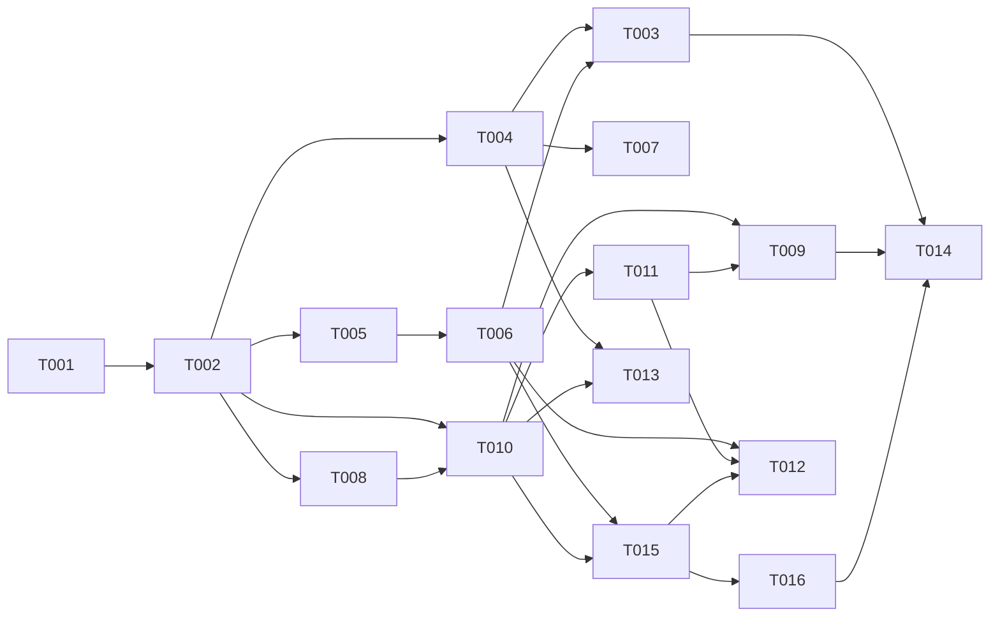

# Tasks: Agentic Loop Runtime Readiness — 013

**Input**: spec.md, plan.md, research.md, data-model.md, contracts/{honcho-v3-client,hermes-runtime-preflight}.contract.md, quickstart.md
**Decisions**: deploy = container + host (CQ1) · honcho data = fresh (CQ2) · pin exact hermes `0.15.1` / honcho `v3.0.9` (CQ3) · engine-only (CQ4).
**Review-remediated 2026-06-08 (codex + gemini)**: Dockerfile **exists** (alpine, Node-only) → convert, not create (codex F3); **US3 added** — live path unwired (codex F1); base alpine→bookworm-slim + Python 3.11 + `PIPX_BIN_DIR=/usr/local/bin` (gemini F2/F3); preflight 5 s timeout + shared `acp-command.ts` parser (gemini F1, codex F6); `AGENTIC_EXECUTOR_ENABLED` gate (codex F4); honcho resolved-ID cache + 409→GET (codex F7, gemini F4/F5); permanent-mismatch RED test + pinned health field `/v1/health.checks.honcho_memory` (codex F5).

## Agent Tags
`[SETUP]` orchestrator · `[BE]` backend-specialist · `[OPS]` devops-engineer · `[E2E]` test-engineer · `[SEC]` security-auditor.

## Task Statuses
`- [ ]` pending · `- [→]` in progress · `- [X]` done · `- [!]` failed · `- [~]` blocked.

---

## Phase 1: Setup

- [ ] T001 [SETUP] Finalize version pins + env. Confirm `infra/docker-compose.standalone.yml` honcho `ghcr.io/plastic-labs/honcho:v3.0.9` + dead `hermes-agent` service removed (done); `infra/.env.example` carries `HONCHO_API_KEY=` (optional) + **`AGENTIC_EXECUTOR_ENABLED=`** (enablement predicate, FR-012) + exact-pin notes (hermes `0.15.1`).

## Phase 2: Foundational (scaffolding — NOT a cross-story barrier)

- [ ] T002 [SETUP] Scaffold new files (no logic): `packages/core/src/services/hermes/acp-command.ts` (shared `HERMES_ACP_CMD` parser stub), `hermes-preflight.ts` (typed `PreflightResult` stub) + test placeholders under `packages/core/test/`. Unlocks `[BE]`/`[OPS]`/`[E2E]` lanes.

**Checkpoint**: pins + flag set, stubs in place.

---

## Phase 3: User Story 1 — Hermes runtime + preflight (Priority: P1) 🎯 MVP-base

**Goal**: the engine runtime carries Hermes; a missing/incompatible Hermes fails at **boot** (preflight), not on the first user turn.
**Independent Test**: build the image, start the stack with `AGENTIC_EXECUTOR_ENABLED=true` → preflight passes; remove Hermes → engine refuses healthy with an actionable error.

### Tests for User Story 1
- [ ] T003 [E2E] [US1] Preflight matrix (FR-012, codex F4): **enabled + compatible Hermes** → `runAgentTurn` spawns `hermes acp`, no ENOENT (SC-001); **enabled + missing** → boot fails, unhealthy, typed error, **0** turns (SC-002); **disabled + missing** → engine starts normally. Include a **5 s-timeout** case → `check_failed` (gemini F1).

### Implementation for User Story 1
- [ ] T004 [OPS] [US1] **Convert** the existing `packages/api/Dockerfile` (`node:20-alpine`, Node-only) → multi-stage `node:20-bookworm-slim` (glibc) + `python3`/`pipx` (+ `ripgrep`); `PIPX_BIN_DIR=/usr/local/bin pipx install hermes-agent[acp]==0.15.1`; **preserve** the pnpm workspace build + `CMD node packages/api/dist/server.js`; build-time assert `hermes acp --check`. (codex F3, gemini F2/F3)
- [ ] T005 [BE] [US1] **`acp-command.ts`** — shared `HERMES_ACP_CMD` parser/normalizer (absolute paths, wrappers, quoted args) reused by preflight + `HermesExecutor` (codex F6). **`hermes-preflight.ts`** — parse via shared, spawn the **configured** `cmd acp --check` under a **strict 5 s timeout**, assert ACP `protocolVersion 1` → typed `PreflightResult` (`hermes_missing`/`acp_incompatible`/`check_failed`). (FR-002/014, gemini F1)
- [ ] T006 [BE] [US1] Wire preflight into engine boot/readiness (`packages/api` `buildServer()`), **gated by `AGENTIC_EXECUTOR_ENABLED`**; failure → `AppError(...,'configuration_error')`, refuse ready. **Refactor `HermesExecutor` to consume `acp-command.ts`** (single parser). (FR-003/012, codex F6)
- [ ] T007 [OPS] [US1] Host-prereq path — document + verify `pipx install 'hermes-agent[acp]==0.15.1'` + `hermes acp --check` (quickstart/README); confirm `docker compose ... up -d --build` builds the engine image green. (CQ1 host)

**Checkpoint**: Hermes runtime present in both models; preflight guards boot.

---

## Phase 4: User Story 2 — Honcho v3 memory (Priority: P2)

**Goal**: working memory persists/recalls via Honcho v3; degradation observable; no per-turn N+1; concurrency-safe.
**Independent Test**: honcho up → fact round-trips; honcho down → turn completes, degradation visible; second op for same keys → no redundant setup calls.

### Tests for User Story 2
- [ ] T008 [E2E] [US2] **(RED first)** Contract test vs live honcho **v3.0.9**: workspace/peer/session/message round-trip, exact field names, `/v3` prefix (AC1/AC5). **Plus permanent-mismatch RED** (AC4, codex F5): point client at a legacy/no-`/v3` API → asserts `permanent` class + `/v1/health.checks.honcho_memory` raised + turn stays fail-open. Written to fail before T010.
- [ ] T009 [E2E] [US2] Integration: cross-tenant isolation (distinct workspaces, AC2) + honcho-down `transient` degrade **visible** (AC3) + **no-N+1** assertion (second op → no redundant get-or-create, AC6) + **409 concurrency** (two first-turns both succeed, AC7/AC8). (SC-004/005, codex F7, gemini F4/F5)

### Implementation for User Story 2
- [ ] T010 [BE] [US2] Rewrite `honcho-client.ts` → Honcho v3: workspace-per-tenant, peer `p-{persona}[-u-{ext}]`, get-or-create workspace/peer/session + set-session-peers, `POST /v3/workspaces/{ws}/sessions/{id}/messages`, `getInsights`→peer-context. **Preserve method signatures + `{id,content,metadata}[]` shape**; optional `HONCHO_API_KEY`; **resolved-ID cache + idempotent create (409→GET)**. (FR-005/008/013; codex F7, gemini F4/F5)
- [ ] T011 [BE] [US2] Error classification + observability — `transient` (connect/5xx/timeout → warn + degrade) vs `permanent` (404 `/v3`, schema/version mismatch → error + raise health field); emit `honcho_degraded` metric + **`/v1/health.checks.honcho_memory`**; keep fail-open (no throw into turn). (FR-006/007, codex F5)

**Checkpoint**: memory persists + observable; no N+1; concurrency-safe.

---

## Phase 5: User Story 3 — Live-path wiring (Priority: P1, review-added) 🎯 MVP-complete

**Goal**: the live reply path actually invokes the agentic executor, so US1/US2 are exercised and SC-001 is reachable.
**Independent Test**: non-scripted agent-enabled turn → handled by `runAgentTurn` (`agent_runs` row), not thin path; Hermes outage → fallback; scripted turn stays deterministic.

- [ ] T015 [BE] [US3] **Wire `chat-service.ts`**: agent-enabled + non-scripted turns → `turn-router` → `HermesExecutor.runAgentTurn`; fallback to `llm.complete`/`completeStream` on Hermes outage/timeout/over-budget; scripted/funnel turns (003) stay deterministic. (FR-015, codex F1)
- [ ] T016 [E2E] [US3] Integration: non-scripted agent-enabled turn produced via `runAgentTurn` (agent_runs/ACP session exists, not thin path); Hermes outage → fallback (degraded, not failed); scripted turn unaffected. (SC-001)

**Checkpoint**: end-to-end agentic turn works through the live path. **MVP complete.**

---

## Phase 6: Polish & Cross-Cutting

- [ ] T012 [BE] `npm run validate` (tsc) + run US1/US2/US3 tests green; confirm no per-turn latency regression (resolved-ID cache verified, honcho off the critical path).
- [ ] T013 [SEC] Isolation + secrets review — workspace-per-tenant boundary holds; **no creds baked into image layers** (hermes/honcho via env); Hermes `HERMES_HOME` process-per-tenant isolation **not regressed** (spec 010 T000d). (FR-008)
- [ ] T014 [OPS] Run `quickstart.md` smoke for **both** deploy models (container + host) — verify SC-001..SC-005.

---

## Dependency Graph

### Dependencies

T001 → T002
T002 → T004, T005, T008, T010
T005 → T006
T004 + T006 → T003
T004 → T007
T008 → T010
T010 → T011
T010 + T011 → T009
T006 + T010 → T015
T015 → T016
T006 + T011 + T015 → T012
T004 + T010 → T013
T003 + T009 + T016 → T014

### Self-validation
- All IDs (T001–T016) exist in the graph. ✔
- No cycles. ✔
- Fan-in `+`, fan-out `,`; no chained arrows on one line. ✔
- T008 RED before T010 (intentional TDD); `[E2E]`/`[SEC]` depend on impl. ✔
- US3 (T015/T016) depends on US1 runtime (T006) + honcho (T010). ✔

---

## Parallel Lanes

| Lane | Agent Flow | Tasks | Blocked By |
|------|-----------|-------|------------|
| 1 | [SETUP] | T001 → T002 | — |
| 2 | [OPS] | T004 → T007 ; T014 | T002 |
| 3 | [BE] US1 | T005 → T006 | T002 |
| 4 | [BE] US2 | T010 → T011 | T002, T008 |
| 5 | [BE] US3 | T015 | T006 + T010 |
| 6 | [E2E] | T008 ; T003 ; T009 ; T016 | T002 / impl |
| 7 | [SEC] | T013 | T004 + T010 |
| 8 | [BE] polish | T012 | T006 + T011 + T015 |

---

## Agent Summary

| Agent | Task Count | Can Start After |
|-------|-----------|-----------------|
| [SETUP] | 2 | immediately |
| [OPS] | 3 | T002 |
| [BE] | 6 | T002 (US2 after T008; US3 after T006+T010) |
| [E2E] | 4 | T002 / impl ready |
| [SEC] | 1 | T004 + T010 |

**Critical Path**: T001 → T002 → T008 → T010 → T015 → T016 → T014 (7)

---

## Agent Dispatch Plan

| Agent | Subagent | Skills | Input Context | Tasks | Files |
|-------|----------|--------|---------------|-------|-------|
| `[SETUP]` | — (orchestrator) | — | plan.md §structure, CQ pins | T001, T002 | `infra/.env.example`, `packages/core/src/services/hermes/` |
| `[OPS]` | `devops-engineer` | `deployment-procedures`, `docker-expert` | research.md §e/§f, plan.md §structure, quickstart.md | T004, T007, T014 | `packages/api/Dockerfile`, `infra/docker-compose.standalone.yml`, `README` |
| `[BE]` | `backend-specialist` | `api-patterns`, `system-design-patterns` | contracts/, research.md §a–k, data-model.md | T005, T006, T010, T011, T012, T015 | `packages/core/src/services/hermes/{honcho-client,hermes-preflight,acp-command}.ts`, `packages/core/src/services/chat-service.ts`, `packages/api/src` boot |
| `[E2E]` | `test-engineer` | `testing-patterns`, `tdd-workflow` | contracts/ AC, quickstart.md §scenarios | T003, T008, T009, T016 | `packages/core/test/`, integration tests |
| `[SEC]` | `security-auditor` | `vulnerability-scanner` | spec.md §FR-008, data-model.md, spec 010 T000d | T013 | project-wide (image layers, honcho boundary) |

---

## Implementation Strategy

### MVP First
1. Setup (T001) → scaffold (T002).
2. US1: T004 (image) ∥ T005→T006 (parser+preflight) → T007 → T003.
3. **US3 (T015→T016)** wires the live path — **required for SC-001**. US2 (T008→T010→T011→T009) can land in parallel; memory degrades gracefully so it may follow.
4. **STOP & VALIDATE**: end-to-end agentic turn runs; missing-hermes fails at boot.

### Parallel Agent Strategy
- After T002 (barrier): dispatch `[OPS]` (Dockerfile), `[BE]` US1 (parser/preflight), `[E2E]` (RED T008) concurrently.
- `[BE]` US2 after T008 RED; `[BE]` US3 (T015) once T006 + T010 land; `[E2E]` integration (T003/T009/T016) as impl arrives; `[SEC]` (T013) after image + client; `[OPS]` smoke (T014) last.

---

## Notes
- `[AGENT]` writes both code and its unit tests; `[E2E]` only cross-boundary/integration.
- **US3 scope (decided 2026-06-08)**: owned by 013. It's 010's unfinished ChatService wiring, but lives here so the feature delivers user-visible value (SC-001).
- No DB tasks — zero schema change (honcho external, Postgres SoR untouched).
- Snapshot/commit deferred (Standing Order #1) — see plan.md Constitution Check; Principle VII tags pending commit (codex F2).
