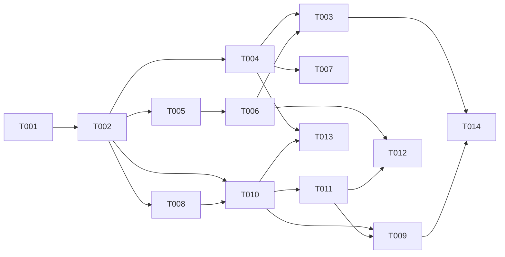

# Tasks: Agentic Loop Runtime Readiness — 013

**Input**: spec.md, plan.md, research.md, data-model.md, contracts/{honcho-v3-client,hermes-runtime-preflight}.contract.md, quickstart.md
**Decisions**: deploy = container + host (CQ1) · honcho data = fresh (CQ2) · pin exact hermes `0.15.1` / honcho `v3.0.9` (CQ3) · engine-only, worker/channel Dockerfiles deferred (CQ4).
**Two independent tails**: US1 = runtime/image + preflight (`[OPS]`/`[BE]`); US2 = honcho v3 client + observability (`[BE]`/`[E2E]`). No cross-story barrier — they parallelise.

## Agent Tags
`[SETUP]` orchestrator · `[BE]` backend-specialist · `[OPS]` devops-engineer · `[E2E]` test-engineer · `[SEC]` security-auditor.

## Task Statuses
`- [ ]` pending · `- [→]` in progress · `- [X]` done · `- [!]` failed · `- [~]` blocked.

---

## Phase 1: Setup

- [ ] T001 [SETUP] Finalize version pins + env. Confirm `infra/docker-compose.standalone.yml` honcho `ghcr.io/plastic-labs/honcho:v3.0.9` + dead `hermes-agent` service removed (done on branch); ensure `infra/.env.example` carries `HONCHO_API_KEY=` (optional, blank default) and exact-pin notes (hermes `0.15.1`).

## Phase 2: Foundational (scaffolding — NOT a cross-story barrier)

- [ ] T002 [SETUP] Scaffold new files (no logic): `packages/core/src/services/hermes/hermes-preflight.ts` (export typed `PreflightResult` stub) + test placeholders under `packages/core/test/` for the honcho contract test and US1/US2 integration. Unlocks the `[BE]`/`[OPS]`/`[E2E]` lanes in parallel.

**Checkpoint**: pins set, stubs in place. US1 and US2 lanes proceed independently.

---

## Phase 3: User Story 1 — Agentic turns execute (Priority: P1) 🎯 MVP

**Goal**: a deployed engine runs an agentic turn (no `spawn ENOENT`); a missing/incompatible Hermes fails at **boot**, not on the first user turn.
**Independent Test**: build the image, start the stack, send an agentic-path message → turn completes; separately break Hermes → engine refuses to become healthy with an actionable error.

### Tests for User Story 1
- [ ] T003 [E2E] [US1] Integration: agent-enabled turn completes end-to-end in the built engine image (no ENOENT, `stopReason: end_turn`); with Hermes removed, engine boot fails the preflight (unhealthy, typed error) and **0 turns** are attempted. (SC-001, SC-002)

### Implementation for User Story 1
- [ ] T004 [OPS] [US1] `packages/api/Dockerfile` (NEW) — multi-stage `node:20-bookworm-slim` + `python3`/`pipx` (+ `ripgrep`); `pipx install hermes-agent[acp]==0.15.1`; build the TS workspace; build-time assert `hermes acp --check`; entrypoint = engine. (research §e/§f; FR-001/002/004)
- [ ] T005 [BE] [US1] Implement `hermes-preflight.ts` per contract — resolve `HERMES_ACP_CMD[0]` on PATH, run `hermes acp --check`, assert ACP `protocolVersion 1` → typed `PreflightResult` (`hermes_missing`/`acp_incompatible`/`check_failed`). (FR-002/003)
- [ ] T006 [BE] [US1] Wire preflight into engine boot/readiness in `packages/api` (`buildServer()`/bootstrap); gate to agentic-enabled deploys; failure → `AppError(...,'configuration_error')`, refuse ready/healthy. (FR-003; contract AC2/AC4)
- [ ] T007 [OPS] [US1] Host-prereq path — document + verify `pipx install 'hermes-agent[acp]==0.15.1'` + `hermes acp --check` in quickstart/README; confirm `docker compose ... up -d --build` builds the engine image green. (CQ1 host model)

**Checkpoint**: US1 complete — agentic loop runs in both deploy models; preflight guards boot. **MVP shippable here.**

---

## Phase 4: User Story 2 — Twins remember across turns (Priority: P2)

**Goal**: working memory actually persists/recalls via Honcho v3; degradation is observable, never a silent no-op.
**Independent Test**: with honcho up, a fact stated on one turn is recalled later; with honcho down, turns still complete and degradation is visible.

### Tests for User Story 2
- [ ] T008 [E2E] [US2] **(RED first)** Contract test against a live honcho **v3.0.9** — workspace/peer/session/message round-trip, exact field names, `/v3` prefix; written to fail before T010. (research §a/§c; honcho-v3-client AC1/AC5)
- [ ] T009 [E2E] [US2] Integration: cross-tenant isolation (distinct workspaces — tenant A can't read tenant B) + honcho-down → turn completes degraded with a **visible** `transient` signal. (SC-004, SC-005; AC2/AC3)

### Implementation for User Story 2
- [ ] T010 [BE] [US2] Rewrite `honcho-client.ts` → Honcho v3: workspace-per-tenant, peer = `p-{persona}[-u-{ext}]`, get-or-create workspace/peer/session + set-session-peers, `POST /v3/workspaces/{ws}/sessions/{id}/messages`, `getInsights`→peer-context/representation. **Preserve method signatures + `{id,content,metadata}[]` return shape**; optional `HONCHO_API_KEY`. (FR-005/008; honcho-v3-client contract)
- [ ] T011 [BE] [US2] Error classification + observability — `transient` (connect/5xx/timeout → warn + degrade) vs `permanent` (404 on `/v3`, schema/version mismatch → error + readiness flag); emit `honcho_degraded` (metric/health); **keep fail-open** (no throw into the turn). (FR-006/007)

**Checkpoint**: US1 + US2 both work independently.

---

## Phase 5: Polish & Cross-Cutting

- [ ] T012 [BE] `npm run validate` (tsc) + run US1/US2 tests green; confirm no per-turn latency regression (honcho off the critical path).
- [ ] T013 [SEC] Isolation + secrets review — workspace-per-tenant boundary holds (no cross-tenant memory); no creds baked into image layers (hermes/honcho via env); Hermes `HERMES_HOME` process-per-tenant isolation **not regressed** (spec 010 T000d). (FR-008)
- [ ] T014 [OPS] Run `quickstart.md` smoke for **both** deploy models (container + host) — verify SC-001..SC-005.

---

## Dependency Graph

### Dependencies

T001 → T002
T002 → T004, T005, T008, T010
T005 → T006
T004 + T006 → T003
T004 → T007
T008 → T010
T010 → T011
T010 + T011 → T009
T006 + T011 → T012
T004 + T010 → T013
T003 + T009 → T014

### Self-validation
- All IDs (T001–T014) exist in the graph. ✔
- No cycles. ✔
- Fan-in uses `+`, fan-out uses `,`; no chained arrows on one line. ✔
- Tests: T008 RED before T010 (TDD); `[E2E]`/`[SEC]` depend on impl. ✔
- US1 (T003–T007) and US2 (T008–T011) share no impl task — independent. ✔

---

## Parallel Lanes

| Lane | Agent Flow | Tasks | Blocked By |
|------|-----------|-------|------------|
| 1 | [SETUP] | T001 → T002 | — |
| 2 | [OPS] | T004 → T007 ; T014 | T002 |
| 3 | [BE] US1 | T005 → T006 | T002 |
| 4 | [BE] US2 | T010 → T011 | T002, T008 |
| 5 | [E2E] | T008 ; T003 ; T009 | T002 / impl |
| 6 | [SEC] | T013 | T004 + T010 |

---

## Agent Summary

| Agent | Task Count | Can Start After |
|-------|-----------|-----------------|
| [SETUP] | 2 | immediately |
| [OPS] | 3 | T002 |
| [BE] | 5 | T002 (US2 also after T008) |
| [E2E] | 3 | T002 / impl ready |
| [SEC] | 1 | T004 + T010 |

**Critical Path**: T001 → T002 → T008 → T010 → T011 → T009 → T014 (7)

---

## Agent Dispatch Plan

| Agent | Subagent | Skills | Input Context | Tasks | Files |
|-------|----------|--------|---------------|-------|-------|
| `[SETUP]` | — (orchestrator) | — | plan.md §structure, CQ pins | T001, T002 | `infra/.env.example`, `packages/core/src/services/hermes/` |
| `[OPS]` | `devops-engineer` | `deployment-procedures`, `docker-expert` | research.md §e/§f, plan.md §structure, quickstart.md | T004, T007, T014 | `packages/api/Dockerfile`, `infra/docker-compose.standalone.yml`, `README` |
| `[BE]` | `backend-specialist` | `api-patterns`, `system-design-patterns` | contracts/, research.md §a–d/§g/§h, data-model.md | T005, T006, T010, T011, T012 | `packages/core/src/services/hermes/{honcho-client,hermes-preflight}.ts`, `packages/api/src` boot |
| `[E2E]` | `test-engineer` | `testing-patterns`, `tdd-workflow` | contracts/ AC, quickstart.md §scenarios | T008, T003, T009 | `packages/core/test/`, integration tests |
| `[SEC]` | `security-auditor` | `vulnerability-scanner` | spec.md §FR-008, data-model.md, spec 010 T000d | T013 | project-wide (image layers, honcho boundary) |

---

## Implementation Strategy

### MVP First (US1 only)
1. Phase 1 Setup (T001) → Phase 2 scaffold (T002).
2. US1: T004 (image) ∥ T005→T006 (preflight) → T007 → T003.
3. **STOP & VALIDATE**: agentic turn runs; missing-hermes fails at boot. Ship MVP.

### Incremental Delivery
- MVP = US1 (agentic loop runs at all). Then US2 (memory persists + observable). Each independently testable; US2 degrades gracefully so it can ship after.

### Parallel Agent Strategy
- After T002 (sync barrier): dispatch Lane 2 `[OPS]` (Dockerfile), Lane 3 `[BE]` (preflight), Lane 5 `[E2E]` (write RED contract test T008) concurrently.
- Lane 4 `[BE]` US2 starts once T008 is RED → T010 → T011.
- `[E2E]` integration (T003, T009) as each story's impl lands; `[SEC]` (T013) after image + client exist; `[OPS]` smoke (T014) last.

---

## Notes
- `[AGENT]` writes both code and its unit tests; `[E2E]` only cross-boundary/integration.
- No DB tasks — zero schema change (honcho is external, Postgres SoR untouched).
- Tests included because SC-001..005 are explicitly verification-shaped (round-trip, isolation, degrade).
- Snapshot/commit deferred (Standing Order #1) — see plan.md Constitution Check.
