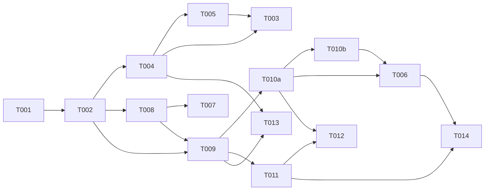

# Tasks: Per-Assistant MCP Servers (Brokered) — 014

**Input**: spec.md, plan.md, research.md, data-model.md, contracts/{mcp-catalog-api,mcp-broker}.contract.md, quickstart.md
**Decisions**: tenant-admin self-serve catalog (CQ1) · broker-through-gateway (CQ2) · full write-treatment for external (CQ3) · HTTP for tenants + stdio platform-admin-only (CQ4).
**Reuse**: extend 010 (mcp-server/tool-gateway/hermes-executor); reuse 011 (KMS + SSRF). New: hand-rolled MCP client (no new dep). Admin UI = `ai-twins` (cross-repo, NOT in these tasks).

## Agent Tags
`[SETUP]` orchestrator · `[DB]` database-architect · `[BE]` backend-specialist · `[E2E]` test-engineer · `[SEC]` security-auditor.

## Task Statuses
`- [ ]` pending · `- [→]` in progress · `- [X]` done · `- [!]` failed · `- [~]` blocked.

---

## Phase 1: Setup

- [ ] T001 [SETUP] Scaffold `packages/core/src/services/hermes/{mcp-client,mcp-broker}.ts` (typed stubs) + confirm 011 KMS decrypt + SSRF dispatcher are importable from core; add a route placeholder. Unlocks lanes.

## Phase 2: Foundational (blocking — shared by US1 + US2)

- [ ] T002 [DB] Models `mcp-catalog-entry.ts` + `assistant-mcp-binding.ts` (tenant-scoped, **RLS**, **ON DELETE CASCADE**, unique `(tenant,name)` / `(persona,entry)`; stdio columns gated to `scope='platform'`; **CHECK / composite-FK `binding.tenant_id = entry.tenant_id`** — opencode F5) → re-export in `models/index.ts` + relations; **reviewed `.sql` migration** (RLS + indexes + journal entry), Standing Order #5. **Blocks all stories.**

**Checkpoint**: schema + migration ready.

---

## Phase 3: User Story 1 — Catalog + binding config (Priority: P1)

**Goal**: tenant-admin registers vetted HTTP MCP servers and binds them to an assistant; secrets encrypted, SSRF-pinned, tenant-isolated.
**Independent Test**: CRUD a catalog entry + bind to a persona via API; secret never returned; private-IP url rejected; cross-tenant 404.

### Tests for User Story 1
- [ ] T003 [E2E] [US1] API integration (mocked SSRF/KMS): catalog CRUD tenant-scoped; **POST private-IP url → rejected** (SC-004); secret never in GET/logs (FR-003); **tenant `transport:'stdio'` → ValidationError** (FR-006); cross-tenant access → 404 (SC-003); bindings PUT round-trips.

### Implementation for User Story 1
- [ ] T004 [BE] [US1] `routes/mcp-catalog.ts` — `/v1/mcp/catalog` CRUD + `/:id/rescan` + `/v1/assistants/:id/mcp` bindings. Inline Zod, typed `AppError`, `withTenantContext(request.tenantId, …)` (**not** raw header — PR #23 lesson). Encrypt `auth` via 011 KMS; SSRF-validate `url` (011) at POST/PATCH; stdio only for platform-admin. **Validate `name` `^[a-z0-9_-]+$` ≤20 chars** (LLM tool-name limit, gemini F2); `tools_include/exclude` = exact-match (opencode F10). (per mcp-catalog-api.contract.md)
- [ ] T005 [BE] [US1] Register `mcpCatalogRoutes` in `buildServer()` (after middleware).

**Checkpoint**: config layer live + tenant-isolated.

---

## Phase 4: User Story 2 — Broker runtime (Priority: P1)

**Goal**: at a turn, the assistant's enabled external tools are brokered through the engine gateway under full controls; writes get full write-treatment.
**Independent Test**: bound MCP's tool appears namespaced, a call routes through `executeTool` (audited/permission), a write-annotated tool runs reserve→execute→finalize, an un-bound server is unreachable.

### Tests for User Story 2
- [ ] T006 [E2E] [US2] Broker integration (mocked external MCP): brokered tool surfaces as `mcp_<entry>_<tool>`; call goes through `executeTool` (audit + permission, SC-001); **write-annotated tool → reserve→execute→finalize** (FR-011); `<untrusted_tool_result>` fence preserved (FR-009); un-bound server never reachable.
- [ ] T007 [E2E] [US2] **Smoke** `mcp-client.ts` against **one real HTTP MCP** (research §a): `initialize`/`tools/list`/`tools/call`. Confirms the hand-rolled client before broad use; failure → escalate to SDK (dep-approval).

### Implementation for User Story 2
- [ ] T008 [BE] [US2] `mcp-client.ts` — minimal JSON-RPC MCP client (`initialize`/`tools/list`/`tools/call` over HTTP) on the **011 SSRF dispatcher pinned to the resolved IP (not re-resolving hostname** — DNS-rebinding, opencode F1), `timeout_ms` bound, **max response size ~1 MB → abort+degrade** (OOM, gemini F4/opencode F11), decrypted auth headers (011 KMS), typed errors, log redaction.
- [ ] T009 [BE] [US2] `mcp-broker.ts` — load enabled bindings (**JOIN on `tenant_id`**, not RLS alone — opencode F5) → discover via **TTL cache** (key=entry; no N+1; **multi-entry miss = concurrent `Promise.allSettled`** — gemini F3/opencode F6; invalidate on call-time drift — opencode F8) → apply include/exclude + overrides → synthesize `ToolDefinition`s (namespaced; **un-annotated default = `isWrite:true` write-treatment** — opencode F2) → return for injection.
- [ ] T010a [BE] [US2] **Inject** brokered tools: extend `mcp-server.ts` (accept brokered tools beside native) + `hermes-executor.ts` (build the broker into the `EngineMcpServer` config at session start). **No second `session/new.mcpServers` entry** (FR-004). *(Split from T010 — WRAP atomicity, opencode F3/analyze F2.)*
- [ ] T010b [BE] [US2] **External write-treatment**: extend `tool-gateway.ts` so a brokered `isWrite` tool runs the existing reserve→execute→finalize + `action_audit` (010 T015). **Engine-side idempotency only** — document that external mutations aren't guaranteed idempotent (best-effort, gemini F1). (FR-011, CQ3)

**Checkpoint**: external tools usable through the gateway, end-to-end.

---

## Phase 5: User Story 3 — Resilience, isolation, observability (Priority: P2)

**Goal**: flaky external MCP never breaks turns; no N+1; tenant isolation holds; degradation visible.
**Independent Test**: kill bound MCP → turn completes degraded; second turn hits discovery cache; cross-tenant broker denied.

- [ ] T011 [BE] [US3] Degrade on unreachable/slow entry (omit its tools + `mcp_broker_degraded{entry}` signal, turn proceeds — FR-007); discovery TTL cache + `rescan` invalidation; per-turn broker-health surface.
- [ ] T012 [E2E] [US3] Resilience + isolation: MCP down → turn completes (SC-002); discovery ≤1/TTL window (SC-005); persona of tenant B cannot broker tenant A's entry (SC-003).

**Checkpoint**: safe to run in prod.

---

## Phase 6: Polish & Cross-Cutting

- [ ] T013 [SEC] Security review — SSRF at registration AND connect **+ DNS-rebinding test (pin-to-IP)** (opencode F1); auth secrets encrypted + never logged; **gateway = sole authority (0 direct un-brokered calls)**; tenant-match (binding↔entry) + RLS isolation (opencode F5); **tool-name-limit** synthesized ≤64 (gemini F2); `<untrusted_tool_result>` fence; stdio platform-only gate; max-payload OOM guard. (FR-003/004/005/008/009/010/014)
- [ ] T014 [BE] `npm run validate` + run US1/US2/US3 tests green; confirm no per-turn N+1 (cache verified).

> **Cross-repo (NOT in these tasks)**: catalog + per-assistant MCP admin UI in `ai-twins` (next to 011 llm-provider). Engine exposes the API (T004) it drives.

---

## Dependency Graph

### Dependencies

T001 → T002
T002 → T004, T008, T009
T004 → T005
T004 + T005 → T003
T008 → T007
T008 → T009
T009 → T010a
T010a → T010b
T010a + T010b → T006
T009 → T011
T010a + T011 → T012
T004 + T009 → T013
T006 + T011 → T014

### Self-validation
- All IDs present (T001–T009, T010a, T010b, T011–T014); T010 split per opencode F3/analyze F2. ✔
- No cycles; T009→T010a closes the missing-edge gap (opencode F4/analyze F1). ✔
- Fan-in `+`, fan-out `,`; no chained arrows on one line. ✔
- `[E2E]`/`[SEC]` depend on impl (T007 after T008; T006 after T010a+T010b; T013 after T004+T009). ✔
- T002 blocks all stories (shared schema). ✔

---

## Parallel Lanes

| Lane | Agent Flow | Tasks | Blocked By |
|------|-----------|-------|------------|
| 1 | [SETUP] | T001 | — |
| 2 | [DB] | T002 | T001 |
| 3 | [BE] US1 | T004 → T005 | T002 |
| 4 | [BE] US2 | T008 → T009 → T010a → T010b | T002 |
| 5 | [BE] US3 | T011 | T009 |
| 6 | [E2E] | T003 ; T006 ; T007 ; T012 | impl |
| 7 | [SEC] | T013 | T004 + T009 |
| 8 | [BE] polish | T014 | T006 + T011 |

---

## Agent Summary

| Agent | Task Count | Can Start After |
|-------|-----------|-----------------|
| [SETUP] | 1 | immediately |
| [DB] | 1 | T001 |
| [BE] | 8 | T002 |
| [E2E] | 4 | impl ready |
| [SEC] | 1 | T004 + T009 |

**Critical Path**: T001 → T002 → T008 → T009 → T010a → T010b → T006 → T014 (8)

---

## Agent Dispatch Plan

| Agent | Subagent | Skills | Input Context | Tasks | Files |
|-------|----------|--------|---------------|-------|-------|
| `[SETUP]` | — (orchestrator) | — | plan.md §structure | T001 | `packages/core/src/services/hermes/` |
| `[DB]` | `database-architect` | `database-design` | data-model.md §tables | T002 | `packages/core/src/models/{mcp-catalog-entry,assistant-mcp-binding}.ts`, `drizzle/` |
| `[BE]` | `backend-specialist` | `api-patterns`, `system-design-patterns` | contracts/, research.md §a–k, data-model.md | T004, T005, T008, T009, T010a, T010b, T011, T014 | `routes/mcp-catalog.ts`, `hermes/{mcp-client,mcp-broker,mcp-server,tool-gateway,hermes-executor}.ts`, `server.ts` |
| `[E2E]` | `test-engineer` | `testing-patterns`, `tdd-workflow`, `webapp-testing` | contracts/ AC, quickstart.md | T003, T006, T007, T012 | `packages/api/tests/`, `packages/core/test/` |
| `[SEC]` | `security-auditor` | `vulnerability-scanner`, `red-team-tactics` | spec.md §FR-003/004/005/008/009, mcp-broker.contract.md | T013 | project-wide (SSRF, secrets, gateway authority, RLS) |

---

## Implementation Strategy

### MVP First
1. Setup (T001) → schema (T002).
2. US1 (T004→T005→T003) ∥ US2 client/broker (T008→T009→T010a→T010b→T006). US1 + US2 = the working slice.
3. **STOP & VALIDATE**: a bound MCP tool runs through the gateway, audited; write tool gets write-treatment.
4. Then US3 (T011→T012) hardens resilience/isolation; T013 SEC; T014 validate.

### Parallel Agent Strategy
- After T002 (barrier): `[BE]` US1 (config) ∥ `[BE]` US2 (client→broker→wire) ∥ `[E2E]` writes tests as impl lands.
- `[SEC]` (T013) once API + broker exist; `[BE]` polish (T014) last.
- ⚠ **Heaviest task = T010** (external write through reserve→execute→finalize). If it balloons, stage external **reads** first, add write-treatment second.

---

## Notes
- `[AGENT]` writes code + its unit tests; `[E2E]` only cross-boundary/integration.
- Gateway-as-sole-authority is the load-bearing invariant — every brokered call MUST pass `executeTool` (T013 verifies 0 direct calls).
- New DB tables → reviewed `.sql` migration only (Standing Order #5); CASCADE FKs (PR #24 lesson).
- Snapshot/commit deferred (Standing Order #1) — see plan.md Constitution Check.
- Admin UI is `ai-twins` (cross-repo), not tracked here.
