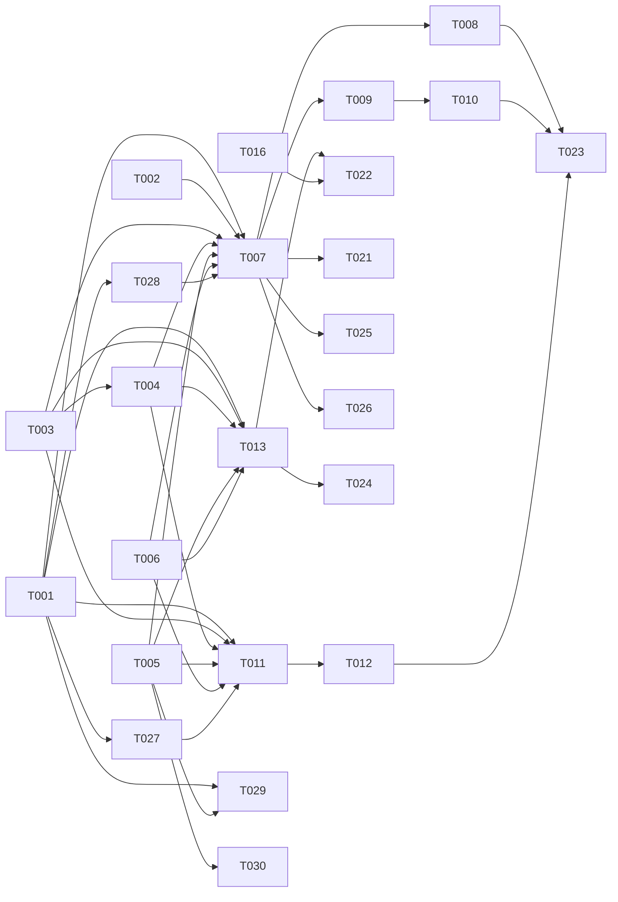

# Tasks: Multi-Channel Gateway (Adapter Port)

**Input**: Design documents from `/specs/015-multi-channel-gateway/`
**Target repo**: twin-engine `undrecreaitwins` (TS, pnpm, `@undrecreaitwins/*`) — NOT ai-twins.
**Prerequisites**: plan.md, spec.md, research.md, data-model.md, contracts/, quickstart.md
**Tests**: spec has isolation/webhook-signature/resilience NFRs → `[SEC]` + `[E2E]` included.

## ⚠️ Gate-0 (external chips — must land before scaling channels)

- **reengagement validator bypass** (CL-A6) → twin-engine chip `task_75466095`. Blocks T007+.
- **channel creds encryption** (CL-A1/FR-004) → twin-engine chip `task_6449740f`. Blocks T005.

## Spec-phase ↔ Task-phase map (glm-F13)

Spec «Phase 1» (6 каналов) ≠ task-фазы (организованы по US-приоритету). Явный маппинг:

| Канал (spec Phase 1) | Task | Task-фаза | Почему |
| --- | --- | --- | --- |
| Discord | T007 | Phase 3 (US1 MVP) | первый канал — доказывает паттерн через гейт |
| Feishu | T011 | Phase 5 (US3) | webhook-режим + подпись |
| WeCom | T011 | Phase 5 (US3) | webhook-режим + подпись |
| Slack | T013 | Phase 6 | socket-mode, повтор US1 |
| Mattermost | T014 | Phase 6 | socket, повтор US1 |
| DingTalk | T015 | Phase 6 | повтор US1 |

Spec «Phase 2» каналы (Matrix/Email/SMS/Webhooks/HomeAssistant) → tasks T016–T020 (Phase 7).
«Phase 6: Remaining Phase-1 channels» = Slack/Mattermost/DingTalk (Discord уже в US1, Feishu/WeCom в US3).

## Format: `[ID] [AGENT] [Story?] Description`

## Phase 1: Setup

- [ ] T001 [SETUP] Scaffold `channel-<x>` package template (package.json `@undrecreaitwins/channel-<x>`, tsconfig, `src/index.ts` process-entry + creds, `src/<x>-adapter.ts` skeleton, `tests/integration/`) mirroring `channel-telegram`
- [ ] T002 [SETUP] **Approval-gated (Standing Order 2)**: install per-channel SDKs — `discord.js`, `@slack/bolt`, `matrix-js-sdk`, `twilio`, `nodemailer`+IMAP, Mattermost/DingTalk/Feishu/WeCom clients. Confirm exact name+version with user BEFORE each install.

---

## Phase 2: Foundational (Blocking)

**⚠️ CRITICAL**: contract + gate-0 before any channel.

- [ ] T003 [BE] Extend `ChannelType` union (+discord/slack/mattermost/dingtalk/feishu/wecom/matrix/email/sms/webhook/homeassistant) + `ChannelMessage` (optional `attachments[]`/`typing`/`replyAnchor`) in `packages/shared/src/types.ts` (FR-001), backward-compatible with text-only telegram/whatsapp
- [ ] T004 [BE] Update `packages/core/src/services/channel-orchestrator.ts` `extractChannelType()` + `VALID_CHANNEL_TYPES` for new types. **Streaming runtime-guard (glm-F9)**: at OUTBOUND **publish** (the orchestrator publishes OUTBOUND; the adapters consume it — gemini), runtime-assert that a payload with `stream:true`/`partial:true` is logged-as-error + discarded — make CL-A7 executable, not just documentary.
- [ ] T005 [DB] **(gate-0 P0-2)** `credentialsCiphertext` + **`kmsKeyRef`** columns on `channel_instances` + `KmsProvider` wiring (reuse `core/services/llm-provider/crypto.ts`) + review-only backfill `.sql` (plaintext→ciphertext, FR-004). Coordinate with twin-engine creds chip `task_6449740f`. **Safety (gemini-F3)**: verify decrypt round-trips before scrubbing plaintext (no data loss); idempotent/re-runnable `.sql`, no plaintext-window. `kmsKeyRef` enables rotation (glm-F10, T030).
- [ ] T006 [SEC] **(gate-0 P0-1)** Verify reengagement→OUTBOUND now passes `validateResponse()` (CL-A6, depends on chip `task_75466095`); add regression test asserting every OUTBOUND writer is validator-gated. Streaming path N/A (CL-A7) — assert channel-OUTBOUND never streams. **Fallback (glm-F2)**: if chip `task_75466095` doesn't land within N days (default 14), implement a stopgap interceptor in `ChannelTransport.publish` (or a dedicated OUTBOUND-stream processor) re-routing reengagement output through `validateResponse()` — **NOT** in `channel-orchestrator.ts`, which only consumes INBOUND and can't see reengagement's direct OUTBOUND publishes (gemini) (document the window + latency trade-off). 015 must not block indefinitely on the external chip.
- [ ] T027 [BE] Shared `packages/core/src/services/webhook-signature.ts` (glm-F3): platform-specific HMAC-SHA256 verifiers + constant-time compare, ported ONCE from Hermes `gateway/platforms/base.py`. Webhook adapters (T011) call it — no per-adapter crypto.
- [ ] T028 [BE] Shared `packages/core/src/services/channel-rate-limiter.ts` (glm-F8): per-platform configurable limits (msgs/sec, message length, media size; values from Hermes `base.py`). Adapters call `rateLimiter.check(channelType, payload)` before send.
- [ ] T029 [BE] Engine-side `channel-provisioning.ts` (glm-F4): accept `{ tenantId, personaSlug, channelType, credentials, config }` → encrypt via `KmsProvider` → write `channel_instances` (`credentialsCiphertext` + `kmsKeyRef`) → signal adapter `connect()`. Engine counterpart of 016 canon route `POST /api/assistants/[id]/channels` (016 T013) — shared contract.

**Checkpoint**: contract extended, gate sealed, creds encrypted, shared modules (signature/rate-limit/provisioning) ready.

---

## Phase 3: User Story US1 — New channel replies through gate (Priority: P1) 🎯 MVP

**Goal**: one new channel (Discord) round-trips through validators 004.
**Independent Test**: Discord message → INBOUND → validators → OUTBOUND → reply; tenant-scoped.

- [ ] T007 [BE] [US1] `channel-discord` adapter (discord.js Gateway WS, `inboundMode:'bot'`): `connect/disconnect/onIncoming`(normalize→stamp `tenant_id`/`persona_slug`→publish INBOUND)/`send`(consume OUTBOUND by `channel_id`→send)/`health`; typed errors, no `as any`/`console.log`
- [ ] T008 [E2E] [US1] Discord integration test: round-trip through gate (validators run), tenant-scoped, ack-after-send

**Checkpoint**: pattern proven on one channel.

---

## Phase 4: User Story US2 — Media in/out (Priority: P2)

**Goal**: attachments flow both ways without breaking text-only.
**Independent Test**: image in/out on Discord/Slack; Telegram text path unaffected.

- [ ] T009 [BE] [US2] Wire `attachments[]` through INBOUND/OUTBOUND payload + Discord/Slack media send+receive; graceful no-op on channels without media
- [ ] T010 [E2E] [US2] Media integration test (image round-trip; telegram text-only regression)

**Checkpoint**: media works, backward-compat intact.

---

## Phase 5: User Story US3 — Webhook channels behind signature (Priority: P2)

**Goal**: webhook-mode channels verify signature before INBOUND.
**Independent Test**: forged signature discarded; valid published.

- [ ] T011 [BE] [US3] `channel-feishu` + `channel-wecom` adapters (`inboundMode:'webhook'`): signature verify via shared `webhook-signature.ts` (T027, NOT per-adapter crypto — glm-F3) BEFORE INBOUND publish, idempotency via Redis `seen:<channel>:<message_id>` SET NX + TTL (gemini-F4) (FR-006)
- [ ] T012 [SEC] [US3] Signature-bypass test: forged/replayed payload discarded + logged, not published

**Checkpoint**: webhook gate hardened.

---

## Phase 6: Remaining Phase-1 channels (repeat US1 pattern)

- [ ] T013 [BE] `channel-slack` adapter (Socket Mode, `@slack/bolt`, `inboundMode:'socket'`)
- [ ] T014 [BE] `channel-mattermost` adapter
- [ ] T015 [BE] `channel-dingtalk` adapter

---

## Phase 7: Phase-2 channels (medium complexity)

- [ ] T016 [BE] `channel-matrix` adapter (`matrix-js-sdk`)
- [ ] T017 [BE] `channel-email` adapter (IMAP inbound / SMTP outbound)
- [ ] T018 [BE] `channel-sms` adapter (Twilio)
- [ ] T019 [BE] `channel-webhooks` adapter (generic, signature-verified)
- [ ] T020 [BE] `channel-homeassistant` adapter

---

## Phase 8: Polish & Cross-Cutting

- [ ] T021 [BE] Surface per-channel `health()` in API (FR-005), all adapters. **Aggregation (glm-F7)**: `GET /api/channels/health` → `{ channels: Record<channelId, ChannelHealth>, overall }`, tenant-scoped, ~30s poll cached in Redis.
- [ ] T022 [SEC] Tenant-isolation audit across all channels (zero cross-tenant); creds-at-rest verify (no plaintext, no log leak, FR-004)
- [ ] T023 [E2E] Cross-channel E2E: gate path + resilience (adapter crash→`health:'error'`, engine survives; Redis Streams ack → no loss/dup on rebalance, FR-007). **XPENDING (glm-F5)**: configure `XPENDING_IDLE_MS` (default 5 min) + `XREADGROUP` block/timeout; test crash-after-consume-before-send → message redelivered (not lost); monitor pending > threshold.
- [ ] T024 [BE] Per-adapter idempotency-on-redelivery tests (R6)
- [ ] T025 [OPS] Per-channel consumer-process deploy config (scale like telegram) + per-tenant creds provisioning runbook
- [ ] T026 [DOC] "Add a new channel" onboarding doc in twin-engine (5-method contract + stamping + inbound-mode)
- [ ] T030 [OPS] Zero-downtime credential rotation flow `rotateChannelCredentials(channelId, newCreds)` (glm-F10/gemini-F6): re-encrypt with new KMS key → update `channel_instances.kmsKeyRef` → signal adapter disconnect/reconnect (new conns use new secret, old drain). Depends on ciphertext column (T005).

---

## Dependency Graph

### Dependencies

T001 → T007, T011, T013, T014, T015, T016, T017, T018, T019, T020
T002 → T007, T011, T013, T016, T017, T018
T003 → T004, T007
T004 → T007
T005 → T007
T006 → T007
T007 → T008, T009
T009 → T010
T011 → T012
T003 + T004 + T005 + T006 → T011, T013, T014, T015, T016, T017, T018, T019, T020
T007 → T021, T025, T026
T008 + T010 + T012 → T023
T013 + T016 → T022
T013 → T024
T001 → T027, T028, T029
T005 → T029, T030
T027 → T011
T028 → T007

### Self-Validation Checklist

- [x] Every task ID in Dependencies exists in the task list (T001–T030)
- [x] No circular dependencies
- [x] No orphan IDs
- [x] Fan-in uses `+` only, fan-out uses `,` only
- [x] No chained arrows on a single line

---

## Dependency Visualization

> (Phase-2 channels T014–T020 share the same foundational fan-in as T013; edges elided for readability.)

---

## Parallel Lanes

| Lane | Agent Flow | Tasks | Blocked By |
|------|-----------|-------|------------|
| 1 | [SETUP] | T001, T002 | — |
| 2 | [BE] foundation | T003 → T004 | T001 |
| 3 | [DB] gate-0 | T005 | T001 + creds chip |
| 4 | [SEC] gate-0/audit | T006; T012; T022 | chip / T011 / channels |
| 5 | [BE] channels | T007 → T009; T013, T014, T015, T016, T017, T018, T019, T020; T011 | T003+T004+T005+T006 |
| 6 | [E2E] | T008, T010, T023 | T007 / T009 / all-US |
| 7 | [BE] polish | T021, T024 | channels |
| 8 | [OPS] | T025 | T007 |
| 9 | [DOC] | T026 | T007 |

> **Review-added tasks (glm-F3/F4/F8/F10, gemini-F6)**: T027 (webhook-signature) + T028 (rate-limiter) + T029 (provisioning) join Lane 5 [BE] foundation after T001 (T027 before T011; T028 before T007); T030 (cred rotation) joins Lane 8 [OPS] after T005.

---

## Agent Summary

| Agent | Task Count | Can Start After |
|-------|-----------|-----------------|
| [SETUP] | 2 | immediately |
| [BE] | 16 | T001 (+ foundation for channels) |
| [DB] | 1 | T001 + creds chip |
| [SEC] | 3 | gate chip / T011 / channels |
| [E2E] | 3 | T007 / T009 / all-US |
| [OPS] | 1 | T007 |
| [DOC] | 1 | T007 |

**Critical Path**: T001 → T003 → T005 → T006 → T007 → T008 → T023 (gate-0 chips upstream of T005/T006)

---

## Agent Dispatch Plan

| Agent | Subagent | Skills | Input Context | Tasks | Files |
|-------|----------|--------|---------------|-------|-------|
| `[SETUP]` | — (orchestrator) | — | plan.md §structure | T001, T002 | `packages/channel-*/` scaffolds |
| `[BE]` | `backend-specialist` | `api-patterns`, `system-design-patterns` | contracts/channel-adapter.contract.md, data-model.md, research R4/R5/R7 | T003,T004,T007,T009,T011,T013–T021,T024 | `packages/shared/`, `packages/core/services/channel-orchestrator.ts`, `packages/channel-*/` |
| `[DB]` | `database-architect` | `database-design` | data-model.md §channel_instances, research R3 | T005 | `packages/core/src/models/channel-instances.ts`, migrations |
| `[SEC]` | `security-auditor` | `vulnerability-scanner`, `red-team-tactics` | spec §Non-Functional, research R2/R3, contracts (signature) | T006, T012, T022 | gate path, webhook adapters, creds |
| `[E2E]` | `test-engineer` | `testing-patterns`, `webapp-testing` | quickstart.md, contracts/ | T008, T010, T023 | `packages/channel-*/tests/integration/` |
| `[OPS]` | `devops-engineer` | `deployment-procedures`, `server-management` | plan.md §structure, quickstart.md | T025 | deploy/process config, runbook |
| `[DOC]` | `documentation-writer` | `documentation-templates` | contracts/channel-adapter.contract.md | T026 | twin-engine channel onboarding doc |

---

## Implementation Strategy

### Gate-0 first

Land the two twin-engine chips (reengagement validator fix, creds encryption) → T005/T006 verify
them. **Do not scale channels over an open gate** (CL-A6).

### MVP

Setup → foundation (T003–T006) → **US1 Discord (T007/T008)**. STOP & validate (quickstart S1).
One channel through the real gate proves the whole pattern.

### Incremental

US2 media → US3 webhook-signature → remaining Phase-1 channels (parallel `[BE]`) → Phase-2
channels → polish (health API, isolation audit, resilience E2E, deploy).

### Parallel

After foundation+gate, channel adapters T013–T020 are independent (`[BE]`, one package each) —
fan out. `[E2E]`/`[SEC]` after their targets; `[OPS]`/`[DOC]` after first deployable channel.

### Notes

- **Gated**: T002 (deps), gate-0 chips, Principle IX branch+repo (implement must run in twin-engine).
- Hermes = protocol reference only (don't import); each adapter = the `channel-telegram` shape.
