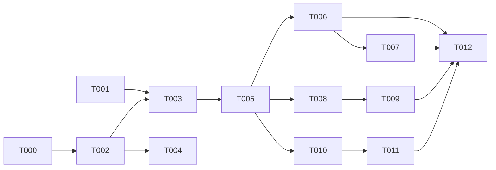

# Tasks: Language Response Guard

**Input**: Design documents from `/specs/017-language-guard-validator/`
**Prerequisites**: plan.md (required), spec.md (required), research.md

**Organization**: Tasks grouped by user story for independent implementation and testing.

## Format: `[ID] [AGENT] [Story?] Description`

## Agent Tags

| Tag | Agent | Domain |
|-----|-------|--------|
| `[SETUP]` | — (orchestrator) | Project init, shared config, scaffolding |
| `[DB]` | database-architect | Schema, migrations, indexes |
| `[BE]` | backend-specialist | Services, middleware, validators, types + unit tests |
| `[E2E]` | test-engineer | Cross-boundary integration tests |

---

## Phase 1: Setup & Validation (Shared Infrastructure)

**Purpose**: Create shared quality-types module (seam A), extend types, DB schema, pipeline registration, and config validation.

- [X] T000 [BE] **(seam A)** Create shared quality-event types module at `packages/core/src/types/quality-event.ts`
  - Export `QualityVerdict` union (superset: `pass | strip | block | fail | rewritten | rolled_back | overflow_skipped`).
  - Export `QualityEvent` interface (canonical audit shape: verdict, source, tenantId, personaId, conversationId, messageId, mode, isDryRun, latencyMs, metadata).
  - Export `QualityEventSource` type (`'004-false-promise' | '004-identity-guard' | '017-language-guard' | '018-dar-pipeline'`).
  - This module is the **canonical owner** — 018 `QualityEventPush` and 019 retrieval events both map to/from `QualityEvent`. No parallel schemas.
  - **Files**: `packages/core/src/types/quality-event.ts` (NEW), `packages/core/src/types/index.ts` (re-export)
  - **Acceptance**: Types compile; `QualityVerdict` is a superset of 017+018 verdict values; `QualityEvent` carries all fields needed by 004-family audit + 018 push + 019 observability.
  - **Cross-spec dependents**: 018 T005 (types reference), 019 T005 (types reference).

- [X] T001 [DB] Add `'strip'` **and `'pass'`** values to `validatorVerdictEnum` in `packages/core/src/models/validators.ts` and generate migration `drizzle/000x_add_strip_pass_verdicts.sql` (`ALTER TYPE validator_verdict ADD VALUE` ×2). `'pass'` is required because FR-009 mandates auditing pass events — without the enum value the audit insert fails at the DB level; mapping pass→`no_op` would conflate semantics (claude F7)
- [X] T002 [BE] Add `LanguageGuardConfig` interface to `packages/core/src/types/validator.ts`, extend `AnyValidatorConfig` union, add BCP-47 → script mapping lookup table, and create Zod schema with `.refine(c => c.stripThreshold <= c.blockThreshold)` for threshold validation (FR-006). Map `detectedScripts` to existing `matchedPatterns` field in `Verdict` (reuse, no new field). Default values: `stripThreshold: 0.05`, `blockThreshold: 0.30`, `regenerateOnViolation: false`, `mode: 'dry-run'`
- [X] T003 [BE] Register `LanguageGuardValidator` in `packages/core/src/services/validators/pipeline.ts` constructor, insert after `FalsePromiseValidator` and before `IdentityGuardValidator`; update `resolveConfig` default to `dry-run` for `language-guard`; add pipeline-level skip: when language-guard returns `pass` and config has empty `allowedLanguages`, do NOT push to `results` (no audit entry for no-op, per DD-005). **This is an explicit pipeline-level convention (claude F6, option 3): document it with a code comment at the skip-site — the `ResponseValidator` interface deliberately carries no skip-audit signal**
- [X] T004 [BE] Verify config validation: ensure Zod schema from T002 is wired into the config-write path (API/seed) so that `stripThreshold > blockThreshold` is rejected at write time (FR-006). Confirm with unit test: invalid config → ZodError with clear message

**Checkpoint**: Types + pipeline extension + config validation ready. Validator can be scaffolded safely.

---

## Phase 2: Foundational (Core Validator Implementation)

**Purpose**: Implement the core language detection and remediation logic — required by ALL user stories.

- [X] T005 [BE] Implement `packages/core/src/services/validators/language-guard.ts`:
  - **Masking pre-pass (DD-008 / FR-014, gemini F1 / claude F1+F5)**: before classification, mask fenced code blocks, inline code spans, URLs, and emails (deterministic regex); masked chars count toward neither numerator nor denominator
  - `ScriptClassifier` class: static Unicode range table (Latin **U+0041**–U+024F letters-only + U+1E00–U+1EFF, claude F8 / gemini PR#32; extensibility comment), `classify(char) → ScriptName`, `analyze(maskedText) → Map<ScriptName, number>` (character counts per script). **Precedence**: Common (strict: whitespace/punctuation/digits/symbols/emoji/control) checked first; a letter (`\p{L}`) matching no known range → `Unknown`, counted **non-compliant** (no fallback-to-Common bypass — gemini PR#32)
  - **Fraction (FR-015)**: `nonCompliantFraction = nonCompliantScriptChars / scriptChars` with `scriptChars = totalChars − commonChars − maskedChars`; `scriptChars === 0` → fraction 0 → `pass`
  - `LanguageGuardValidator` class implementing `ResponseValidator`:
    - `name: 'language-guard'`
    - `validateAndMutate(reply, context)`: if `config.allowedLanguages` is empty → return `{ verdict: { decision: 'pass' }, mutatedText: reply, latencyMs: 0 }` immediately (FR-012). Otherwise: classify all chars, compute non-compliant fraction, produce verdict
    - **Strip remediation**: when non-compliant fraction ≥ `stripThreshold` and < `blockThreshold` → remove all non-compliant characters from response text, preserving whitespace and structure. Return `decision: 'strip'` with `nonCompliantFraction` and `detectedScripts` (stored in `matchedPatterns` per T002) in verdict
    - **Block remediation**: when non-compliant fraction ≥ `blockThreshold` → replace entire response with `fallbackMessage` (or default: "I can only respond in [language names]"). Return `decision: 'block'`
    - **Pass**: when non-compliant fraction < `stripThreshold` → return `decision: 'pass'`, mutatedText = reply unchanged. This IS persisted as an audit entry when `allowedLanguages` is non-empty (FR-009)
  - Threshold validation delegated to Zod schema from T002

**Checkpoint**: Core detection engine complete and testable in isolation.

---

## Phase 3: User Story 1 — Tenant Enforces Response Language (P1) 🎯 MVP

**Goal**: Active-mode language guard strips small contamination and blocks heavy contamination.

**Independent Test**: Configure `allowedLanguages: ["ru", "en"]`, `mode: active`. Submit Chinese-contaminated responses at 3% and 40% levels. Verify strip and block respectively.

### Implementation

- [X] T006 [BE] [US1] Write unit tests in `packages/core/src/test/validators/language-guard.test.ts`:
  - Clean Russian response → `pass`, unchanged
  - 3% Chinese characters → `strip`, Chinese chars removed
  - 40% Chinese characters → `block`, fallback substituted
  - Empty `allowedLanguages` → `pass`, no processing, no audit entry
  - Mixed Latin+Cyrillic proper names (below threshold) → `pass`
  - **Russian persona (`["ru"]`) + response that is 50% fenced Python code block → `pass`** (code masked, DD-008 — the gemini/claude CRITICAL case)
  - **Chinese persona (`["zh"]`) + 200-char Han response containing a 30-char URL → `pass`** (URL masked, claude F5)
  - **Response that is only code + whitespace (`scriptChars === 0`) → `pass`, fraction 0** (FR-015 zero-denominator)
  - **Russian persona + 40% Greek text → flagged** (`Unknown` script counts non-compliant; no fallback-to-Common bypass — gemini PR#32)
  - **Punctuation/digits-heavy Russian response → `pass`** (Common strict + Latin starts at U+0041 — punctuation never classifies as Latin)
  - `stripThreshold > blockThreshold` config → validation error
  - `pass` verdict with non-empty `allowedLanguages` → audit entry written (FR-009)

**Checkpoint**: US1 MVP complete. Language guard works in active mode with strip, block, and pass.

---

## Phase 4: User Story 2 — Dry-Run Audit (P2)

**Goal**: Operators observe violations without affecting users.

**Independent Test**: Configure `mode: dry-run`. Submit violating response. Verify user receives original; audit entry written with would-be verdict.

### Implementation

- [X] T007 [BE] [US2] Add dry-run test cases to `language-guard.test.ts`:
  - `mode: dry-run` + violating response → original delivered, audit entry with `isDryRun: true`
  - `mode: dry-run` + clean response → `pass` with audit entry (FR-009: all events audited when `allowedLanguages` non-empty)
  - Verify that `isDryRun` flag is correctly set in `persistRuns` (inherited from pipeline, no new code needed)
  - Verify pipeline applies mutation only when `config.mode === 'active'` (inherited, confirm via test)

**Checkpoint**: Dry-run mode verified. US2 complete.

---

## Phase 5: User Story 3 — Language Directive Injection (P2)

**Goal**: System prompt includes language constraint to reduce violations proactively.

**Independent Test**: With `allowedLanguages: ["ru"]` configured, intercept the full context forwarded to the AI. Verify it includes a language constraint clause.

### Implementation

- [X] T008 [BE] [US3] **Single config resolution + directive injection (gemini F2/F5, claude F3)**: resolve the `language-guard` config **once** at the chat-lifecycle entry (`ChatService.complete()`, where `tenantId` is in scope) and pass the resolved config to BOTH `buildSystemPrompt()` and the validator pipeline (optional `preloadedConfigs` param / request-scoped holder) — no second DB read for the same row per turn. In `buildSystemPrompt()`:
  - After annotation few-shot injection (line ~596), before `return parts.join('\n')`:
  - If preloaded config exists AND `allowedLanguages` is non-empty → append directive: `"IMPORTANT: You must respond ONLY in [language names from BCP-47 lookup]. Do not use any other language or script."`
  - If config missing or `allowedLanguages` empty → skip (FR-012)
  - **Error handling**: wrap config resolution in try/catch. On failure → `console.warn` and skip directive (fail-open); the pipeline falls back to its own `resolveConfig` if the preload is absent. Matches existing annotation-retrieval pattern (DD-003)
- [X] T009 [BE] [US3] Add directive injection tests:
  - Persona with `allowedLanguages: ["ru", "en"]` → system prompt contains Russian+English language directive
  - Persona with no language guard config → system prompt unchanged
  - Persona with empty `allowedLanguages: []` → no directive
  - Config-resolution failure → no directive, no error thrown (fail-open); pipeline still evaluates via its own fallback resolve
  - **Single-resolve assertion**: one chat turn issues at most one `validator_configs` read for `language-guard` (spy on the resolver — gemini F2)

**Checkpoint**: Language directive injected with error handling. US3 complete.

---

## Phase 6: User Story 4 — Per-Persona Configuration (P3)

**Goal**: Independent language settings per persona within same tenant.

**Independent Test**: Russian-only guard on Persona A, English-only on Persona B. Submit same Chinese-contaminated response. Verify each applies its own rules.

### Implementation

- [X] T010 [BE] [US4] Verify per-persona scoping: existing `validator_configs` table already has unique index on `(tenant_id, persona_id, validator_name)`. Each persona gets its own config row. Pipeline's `resolveConfig` already queries by `(tenantId, personaId, validatorName)`. No structural change needed — confirm with integration test.
- [X] T011 [BE] [US4] Add per-persona test cases:
  - Two personas, different `allowedLanguages` → same response gets different verdicts
  - One persona with config, one without → unconfigured persona gets no-op (FR-012)

**Checkpoint**: US4 complete. Per-persona independence verified.

---

## Phase 7: Integration & Polish

**Purpose**: Cross-boundary testing and edge cases.

- [X] T012 [E2E] Integration test: full pipeline run with language guard + existing validators. Verify ordering (false-promise → language-guard → identity-guard). Verify language guard audit entries appear in `validator_runs` with correct verdicts and `detectedScripts` in `matchedPatterns`.

---

## Deferred

- [ ] ~~T015~~ [DEFERRED] Handle `regenerateOnViolation` in pipeline: when `block` verdict AND `config.regenerateOnViolation === true`, the pipeline calls the generation function once more and re-validates. Requires extending `validateResponse` signature with an optional `regenerateFn` callback. Config field exists (boolean, default `false`) but is ignored in MVP. Follow-up spec: `specs/017-language-guard-validator/followup-regenerate.md`.

---

## Dependency Graph

### Dependencies

```
T000 → T002
T001 → T003
T002 → T003, T004
T003 → T005
T005 → T006
T006 → T007
T005 → T008
T008 → T009
T005 → T010
T010 → T011
T006 + T007 + T009 + T011 → T012
```

### Self-Validation Checklist

- [x] Every task ID in Dependencies exists in the task list above
- [x] No circular dependencies (A→B→A)
- [x] No orphan task IDs referenced that don't exist
- [x] Fan-in uses `+` only, fan-out uses `,` only
- [x] No chained arrows on a single line

---

## Dependency Visualization



---

## Parallel Lanes

| Lane | Agent Flow | Tasks | Blocked By |
|------|-----------|-------|------------|
| 1 | [DB] | T001 | — |
| 2 | [BE] types + validation | T002, T004 | — |
| 3 | [BE] pipeline | T003 | T001, T002 |
| 4 | [BE] core validator | T005 | T003 |
| 5 | [BE] US1 tests | T006 | T005 |
| 6 | [BE] US2 dry-run | T007 | T006 |
| 7 | [BE] US3 directive | T008, T009 | T005 |
| 8 | [BE] US4 per-persona | T010, T011 | T005 |
| 9 | [E2E] integration | T012 | T006, T007, T009, T011 |

---

## Agent Summary

| Agent | Task Count | Can Start After |
|-------|-----------|-----------------|
| [DB] | 1 | immediately |
| [BE] | 10 (T002–T011) | T001 + T002 (for T003) |
| [E2E] | 1 (T012) | all US tasks complete |

**Critical Path**: T001 → T003 → T005 → T006 → T007 → T012
**Alt Critical Path**: T002 → T003 → T005 → T008 → T009 → T012

---

## Agent Dispatch Plan

| Agent | Subagent | Skills | Input Context | Tasks | Files |
|-------|----------|--------|---------------|-------|-------|
| [DB] | `database-architect` | `database-design` | plan.md DD-004, models/validators.ts | T001 | `packages/core/src/models/validators.ts`, `drizzle/` |
| [BE] | `backend-specialist` | `api-patterns`, `system-design-patterns` | spec.md FR-001–FR-013, plan.md DD-001–DD-007, research.md §1–§3, types/validator.ts, services/validators/pipeline.ts | T002–T011 | `packages/core/src/types/validator.ts`, `packages/core/src/services/validators/`, `packages/core/src/services/chat-service.ts`, `packages/core/src/test/validators/` |
| [E2E] | `test-engineer` | `testing-patterns` | contracts/validator.ts, plan.md §integration | T012 | `packages/core/src/test/validators/` |

---

## Implementation Strategy

### MVP First (User Story 1 Only)

1. Complete Phase 1: Setup (T001–T004)
2. Complete Phase 2: Core validator (T005)
3. Complete Phase 3: US1 tests (T006)
4. **STOP and VALIDATE**: Test language guard in isolation
5. Deploy/demo if ready

### Incremental Delivery

1. Setup + Core → Foundation ready
2. Add US1 → Test independently → **MVP!** (active mode enforcement)
3. Add US2 → Test independently → Dry-run audit
4. Add US3 → Test independently → Language directive
5. Add US4 → Test independently → Per-persona scoping
6. E2E → Full pipeline integration

### Suggested MVP Scope

**MVP = T001–T006** (Phases 1–2 + US1 tests). Delivers active-mode language enforcement with strip, block, and pass. Everything else is incremental.

---

## Notes

- Language guard is fully deterministic — no LLM calls, no async beyond config resolution. The fastest validator in the pipeline.
- `regenerateOnViolation` is deferred to follow-up (DD-007). Config field exists but is ignored.
- The `'strip'` + `'pass'` enum value additions (T001) require a migration. Drizzle generates this; coordinate with existing migrations.
- Code blocks / inline code / URLs / emails are masked before classification (DD-008, FR-014) — the gemini/claude CRITICAL fix for technical personas.
- No new DB tables. Reuses `validator_configs` (config) and `validator_runs` (audit).
- `fallbackMessage` default wording is implementation detail per spec. Suggest: "I can only respond in {language_names}." — confirm with product team.
- `detectedScripts` is stored in existing `Verdict.matchedPatterns` field — no new field on the type.
- `pass` verdicts from non-empty `allowedLanguages` configs ARE audited (FR-009). Empty `allowedLanguages` → no audit (FR-012).
- DB query in directive injection (T008) fails open — missing directive doesn't break chat path (DD-003).
