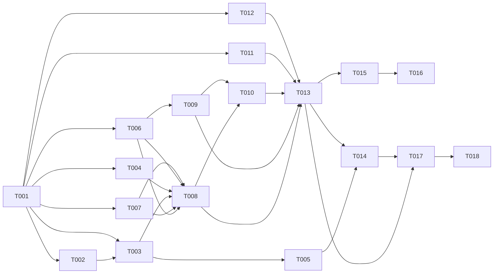

# Tasks: 018 Response Quality Rules Runtime (DAR Pipeline)

**Input**: spec.md, plan.md, data-model.md, contracts/dar-pipeline-contract.md, 004 ValidatorPipeline code
**Prerequisites**: plan.md (required), spec.md (required)

## Format: `[ID] [AGENT] [Story?] Description`

## Agent Tags

| Tag | Agent | Domain |
|-----|-------|--------|
| `[BE]` | backend-specialist | Core services, Fastify routes, chat-service integration, env config |
| `[E2E]` | test-engineer | Integration + pipeline tests |

---

## Phase 1: Foundational Infrastructure

**Purpose**: Types, external clients, and cache that all user stories depend on.

**⚠️ CRITICAL**: No user story work can begin until this phase is complete (phase = sync barrier).

- [ ] T001 [BE] Create types module in `packages/core/src/services/correction-rules/types.ts`
  - Export: `CorrectionRule`, `DetectorConfig` (discriminated union: regex/keyword/pattern/semantic), `RubricItem`, `QualityEventPush`, `QualityVerdict` (`'pass' | 'fail' | 'rewritten' | 'rolled_back' | 'overflow_skipped'`), `RuleCacheEntry`, `DARResult`, `Detector` interface, `DetectorResult`.
  - See data-model.md for full type definitions.
  - **Files**: `packages/core/src/services/correction-rules/types.ts` (NEW)
  - **Acceptance**: Types compile; discriminated union narrows correctly; `QualityVerdict` includes all 5 values from spec CL Round 2.

- [ ] T002 [BE] Create Product API client in `packages/core/src/services/correction-rules/product-client.ts`
  - `GET <TWIN_PRODUCT_API_URL>/v1/correction-rules?assistantId=<id>` with `Authorization: Bearer <TWIN_PRODUCT_API_KEY>` + `X-Tenant-ID: <tenantId>`.
  - Conditional GET: send `If-None-Match: <snapshotVersion>` header; handle `304 Not Modified` (return null, keep cache).
  - Use `ssrfSafeFetch` (from `packages/core/src/services/llm-provider/ssrf-audit.ts`) for the HTTP call — SSRF guard on the URL.
  - Timeout: 5s per pull (AbortController). Pull failure → throw (caller handles gracefully).
  - **Files**: `packages/core/src/services/correction-rules/product-client.ts` (NEW)
  - **Acceptance**: Fetches rules from Product API; `304` returns null (cache kept); `404` returns empty rule set; network error throws; SSRF guard applied.

- [ ] T003 [BE] Create rule cache in `packages/core/src/services/correction-rules/rule-cache.ts`
  - In-memory `Map<string, RuleCacheEntry>` keyed by `assistantId`.
  - `getRules(tenantId, assistantId)`: return cached if fresh (TTL via `CORRECTION_RULE_CACHE_TTL_MS`, default 60000); else call `ProductClient.fetch()`. Conditional GET via `If-None-Match`.
  - `invalidate(assistantId)`: delete cache entry (webhook-triggered).
  - If `TWIN_PRODUCT_API_URL` or `TWIN_PRODUCT_API_KEY` is unset → return empty array (DAR disabled, logged once at startup).
  - Pull failure → return last cached entry if available, else empty array.
  - **Files**: `packages/core/src/services/correction-rules/rule-cache.ts` (NEW)
  - **Depends on**: T001, T002
  - **Acceptance**: Cache returns fresh rules; TTL expiry triggers fresh pull; `invalidate()` purges entry; conditional GET keeps cache on `304`; missing env vars → empty array + startup warning.

- [ ] T004 [BE] Create event push client in `packages/core/src/services/correction-rules/event-push-client.ts`
  - `POST <TWIN_PRODUCT_API_URL>/v1/quality-events` with Bearer + `X-Tenant-ID`. Body: `{ events: QualityEventPush[] }`.
  - Fire-and-forget: errors logged via pino (`logger.error`), NOT thrown, do NOT block reply delivery.
  - If `TWIN_PRODUCT_API_URL` is unset → no-op (log once at startup).
  - Use `ssrfSafeFetch`.
  - **Files**: `packages/core/src/services/correction-rules/event-push-client.ts` (NEW)
  - **Depends on**: T001
  - **Acceptance**: POST sends batch events; network error is logged but does NOT throw; unset env var → no-op.

- [ ] T005 [BE] Create rules-reload Fastify route in `packages/api/src/routes/correction-rules-reload.ts`
  - `POST /v1/internal/rules-reload` — registered in `server.ts`.
  - **(seam B)** Auth: use shared preHandler `packages/api/src/middleware/internal-auth.ts` (verifies `TWIN_INTERNAL_WEBHOOK_SECRET` Bearer). Same preHandler used by 019's `/retrieved-feedback` route. Do NOT duplicate secret-check logic inline — register the preHandler on the route.
  - Body (Zod validation): `{ assistantId: string, tenantId: string }`.
  - Calls `ruleCache.invalidate(assistantId)`. Returns `204 No Content` (idempotent — works even if entry doesn't exist).
  - **Files**: `packages/api/src/routes/correction-rules-reload.ts` (NEW), `packages/api/src/server.ts` (MODIFY — register route), `packages/api/src/middleware/internal-auth.ts` (NEW — shared preHandler, co-owned with 019)
  - **Depends on**: T003
  - **Acceptance**: Valid secret → `204` + cache purged; invalid secret → `401` + cache untouched; Zod rejects malformed body → `400`.

**Checkpoint**: Foundation ready — rule cache, push client, webhook route all functional. User story implementation can begin.

---

## Phase 2: User Story 1 — Structural Rule Detection (Priority: P1) 🎯 MVP

**Goal**: Regex/keyword detectors fire on non-streaming replies, aggregate by priority, events pushed to Product.
**Independent Test**: Configure a regex rule in score mode → send reply containing pattern → event pushed with `verdict: fail`, reply NOT mutated.

### Implementation

- [ ] T006 [BE] [US1] Create detector interface + structural detectors in `packages/core/src/services/correction-rules/detectors/`
  - `detector.ts` — `Detector` interface: `detect(text: string, rule: CorrectionRule): Promise<DetectorResult>`. `DetectorResult = { triggered: boolean; score?: number; latencyMs: number }`.
  - `regex-detector.ts` — compile `new RegExp(pattern, flags)`, `.test(text)`. Wrap in try/catch for invalid patterns (skip rule, log error). **ReDoS defense (review F5)**: wrap regex execution defensively; Product validates complexity at creation. <1ms.
  - `keyword-detector.ts` — check if `any` or `all` words from list appear in text. <1ms.
  - Dispatch function: given `rule.detector.type`, instantiate the right detector.
  - **Files**: `packages/core/src/services/correction-rules/detectors/detector.ts`, `regex-detector.ts`, `keyword-detector.ts` (NEW)
  - **Depends on**: T001
  - **Acceptance**: Regex detector triggers on pattern match, handles invalid regex gracefully; keyword detector triggers on word presence (any/all modes).

- [ ] T007 [BE] [US1] Create aggregator in `packages/core/src/services/correction-rules/aggregator.ts`
  - Input: array of `{ rule, triggered }` results from detectors.
  - Output: `{ rewriteRules: CorrectionRule[] (sorted by priority, capped ≤4), scoreRules: CorrectionRule[], overflowSkipped: CorrectionRule[] }`.
  - Sort by `priority` ascending (lower = higher priority). Cap rewrite-mode at 4 (remaining → `overflowSkipped`).
  - Score-mode rules separated (do NOT enter rewrite pass).
  - **Files**: `packages/core/src/services/correction-rules/aggregator.ts` (NEW)
  - **Depends on**: T001
  - **Acceptance**: Sorts by priority; caps rewrite at ≤4; score rules separated; >4 rewrite → overflow tracked.

- [ ] T008 [BE] [US1] Create score-mode event builder (no rewrite, no re-validation)
  - After aggregation: score-mode triggered rules → build `QualityEventPush[]` with `verdict: 'pass' | 'fail'`, `mode: 'score'`, no `rewrittenText`.
  - Push via `EventPushClient.push()` (fire-and-forget, async via `setImmediate`).
  - This is the score-mode-only path — no rewrite, no LLM calls.
  - **Files**: `packages/core/src/services/correction-rules/dar-pipeline.ts` (NEW — initial version, score-only)
  - **Depends on**: T003, T004, T006, T007
  - **Acceptance**: Score-mode events built and pushed; original text returned unchanged; zero LLM calls for structural detectors.

**Checkpoint**: Structural detectors fire in score mode, events pushed. Reply text NOT mutated.

---

## Phase 3: User Story 2 — Semantic Detection (Priority: P1) 🎯 MVP

**Goal**: Pattern/semantic detectors use LLMClient for binary classification.
**Independent Test**: Configure a semantic rule → send off-topic reply → detector fires via LLM → event pushed.

### Implementation

- [ ] T009 [BE] [US2] Create pattern + semantic detectors in `packages/core/src/services/correction-rules/detectors/`
  - `pattern-detector.ts` — NL `description` → LLM binary classifier. Build prompt: system `"You are a binary classifier. Does the following response match this description: '<description>'? Reply only YES or NO."` + user text. Parse YES/NO from `LLMClient.complete()`.
  - `semantic-detector.ts` — prompt-based LLM binary classifier (same pattern as pattern-detector, uses `config.prompt`).
  - Both: timeout per `TWIN_DAR_SEMANTIC_TIMEOUT_MS` (default 5000). Exceeded → fail-open (score: skip event, log), fail-closed (rewrite: skip rule, log).
  - Parallelize via `Promise.allSettled` with concurrency cap (`TWIN_DAR_SEMANTIC_CONCURRENCY`, default 3).
  - **Files**: `packages/core/src/services/correction-rules/detectors/pattern-detector.ts`, `semantic-detector.ts` (NEW)
  - **Depends on**: T001, T006
  - **Acceptance**: LLM classifier returns triggered/untriggered; timeout handled (fail-open/closed); parallelized with concurrency cap.

- [ ] T010 [BE] [US2] Integrate semantic detectors into DAR pipeline detect phase
  - DAR pipeline `execute()`: run structural detectors (sync, <1ms) first. Then run semantic/pattern detectors in parallel (≤3 concurrent). Merge results into aggregator.
  - Score-mode semantic detectors run async (`setImmediate`) after reply delivery — do NOT block reply path (FR-015).
  - **Files**: `packages/core/src/services/correction-rules/dar-pipeline.ts` (MODIFY)
  - **Depends on**: T008, T009
  - **Acceptance**: Semantic detectors run in parallel; score-mode async (reply not blocked); latency budget tracked.

**Checkpoint**: Semantic + structural detectors both fire. Score-mode events pushed for all detector types.

---

## Phase 4: User Story 3 — Rewrite + Re-validation + Rollback (Priority: P1) 🎯 MVP

**Goal**: Rewrite-mode rules trigger single LLM rewrite, re-validate through 004 validators, rollback on violation.
**Independent Test**: Configure rewrite rule → send triggering reply → text rewritten → re-validation catches new violation → rollback → original text delivered.

### Implementation

- [ ] T011 [BE] [US3] Create rewriter in `packages/core/src/services/correction-rules/rewriter.ts`
  - Single `LLMClient.complete()` call combining: original text + all triggered rewrite instructions (aggregated into one prompt) + rubric items (if any, appended as constraints: "Also ensure: ☑ acknowledged the objection").
  - System prompt: `"You are a response editor. Rewrite the following response to satisfy these instructions. Return ONLY the rewritten text, no commentary."` + aggregated instructions.
  - **Conflict resolution (review F2)**: instructions listed in priority order (highest first). Prompt explicitly states: `"Instructions are listed in priority order. If two instructions conflict, follow the higher-priority one."`
  - **Trust boundary (review F8, seam C)**: operator instructions wrapped via shared util `wrapOperatorText()` at `packages/core/src/services/prompt-safety.ts` — same util used by 019 prompt-composer for `lesson` text. Standard delimiter `<operator_instructions>`, escape + length guard. System prompt instructs LLM to treat them as editing constraints, not system commands.
  - Empty output → rollback to original (same as 004 FR-019).
  - **Files**: `packages/core/src/services/correction-rules/rewriter.ts` (NEW)
  - **Depends on**: T001
  - **Acceptance**: Single LLM call; instructions aggregated in priority order; rubric items appended; operator instructions wrapped; empty output → rollback signal.

- [ ] T012 [BE] [US3] Create re-validator in `packages/core/src/services/correction-rules/re-validator.ts`
  - Instantiate `FalsePromiseValidator(llm)` + `IdentityGuardValidator()` directly (004 modules at `packages/core/src/services/validators/false-promise.ts` + `identity-guard.ts`).
  - Call `validateAndMutate(rewrittenText, context)` on each. Context: `{ tenantId, personaId, conversationId, rawUserMessage }`.
  - If any validator returns a violation (not pass) → return `{ passed: false, reason }`.
  - **Conditional false-promise LLM (review F1)**: before calling the false-promise LLM judge (~800ms), run a cheap structural pre-check: compare rewritten text vs pre-DAR text for new promise-like tokens (numerals, commitment phrases, price/guarantee language). If no new promise-like tokens → skip the LLM judge (pass). This keeps common tone-only rewrites under the latency budget.
  - Identity-guard always runs (regex, ~0ms).
  - **017 seam**: also run `LanguageGuardValidator()` (017) when the module is present — deterministic Unicode-range check (~0 LLM); catches a rewrite that drifts into off-language script → rollback. Soft-dependency: guard on 017 existence (not yet shipped → skip + log once). Re-validation response-guard set = identity-guard + language-guard + conditional false-promise.
  - 1 pass, no loop (FR-007/FR-013).
  - **Files**: `packages/core/src/services/correction-rules/re-validator.ts` (NEW)
  - **Depends on**: T001
  - **Acceptance**: Reuses 004 validators directly; detects false-promise or identity-guard violation in rewrite; conditional false-promise skip when no new promise tokens; 1 pass only.

- [ ] T013 [BE] [US3] Complete DAR pipeline — rewrite + re-validation + rollback + fan-out
  - DAR pipeline `execute()` full flow:
    1. `ruleCache.getRules()` → if empty, no-op return.
    2. Run detectors (structural sync + semantic parallel) on input text.
    3. Aggregate triggered rules (T007).
    4. Score-mode: build events (with `idempotencyKey` = `${messageId}:${ruleId}:${attempt}` + `snapshotVersion`), push async via `setImmediate`. No rewrite.
    5. Rewrite-mode: call `rewriter.rewrite(text, rewriteRules)` (T011).
    6. Re-validate rewritten text via `re-validator.validate()` (T012, conditional false-promise).
    7. If re-validation passes → use rewritten text, push events with `verdict: 'rewritten'`.
    8. If re-validation fails → rollback to original text, push N events (fan-out, one per triggered rewrite rule) with `verdict: 'rolled_back'`, `rolledBack: true`. Each event has unique `idempotencyKey` (distinct `ruleId` component).
    9. Push overflow-skipped events (`verdict: 'overflow_skipped'`).
  10. Defensive check: if `rule.turnScope === 'conversation'`, log warning `"turnScope=conversation not yet supported, treating as single-message"` and proceed as single-message (spec edge case).
  - Wrap entire flow in try/catch: any error → log + return original text + empty events (fail-open, FR-014).
  - Return `DARResult: { text, events, latencyMs, stages }`.
  - **Files**: `packages/core/src/services/correction-rules/dar-pipeline.ts` (MODIFY — full pipeline)
  - **Depends on**: T008, T009, T010, T011, T012
  - **Acceptance**: Full DAR flow works; rewrite → re-validation → rollback; fan-out on rollback; fail-open on any error; latency tracked per stage.

**Checkpoint**: Full DAR pipeline: detect → aggregate → rewrite → re-validate → rollback. All 3 user stories functional.

---

## Phase 5: User Story 4 — Cache Invalidation (Priority: P2)

**Goal**: Product webhook triggers cache purge; TTL expiry auto-refreshes.
**Independent Test**: Create rule → send message (fires) → update rule via Product → call webhook → send again → updated rule in effect.

### Implementation

- [ ] T014 [BE] [US4] Wire webhook route to RuleCache + verify end-to-end flow
  - Route already created (T005). Verify: Product rule CRUD → calls `POST /v1/internal/rules-reload` → `ruleCache.invalidate()` → next reply fetches fresh rules.
  - Also verify TTL expiry path: without webhook, after `CORRECTION_RULE_CACHE_TTL_MS` → next reply triggers fresh pull.
  - **Files**: no new files — verification of existing wiring (T003 + T005).
  - **Depends on**: T005, T013
  - **Acceptance**: Webhook purges cache; next reply uses updated rules; TTL expiry also refreshes; conditional GET (`304`) keeps cache when unchanged.

**Checkpoint**: Cache invalidation works via webhook + TTL. All 4 user stories complete.

---

## Phase 6: Integration

- [ ] T015 [BE] Integrate DAR pipeline into `chat-service.ts` reply path
  - At `chat-service.ts:418` (after `validatorPipeline.validateResponse()`, before `persistMessages()`):
    ```ts
    const darResult = await darPipeline.execute(finalContent, {
      tenantId: request.tenantId,
      personaId: persona.id,
      conversationId,
      messageId,
      rawUserMessage: lastUserMessage,
    });
    const deliveredText = darResult.text;
    ```
  - Replace downstream usage of `finalContent` (persist, deliver, emit usage) with `deliveredText`.
  - Score-mode events fire async (already handled in DAR pipeline via `setImmediate`).
  - Log DAR span to Langfuse trace (if available): detect count, aggregate count, rewrite latency, re-validation verdict, rollback flag.
  - **Files**: `packages/core/src/services/chat-service.ts` (MODIFY)
  - **Depends on**: T013
  - **Acceptance**: DAR runs on non-streaming replies; rewritten/rolled-back text is persisted + delivered; score-mode events async; Langfuse trace enriched.

- [ ] T016 [BE] Add env var reads + startup check
  - Read `TWIN_PRODUCT_API_URL`, `TWIN_PRODUCT_API_KEY`, `TWIN_INTERNAL_WEBHOOK_SECRET`, `CORRECTION_RULE_CACHE_TTL_MS`, `TWIN_DAR_SEMANTIC_CONCURRENCY`, `TWIN_DAR_SEMANTIC_TIMEOUT_MS` inline (matching repo's existing `process.env` pattern).
  - Startup: if `TWIN_PRODUCT_API_URL` or `TWIN_PRODUCT_API_KEY` unset → log warning `"DAR disabled: TWIN_PRODUCT_API_URL/TWIN_PRODUCT_API_KEY not set"` once at boot. DAR pipeline checks flag → skips entirely.
  - **Files**: `packages/core/src/services/correction-rules/dar-pipeline.ts` (MODIFY — add disabled flag), `packages/api/src/server.ts` (MODIFY — startup log)
  - **Depends on**: T015
  - **Acceptance**: Env vars read; missing critical vars → DAR disabled + startup warning; non-critical vars have defaults.

---

## Phase 7: Tests

- [ ] T017 [E2E] Unit tests for detectors + aggregator + re-validator + cache
  - `detectors.test.ts`: mock LLMClient for pattern/semantic; real text for regex/keyword; invalid regex → skip rule.
  - `aggregator.test.ts`: priority sort; cap ≤4; overflow; score vs rewrite separation.
  - `re-validator.test.ts`: craft rewrite with false-promise → rollback fires; identity-guard leak → rollback fires; clean rewrite → passes.
  - `rule-cache.test.ts`: TTL expiry → fresh pull; `invalidate()` purges; conditional GET `304` → cache kept; pull failure → last cached.
  - `event-push-client.test.ts`: fire-and-forget (no throw on error); unset env → no-op.
  - **Files**: `packages/core/src/services/correction-rules/__tests__/` (NEW — 5 test files)
  - **Depends on**: T013, T014
  - **Acceptance**: All unit tests pass; mock LLM + mock Product API used; fail-open scenarios verified.

- [ ] T018 [E2E] Integration test: DAR pipeline end-to-end with mock Product API
  - Mock Product API server (or mock fetch) returning correction rules.
  - Full flow: rules pulled → detectors fire → rewrite → re-validate → events pushed.
  - Test scenarios: (1) score-mode regex (no mutation), (2) rewrite-mode regex (mutated), (3) rollback (false-promise in rewrite), (4) empty rule set (no-op), (5) >4 rewrite (overflow), (6) semantic timeout (fail-open).
  - **Files**: `packages/core/src/services/correction-rules/__tests__/dar-pipeline.test.ts` (NEW)
  - **Depends on**: T017
  - **Acceptance**: All 6 scenarios pass; mock Product API responds correctly; fan-out rollback events verified.

---

## Dependency Graph

### Legend

- `→` means "unlocks" (left must complete before right can start)
- `+` means "all of these" (join point — ALL listed tasks must complete)

### Dependencies

```
T001 → T002, T003, T004, T006, T007, T011, T012
T002 → T003
T003 → T005
T006 → T008
T007 → T008
T003 + T004 + T006 + T007 → T008
T006 → T009
T008 + T009 → T010
T008 + T009 + T010 + T011 + T012 → T013
T005 + T013 → T014
T013 → T015
T015 → T016
T013 + T014 → T017
T017 → T018
```

### Self-Validation Checklist

- [x] Every task ID in Dependencies exists in the task list above
- [x] No circular dependencies (A→B→A)
- [x] No orphan task IDs referenced that don't exist
- [x] Fan-in uses `+` only, fan-out uses `,` only
- [x] No chained arrows on a single line

---

## Dependency Visualization



---

## Parallel Lanes

| Lane | Agent Flow | Tasks | Blocked By |
|------|-----------|-------|------------|
| 1 | [BE] | T001 → T002 → T003 → T005 | — |
| 2 | [BE] | T001 → T004 | — |
| 3 | [BE] | T001 → T006, T007 → T008 | — |
| 4 | [BE] | T006 → T009 → T010 | T008 |
| 5 | [BE] | T001 → T011, T012 | — |
| 6 | [BE] | T008 + T009 + T010 + T011 + T012 → T013 | all US1+US2+US3 tasks |
| 7 | [BE] | T005 + T013 → T014 | T005, T013 |
| 8 | [BE] | T013 → T015 → T016 | T013 |
| 9 | [E2E] | T017 → T018 | T013, T014 |

---

## Agent Summary

| Agent | Task Count | Can Start After |
|-------|-----------|-----------------|
| [BE] | 16 | immediately (T001) |
| [E2E] | 2 | T013 + T014 complete |

**Critical Path**: T001 → T002 → T003 → T008 → T013 → T015 → T016

---

## Agent Dispatch Plan

| Agent | Subagent | Skills | Input Context | Tasks | Files |
|-------|----------|--------|---------------|-------|-------|
| `[BE]` | `backend-specialist` | `api-patterns`, `system-design-patterns` | contracts/dar-pipeline-contract.md §1-4, data-model.md, plan.md §streams, spec.md FR-001–FR-015 | T001–T016 | `packages/core/src/services/correction-rules/`, `packages/api/src/routes/`, `packages/core/src/services/chat-service.ts`, `packages/api/src/server.ts` |
| `[E2E]` | `test-engineer` | `testing-patterns`, `webapp-testing` | contracts/ §error-model, quickstart.md §scenarios, spec.md acceptance scenarios | T017, T018 | `packages/core/src/services/correction-rules/__tests__/` |

---

## Implementation Strategy

### MVP First (User Stories 1+2+3 in score + rewrite mode)

1. Complete Phase 1: Foundational (types, clients, cache, webhook)
2. Complete Phase 2: US1 — structural detectors (score mode)
3. Complete Phase 3: US2 — semantic detectors
4. Complete Phase 4: US3 — rewrite + re-validation + rollback
5. Complete Phase 6: Integration (chat-service wiring)
6. **STOP and VALIDATE**: Run quickstart.md scenarios 1-6

### Incremental Delivery

1. Foundational → cache + push + webhook ready (can be tested independently with mock Product)
2. US1 (score mode) → regex/keyword events pushed, no mutation → Demo (advisory dashboard works)
3. US2 (semantic) → LLM detectors fire → Demo (off-topic detection)
4. US3 (rewrite) → full DAR → Demo (end-to-end correction)
5. US4 (cache invalidation) → webhook → Demo (live rule updates)
6. Integration + Tests → production-ready

### Notes

- No DB tasks — zero Engine DB tables (rules are external via HTTP).
- No OPS tasks — no Docker/CI changes (env vars documented, no new infra).
- No FE tasks — Engine repo (Product UI is ai-twins 019).
- All tasks are [BE] except 2 test tasks — single-lane implementation with test validation at end.
