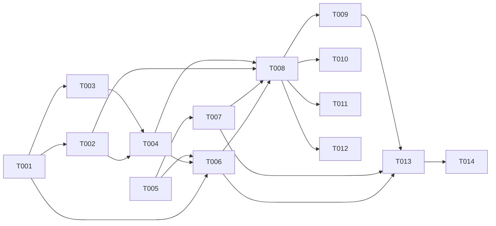

# Tasks: 019 Feedback Loop Closure

**Input**: spec.md, plan.md, data-model.md, contracts/feedback-loop-contract.md
**Prerequisites**: plan.md (required), spec.md (required)

## Format: `[ID] [AGENT] [Story?] Description`

## Agent Tags

| Tag | Agent | Domain |
|-----|-------|--------|
| `[DB]` | database-architect | Drizzle models, migration SQL, indexes, RLS |
| `[BE]` | backend-specialist | Services, routes, chat-service integration, env config |
| `[E2E]` | test-engineer | Integration + pipeline tests |

---

## Phase 1: Foundational — Storage Layer

**Purpose**: Create the `feedback_memories` + `conversation_feedback_states` tables that the spec assumed existed but DON'T. Extend persona config.

**⚠️ CRITICAL**: No user story work can begin until this phase is complete.

- [ ] T001 [DB] Create `feedback_memories` Drizzle model in `packages/core/src/models/feedback-memories.ts`
  - `pgTable('feedback_memories')` with columns: `id` (UUID PK), `tenantId`, `personaId` (FK → personas, cascade), `contextEmbedding` (vector 1024), `lesson` (text), `status` (pgEnum: pending/active/archived), `operatorRole` (text, nullable), `weight` (real, default 1.0), `sourceConversationId` (UUID FK → conversations, set null), `createdAt`, `updatedAt`.
  - Index: `(tenantId, personaId, status)` for filtered retrieval.
  - Re-export from `packages/core/src/models/index.ts`.
  - **Files**: `packages/core/src/models/feedback-memories.ts` (NEW), `packages/core/src/models/index.ts` (MODIFY)
  - **Acceptance**: Model compiles; vector type imported from `./types.ts`; pgEnum for status.

- [ ] T002 [DB] Create `conversation_feedback_states` Drizzle model in `packages/core/src/models/conversation-feedback-states.ts`
  - `pgTable('conversation_feedback_states')` with: `conversationId` (UUID PK, FK → conversations, cascade), `appliedFeedbackIds` (jsonb string[], default []), `messageCount` (int, default 0), `lastStageLabel` (text, nullable), `updatedAt`.
  - Re-export from `packages/core/src/models/index.ts`.
  - **Files**: `packages/core/src/models/conversation-feedback-states.ts` (NEW), `packages/core/src/models/index.ts` (MODIFY)
  - **Depends on**: T001 (T001 before T002 for `index.ts` ordering)
  - **Acceptance**: Model compiles; jsonb typed as `string[]`.

- [ ] T003 [DB] Extend `personas` model with feedback config fields
  - Add `feedbackRetrievalEnabled: boolean('feedback_retrieval_enabled').notNull().default(true)` and `feedbackTokenBudget: integer('feedback_token_budget').notNull().default(500)` after `ragMode` field.
  - **Files**: `packages/core/src/models/personas.ts` (MODIFY)
  - **Acceptance**: Model compiles; defaults applied on existing rows.

- [ ] T004 [DB] Create migration SQL `drizzle/0011_feedback_memories.sql`
  - `CREATE TABLE feedback_memories` (all columns per data-model.md)
  - `CREATE INDEX feedback_memories_context_embedding_hnsw_idx ON feedback_memories USING hnsw (context_embedding vector_cosine_ops)`
  - `CREATE INDEX feedback_memories_tenant_persona_status_idx ON feedback_memories (tenant_id, persona_id, status)`
  - `CREATE TABLE conversation_feedback_states` (all columns per data-model.md)
  - `ALTER TABLE personas ADD COLUMN feedback_retrieval_enabled BOOLEAN NOT NULL DEFAULT TRUE, ADD COLUMN feedback_token_budget INTEGER NOT NULL DEFAULT 500`
  - `ALTER TABLE ... ENABLE ROW LEVEL SECURITY` + `CREATE POLICY ... tenant_isolation` for both new tables
  - **Review-only** per Standing Order #5 — do NOT execute.
  - **Files**: `drizzle/0011_feedback_memories.sql` (NEW)
  - **Depends on**: T001, T002, T003
  - **Acceptance**: SQL valid; HNSW index uses `vector_cosine_ops`; RLS policies match existing pattern.

**Checkpoint**: Storage ready. Models exist, migration drafted. User story implementation can begin.

---

## Phase 2: Foundational — Types & Services

- [ ] T005 [BE] Create types module in `packages/core/src/services/feedback/types.ts`
  - Export: `FeedbackMemory` (DB row shape), `ComposedPrompt`, `TokenInfo` (`{ tokens, truncated, itemsIncluded }`), `FeedbackRetrievalResult` (`{ memories, similarityScores, latencyMs }`).
  - See data-model.md for full type definitions.
  - **Files**: `packages/core/src/services/feedback/types.ts` (NEW)
  - **Acceptance**: Types compile; `FeedbackMemory` matches DB model; `ComposedPrompt` includes layer token info.

---

## Phase 3: User Story 1 — Feedback Retrieval (Priority: P1) 🎯 MVP

**Goal**: Retrieve top-K relevant active feedback memories via pgvector cosine search, excluding dedup'd IDs.
**Independent Test**: Seed a feedback memory → send matching message → memory retrieved + injected into prompt.

### Implementation

- [ ] T006 [BE] [US1] Create `feedback-retrieval.ts` service in `packages/core/src/services/feedback/feedback-retrieval.ts`
  - `retrieveRelevant(tenantId, personaId, queryText, conversationState, existingEmbedding?): Promise<FeedbackRetrievalResult>`
  - **Reuse RAG embedding (review F7)**: accept optional `existingEmbedding?: number[]` — if provided (RAG already embedded the query), skip the TEI call. Saves ~10ms + 1 round-trip per reply.
  - **Empty-set check (FR-009)**: before embedding, check if any `status: active` memories exist for (tenantId, personaId). If 0 → return empty (zero-cost no-op, skip embedding + search).
  - Embed `queryText` via `embeddingService.embed()` (BGE-M3, ~10ms) — skipped if `existingEmbedding` provided.
  - pgvector cosine search: `1 - (context_embedding <=> query_embedding) >= FEEDBACK_SIMILARITY_THRESHOLD` (default 0.75). Pattern from `annotation-service.ts:95-111`. **Optimization note (review G-F4)**: if TEI vectors are pre-normalized, consider inner product `<#>` instead of cosine `<=>` for speed.
  - Filter: `status = 'active'`, `personaId` match, NOT IN `conversationState.appliedFeedbackIds`.
  - Inside `withTenantContext(tenantId, ...)` for RLS.
  - **Query-time recency scoring (review F3)**: composite score computed in the SQL ORDER BY: `(1 - (embedding <=> query)) * weight * exp(-extract(epoch from now() - created_at) / 86400 / 30) DESC`. `weight` = static operator_role base; recency decay = exponential 30-day half-life, computed from `createdAt` at query time. Return top-K (`FEEDBACK_TOP_K`, default 3).
  - **Graceful degradation (FR-008)**: embedding service down / DB error → return empty array + log warning. Never throw.
  - **Files**: `packages/core/src/services/feedback/feedback-retrieval.ts` (NEW)
  - **Depends on**: T001, T004, T005
  - **Acceptance**: Retrieves active memories by cosine similarity + query-time recency; excludes dedup'd IDs; empty-set no-op; reuses RAG embedding if provided; graceful degradation on TEI/DB failure.

**Checkpoint**: Feedback memories retrieved from DB. Not yet injected into prompt.

---

## Phase 4: User Story 2 — Prompt Composition (Priority: P1) 🎯 MVP

**Goal**: Compose system prompt from persona + feedback + RAG within token budget. Content conflict precedence.
**Independent Test**: Configure large persona + many feedback + RAG → total prompt stays within budget.

### Implementation

- [ ] T007 [BE] [US2] Create `prompt-composer.ts` service in `packages/core/src/services/feedback/prompt-composer.ts`
  - `compose({ personaPrompt, personaTraits, feedbackMemories, ragChunks, feedbackTokenBudget, systemPromptBudget }): ComposedPrompt`
  - Token estimation: `Math.ceil(text.length / 4)` (same pattern as `retrieval.ts:101`). Extract to local helper.
  - **Budget allocation**:
    - Persona: hard floor 500 tokens. If exceeds budget → truncate to `budget - 500`, log truncation.
    - Feedback: cap at `feedbackTokenBudget` (default 500). Each memory truncated to 170 tokens. Pack top memories until budget full.
    - RAG: remainder = `systemPromptBudget - persona_tokens - feedback_tokens`. If < 200 → skip RAG (better none than truncated).
  - **Layer ordering** (in assembled prompt string):
    1. Persona system prompt + traits
    2. Conflict directive: `"factual grounding from RAG is authoritative; operator feedback lessons override default persona style but MUST NOT contradict grounded facts"`
    3. RAG chunks (ground truth)
    4. Feedback lessons wrapped via shared util `wrapOperatorText()` (seam C — `packages/core/src/services/prompt-safety.ts`, same util as 018 rewriter T011). Standard delimiter `<operator_instructions>`, escape + length guard. System prompt instructs LLM to treat them as behavioral corrections, not system commands. Operator trust boundary = tenant admin.
  - Return `ComposedPrompt` with token info per layer + retrieved memories.
  - **Files**: `packages/core/src/services/feedback/prompt-composer.ts` (NEW)
  - **Depends on**: T005
  - **Acceptance**: Budget enforced per layer; persona hard floor; feedback truncated; RAG skipped if < 200 tokens remainder; conflict directive included; layer order correct.

**Checkpoint**: Prompt composer assembles layered prompt within budget.

---

## Phase 5: User Story 3 — Dedup + Integration (Priority: P1/P2) 🎯 MVP

**Goal**: Integrate feedback retrieval + composition into chat-service. Dedup prevents fatigue. Reset on stage transition.
**Independent Test**: Send 3 messages matching same memory → memory applied once, skipped for 2-3. Stage transition → re-applied.

### Implementation

- [ ] T008 [BE] [US3] Integrate feedback retrieval + composition into `chat-service.ts` `buildSystemPrompt()`
  - At `chat-service.ts:946` (after RAG block, before funnel context block):
    1. Check `persona.feedbackRetrievalEnabled` → skip if false.
    2. Read `conversation_feedback_states` for this conversation. **Race-safe lazy-create (review F10)**: `INSERT ... ON CONFLICT (conversation_id) DO NOTHING` then read — prevents unique-violation when two near-simultaneous messages race to create the row.
    3. Call `feedbackRetrievalService.retrieveRelevant(tenantId, personaId, userQuery, { appliedFeedbackIds: state.appliedFeedbackIds }, existingEmbedding)`. **Reuse RAG embedding (review F7)**: pass the embedding already computed by `buildSystemPrompt` for RAG retrieval (same BGE-M3, same query text) — saves 1 TEI round-trip.
    4. Call `promptComposer.compose()` with persona prompt + feedback + RAG chunks (from grounding results).
    5. Replace the current `parts.push(persona)` + `parts.push(rag)` assembly with composed sections.
    6. After reply: update `conversation_feedback_states` — append newly applied memory IDs, increment `messageCount`.
  - **Graceful degradation**: feedback retrieval failure → proceed with persona + RAG only (existing behavior). Log warning.
  - **Files**: `packages/core/src/services/chat-service.ts` (MODIFY — `buildSystemPrompt()` + state update after reply)
  - **Depends on**: T006, T007, T002, T004
  - **Acceptance**: Feedback lessons appear in system prompt when active memories match; budget enforced; persona prompt preserved; failure doesn't block reply.

- [ ] T009 [BE] [US3] Implement dedup reset logic
  - **Combined reset (review G-F3)**: reset on stage transition **OR** N-message count — whichever comes first, for ALL conversations (funnel + non-funnel):
    - **Stage transition**: check `funnelResult.metadata.stage_transition` (from 003). If `from !== to` → reset.
    - **N-message**: if `messageCount >= FEEDBACK_DEDUP_RESET_MESSAGES` (default 3) → reset. Applies within funnel stages too (prevents feedback loss in 50+ message stages).
  - Reset = `appliedFeedbackIds = []`, `messageCount = 0`, update `lastStageLabel`.
  - Update `conversation_feedback_states` row.
  - **Files**: `packages/core/src/services/chat-service.ts` (MODIFY — dedup reset in reply flow)
  - **Depends on**: T008
  - **Acceptance**: Memory applied once per reset window; re-applied after stage transition; re-applied after N messages (ALL conversations, including long funnel stages); state persisted durably.

- [ ] T010 [BE] [US3] Add Langfuse trace enrichment for feedback retrieval
  - Add `feedback_memories_retrieved` span to existing Langfuse trace in the reply path.
  - Include: memory IDs, similarity scores, lesson text (truncated to 100 chars), token budget allocation per layer.
  - **Files**: `packages/core/src/services/chat-service.ts` (MODIFY — trace emit after feedback retrieval)
  - **Depends on**: T008
  - **Acceptance**: Langfuse trace includes feedback span with memory details + token allocation.

**Checkpoint**: Full integration. Feedback memories retrieved, composed, injected, deduped, traced.

---

## Phase 6: Observability Endpoint

- [ ] T011 [BE] Create `GET /v1/internal/retrieved-feedback` route in `packages/api/src/routes/retrieved-feedback.ts`
  - Query param: `conversationId` (required).
  - **(seam B)** Auth: use shared preHandler `packages/api/src/middleware/internal-auth.ts` (verifies `TWIN_INTERNAL_WEBHOOK_SECRET` Bearer). Same preHandler as 018's `/rules-reload` route. Do NOT duplicate secret-check logic inline.
  - Returns applied memory IDs + similarity scores + token allocation (current conversation state from `conversation_feedback_states`).
  - Zod validation on query params.
  - Register route in `server.ts`.
  - **Files**: `packages/api/src/routes/retrieved-feedback.ts` (NEW), `packages/api/src/server.ts` (MODIFY)
  - **Depends on**: T008
  - **Acceptance**: Authenticated request returns applied memories; unauthenticated → 401; wrong tenant → 404.

---

## Phase 7: Env Config

- [ ] T012 [BE] Add env var reads for feedback configuration
  - `FEEDBACK_DEDUP_RESET_MESSAGES` (default 3), `FEEDBACK_SIMILARITY_THRESHOLD` (default 0.75), `FEEDBACK_TOP_K` (default 3), `SYSTEM_PROMPT_BUDGET_DEFAULT` (default 4000).
  - Read inline via `process.env` (matching repo pattern). Parse as numbers with defaults.
  - **Files**: `packages/core/src/services/feedback/feedback-retrieval.ts` (MODIFY — read thresholds), `packages/core/src/services/chat-service.ts` (MODIFY — read dedup reset + budget)
  - **Depends on**: T008
  - **Acceptance**: Env vars read with defaults; missing vars use defaults without error.

---

## Phase 8: Tests

- [ ] T013 [E2E] Unit tests for feedback retrieval + prompt composer
  - `feedback-retrieval.test.ts`: mock EmbeddingService + mock withTenantContext vector search; empty-set no-op; dedup exclusion; graceful degradation (TEI down → empty); similarity threshold filtering.
  - `prompt-composer.test.ts`: budget allocation (persona floor, feedback cap, RAG remainder); truncation; RAG skip when < 200; conflict directive present; layer ordering correct.
  - Dedup reset test: stage transition resets; N-message fallback resets; state persists.
  - **Files**: `packages/core/src/services/feedback/__tests__/feedback-retrieval.test.ts`, `prompt-composer.test.ts` (NEW)
  - **Depends on**: T006, T007, T009
  - **Acceptance**: All unit tests pass; mocks used for embedding + DB; graceful degradation verified.

- [ ] T014 [E2E] Integration test: feedback retrieval → composition → prompt includes lesson
  - Seed a `feedback_memories` row (active status) via test DB.
  - Mock `buildSystemPrompt` call → verify feedback lesson appears in composed prompt.
  - Verify dedup: second call with same conversation excludes the memory.
  - Verify reset: after N messages, memory re-included.
  - **Files**: `packages/core/src/services/feedback/__tests__/integration.test.ts` (NEW)
  - **Depends on**: T013
  - **Acceptance**: Full flow works end-to-end with test DB; lesson injected; dedup active; reset works.

---

## Dependency Graph

### Dependencies

```
T001 → T002, T003
T002 → T004
T003 → T004
T001 → T006
T004 → T006
T005 → T006
T005 → T007
T006 + T007 + T002 + T004 → T008
T008 → T009
T008 → T010
T008 → T011
T008 → T012
T006 + T007 + T009 → T013
T013 → T014
```

### Self-Validation Checklist

- [x] Every task ID in Dependencies exists in the task list above
- [x] No circular dependencies
- [x] No orphan task IDs
- [x] Fan-in uses `+` only, fan-out uses `,` only
- [x] No chained arrows on a single line

---

## Dependency Visualization



---

## Parallel Lanes

| Lane | Agent Flow | Tasks | Blocked By |
|------|-----------|-------|------------|
| 1 | [DB] | T001, T002, T003 → T004 | — |
| 2 | [BE] | T005 → T006, T007 | T004 |
| 3 | [BE] | T006 + T007 + T002 + T004 → T008 | Lane 1 + Lane 2 |
| 4 | [BE] | T008 → T009, T010, T011, T012 | T008 |
| 5 | [E2E] | T013 → T014 | T006 + T007 + T009 |

---

## Agent Summary

| Agent | Task Count | Can Start After |
|-------|-----------|-----------------|
| [DB] | 4 | immediately |
| [BE] | 8 | T004 complete (Lane 1) |
| [E2E] | 2 | T006 + T007 + T009 complete |

**Critical Path**: T001 → T004 → T006 → T008 → T009 → T013 → T014

---

## Agent Dispatch Plan

| Agent | Subagent | Skills | Input Context | Tasks | Files |
|-------|----------|--------|---------------|-------|-------|
| `[DB]` | `database-architect` | `database-design` | data-model.md, plan.md §Phase0 | T001, T002, T003, T004 | `packages/core/src/models/`, `drizzle/` |
| `[BE]` | `backend-specialist` | `api-patterns`, `system-design-patterns` | contracts/feedback-loop-contract.md, data-model.md, plan.md §Phase2-5, spec.md FR-001–FR-010 | T005–T012 | `packages/core/src/services/feedback/`, `packages/core/src/services/chat-service.ts`, `packages/api/src/routes/` |
| `[E2E]` | `test-engineer` | `testing-patterns`, `webapp-testing` | contracts/ §error-model, quickstart.md §scenarios, spec.md acceptance scenarios | T013, T014 | `packages/core/src/services/feedback/__tests__/` |

---

## Implementation Strategy

### MVP First (User Stories 1+2+3)

1. Complete Phase 1: Storage (tables + migration — CRITICAL prerequisite gap)
2. Complete Phase 2: Types
3. Complete Phase 3: US1 — Feedback retrieval service
4. Complete Phase 4: US2 — Prompt composition service
5. Complete Phase 5: US3 — Integration + dedup + Langfuse
6. Complete Phase 6-7: Observability endpoint + env config
7. **STOP and VALIDATE**: Run quickstart.md scenarios 1-6

### Notes

- **[DB] lane starts first** — storage is the critical prerequisite. Everything else waits on T004 (migration).
- **Feedback memory ingestion (write path) is NOT in this spec** — memories must be seeded via DB or a future ingestion endpoint. For testing, use direct SQL inserts.
- No FE tasks — Engine repo (Product UI is ai-twins 021).
- No OPS tasks — no Docker/CI changes.
