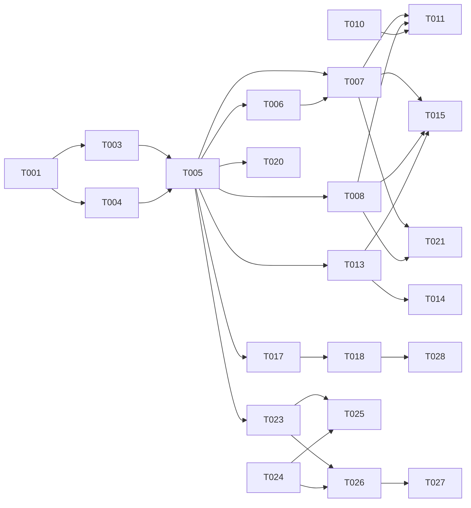

# Tasks: Engine Funnel Richness

**Input**: Design documents from `/specs/020-engine-funnel-richness/`
**Prerequisites**: plan.md, spec.md, research.md, data-model.md, contracts/metadata.md

**Organization**: Tasks are grouped by foundational work followed by user stories (MVP first).

## Format: `[ID] [AGENT] [Story?] Description`

## Agent Tags

| Tag | Agent | Domain |
|-----|-------|--------|
| `[SETUP]` | — | Project init, shared config |
| `[DB]` | database-architect | Schema, migrations |
| `[BE]` | backend-specialist | Funnel logic, LLM services, Metadata |
| `[E2E]` | test-engineer | Integration tests |

## Phase 1: Setup (Shared Infrastructure)

- [ ] T001 [SETUP] Create directory structure: `specs/020-engine-funnel-richness/contracts/`
- [ ] T002 [SETUP] Verify dependencies: `drizzle-orm`, `ioredis`, `langfuse` (already present)

## Phase 2: Foundational (Blocking Prerequisites)

**⚠️ CRITICAL**: Database and Shared Types must be updated first.

- [ ] T003 [DB] Update `packages/core/src/models/` schemas (fragments, stages, slots, conversations, state) per data-model.md
- [ ] T004 [SETUP] Update `packages/shared/src/types.ts` with new Funnel fields per data-model.md
- [ ] T005 [DB] Create migration SQL for the schema changes (**review-only, do NOT apply** — review fix C-F9)

**Checkpoint**: Foundation ready — new fields accessible in code.

---

## Phase 3: User Story 1, 2 & 15 - Delivery Cascade, Variables & Conditions (P1) 🎯 MVP

**Goal**: Support verbatim delivery, template substitution, delivery conditions, and LLM mode.

- [ ] T006 [BE] [US2] Implement `VariableParser` utility in `packages/core/src/services/funnel/utils/variable-parser.ts`
- [ ] T007 [BE] [US1] Update `FunnelRuntime.processMessage` to handle `deliveryMode`: `verbatim` (skip LLM), `template` (use VariableParser), `llm` (default)
- [ ] T008 [BE] [US15] Implement `DeliveryConditionEvaluator` in `packages/core/src/services/funnel/utils/condition-evaluator.ts` and integrate into `FunnelRuntime` selection logic
- [ ] T009 [BE] [US1] Add unit tests for `VariableParser`, `deliveryMode` branching, and `DeliveryCondition` filtering in `packages/core/tests/unit/funnel-delivery.test.ts`

---

## Phase 4: User Story 3 - Adaptive Intro (P1)

**Goal**: Smooth bridges between user questions and scripted fragments.

- [ ] T010 [BE] [US3] Implement `AdaptiveIntroService` in `packages/core/src/services/llm/adaptive-intro.ts` using lightweight LLM call. **Intro runs in parallel with main generation** (review fix C-F1). **Failure → graceful skip** (review fix C-F4).
- [ ] T011 [BE] [US3] Integrate `AdaptiveIntroService` into `FunnelRuntime` pre-generation step (**parallel with main gen — race-to-merge**; if intro not ready by time main gen completes → skip intro)
- [ ] T012 [BE] [US3] Unit test bridge generation ensuring conversational particles (ну, же, ведь) and lower-case short phrases are produced. **Plus test: intro LLM failure → skip, fragment delivered without intro** (review fix C-F4)

---

## Phase 5: User Story 4, 13, 14 - Slot Extraction (P1)

**Goal**: Sync post-turn extraction of structured data into `conversations.slots`.

- [ ] T013 [BE] [US4] Implement `SlotExtractorService` in `packages/core/src/services/llm/slot-extractor.ts`
- [ ] T014 [BE] [US4] Add `locked` and `enum` enforcement in `SlotExtractorService`
- [ ] T015 [BE] [US4] Hook `SlotExtractorService` into `ChatService` or `FunnelRuntime` post-turn (sync before turn done). **Uses conversation-level lock (Redis SET NX) + JSONB merge write** (review fix C-F3). **Extraction runs against ALL funnel slot definitions** (not per-stage — review fix C-F2).
- [ ] T016 [BE] [US4] Unit test extraction with phone numbers, emails, and enum validation cases in `packages/core/tests/unit/slot-extraction.test.ts`. **Plus concurrency test**: two overlapping extractions updating different slots → both preserved (JSONB merge) (review fix C-F3).

---

## Phase 6: User Story 5 / FR-021 / FR-022 - Banned Words & Output Guard (P1)

**Goal**: Prevent AI-sounding or forbidden phrases.

- [ ] T017 [BE] [US5] Implement `BannedWordsFilter` in `packages/core/src/services/llm/guards/banned-words.ts` (Hard regex, Soft keyword)
- [ ] T018 [BE] [US5] Implement `OutputGuard` pipeline with rerun logic (max 2) and global budget check
- [ ] T019 [BE] [US5] Unit test hard-blocking and soft-warning

---

## Phase 7: User Story 6, 23 - Pacing & Humanization (P1)

**Goal**: Add `delay_ms` and `typing_chunks` metadata.

- [ ] T020 [BE] [US6] Implement `PacingCalculator` in `packages/core/src/services/funnel/utils/pacing.ts`
- [ ] T021 [BE] [US6] Enrich `metadata.humanization` in `FunnelRuntime` response
- [ ] T022 [BE] [US6] Add `backspace_simulation` metadata generation

---

## Phase 8: User Story 9, 10, 11, 12, 17 - Advanced Guards & Anytime Stages (P2)

**Goal**: Required slots, confirmation gates, and LIFO anytime stages.

- [ ] T023 [BE] [US10] Update `evaluateAdvanceGuard` to check `requiredSlots` match in `conversations.slots`
- [ ] T024 [BE] [US11] Implement `IntentClassifier` for affirmative advance LLM-fallback in `packages/core/src/services/llm/intent-classifier.ts`
- [ ] T025 [BE] [US12] Implement `ConfirmationGate` in `FunnelRuntime` (stay on stage + prompt if confirmation required)
- [ ] T026 [BE] [US9] Implement `AnytimeTrigger` check and `returnStack` (LIFO) management in `FunnelRuntime`
- [ ] T027 [E2E] [US9] E2E test: Trigger anytime stage → Pop back to original stage. **Plus nested anytime (depth 2→3), self-trigger (no-op), stale-stage pop, max-depth reject** (review fix Codex-F3).
- [ ] T032 [E2E] [NFR-4] Backward-compat regression E2E: existing 003 funnel (no new fields) → identical behavior (`deliveryMode: 'llm'`, no intro, no guards, unchanged metadata) (review fix Codex-F7).
- [ ] T033 [BE] [FR-026] Integration test: budget exhaustion — intro + gen + banned rerun + anti-repeat + intent fallback + extraction → `maxTurnLLMCalls` hit → skip non-critical steps → best-effort delivery (review fix C-F1).

---

## Phase 9: User Story 7, 8 & Metrics - Anti-Repeat & Retell (P2)

**Goal**: Similarity-based reruns, contextual rephrasing, and observability.

- [ ] T028 [BE] [US7] Implement `AntiRepeatGuard` using embedding similarity (threshold 0.85)
- [ ] T029 [BE] [US8] Implement `ContextualReteller` for stage revisits
- [ ] T030 [BE] [US7] Integrate into post-gen pipeline within global rerun budget
- [ ] T031 [BE] [NFR-6] Implement metrics emission for all new generative paths (firing counts, costs, reruns) in `FunnelRuntime`

---

## Dependency Graph

### Dependencies

T001 → T003, T004              # setup first
T003 + T004 → T005             # types + schema before migration
T005 → T006, T007, T008, T013, T017, T020, T023 # migration unlocks implementation
T006 → T007                    # parser used in runtime
T007 + T008 → T011, T015, T021 # runtime base for integrations
T010 → T011                    # intro service before runtime integration
T013 → T014, T015              # extractor base
T017 → T018                    # filter before guard
T018 → T028                    # output guard logic used by anti-repeat
T023 + T024 → T025, T026       # basic guards before complex ones
T026 → T027                    # logic before E2E

### Dependency Visualization

---

## Parallel Lanes

| Lane | Agent Flow | Tasks | Blocked By |
|------|-----------|-------|------------|
| 1 | [DB] | T003 → T005 | T001 |
| 2 | [BE-Core] | T004, T006 → T007 + T008 → T011, T015, T021 | T001, T005 |
| 3 | [BE-LLM] | T010, T013 → T014, T017 → T018 → T028, T029 | T005 |
| 4 | [BE-Guards]| T023 + T024 → T025, T026 | T005 |
| 5 | [E2E] | T027 | T026 |
| 6 | [BE-Metrics]| T031 | T007 |

---

## Agent Summary

| Agent | Task Count | Can Start After |
|-------|-----------|-----------------|
| [SETUP] | 3 | immediately |
| [DB] | 2 | T001 |
| [BE] | 25 | T005 |
| [E2E] | 1 | T026 |

**Critical Path**: T001 → T003 → T005 → T007 → T011 → T015 → T021

---

## Agent Dispatch Plan

| Agent | Subagent | Skills | Input Context | Tasks | Files |
|-------|----------|--------|---------------|-------|-------|
| `[DB]` | `database-architect` | `database-design` | data-model.md | T003, T005 | `packages/core/src/models/` |
| `[BE]` | `backend-specialist` | `api-patterns`, `system-design-patterns` | research.md, contracts/metadata.md | T006-T026, T028-T031 | `packages/core/src/services/` |
| `[E2E]` | `test-engineer` | `webapp-testing` | spec.md §Success Criteria | T027 | `packages/core/tests/e2e/` |
