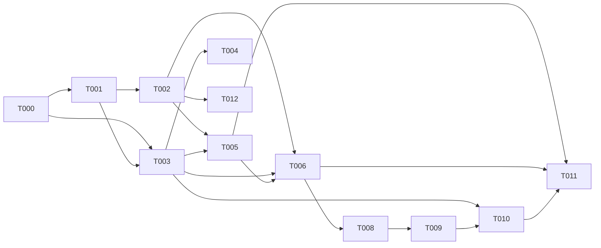

# Tasks: Language Guard Validator Leftovers — API, Config Fields, Audit Log

**Input**: Design documents from `/specs/023-language-guard-validator-leftovers/`
**Prerequisites**: plan.md, spec.md, research.md, data-model.md, contracts/

**Organization**: Tasks grouped by user story. Each story independently testable.

## Format: `[ID] [AGENT] [Story?] Description`

## Agent Tags

| Tag | Agent | Domain |
|-----|-------|--------|
| `[SETUP]` | — (orchestrator) | Scaffolding, shared config |
| `[DB]` | database-architect | Schema, migrations, models |
| `[BE]` | backend-specialist | API routes, services, middleware |
| `[E2E]` | test-engineer | Cross-boundary integration tests |

---

## Phase 1: Setup (Shared Infrastructure)

**Purpose**: DB migration, type extensions and pipeline skip logic — blocks all user stories

- [x] T000 [DB] Add `version INTEGER NOT NULL DEFAULT 0` column to `validator_configs` table via migration (one-time `ALTER TABLE`). Create index on `(tenant_id, persona_id, validator_name, version)`. This enables atomic optimistic locking without TOCTOU.
- [x] T001 [SETUP] Add `enabled: boolean` field to `LanguageGuardConfig` interface in `packages/core/src/types/validator.ts`. Remove `configVersion` from the interface — it lives in the `version` DB column, not in JSONB config.
- [x] T002 [SETUP] Add pipeline skip logic: `if (config.enabled === false) return;` before `validator.validateAndMutate()` call in `packages/core/src/services/validators/pipeline.ts` (with backward compat: missing `enabled` = `true`). ALSO add the same gate to directive injection in `packages/core/src/services/chat-service.ts` (~line 1027): wrap `buildLanguageDirective` call in `if (cfg.enabled !== false)` — otherwise disabled guard still influences generation via directive.

---

## Phase 2: Foundational (Blocking Prerequisites)

**Purpose**: Route registration and shared infrastructure for all endpoints

- [x] T003 [BE] Create `packages/api/src/routes/validators.ts` with Fastify plugin skeleton, Zod schemas for GET/PUT/logs request validation, and shared helpers (compound cursor encode/decode, BCP-47 regex, config defaults)
- [x] T004 [BE] Register validators route in `packages/api/src/server.ts` via `fastify.register(validatorRoutes)`

---

## Phase 3: User Story 1 — Read Config + US-2 Save Config + US-3 Enable/Disable + US-5 Optimistic Locking (Priority: P1) 🎯 MVP

**Goal**: Full config CRUD with optimistic locking and enable/disable toggle

**Independent Test**: GET returns default config; PUT with expectedVersion saves and increments; PUT without expectedVersion returns 400; PUT with mismatched version returns 409; enabled=false causes pipeline skip

### Implementation

- [x] T005 [BE] [US1] Implement `GET /v1/personas/:personaId/validators/language-guard` handler in `packages/api/src/routes/validators.ts` — reads from `validator_configs` table, returns default config if none exists, includes `configVersion`
- [x] T006 [BE] [US2] Implement `PUT /v1/personas/:personaId/validators/language-guard` handler in `packages/api/src/routes/validators.ts` — validates body with Zod (ALL server-side validation in this task, no separate validation phase): `stripThreshold <= blockThreshold` (400 `THRESHOLD_ORDER`), `stripThreshold`/`blockThreshold` in `[0, 1]` (400 `THRESHOLD_RANGE`), `mode: 'active'` + empty `allowedLanguages` (400 `EMPTY_ACTIVE_LANGUAGES`), BCP-47 regex on each `allowedLanguages` item (400 `INVALID_BCP47`), dedupe `allowedLanguages`. Then checks `expectedVersion` (400 if missing). Uses atomic UPSERT: `INSERT ... ON CONFLICT (tenant_id, persona_id, validator_name) DO UPDATE SET config=$1, mode=$2, version=version+1 WHERE version=$expectedVersion`. If RETURNING yields row → 200; if affected-rows=0 → 409 CONFLICT. Reads/writes `mode` from dedicated DB column (not JSONB). All validation errors return `{ error: "VALIDATION_FAILED", fields: { [fieldName]: { code: string, message: string } } }`.
- [x] T008 [BE] [US3] Implement `enabled` toggle in PUT handler — save `enabled` field to config JSONB; GET handler returns `enabled` with default `true` for backward compat
- [x] T009 [BE] [US5] Implement `configVersion` optimistic locking — GET returns `version` column value. PUT uses atomic `UPDATE ... WHERE version = $expectedVersion` (affected-rows=0 → 409 + `{ error: "CONFLICT", currentConfig, currentVersion }`). No application-level version check — DB enforces.

---

## Phase 4: User Story 4 — Audit Log (Priority: P2)

**Goal**: Paginated audit log read endpoint for language-guard events

**Independent Test**: GET /logs returns paginated items with compound cursor; empty result for never-active guard; correct filtering by tenantId + personaId + validatorName

### Implementation

- [x] T010 [BE] [US4] Implement `GET /v1/personas/:personaId/validators/language-guard/logs` handler in `packages/api/src/routes/validators.ts` — reads from `validator_runs` table filtered by `validatorName: 'language-guard'`, compound cursor pagination (`createdAt DESC, id DESC`), returns `{ items: ValidatorRun[], nextCursor: string|null }` with nested `metadata: { nonCompliantFraction, detectedScripts }`

---

## Phase 5: Polish & Cross-Cutting Concerns

**Purpose**: Tests and validation

- [x] T011 [E2E] Unit tests for route handlers in `packages/api/tests/unit/routes/validators.test.ts` — GET default config, GET with existing config, PUT create (first-write UPSERT), PUT update, PUT version conflict (409), PUT missing expectedVersion (400), PUT validation errors (400), concurrent PUT conflict (409), cross-tenant isolation (wrong tenant → reject), missing X-Tenant-ID → 401, GET logs pagination, GET logs empty, persona not found (404)
- [x] T012 [E2E] Pipeline integration test: `enabled: false` skips language-guard validation in `packages/core/tests/integration/pipeline.test.ts` (or equivalent). ALSO: `enabled: false` skips system-prompt directive injection in `chat-service` — assert `buildLanguageDirective` is NOT called / directive string absent from prompt.

---

## Dependency Graph

### Dependencies

T000 → T001, T003                 # DB migration before type extension and route
T001 → T002                       # type extension before pipeline skip
T001 → T003                       # type extension before route implementation
T002 → T005, T006                 # pipeline skip logic before endpoint tests
T003 → T004                       # route skeleton before registration
T003 → T005, T006, T010           # route skeleton before all handlers
T005 → T006                       # GET before PUT (version dependency)
T006 → T008                       # PUT (with validation) before toggle
T008 → T009                       # toggle before locking (sequential in same lane)
T009 → T010                       # locking before logs endpoint
T005 + T006 + T010 → T011         # all endpoints before tests
T002 → T012                       # pipeline skip before integration test

### Self-Validation Checklist

- [x] Every task ID in Dependencies exists in the task list
- [x] No circular dependencies
- [x] No orphan task IDs
- [x] Fan-in uses `+` only, fan-out uses `,` only
- [x] No chained arrows on a single line

---

## Dependency Visualization

---

## Parallel Lanes

| Lane | Agent Flow | Tasks | Blocked By |
|------|-----------|-------|------------|
| 0 | [DB] | T000 | — |
| 1 | [SETUP] | T001 → T002 | T000 |
| 2 | [BE] route | T003 → T004 | T000, T001 |
| 3 | [BE] handlers | T005 → T006 → T008 → T009 → T010 | T003 |
| 4 | [E2E] | T011, T012 | T005 + T006 + T010, T002 |

---

## Agent Summary

| Agent | Task Count | Can Start After |
|-------|-----------|-----------------|
| [DB] | 1 | immediately |
| [SETUP] | 2 | T000 |
| [BE] | 7 | T000, T001 |
| [E2E] | 2 | T005 + T006 + T010 |

**Critical Path**: T000 → T001 → T003 → T005 → T006 → T008/T009 → T010 → T011

---

## Agent Dispatch Plan

| Agent | Subagent | Skills | Input Context | Tasks | Files |
|-------|----------|--------|---------------|-------|-------|
| `[DB]` | `database-architect` | — | data-model.md §storage | T000 | `packages/core/src/models/validators.ts` (migration) |
| `[SETUP]` | — (orchestrator) | — | plan.md §project-structure, data-model.md §entity | T001, T002 | `packages/core/src/types/validator.ts`, `packages/core/src/services/validators/pipeline.ts`, `packages/core/src/services/chat-service.ts` |
| `[BE]` | `backend-specialist` | `api-patterns` | contracts/*, plan.md §technical-context, data-model.md §storage | T003, T004, T005, T006, T008, T009, T010 | `packages/api/src/routes/validators.ts`, `packages/api/src/server.ts` |
| `[E2E]` | `test-engineer` | `testing-patterns` | contracts/*, quickstart.md §scenarios | T011, T012 | `packages/api/tests/integration/validators.test.ts`, `packages/core/src/test/validators/pipeline-enabled.test.ts`, `packages/core/src/test/validators/directive-gate.test.ts` |

---

## Implementation Strategy

### MVP First (US-1 + US-2 + US-3 + US-5)

1. Complete Phase 1: Setup (type extension + pipeline skip)
2. Complete Phase 2: Foundational (route skeleton + registration)
3. Complete Phase 3: Config CRUD with locking
4. **STOP and VALIDATE**: Test GET/PUT endpoints independently
5. Demo: Config CRUD works, version conflicts return 409

### Incremental Delivery

1. Setup + Foundational → Route skeleton ready
2. Config CRUD (US-1/2/3/5) → Full config management (MVP!)
3. Audit log (US-4) → Read-only log endpoint
4. Tests → Validation coverage

### Parallel Agent Strategy (Claude Code)

1. Orchestrator completes Phase 1 directly (type extensions)
2. Once T001 complete → dispatch `[BE]` agent for route skeleton (T003, T004)
3. Once T003 complete → `[BE]` continues with handlers (T005-T010) sequentially
4. Once all handlers complete → dispatch `[E2E]` for tests (T011, T012)
5. No frontend work needed — this is a pure API feature

---

## Notes

- This is a pure backend feature — no `[FE]` tasks needed
- `[DB]` tasks are minimal: no schema changes, just JSONB field additions
- All tasks are in `packages/core/` and `packages/api/` — contained scope
- Tests (T011, T012) are explicitly requested in spec NFR-4
- Product spec 026 will consume these APIs — no UI work here
