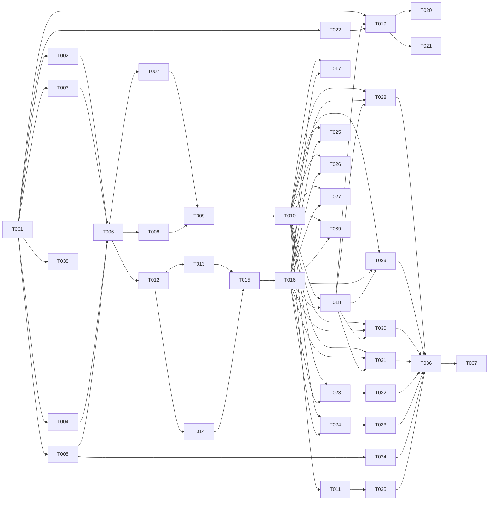

---

description: "Task list for Embedding Adapter — TEI-to-cloud proxy service"

---

# Tasks: Embedding Adapter (TEI-to-Cloud Bridge)

**Input**: Design documents from `specs/025-embedding-adapter/`
**Prerequisites**: plan.md (required), spec.md, research.md, data-model.md, contracts/

**Organization**: Tasks grouped by user story for independent implementation and testing.

## Format: `[ID] [AGENT] [Story?] Description`

- `[AGENT]`: Domain agent (see Agent Tags below)
- `[Story]`: User story reference (US1–US4)

## Agent Tags

| Tag | Agent | Domain |
|-----|-------|--------|
| `[SETUP]` | — (orchestrator) | Scaffolding, shared config |
| `[BE]` | backend-specialist | Routes, providers, auth, sanitize, error handling |
| `[OPS]` | devops-engineer | Docker, compose integration |
| `[E2E]` | test-engineer | Integration tests |
| `[SEC]` | security-auditor | Security audit |

---

## Phase 1: Setup (Shared Infrastructure)

**Purpose**: Package scaffolding, config, types, shared utilities

- [ ] T001 [SETUP] Scaffold `packages/embedding-adapter` with `package.json` (initial version `0.1.0`), `tsconfig.json`, Vitest config, `.gitignore`
- [ ] T002 [SETUP] Implement config loader (`src/config.ts`) with Zod schema per data-model.md
- [ ] T003 [SETUP] Implement shared TEI contract types in `src/types.ts` (EmbedRequest, RerankRequest, RerankResult, HealthResponse)
- [ ] T004 [SETUP] Implement error handling module (`src/lib/errors.ts`) — AppError classes + error-to-HTTP mapping (400/401/502/504)
- [ ] T005 [BE] Implement API key resolver (`src/lib/auth.ts`) — header-first, env fallback per provider, return 401 if none found

**Checkpoint**: Foundation ready — shared types, config, auth, error handling complete

---

## Phase 2: User Story 1 — Proxy Embeddings (Priority: P1) 🎯 MVP

**Goal**: `POST /embed` proxies to OpenAI or Jina, returns raw `number[] | number[][]`

**Independent Test**: `curl -X POST http://localhost:8095/embed -H "Content-Type: application/json" -d '{"inputs":"test"}'` returns flat float array

- [ ] T006 [BE] [US1] Implement `EmbedProvider` interface in `src/providers/types.ts`
- [ ] T007 [BE] [US1] Implement Jina embed provider (`src/providers/jina-embed.ts`) — pass `dimensions: 1024`, unwrap response. **Configure undici `Agent` with `keepAliveTimeout` for TLS reuse (review-fix FR-010).**
- [ ] T008 [BE] [US1] Implement OpenAI embed provider (`src/providers/openai-embed.ts`) — log startup warning for 1536-dim. **Configure undici `Agent` with `keepAliveTimeout` (review-fix FR-010). Response-side dim-check: log warning if returned dimension ≠ 1024.**
- [ ] T009 [BE] [US1] Implement response sanitizer (`src/lib/sanitize.ts`) — strip `object`, `model`, `usage`, `data[].object`. **Validate upstream response via Zod schema (review-fix FR-005); return 502 if shape doesn't match.**
- [ ] T010 [BE] [US1] Implement `POST /embed` route (`src/routes/embed.ts`) — input validation, provider routing, sanitize response, error mapping
- [ ] T011 [BE] [US1] Implement `GET /health` route (`src/routes/health.ts`) — return status + provider name

**Checkpoint**: `/embed` works with Jina and OpenAI, `/health` responds — MVP!

---

## Phase 3: User Story 2 — Proxy Rerank (Priority: P1)

**Goal**: `POST /rerank` proxies to Cohere or Jina, returns sorted `RerankResult[]`

**Independent Test**: `curl -X POST http://localhost:8095/rerank -H "Content-Type: application/json" -d '{"query":"test","documents":["a","b"]}'` returns sorted `index` + `score`

- [ ] T012 [BE] [US2] Implement `RerankProvider` interface in `src/providers/types.ts` (add to existing file)
- [ ] T013 [BE] [US2] Implement Cohere rerank provider (`src/providers/cohere-rerank.ts`) — map `relevance_score` → `score`, strip `meta`. **Pass `top_n: documents.length` explicitly (review-fix FR-002).**
- [ ] T014 [BE] [US2] Implement Jina rerank provider (`src/providers/jina-rerank.ts`) — map `relevance_score` → `score`, strip `document.text`, `model`, `usage`. **Pass `top_n: documents.length` explicitly (review-fix FR-002).**
- [ ] T015 [BE] [US2] Implement rerank input validation — reject >1000 docs (Cohere) or >2048 (Jina) with 400 + limit message
- [ ] T016 [BE] [US2] Implement `POST /rerank` route (`src/routes/rerank.ts`) — input validation, provider routing, field normalization, sanitize, error mapping

**Checkpoint**: `/rerank` works with Cohere and Jina, batch limits enforced

---

## Phase 4: User Story 3 — API Key Resolution & Headers (Priority: P2)

**Goal**: Dynamic API key from `Authorization` header overrides env fallback

**Independent Test**: Request with `Authorization: Bearer sk-test` uses that key instead of env

- [ ] T017 [BE] [US3] Implement per-request Authorization header extraction + provider routing in `src/lib/auth.ts` (update existing)
- [ ] T018 [BE] [US3] Wire auth into embed/rerank route middleware — pass resolved key to provider call

**Checkpoint**: Header-first key resolution works end-to-end

---

## Phase 5: User Story 4 — Compose Swap Integration (Priority: P2)

**Goal**: Drop-in replacement in `docker-compose.standalone.yml`, removes TEI containers

**Independent Test**: `docker compose up -d` shows `<100MB RSS` for adapter, no tei-embed/tei-rerank running

- [ ] T019 [OPS] [US4] Create `packages/embedding-adapter/Dockerfile` — Node 20 Alpine, pnpm deploy, `fastify start`. **Healthcheck uses `wget` (Alpine ships it; `curl` absent by default — review-fix).**
- [ ] T020 [OPS] [US4] Update `docker-compose.standalone.yml` — add `embedding-adapter` service, remove `tei-embed` and `tei-rerank`. **Use `expose: ["8095"]` not `ports:` to avoid publishing API-key-accessible endpoint on host (review-fix S2).**
- [ ] T021 [OPS] [US4] Update engine env `EMBEDDINGS_URL` to point at `embedding-adapter:8095`
- [ ] T022 [BE] [US4] Implement Fastify server bootstrap (`src/index.ts`) — register routes, **explicit `bodyLimit` (default 1MB, configurable via `BODY_LIMIT` — review-fix), no CORS by default** (engine-to-adapter is server-to-server per plan.md), healthcheck, graceful shutdown

**Checkpoint**: Standalone compose runs without TEI containers, engine works via adapter

---

## Phase 6: Edge Cases & Hardening

**Purpose**: Missing inputs, upstream failures, upstream timeouts, JSON strictness, logging PII guard

- [ ] T023 [BE] Implement empty/null input validation for `/embed` — reject empty string and empty array with 400. **Enforce `MAX_INPUT_CHARS` per string (review-fix FR-009) — reject with 400 if exceeded.**
- [ ] T024 [BE] Implement upstream timeout handling per `UPSTREAM_TIMEOUT_MS` (default 10000ms) — AbortController, return 504
- [ ] T025 [BE] Implement upstream error mapping — 401/429/500 → 502, log without PII text. **Catch `SyntaxError`/network errors (`ENOTFOUND`, `ECONNREFUSED`) → 502 (review-fix). Don't expose upstream 401 as-is — avoid credential-oracle timing side-channel.**
- [ ] T026 [BE] Add no-PII guard to logger — **redact `inputs`/`documents`/`query` from error payloads AND `authorization`/`x-api-key`/`*_api_key` headers from ALL log levels via pino `redact` config (review-fix S1 — auth header leakage is HIGH severity).**
- [ ] T027 [BE] Add startup dimension warning — if configured provider is known to return ≠1024, log prominent startup warning. **Also add response-side dim-check log for runtime diagnostics (review-fix).**

**Checkpoint**: All edge cases handled

---

## Phase 7: Testing & Verification

**Purpose**: Ensure reliability and contract compliance

- [ ] T028 [E2E] Integration test for `/embed` single input — verify `number[]` response shape
- [ ] T029 [E2E] Integration test for `/embed` batch input — verify `number[][]` response shape
- [ ] T030 [E2E] Integration test for `/rerank` — verify sorted `RerankResult[]`
- [ ] T031 [E2E] Integration test for auth header resolution — verify key forwarding
- [ ] T032 [E2E] Integration test for empty input rejection — verify 400
- [ ] T033 [E2E] Integration test for upstream timeout — verify 504
- [ ] T034 [E2E] Integration test for missing credentials — verify 401
- [ ] T035 [E2E] Integration test for `/health` — verify status + provider fields

---

## Phase 8: Polish

- [ ] T036 [OPS] Run `quickstart.md` validation — verify local dev flow
- [ ] T037 [SEC] Security audit — verify no API key leakage in logs, errors, or responses
- [ ] T038 [OPS] Create `packages/embedding-adapter/README.md` + register package in root `pnpm-workspace.yaml`
- [ ] T039 [BE] Add performance benchmark test for `/embed` and `/rerank` — assert <50ms overhead (excluding upstream)

---

## Phase 9: Review-Fix Hardening (claude.md + cline.md findings)

**Purpose**: Circuit breaker, concurrency limiter, engine fail-open verification, integration tests for new edge cases

- [ ] T040 [BE] Implement circuit breaker (`src/lib/circuit-breaker.ts`) per FR-007 — `CIRCUIT_FAILURE_THRESHOLD` consecutive failures in 60s window → 503 + half-open probe after `CIRCUIT_RESET_TIMEOUT`. **Fixes claude.md F1 + cline.md F2 (HIGH).**
- [ ] T041 [BE] Implement concurrency limiter (`src/lib/concurrency.ts`) per FR-008 — semaphore-based `MAX_CONCURRENT_REQUESTS` (default 50), return 503 + `Retry-After: 1` if exceeded. **Fixes claude.md E1 + cline.md F6 (MEDIUM).**
- [ ] T042 [E2E] Verify engine `EmbeddingService` graceful degradation under adapter failure modes (timeout, 502, 503) — cross-package integration test asserting fail-open behavior. **Fixes claude.md A1 + cline.md F3 (MEDIUM/HIGH). If engine does NOT fail-open, this surfaces the assumption and blocks.**
- [ ] T043 [E2E] Integration test for `/rerank` — verify `top_n: documents.length` passed (50 docs → 50 results, not 10). **Fixes claude.md E2 (MEDIUM — silent truncation contract breaker).**
- [ ] T044 [E2E] Integration test for `MAX_INPUT_CHARS` rejection — verify 400 on oversized string. **Fixes cline.md F5 (MEDIUM).**
- [ ] T045 [E2E] Integration test for circuit breaker open → 503, half-open recovery. **Fixes claude.md F1 (MEDIUM).**

**Checkpoint**: All review findings addressed in code or verified via test

---

### Dependencies

T001 → T002, T003, T004, T005, T019, T022        # setup unlocks all
T002 + T003 + T004 + T005 → T006                  # foundation before providers
T006 → T007, T008                                  # provider interface before implementations
T007 + T008 → T009                                 # providers before sanitizer
T009 → T010                                        # sanitizer before route
T010 → T011                                        # embed route before health (siblings)
T006 → T012                                        # embed provider interface before rerank interface
T012 → T013, T014                                  # rerank interface before implementations
T013 + T014 → T015                                 # providers before batch validation
T015 → T016                                        # validation before route
T010 + T016 → T017, T018                           # embed+rerank routes before auth wiring
T018 + T022 → T019                                 # auth wired + server ready before Docker
T019 → T020, T021                                  # Dockerfile before compose
T010 + T016 → T023, T024, T025, T026, T027         # routes before edge case hardening
T010 + T016 + T018 → T028, T029, T030, T031        # routes + auth before embed/rerank tests
T023 → T032                                        # edge case before its test
T024 → T033                                        # timeout handler before its test
T005 → T034                                        # auth module before missing-credential test
T011 → T035                                        # health route before its test
T028 + T029 + T030 + T031 + T032 + T033 + T034 + T035 → T036  # all tests pass before polish
T036 → T037                                        # functional validation before security audit
T001 → T038                                        # setup before README + workspace
T010 + T016 → T039                                 # routes exist before perf benchmark
T010 + T016 → T040                                 # routes exist before circuit breaker wiring
T010 + T016 → T041                                 # routes exist before concurrency limiter wiring
T016 → T043                                        # rerank route before top_n test
T023 → T044                                        # MAX_INPUT_CHARS validation before its test
T040 → T045                                        # circuit breaker impl before its test
T040 + T041 + T042 + T043 + T044 + T045 → T037     # review-fix hardening before security audit

### Self-Validation Checklist

- [X] Every task ID in Dependencies exists in task list
- [X] No circular dependencies
- [X] No orphan task IDs
- [X] Fan-in uses `+` only, fan-out uses `,` only
- [X] No chained arrows on a single line
- [X] SC-003 (<50ms overhead) now covered by T039
- [X] FR-002 `top_n` covered by T013/T014/T043 (review-fix claude.md E2)
- [X] FR-007 circuit breaker covered by T040/T045 (review-fix claude.md F1 + cline.md F2)
- [X] FR-008 concurrency limiter covered by T041 (review-fix claude.md E1 + cline.md F6)
- [X] FR-009 MAX_INPUT_CHARS covered by T023/T044 (review-fix cline.md F5)
- [X] FR-010 TLS keep-alive covered by T007/T008 (review-fix claude.md P1)
- [X] FR-005 response Zod validation covered by T009 (review-fix cline.md F9)
- [X] S1 auth header redaction covered by T026 (review-fix claude.md S1 — HIGH)
- [X] S2 port→expose covered by T020 (review-fix claude.md S2)
- [X] A3 curl→wget covered by T019 (review-fix claude.md A3)
- [X] A1 engine fail-open verification covered by T042 (review-fix claude.md A1 + cline.md F3)

---

## Dependency Visualization

---

## Parallel Lanes

| Lane | Agent Flow | Tasks | Blocked By |
|------|-----------|-------|------------|
| 1 | [SETUP] | T001 → T002, T003, T004 | — |
| 2 | [BE] | T005 → T006 → T007, T008 → T009 → T010 → T011 | T001 |
| 3 | [BE] | T012 → T013, T014 → T015 → T016 | T006 |
| 4 | [BE] | T017, T018 | T010 + T016 |
| 5 | [BE] | T023, T024, T025, T026, T027 | T010 + T016 |
| 6 | [OPS] | T022 → T019 → T020, T021 | T001 |
| 7 | [E2E] | T028–T035 | T010 + T016 + T018 |
| 8 | [OPS] | T036, T038 | T028–T035, T001 |
| 9 | [BE] | T039 | T010 + T016 |
| 10 | [SEC] | T037 | T036 |

---

## Agent Summary

| Agent | Task Count | Can Start After |
|-------|-----------|-----------------|
| [SETUP] | 4 | Immediately |
| [BE] | 29 | T001 (some), T006 (rerank lane) |
| [OPS] | 5 | T001 |
| [E2E] | 12 | T010 + T016 + T018 |
| [SEC] | 1 | T036 (now gated on review-fix hardening) |

**Critical Path**: T001 → T005 → T006 → T007 → T009 → T010 → T016 → T018 → T019 → T020 → T040 → T045 → T036 → T037

---

## Agent Dispatch Plan

| Agent | Subagent | Skills | Input Context | Tasks | Files |
|-------|----------|--------|---------------|-------|-------|
| `[SETUP]` | — (orchestrator) | — | plan.md §structure, data-model.md §1 | T001, T002, T003, T004 | `packages/embedding-adapter/package.json`, `tsconfig.json`, `vitest.config.ts`, `src/config.ts`, `src/types.ts`, `src/lib/errors.ts` |
| `[BE]` | backend-specialist | api-patterns, nodejs-best-practices | data-model.md §2–5, research.md §1–3, contracts/openapi.yaml | T005–T018, T022–T027 | `src/index.ts`, `src/routes/`, `src/providers/`, `src/lib/auth.ts`, `src/lib/sanitize.ts` |
| `[OPS]` | devops-engineer | docker-expert | quickstart.md, plan.md §structure | T019, T020, T021, T036, T038 | `packages/embedding-adapter/Dockerfile`, `docker-compose.standalone.yml`, `.env`, `pnpm-workspace.yaml` |
| `[E2E]` | test-engineer | testing-patterns, webapp-testing | contracts/openapi.yaml, research.md §1, spec.md §User Scenarios | T028–T035 | `packages/embedding-adapter/test/` |
| `[BE]` | backend-specialist | performance-profiling | spec.md §Success Criteria (SC-003) | T039 | `packages/embedding-adapter/test/benchmark.test.ts` |
| `[SEC]` | security-auditor | vulnerability-scanner | spec.md §Edge Cases (PII guard), data-model.md §3 | T037 | `packages/embedding-adapter/src/lib/auth.ts`, logger configuration |

---

## Implementation Strategy

### MVP First (US1 + US2 — P1 Stories)

1. Phase 1: Setup — T001–T005
2. Phase 2: US1 (embed) — T006–T011 → **STOP, test `/embed`**
3. Phase 3: US2 (rerank) — T012–T016 → **STOP, test `/rerank`**
4. Phase 6: Edge cases — T023–T027
5. Phase 7: Core tests — T028–T035
6. **MVP ready**: embed + rerank working, all edge cases covered

### Full Delivery (P2 Stories Added)

7. Phase 4: US3 (dynamic auth) — T017–T018
8. Phase 5: US4 (Docker/compose) — T019–T022
9. Phase 8: Polish — T036–T039
