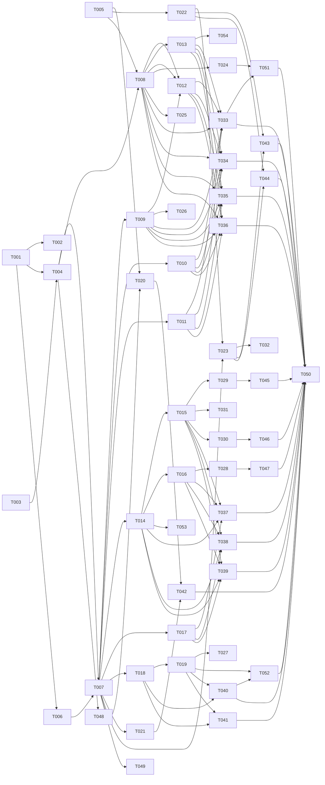

---

description: "Task list for Engine Tuning — Adaptive Configuration Pipeline with draft lifecycle, interview state machine, and self-tuner proposals"

---

# Tasks: Engine Tuning — Adaptive Configuration Pipeline

**Input**: Design documents from `specs/026-tuning/`
**Prerequisites**: plan.md (required), spec.md, research.md, data-model.md, contracts/

**Organization**: Tasks grouped by user story for independent implementation and testing.

## Format: `[ID] [AGENT] [Story?] Description`

- `[AGENT]`: Specialist agent responsible for the task (see Agent Tags below)
- `[Story]`: User story reference (US1–US5)
- Include exact file paths in descriptions

## Agent Tags

| Tag | Agent | Domain |
|-----|-------|--------|
| `[SETUP]` | — (orchestrator) | Scaffolding, shared types, base config |
| `[DB]` | database-architect | Drizzle schema, migration, indexes, RLS |
| `[BE]` | backend-specialist | Services (core), routes (API), Zod schemas, middleware |
| `[OPS]` | devops-engineer | Docker, compose, env config |
| `[E2E]` | test-engineer | Integration/E2E tests across packages |

---

## Phase 1: Setup & Foundational (Shared Infrastructure)

**Purpose**: DB schema, shared types, repository, route scaffolding. **Blocks all user stories.**

- [ ] T001 [DB] Create `tuning_drafts` drizzle schema in `packages/core/src/db/schema/tuning.ts` per data-model.md §1.4 — all columns (including `error`), enums, indexes (including partial unique `WHERE status = 'generating'`), RLS policy (ENABLE + FORCE + WITH CHECK + 2-arg current_setting per data-model §1.3)
- [ ] T002 [DB] Generate drizzle migration (`pnpm db:generate`) for `tuning_drafts` table
- [ ] T003 [SETUP] Define shared types in `packages/core/src/types/tuning.ts`: `TuningDraft`, `TuningDraftStatus`, `TuningMethod`, `ConfidenceLevel`, `PreviousSnapshot` (persona config + priorFunnelVersionId + priorValidatorToggles), `DraftConfigOverlay` — mapped from data-model.md §1–4
- [ ] T004 [BE] Implement `TuningDraftRepository` in `packages/core/src/services/tuning/tuning-draft-repository.ts` — CRUD operations: `create()`, `getById(tenantScoped)`, `listByPersona()`, `update()`, `getActiveDraft()`, `supersedeActiveDraft()`, `sweepStaleGenerating(personaId, tenantId, thresholdMs)` — all tenant-scoped via `withTenantContext`. Concurrent-lock enforced by DB partial unique index (data-model §1.2) — catch unique violation → throw 409.
- [ ] T005 [BE] Implement Redis helper module in `packages/core/src/services/tuning/redis-helper.ts` — connection, key builders (`interviewKey(tenantId, personaId, userId)`, `proposalsKey(tenantId, personaId)`), set/get with TTL, delete, updateArray (remove item). Fallback in-memory Map for dev (no Redis).
- [ ] T005a [BE] **Extend `LLMClient`** in `packages/core/src/services/llm-client.ts` — add `responseFormat?: { type: 'json_object' }` to `LLMRequest` interface (line 14-20) and pass through in fetch body (line 65-70). Additive, non-breaking change. Required before T008.
- [ ] T006 [SETUP] Create Zod validation schemas in `packages/api/src/schemas/tuning.ts`: `GenerateRequest` (reject `template-bootstrap` with 400 `METHOD_NOT_IMPLEMENTED`), `ReviewRequest`, `InterviewAnswerRequest`, `SandboxPreviewRequest`, `ProposalAcceptRequest` — per contract tuning-api.md
- [ ] T007 [BE] Create route scaffolding in `packages/api/src/routes/tuning/index.ts` — `fastify.register` entry that prefixes `/v1/personas/:personaId/tuning/*` and `/v1/tuning/*` routes. Wire auth + tenant middleware. **Register `onReady` startup sweep hook**: scan for `status=generating` drafts older than 5 min → flip to `failed` (`GENERATION_STALLED`).

**Checkpoint**: Foundation ready — DB, types, repository, route scaffolding complete

---

## Phase 2: User Story 1 — Doc Extraction Draft Generation (Priority: P1) 🎯 MVP

**Goal**: `POST /v1/personas/:personaId/tuning/generate { method: 'doc-extraction' }` creates draft, returns 202, async pipeline produces ready/failed draft

**Independent Test**: Upload 2-3 documents to persona → call generate → poll until status=ready → verify draft has non-empty systemPrompt + funnelConfig

- [ ] T008 [BE] [US1] Implement `DocExtractionPipeline` in `packages/core/src/services/tuning/doc-extraction-pipeline.ts` — reads RAG chunks for persona (**chunk selection**: top-K by relevance/cosine sim, max 8K tokens concatenated), calls LLM with extraction prompt (`response_format: json_object` via T005a), parses structured output, creates draft with status=ready. **ALL DB writes wrapped in `withTenantContext(tenantId, ...)`** — background task, request transaction is gone. Handle: LLM timeout → status=failed LLM_TIMEOUT, unparseable JSON → partial draft systemPrompt only + confidence=low, chunk count validation, LLM 429/5xx → retry (2 attempts, 1s/3s backoff).
- [ ] T009 [BE] [US1] Implement generate route handler in `packages/api/src/routes/tuning/generate.ts` — validate persona exists + belongs to tenant. **Reject `method: 'template-bootstrap'` with 400 `METHOD_NOT_IMPLEMENTED`** (Method B deferred). **Sweep stale drafts** for persona before lock check (FR-011 escape hatch): `draftRepo.sweepStaleGenerating(personaId, tenantId, 90_000)`. Create draft (status=generating) — concurrent-lock enforced by DB partial unique index, catch unique violation → 409 `CONFLICT_DRAFT_ACTIVE`. Fire-and-forget WITH crash safety: `process.nextTick(() => runGenerationPipeline(draftId, tenantId).catch(err => markDraftFailed(draftId, tenantId, err)))`. Return 202. Validate persona has documents → 400 `NO_DOCUMENTS`.
- [ ] T010 [BE] [US1] Implement poll draft route in `packages/api/src/routes/tuning/drafts.ts` — `GET /v1/tuning/drafts/:draftId` returns full draft object. Implement poll-time reaper (FR-003): if draft status=generating AND now - createdAt > 90s → flip to failed (GENERATION_STALLED), return failed draft. Auth inherited from shared engine hook (Bearer bound to tenant, FR-012).
- [ ] T011 [BE] [US1] Implement list drafts route in `packages/api/src/routes/tuning/drafts.ts` — `GET /v1/personas/:personaId/tuning/drafts` returns drafts (latest first), optional `?status=` filter. Tenant-scoped.
- [ ] T012 [BE] [US1] **REMOVED** — validator dry-run quality gate deferred to v1.1 (FR-013). For v1, confidence is taken from LLM self-report in extraction output (data-model §5). No separate quality-gate task needed.
- [ ] T013 [BE] [US1] Implement extraction prompt content in `packages/core/src/services/tuning/extraction-prompt.ts` — hardcoded prompt (admin-editable deferred) following research.md §2.1 format. Russian + English dual-language support.

**Checkpoint**: US1 works end-to-end — generate → poll → ready/failed draft with extraction content

---

## Phase 3: User Story 2 — Draft Activate & Rollback (Priority: P1) 🎯 MVP

**Goal**: `POST /v1/tuning/drafts/:draftId/activate` synchronously applies draft to live persona config

**Independent Test**: Generate draft → activate → verify persona systemPrompt changed in DB → rollback → verify reverted

- [ ] T014 [BE] [US2] Implement `ActivatePipeline` in `packages/core/src/services/tuning/activate-pipeline.ts` — synchronously: (1) save previousSnapshot (persona config: systemPrompt + traits; prior funnel active-version id; prior validator toggles — per data-model §4.2), (2) mark any currently-activated non-superseded draft for this persona as superseded, (3) update persona system_prompt + traits, (4) **map funnelConfig → {definition, stages[], fragments[], slots[]}** via new `FunnelConfigMapper` (T014a) and create funnel version via `FunnelRepository.createVersion(definitionId, config, stages, slots)`, (5) set validator toggles, (6) mark draft activated. **Atomicity**: all steps inside a single `withTenantContext` transaction — repos accept injected `tx` parameter (refactor `PersonaRepository.update` and `FunnelRepository.createVersion` to optionally accept `tx`). If any step throws → full rollback. If repo `tx` injection is too risky for v1, activate uses raw drizzle queries inside one transaction instead of calling repos.
- [ ] T014a [BE] [US2] Implement `FunnelConfigMapper` in `packages/core/src/services/tuning/funnel-config-mapper.ts` — maps draft's flat `funnelConfig` JSONB (LLM output `{ funnelStages: [{name, description, triggers, slots[]}] }`) into `FunnelRepository.createVersion()` args: resolve/create funnel definition, decompose into `stages[]` (each with synthesized `fragments[]` — use stage `description` as default fragment text), extract `slots[]`. Required before T014.
- [ ] T015 [BE] [US2] Implement activate route in `packages/api/src/routes/tuning/activate.ts` — `POST /v1/tuning/drafts/:draftId/activate`. Validate draft status=ready → 200 `{ status: 'activated', activatedAt }`. Draft already activated → 409 `{ error: 'CONFLICT' }`. Synchronous, return within 3s per SC-002.
- [ ] T016 [BE] [US2] Implement rollback route in `packages/api/src/routes/tuning/rollback.ts` — `POST /v1/tuning/drafts/:draftId/rollback`. Restore **full** previousSnapshot (FR-007): persona prompt/traits + reactivate prior funnel version + restore validator toggles. Only works on current active draft (status=activated, not superseded) with non-null previousSnapshot. Superseded draft → 409 `DRAFT_SUPERSEDED`. No previousSnapshot → 400 `NO_PREVIOUS_SNAPSHOT`. Return 200 `{ status: 'rolled-back' }`.
- [ ] T017 [BE] [US2] Implement review route in `packages/api/src/routes/tuning/review.ts` — `POST /v1/tuning/drafts/:draftId/review { verdict, notes? }`. Write `reviewVerdict` + `reviewNotes` to draft (FR-005). Advisory — does NOT change status or gate activate. Return 200.

**Checkpoint**: US2 works — activate + rollback + review all functional

---

## Phase 4: User Story 5 — Sandbox Draft Preview (Priority: P2)

**Goal**: `POST /v1/tuning/drafts/:draftId/sandbox-preview { messages }` runs chat pipeline with draft config overlay

**Independent Test**: Create draft with different systemPrompt → send test message via sandbox-preview → verify reply uses draft prompt, not live config

- [ ] T018 [BE] [US5] Implement `DraftConfigOverlay` type and sandbox draft mode in `packages/core/src/services/tuning/sandbox-draft-mode.ts` — load draft config, create **shadow persona object** (shallow copy with draft fields overlaid). Add optional `draftOverride?: DraftConfigOverlay` to `ChatRequest` type. `ChatService.complete()` checks for override after loading persona from DB and replaces corresponding fields before passing to funnel runtime + validator pipeline. **No private-method patching** — overlay threads through public API. Ensure `validatorToggles` from draft flows to `ValidatorPipeline`, not live persona config.
- [ ] T019 [BE] [US5] Implement sandbox-preview route in `packages/api/src/routes/tuning/sandbox-preview.ts` — `POST /v1/tuning/drafts/:draftId/sandbox-preview { messages: [{ role, content }] }`. Load draft, validate status=ready, create overlay, run full chat pipeline (RAG + funnel + validators in dry-run), return reply. Metadata includes `{ draftApplied: true, overriddenParts: string[], ragEmpty?: boolean }`. Handle empty RAG with `ragEmpty: true` metadata.

**Checkpoint**: US5 works — sandbox preview returns draft-modified reply with metadata

---

## Phase 5: User Story 3 — Interview Flow (Method C) (Priority: P2)

**Goal**: Adaptive Q&A session stored per persona (Redis TTL 30min), generates draft when all 7 questions answered

**Independent Test**: Call next → answer 7 questions → verify draft created with status=ready

- [ ] T020 [BE] [US3] Implement `InterviewStateMachine` in `packages/core/src/services/tuning/interview-state-machine.ts` — manages interview session: `startSession(tenantId, personaId, userId)`, `getNextQuestion(tenantId, personaId, userId)` → returns question at current (unanswered) position without advancing cursor, `submitAnswer(tenantId, personaId, userId, questionId, answer)` → records answer and advances cursor. Question bank per research.md §3.1 (7 questions, Russian). Adaptive skipping per research.md §3.2 — check if persona has document chunks, skip questions already covered (v1: simple keyword overlap; v1.1: embedding similarity). Store state in Redis via `redis-helper.ts` keyed `tuning:interview:{tenantId}:{personaId}:{userId}` (TTL 30min) — per-interviewer key prevents concurrent admins clobbering. When all questions answered → compile answers → call LLM extraction → create draft (method: 'interview') → return draftId. **ALL background writes wrapped in `withTenantContext`**.
- [ ] T021 [BE] [US3] Implement interview routes in `packages/api/src/routes/tuning/interview.ts` — `POST /v1/personas/:personaId/tuning/interview/next` returns `{ question, questionId, total, current }` or `{ draftId, status: 'ready' }` when complete. `POST /v1/personas/:personaId/tuning/interview/answer { questionId, answer }` returns `{ acknowledged: true }`.

**Checkpoint**: US3 works — interview Q&A flow creates draft

---

## Phase 6: User Story 4 — Self-Tuner Proposals (Method D) (Priority: P3)

**Goal**: On-demand conversation analysis → proposals → accept/reject → draft creation

**Independent Test**: Insert 20+ mock conversations with patterns → call proposals → verify proposal with signal + description + riskLevel

- [ ] T022 [BE] [US4] Implement `ConversationAnalyzer` in `packages/core/src/services/tuning/conversation-analyzer.ts` — `analyze(personaId)`: (1) validate warm-up threshold — <20 conversations → return empty + warmup indicator, (2) scan recent conversations for repeated topics, failed validations (validator_runs table), block-rate spikes, sentiment shifts (research.md §4). Generate `TuningProposal[]` array. Cache in Redis (TTL 30min) via `redis-helper.ts`.
- [ ] T023 [BE] [US4] Implement proposals routes in `packages/api/src/routes/tuning/proposals.ts` — `GET /v1/personas/:personaId/tuning/proposals` returns `{ proposals: TuningProposal[] }` with warmup indicator if <20 conversations. `POST /v1/tuning/proposals/:proposalId/accept` — resolve proposal from Redis cache (single array key, data-model §3.2), remove from cached array, create draft with method='self-tuner', return `{ draftId }`. Cache miss → 404 `PROPOSAL_EXPIRED` (FR-010). `POST /v1/tuning/proposals/:proposalId/reject` — remove from cached array (rewrite key), return `{ dismissed: true }`.

**Checkpoint**: US4 works — proposals generated, accepted/rejected, drafts created

---

## Phase 7: Edge Cases & Hardening

**Purpose**: All error paths, edge cases, and hardening from spec.md §Edge Cases

- [ ] T024 [BE] Implement LLM extraction timeout (>60s) handling — AbortController with 55s timeout, catch AbortError → draft status=failed, error='LLM_TIMEOUT'
- [ ] T025 [BE] Implement unparseable JSON fallback in extraction pipeline — catch JSON parse error, extract systemPrompt via regex fallback, create partial draft with funnelConfig=null, confidence='low'
- [ ] T026 [BE] [US1] Implement concurrent generate guard — check no draft with status=generating exists for persona, return 409 if found. Race-condition safe via DB-level check.
- [ ] T027 [BE] Implement sandbox preview with empty RAG — works but reply may be generic, metadata includes `ragEmpty: true`
- [ ] T028 [BE] [US2] Implement rollback with null previousSnapshot guard — return 400 `NO_PREVIOUS_SNAPSHOT`
- [ ] T029 [BE] [US2] Implement cross-tenant draft access guard — all draft queries scoped by tenantId from auth header (FR-012). Cross-tenant → 404 (not 403, to avoid information leakage)
- [ ] T030 [BE] Implement poll-time reaper in poll handler (FR-003) — flip generating >90s to failed with error='GENERATION_STALLED'. Include in `TuningDraftRepository.getById()` or as middleware in poll route.
- [ ] T031 [BE] [US2] Implement chained activation — activate draft B → mark draft A as superseded. Rollback only on current active draft B; rollback on superseded A → 409 `DRAFT_SUPERSEDED`
- [ ] T032 [BE] [US4] Implement proposal cache miss on accept/reject → 404 `PROPOSAL_EXPIRED`
- [ ] T053 [BE] Implement `diffSections` computation in `ActivatePipeline` — after activate, compute structured diff between previousSnapshot and new config (systemPrompt changed Y/N, funnelConfig changed Y/N, validatorToggles changed Y/N). Store in `diffSections` JSONB column.

**Checkpoint**: All edge cases handled — proper error codes (400/404/409) on expected failures

---

## Phase 8: Testing & Verification

**Purpose**: Integration tests for each user story, edge case, and performance benchmarks for timing SLAs (SC-001, SC-003).

- [ ] T033 [E2E] [US1] Integration test: upload 2-3 persona documents → call generate → poll until ready → verify systemPrompt + funnelConfig non-empty
- [ ] T034 [E2E] [US1] Integration test: generate with 0 documents → verify 400 `NO_DOCUMENTS`
- [ ] T035 [E2E] [US1] Integration test: concurrent generate for same persona → second returns 409
- [ ] T036 [E2E] [US1] Integration test: poll while generating → verify status='generating', poll after ready → verify full draft object
- [ ] T037 [E2E] [US2] Integration test: generate → review (approved) → activate → verify persona systemPrompt changed in DB → rollback → verify reverted
- [ ] T038 [E2E] [US2] Integration test: activate already-activated draft → 409
- [ ] T039 [E2E] [US2] Integration test: chained activation — activate draft A → activate draft B → verify A is superseded → rollback B → verify B is rolled-back, A stays superseded → rollback A → 409 DRAFT_SUPERSEDED
- [ ] T040 [E2E] [US5] Integration test: sandbox-preview with draft overlay → verify reply uses draft prompt, metadata includes overriddenParts
- [ ] T041 [E2E] [US5] Integration test: sandbox-preview with empty RAG → verify ragEmpty: true in metadata
- [ ] T042 [E2E] [US3] Integration test: interview flow — next → answer × 7 → verify draft created
- [ ] T043 [E2E] [US4] Integration test: proposals with <20 conversations → verify empty + warmup
- [ ] T044 [E2E] [US4] Integration test: expire proposal → accept → 404 PROPOSAL_EXPIRED
- [ ] T045 [E2E] Integration test: cross-tenant draft access → verify 404
- [ ] T046 [E2E] Integration test: stalled generation — create draft with status=generating, older createdAt → poll → verify flipped to failed GENERATION_STALLED
- [ ] T047 [E2E] Integration test: rollback with null previousSnapshot → 400
- [ ] T051 [E2E] Performance benchmark: measure doc extraction draft generation — assert <60s for ≤5 docs (≤50KB) per SC-001
- [ ] T052 [E2E] Performance benchmark: measure sandbox preview response time — assert <10s per SC-003

**Checkpoint**: All user stories, edge cases, error paths, and timing SLAs covered by integration + benchmark tests

---

## Phase 9: Polish & Deferrals

- [ ] T048 [OPS] Update `.env.example` with any tuning-specific config (e.g., `TUNING_EXTRACTION_TIMEOUT_MS`, `TUNING_STALL_TIMEOUT_MS`)
- [ ] T049 [SETUP] Update `specs/main/architecture.md` §3 (Core Service Patterns) to mention tuning services
- [ ] T050 [SETUP] Verify quickstart.md walkthrough — all curls return expected responses
- [ ] T054 [BE] Follow-up: migrate hardcoded extraction prompt (T013) to admin-editable setting per coding standards §15.1 — add `admin_settings` row keyed `TUNING_EXTRACTION_PROMPT_CONTENT`, implement `resolveExtractionPrompt()` with per-assistant → admin-setting → hardcoded fallback chain

**Method B (Template Bootstrap) deferral**: Method B implementation is explicitly deferred to a follow-up spec, as per 2026-06-22 clarification: "Content task = separate from code." The `templates` table extension (`funnel_preset` + `validator_preset` JSONB columns) and template-bootstrap pipeline will be delivered in a separate feature spec post-v1. The `template-bootstrap.ts` reference has been removed from the plan.md project structure.

---

## Dependency Graph

### Dependencies

T001 → T002                        # schema before migration
T001 + T003 → T004                  # schema + types before repository
T005 → T020, T022                  # Redis helper before interview + proposal
T001 → T006                         # schema defines types for Zod
T006 + T004 → T007                 # Zod schemas + repository before route scaffolding
T007 → T009, T010, T011            # route scaffolding before endpoint handlers
T004 + T005 → T008                 # repository + Redis before extraction pipeline
T008 → T012, T013                  # pipeline before quality gate + prompt
T008 + T009 → T012                 # pipeline + generate route before quality gate
T007 → T014                         # route scaffolding before activate pipeline
T014 → T015, T016                  # pipeline before activate + rollback routes
T016 → T028                         # rollback before edge case guard
T015 → T029, T031                  # activate routes before edge case guards
T007 → T017                         # route scaffolding before review route
T007 → T018                         # route scaffolding before sandbox service
T018 → T019                         # sandbox service before route
T007 → T020, T021                  # route scaffolding before interview
T007 → T022, T023                  # route scaffolding before proposals
T008 → T024, T025                  # pipeline before timeout + fallback
T009 → T026                         # generate route before concurrent guard
T019 → T027                         # sandbox route before empty RAG guard
T015 → T030                         # activate before poll-time reaper (reaper in poll route)
T023 → T032                         # proposals before expired-proposal guard
T014 → T053                         # activate pipeline before diffSections computation (computed inside activate)
T009 + T010 + T011 + T008 + T012 + T013 → T033, T034, T035, T036  # US1 routes + pipeline before US1 tests
T014 + T015 + T016 + T017 → T037, T038, T039  # activate + rollback + review before US2 tests
T018 + T019 → T040, T041            # sandbox before US5 tests
T020 + T021 → T042                  # interview before US3 test
T022 + T023 → T043, T044            # proposals before US4 tests
T029 → T045                         # cross-tenant guard before its test
T030 → T046                         # reaper before stall test
T028 → T047                         # no-previous-snapshot guard before its test
T024 + T033 → T051                  # timeout handling + US1 test before benchmark
T019 + T040 → T052                  # sandbox route + test before benchmark
T004 → T048                         # repository before env config
T007 → T049                         # routes before arch doc update
T013 → T054                         # hardcoded prompt before admin-editable migration
T033 + T034 + T035 + T036 + T037 + T038 + T039 + T040 + T041 + T042 + T043 + T044 + T045 + T046 + T047 + T051 + T052 → T050  # all tests pass before quickstart validation

### Self-Validation Checklist

- [ ] Every task ID in Dependencies exists in task list above
- [ ] No circular dependencies
- [ ] No orphan task IDs
- [ ] Fan-in uses `+` only, fan-out uses `,` only
- [ ] No chained arrows on a single line
- [ ] FR-001 (DB schema) covered by T001
- [ ] FR-002 (Generate) covered by T009
- [ ] FR-003 (Poll-time reaper) covered by T010, T030
- [ ] FR-004 (List drafts) covered by T011
- [ ] FR-005 (Review) covered by T017
- [ ] FR-006 (Activate) covered by T014, T015
- [ ] FR-007 (Rollback) covered by T016
- [ ] FR-008 (Sandbox preview) covered by T018, T019
- [ ] FR-009 (Interview) covered by T020, T021
- [ ] FR-010 (Proposals) covered by T022, T023, T032
- [ ] FR-011 (Concurrent lock) covered by T026
- [ ] FR-012 (Tenant isolation) covered by T029
- [ ] FR-013 (Quality gate) covered by T012
- [ ] diffSections populated (A3 fix) covered by T053
- [ ] SC-001 timing SLA (60s) covered by T051
- [ ] SC-003 timing SLA (10s) covered by T052
- [ ] Admin-editable prompt follow-up (A7 fix) covered by T054
- [ ] Method B deferral documented (A1/A4 fix) — deferral note in Phase 9
- [ ] US1 tests covered by T033–T036
- [ ] US2 tests covered by T037–T039
- [ ] US3 test covered by T042
- [ ] US4 tests covered by T043–T044
- [ ] US5 tests covered by T040–T041
- [ ] Edge case tests covered by T045–T047

---

## Dependency Visualization

---

## Parallel Lanes

| Lane | Agent Flow | Tasks | Blocked By |
|------|-----------|-------|------------|
| 1 | [DB] | T001 → T002 | — |
| 2 | [SETUP] | T003, T006 | T001 |
| 3 | [BE] | T004 + T005 → T008 → T012, T013 | T001, T003 |
| 4 | [BE] | T007 → T009, T010, T011, T014, T015, T016, T017 | T006 + T004 |
| 5 | [BE] | T018 → T019 | T007 |
| 6 | [BE] | T020 → T021 | T005 + T007 |
| 7 | [BE] | T022 → T023 | T005 + T007 |
| 8 | [BE] | T024–T032, T053 | T008, T009, T015, T016, T018, T019, T023 |
| 9 | [E2E] | T033–T047 | Phase 2–6 completions |
| 10 | [E2E] | T051 | T024 + T033 |
| 11 | [E2E] | T052 | T019 + T040 |
| 12 | [OPS] | T048 | T004 |
| 13 | [SETUP] | T049, T050 | All tests pass |
| 14 | [BE] | T054 | T013 |

---

## Agent Summary

| Agent | Task Count | Can Start After |
|-------|-----------|-----------------|
| [DB] | 2 | Immediately |
| [SETUP] | 4 | T001 (Zod), T001 + T003 (types), all tests (quickstart) |
| [BE] | 35 | T001 + T003 (repository), T006 (routes), T007 (scaffolding) |
| [E2E] | 17 | Routes + services complete per US |
| [OPS] | 1 | T004 |

**Critical Path**: T001 → T003 → T004 → T007 → T009 → T008 → T024 → T033 → T051 → T050

---

## Agent Dispatch Plan

| Agent | Subagent | Skills | Input Context | Tasks | Files |
|-------|----------|--------|---------------|-------|-------|
| `[DB]` | database-architect | database-design | data-model.md §1 (tuning_drafts table), plan.md §storage | T001, T002 | `packages/core/src/db/schema/tuning.ts`, `drizzle/` |
| `[SETUP]` | — (orchestrator) | — | data-model.md §1–3 (types), contracts/tuning-api.md (Zod schemas), plan.md §structure, quickstart.md | T003, T006, T049, T050 | `packages/core/src/types/tuning.ts`, `packages/api/src/schemas/tuning.ts`, `specs/main/architecture.md` |
| `[BE]` | backend-specialist | api-patterns, nodejs-best-practices, clean-code | plan.md §technical-context, plan.md §source-code, data-model.md §1–5, contracts/tuning-api.md, research.md §1–7, spec.md §User Scenarios + §Edge Cases + §Functional Requirements | T004, T005, T007–T032, T053, T054 | `packages/core/src/services/tuning/*.ts`, `packages/core/src/services/llm-client.ts` (extend), `packages/api/src/routes/tuning/*.ts`, `packages/api/src/schemas/tuning.ts` |
| `[E2E]` | test-engineer | testing-patterns, webapp-testing, performance-profiling | contracts/tuning-api.md, quickstart.md, spec.md §User Scenarios + §Edge Cases + §Success Criteria, data-model.md §1 | T033–T047, T051, T052 | `packages/core/test/tuning/*.ts`, `packages/api/test/tuning/*.ts` |
| `[OPS]` | devops-engineer | docker-expert | plan.md, quickstart.md | T048 | `.env.example` |

---

## Implementation Strategy

### MVP First (US1 + US2 — P1 Stories)

1. Phase 1: Setup — T001–T007 → **STOP, verify foundation**
2. Phase 2: US1 (draft generation) — T008–T013 → **STOP, test generate→poll→ready**
3. Phase 3: US2 (activate/rollback) — T014–T017 → **STOP, test activate→rollback**
4. Phase 7: Edge cases (timeout, concurrent, reaper, diffSections) — T024–T032, T053
5. Phase 8: Core tests + benchmarks — T033–T039, T045–T047, T051
6. **MVP ready**: doc-extraction generation + activate/rollback + sandbox preview + all edge cases + timing SLAs

### Full Delivery (P2/P3 Stories Added)

1. Phase 4: US5 (sandbox preview) — T018–T019 → **STOP, test sandbox**
2. Phase 5: US3 (interview) — T020–T021 → **STOP, test interview flow**
3. Phase 6: US4 (proposals) — T022–T023 → **STOP, test proposals**
4. Remaining E2E tests + benchmarks — T040–T044, T052
5. Phase 9: Polish + admin-editable prompt — T048–T050, T054
