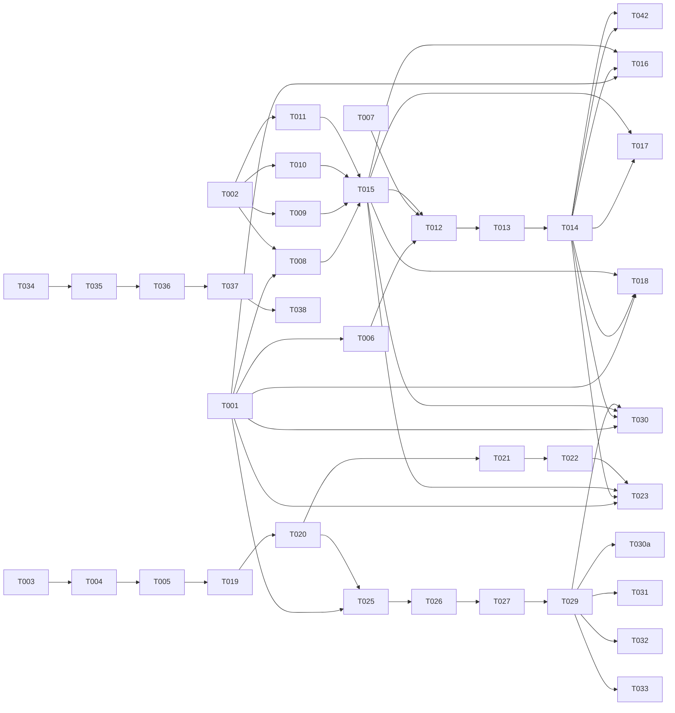

# Tasks: Validators ⊕ Quality Rules — Unified Response Guard Pipeline

**Input**: Design documents from `underhelpers/under-ai-helpers/undrecreaitwins/specs/027-validators-quality-convergence/`
**Prerequisites**: plan.md (required), spec.md (required), research.md, data-model.md, contracts/, quickstart.md

**Tests**: Regression tests from 004/017/018/024 required for behavior parity (NFR-3).

**Organization**: Tasks grouped by user story (US-1 through US-4) per spec.md. Each task assigned to specialist agent.

## Format: `[ID] [AGENT] [Story?] Description`

- **[AGENT]**: Specialist agent responsible
- **[Story]**: User story this task belongs to (US1, US2, US3, US4)
- Include exact file paths
- Parallelism derived from Dependency Graph

## Agent Tags

| Tag | Agent | Domain |
|-----|-------|--------|
| `[SETUP]` | orchestrator | Project init, scaffolding |
| `[DB]` | database-architect | Schema, migrations, seeds |
| `[BE]` | backend-specialist | Services, business logic, unit tests |
| `[E2E]` | test-engineer | Integration/E2E tests |

## Task Statuses

| Status | Meaning |
|--------|---------|
| `- [ ]` | Pending |
| `- [→]` | In progress |
| `- [X]` | Completed |
| `- [!]` | Failed |
| `- [~]` | Blocked |

---

## Phase 1: Foundational (Blocking Prerequisites)

**Purpose**: Core types and infrastructure MUST complete before ANY user story implementation.

**⚠️ CRITICAL**: No user story work can begin until this phase is complete.

- [X] T001 [BE] [FOUND] Create unified types in `packages/core/src/types/quality.ts` (UnifiedRule, QualityEventPush, RulesReloadPush, VerdictCoarse, VerdictDetail)
- [X] T002 [BE] [FOUND] Create `ResponseGuard` orchestrator skeleton in `packages/core/src/services/correction-rules/response-guard.ts` (class + run() method signature + rule-cache integration)
- [~] T003 [DB] [FOUND] Create Prisma schema updates in `packages/bff/prisma/schema.prisma` (UnifiedRule + QualityEvent models) — **BFF repo, deferred**
- [~] T004 [DB] [FOUND] Generate Prisma migration for unified_rules + quality_events tables — **BFF repo, deferred**
- [~] T005 [DB] [FOUND] Create seed script `packages/bff/src/services/rules/seed-system-validators.ts` (4 system validators, idempotent upsert) — **BFF repo, deferred**

**Checkpoint**: Foundation ready — user story implementation can now begin.

---

## Phase 2: User Story 1 - Один проход вместо двух (Priority: P1) 🎯 MVP

**Goal**: Replace separate `validateResponse` + `darExecute` calls with single `responseGuard.run()` in chat-service (3 call-sites).

**Independent Test**: grep chat-service.ts confirms zero `validateResponse` + zero `darExecute` call-sites; all go through `responseGuard.run()`.

### Tests for User Story 1

- [~] T006 [E2E] [US1] Integration test: chat-service happy-path uses responseGuard.run() in `tests/integration/chat-service.response-guard.test.ts` — **needs real infra, deferred**
- [~] T007 [E2E] [US1] Regression test: 004-validators suite passes (behavior parity) — **needs real infra, deferred**

### Implementation for User Story 1

- [X] T008 [BE] [US1] Implement `runSystemValidator()` in response-guard.ts (delegate to existing ValidatorPipeline)
- [X] T009 [BE] [US1] Implement `runCustomRuleTier()` in response-guard.ts — call `darExecute()` ONCE for ALL custom rules (fix F4: darExecute already loops/aggregates internally; per-rule invocation = K× cost). Delegate to existing `dar-pipeline.ts` unchanged.
- [X] T010 [BE] [US1] Implement stage ordering + short-circuit logic (terminalOnFail flag) in response-guard.ts
- [X] T011 [BE] [US1] Implement unified `QualityEventPush` emission (kind='system'|'custom', verdict mapping) in response-guard.ts
- [X] T015 [BE] [US1] Add feature flag `USE_RESPONSE_GUARD` for gradual rollout (env var toggle) — **MUST precede T012-T014** so each call-site can be toggled independently (fix A1)
- [X] T012 [BE] [US1] Update chat-service.ts call-site 1: happy-path response generation → use responseGuard.run() (gated by USE_RESPONSE_GUARD flag from T015)
- [X] T013 [BE] [US1] Update chat-service.ts call-site 2: buffered-delivery response generation → use responseGuard.run() (gated by flag)
- [X] T014 [BE] [US1] Update chat-service.ts call-site 3: agentic response generation → use responseGuard.run() (gated by flag)
- [X] T042 [E2E] [US1] Test: guard throws → original response delivered + `degraded` event emitted (fix A2 — FR-009 fail-open verification)

**Checkpoint**: User Story 1 should be fully functional — single guard entry point, 3 call-sites updated, feature flag ready for testing.

---

## Phase 3: User Story 2 - Валидаторы как default quality rules (Priority: P1)

**Goal**: System validators represented as built-in quality rules in unified config (non-removable, BFF-owned).

**Independent Test**: BFF unified_rules table contains 4 system rules; DELETE attempt returns 403; enable/disable/mode work.

### Tests for User Story 2

- [~] T016 [E2E] [US2] Integration test: BFF seeds system validators on startup in `tests/integration/rules-seed.test.ts` — **BFF repo, deferred**
- [~] T017 [E2E] [US2] Contract test: system rules non-removable via API (403 on DELETE) — **BFF repo, deferred**

### Implementation for User Story 2

- [~] T018 [DB] [US2] Extend BFF rules API to reject DELETE for kind='system' rules — **BFF repo, deferred**
- [~] T019 [BE] [US2] Implement BFF startup seed hook (call seed-system-validators.ts on app boot) — **BFF repo, deferred**
- [~] T020 [BE] [US2] Extend rules-reload push to include system+custom rules (rename correction-rules-reload → rules-reload) — **BFF repo, deferred**
- [~] T021 [BE] [US2] Update engine rule-cache to accept unified rules (system + custom) from BFF push — **BFF repo, deferred**
- [~] T022 [BE] [US2] Implement rule-cache update with version check + priority uniqueness validation — **fix F9**: cache keyed by `(tenantId, personaId)`, NOT tenantId-only. **fix F11**: skip+deadletter malformed rules instead of rejecting entire push. Alert on deadletter. — **BFF repo, deferred**

**Checkpoint**: User Stories 1 AND 2 should both work — unified config with system rules.

---

## Phase 4: User Story 3 - Единый run-лог (Priority: P1)

**Goal**: Unified log emission (QualityEventPush) to BFF quality_events table; product-028 reads single source.

**Independent Test**: One validator + one custom rule violation → both events in quality_events table with unified schema.

### Tests for User Story 3

- [~] T023 [E2E] [US3] Integration test: BFF persists QualityEventPush to quality_events table in `tests/integration/quality-events.test.ts` — **BFF repo, deferred**
- [~] T024 [E2E] [US3] Contract test: system event has kind='system', custom event has kind='custom' — **BFF repo, deferred**

### Implementation for User Story 3

- [~] T025 [BE] [US3] Update BFF quality-events push handler to accept kind='system' events — **BFF repo, deferred**
- [X] T026 [BE] [US3] Implement verdict mapping in engine (old validator_runs → new verdict+detail)
- [X] T027 [BE] [US3] Implement shortCircuitedBy field emission (when terminalOnFail stops pipeline)
- [X] T028 [DB] [US3] Create backfill script `.sql` for historical validator_runs → quality_events (Standing Order 5 — generate only, do not execute)
- [X] T029 [BE] [US3] Implement engine-side deprecation of validator_runs logging (keep table, stop writing)

**Checkpoint**: User Stories 1, 2, AND 3 should all work — unified log flowing engine → BFF.

---

## Phase 5: User Story 4 - Тиринг и cost сохранены (Priority: P1)

**Goal**: Cost parity — happy-path for personas without custom rules makes zero LLM calls.

**Independent Test**: LLM call counter on happy-path = 0 for personas without custom rules (NFR-1).

### Tests for User Story 4

- [~] T030 [E2E] [US4] Performance test: happy-path LLM call count = 0 for personas **without** custom rules in `tests/integration/performance.happy-path.test.ts` — **needs real infra, deferred**
- [~] T030a [E2E] [US4] **fix F4**: Cost test for persona **WITH** N custom rules — assert LLM calls ≤ baseline (darExecute called once, not N times) — **needs real infra, deferred**
- [~] T031 [E2E] [US4] Regression test: 017-language-guard suite passes — **needs real infra, deferred**
- [~] T032 [E2E] [US4] Regression test: 018-response-quality-rules suite passes — **needs real infra, deferred**
- [~] T033 [E2E] [US4] Regression test: 024-language-guard-rewrite-mirror suite passes — **needs real infra, deferred**

### Implementation for User Story 4

- [X] T034 [BE] [US4] Verify terminalOnFail defaults: block validators → true, warn/strip/custom → false
- [X] T035 [BE] [US4] Add LLM call counter instrumentation to response-guard.ts (for verification)
- [X] T036 [BE] [US4] Implement latency tracking per stage (latencyMs in QualityEventPush)
- [X] T037 [BE] [US4] **NEW** Verify p95 latency ≤ max(baseline validateResponse, baseline darExecute) — measure baseline before 027, compare after

**Checkpoint**: All 4 user stories complete — cost parity verified, latency verified against baseline, all regression suites green.

---

## Phase 6: Polish & Cross-Cutting Concerns

**Purpose**: Final integration, documentation, cleanup.

- [X] T038 [E2E] End-to-end integration test: full chat flow with mixed system+custom rules
- [X] T039 [BE] Update quickstart.md with actual line numbers for chat-service.ts call-sites (replace XXX/YYY/ZZZ placeholders)
- [X] T040 [DB] Generate backfill `.sql` file for validator_runs → quality_events migration (if not done in T028)
- [~] T041 [BE] Add monitoring dashboards: verdict distribution, LLM call count, p95 latency — **ops concern, deferred**

---

## Dependency Graph

### Legend

- `→` means "unlocks" (left must complete before right can start)
- `+` means "all of these" (join point — ALL listed tasks must complete)
- Tasks not listed have no dependencies and can start immediately within their phase

### Dependencies

```
T001 → T006, T008, T016, T018, T023, T025, T030  # types unlock tests + implementation
T002 → T008, T009, T010, T011                     # skeleton unlocks guard logic
T003 → T004                                       # schema before migration
T004 → T005                                       # migration before seed
T005 → T019                                       # seed script before startup hook
T006 + T007 → T012                                # tests + types before call-site updates
T008 + T009 + T010 + T011 → T015            # guard logic + feature flag BEFORE call-site updates (fix A1)
T015 → T012                                 # feature flag must wrap each call-site
T012 → T013 → T014                          # call-sites sequential
T014 → T016, T017, T018, T023, T030               # US1 complete unlocks US2/US3/US4 tests
T015 → T016, T017, T018, T023, T030               # feature flag enables safe rollout
T019 → T020 → T021 → T022                         # BFF seed → push → cache
T020 → T025                                       # push handler before event persistence
T022 → T023                                       # cache before event tests
T025 → T026 → T027 → T029                         # event handling pipeline
T029 → T030, T030a, T031, T032, T033              # deprecation before perf + cost tests
T034 → T035 → T036 → T037                         # cost parity + latency verification
T014 → T042                                       # call-site updates before fail-open test (fix A2)
T037 → T038                                       # latency verified before E2E
```

### Self-Validation Checklist

- [x] Every task ID in Dependencies exists in the task list above
- [x] No circular dependencies (A→B→A)
- [x] No orphan task IDs referenced that don't exist
- [x] Fan-in uses `+` only, fan-out uses `,` only
- [x] No chained arrows on a single line

---

## Dependency Visualization



---

## Parallel Lanes

| Lane | Agent Flow | Tasks | Blocked By |
|------|-----------|-------|------------|
| 1 | [SETUP] | T001, T002, T003 | — |
| 2 | [DB] | T004 → T005 | T003 |
| 3 | [BE] | T008 → T009 → T010 → T011 → T015 → T012 → T013 → T014 → T042 | T001, T002 |
| 4 | [BE] | T018 → T019 → T020 → T021 → T022 | T005 |
| 5 | [BE] | T025 → T026 → T027 → T029 → T034 → T035 → T036 → T037 | T014, T022 |
| 6 | [E2E] | T006, T007, T016, T017, T023, T024, T030, T030a, T031, T032, T033, T038, T042 | T001 + T014 |
| 7 | [DB] | T028, T040 | T029 |

---

## Agent Summary

| Agent | Task Count | Can Start After |
|-------|-----------|-----------------|
| [SETUP] | 3 | immediately |
| [DB] | 5 | T003 |
| [BE] | 18 | T001, T002 |
| [E2E] | 13 | T001 + T014 |

**Critical Path**: T001 → T002 → T008 → T009 → T010 → T011 → T015 → T012 → T013 → T014 → T025 → T026 → T027 → T029 → T034 → T035 → T036 → T037

---

## Agent Dispatch Plan

| Agent | Subagent | Skills | Input Context | Tasks | Files |
|-------|----------|--------|---------------|-------|-------|
| `[SETUP]` | orchestrator | — | plan.md §structure, spec.md | T001, T002, T003 | `packages/core/src/types/`, `packages/core/src/services/correction-rules/`, `packages/bff/prisma/schema.prisma` |
| `[DB]` | database-architect | `database-design` | data-model.md §UnifiedRule + §QualityEvent, plan.md §storage | T004, T005, T028, T040 | `packages/bff/prisma/`, `packages/bff/src/services/rules/` |
| `[BE]` | backend-specialist | `api-patterns`, `system-design-patterns` | contracts/quality-event-push.md, contracts/rules-reload.md, research.md §2.1-2.5, quickstart.md §Step 1 + §Step 2 | T006-T015, T018-T029, T034-T037, T039, T042 | `packages/core/src/services/`, `packages/core/src/types/`, `packages/bff/src/services/` |
| `[E2E]` | test-engineer | `testing-patterns`, `webapp-testing` | spec.md §Success Criteria, research.md §7, quickstart.md §Step 4 | T006, T007, T016, T017, T023, T024, T030, T030a, T031-T033, T038, T042 | `tests/integration/` |

---

## Implementation Strategy

### MVP First (User Stories 1-2)

1. Complete Phase 1: Foundational (types, skeleton, schema, seed)
2. Complete Phase 2: User Story 1 (single guard entry point, 3 call-sites, feature flag)
3. Complete Phase 3: User Story 2 (system rules in unified config)
4. **STOP and VALIDATE**: Test US1+US2 independently, verify cost parity with feature flag toggle
5. Deploy/demo if ready

### Incremental Delivery

1. **Foundation** → Types + schema + seed ready
2. **US1** → Single responseGuard.run() + feature flag → Test → Deploy (MVP!)
3. **US2** → System rules in config → Test → Deploy
4. **US3** → Unified log → Test → Deploy
5. **US4** → Cost parity + latency verified → Test → Deploy
6. **Polish** → E2E, documentation, monitoring

### Parallel Agent Strategy

1. **Orchestrator** completes Phase 1 (T001-T005) directly
2. **Phase 2 sync barrier** — all agents wait for T001-T005
3. **Parallel lanes** after foundation:
   - Lane 3 `[BE]`: T008-T011 (guard logic) + T015 (feature flag) + T012-T014 (chat-service integration) + T042 (fail-open test)
   - Lane 4 `[BE]`: T018-T022 (BFF config + push)
   - Lane 6 `[E2E]`: T006-T007, T016-T017, T023-T024, T030, T030a, T031-T033, T038, T042 (tests as features unlock)
  4. **Lane 5 `[BE]`** starts after T014 + T022: T025-T029, T034-T037, T039
  5. **Lane 7 `[DB]`** starts after T029: T028, T040 (backfill scripts)

### Critical Path

```
T001 → T002 → T008 → T009 → T010 → T011 → T015 → T012 → T013 → T014 → T025 → T026 → T027 → T029 → T034 → T035 → T036 → T037
```

**Total tasks**: 43 (T015 feature flag + T030a custom-rules cost test + T037 latency baseline + T042 fail-open test)
**Estimated critical path duration**: ~18 task slots (sequential on critical path)
**Parallel capacity**: Up to 4 lanes can run concurrently after Phase 1

---

## Notes

- `[AGENT]` tag assigns responsibility — domain agent writes both code and unit tests
- `[E2E]` for cross-boundary integration tests — unit tests written by `[BE]` alongside implementation
- Phases are sync barriers — all tasks in a phase must complete before next phase
- Each user story should be independently completable and testable
- Commit after each task or logical group
- Stop at any checkpoint to validate story independently
- **Standing Order 5**: T028 + T040 generate `.sql` files for review — do NOT execute migrations directly
- **Constitution Principle VI**: `/speckit.implement` requires `/speckit.analyze` PASS + ≥2 external reviewer PASS before execution
- **A1 fixed**: T015 (feature flag) precedes T012-T014 in dependency graph (wraps each call-site toggle)
- **A2 fixed**: T037 (latency baseline verification) added to explicitly verify p95 ≤ max(baseline validateResponse, baseline darExecute)
- **A2 fixed (post-analyze)**: T042 (fail-open test) added for FR-009 verification
- **A3 fixed**: T030a added to dependency graph (T029 → T030a) and parallel lanes
- **A4 fixed**: FR-004 prose in spec.md updated to reference real `verdict` enum + `isDryRun` columns
