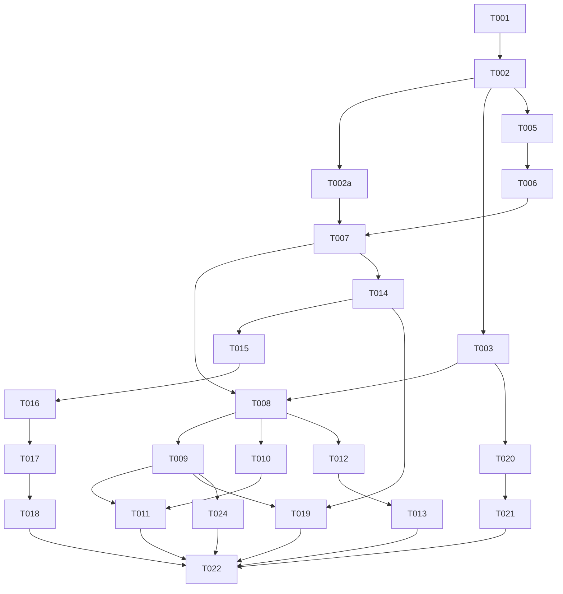

# Tasks: 028 — Big Context Window LLM as RAG

**Input**: Design documents from `/specs/028-big-context-window-llm-as-rag/`
**Prerequisites**: plan.md (required), spec.md (required for user stories), research.md, data-model.md, contracts/

## Format: `[ID] [AGENT] [Story?] Description`

- **[AGENT]**: Specialist agent responsible for the task
- **[Story]**: Which user story this task belongs to (e.g., US1, US2, US3)

## Agent Tags

| Tag | Agent | Domain |
|-----|-------|--------|
| `[DB]` | database-architect | Schema, migrations, seeds, indexes |
| `[BE]` | backend-specialist | API routes, services, middleware, server logic + unit tests |
| `[FE]` | frontend-specialist | Components, pages, styles, client state, UI design |
| `[OPS]` | devops-engineer | Docker, CI/CD, infra, deploy configs |
| `[E2E]` | test-engineer | Cross-boundary integration/E2E tests only |

---

## Phase 1: Setup & Database Foundation

**Purpose**: Database schema changes, Drizzle updates, and configuration wiring.

- [X] T001 [DB] Create migration for schema additions (tenants.groundingMode, personas.groundingMode, personas.bigContextMaxTokens, personas.truncationStrategy, personas.embeddingsStatus, documents.fullText, documents.priority, lz4 compression with PG14 guard) in `drizzle/`. NOTE: the `document_chunks → documents` FK already cascades (`models/documents.ts:30-32`, `onDelete: 'cascade'`) — do NOT add a redundant CASCADE ALTER (claude-F3)
- [X] T002 [DB] Update Drizzle schemas in `packages/core/src/models/documents.ts`, `packages/core/src/models/personas.ts` (incl. `embeddingsStatus` enum column), and `packages/core/src/models/tenants.ts`
- [X] T002a [BE] Collapse the duplicate `GroundingContext` type: delete the local re-declaration in `packages/core/src/services/grounding/retrieval.ts:6-13`, import the canonical one from `packages/core/src/interfaces/IGroundingEngine.ts:10-17`. This is the precondition for adding `DocumentContext` (claude-F1) — without it, the two copies drift and TS structural typing hides the divergence until a consumer reads a field only one copy has. Verify with `npm run validate` (claude-F4)
- [X] T003 [BE] Update persona endpoints Zod schema and fastify route handlers to support grounding configuration in `packages/api/src/routes/personas.ts`
- [X] T004 [DB] (covered by T001 migration — lz4 compression included in `drizzle/0016_grounding_mode_fulltext.sql`)

---

## Phase 2: Ingestion & Document Parsing

**Purpose**: Implement raw plain-text extraction on document ingest, storing it directly in PostgreSQL.

- [X] T005 [BE] [US1] Integrate PDF (`pdf-parse`) and DOCX (`mammoth`) text extractors into `packages/training/src/jobs/document-ingest-worker.ts` and local test worker `packages/core/src/services/document-worker.ts`. **Invalidation**: on insert OR `fullText` update OR hard-delete, the worker MUST reset `personas.embeddingsStatus` to `'idle'` in the SAME DB transaction as the document write (G4 — a `'completed'` flag would otherwise lie about index coverage and serve stale `fallback-vector` results). Applies unconditionally; no-op in vector-mode synchronous path.
- [X] T006 [BE] [US1] Skip/defer vector chunking and embedding generation on ingestion if the persona's effective `groundingMode` is `'big-context'`

---

## Phase 3: User Story 1 - Big Context Grounding (Priority: P1) 🎯 MVP

**Goal**: Implement retrieval logic that loads full documents as `DocumentContext` items (new type, claude-F1) and passes them directly to chat completion. Vector-mode `GroundingContext` items are unchanged.

- [X] T007 [BE] [US1] Define `DocumentContext` interface in `packages/core/src/interfaces/IGroundingEngine.ts` (additive to `GroundingContext`): `{ text: string; score: number; metadata: { documentId: string; priority: number } }` — NO `chunkIndex`. Implement big-context retrieval in `packages/core/src/services/grounding/retrieval.ts` returning one `DocumentContext` item per document with text, `score: 1.0`, and `{ documentId, priority }` metadata. This is an interface ADDITION (claude-F1) — do NOT overload `GroundingContext` with optional fields. BLOCKS ON T002a (claude-F4). **Logger discipline (claude-F9)**: log only via consola `logger` (redacting), NEVER `console.*` — the existing `retrieval.ts:114` `console.warn` is the anti-pattern not to copy.
- [X] T008 [BE] [US1] Route queries based on effective `groundingMode` in `packages/core/src/services/grounding/GroundingEngine.ts`. The return type widens to `GroundingContext[] | DocumentContext[]` (or a discriminated wrapper) — consumers narrow by `groundingMode`. Do NOT force-cast `DocumentContext[]` to `GroundingContext[]` (that's the claude-F1 lie this fix kills). Chat-service (T009) branches on `groundingMode` already, so the union is consumed correctly downstream.
- [X] T009 [BE] [US1] Update `ChatService` in `packages/core/src/services/chat-service.ts` to build LLM system prompts with document content injected as a **prefix-stable block**: the `<documents>` block MUST precede conversation history and the user query, so the doc prefix is invariant across turns and maximizes OmniRoute prompt-cache hit rate (FR-011). The block ordering is part of the contract, not an implementation detail (antigravity-F5)
- [X] T010 [BE] [US1] Ensure query discipline: exclude `fullText` column from all routine documents table queries that do not require full-text content
- [X] T011 [E2E] [US1] Integration tests for tenant-isolated big-context chat grounding in `packages/core/tests/integration/grounding/`

---

## Phase 4: User Story 2 - Doc-Extraction Tuning (Priority: P2)

**Goal**: Update the tuning pipeline to fetch and concatenate the full documents without triggering embedding adapter calls.

- [X] T012 [BE] [US2] Update `DocExtractionPipeline` in `packages/core/src/services/tuning/doc-extraction-pipeline.ts` to retrieve and concatenate raw document text instead of chunks, skipping `/embed` requests
- [X] T013 [E2E] [US2] Integration test verifying doc-extraction tuning finishes with zero embedding calls

---

## Phase 5: User Story 3 - Budget & Truncation (Priority: P3)

**Goal**: Implement dynamic context budget resolution, token counting, truncation strategies, and background indexing fallback.

- [X] T014 [BE] [US3] Implement strict token-count cascade in `packages/core/src/services/grounding/retrieval.ts`: Tier 1 = OmniRoute `POST /v1/messages/count_tokens` → Tier 2 = local `js-tiktoken` (`cl100k_base`) on OmniRoute failure → Tier 3 = `chars/4` estimate + `logger.warn` only if tiktoken itself throws. Never collapse Tier 1 → Tier 3 (Cyrillic under-count risk). Always proceed with the LLM call (antigravity-F3)
- [X] T015 [BE] [US3] Implement priority and recency-based greedy truncation (`'silent'` strategy) to fit documents within budget
- [X] T016 [BE] [US3] Implement `'fallback-vector'` strategy: gate strictly on `personas.embeddingsStatus === 'completed'` (FR-004/FR-006). If the flag is `'idle'` or `'processing'`, degrade to `'silent'` truncation for that request and `logger.warn` that fallback was skipped — never run vector search against a partial index. If `'completed'`, run vector search (antigravity-F1)
- [X] T017 [BE] [US3] Create BullMQ lazy background embedding job and worker in `packages/training/src/jobs/lazy-embed-worker.ts` to index documents for fallback RAG. The worker MUST drive the persona's `embeddingsStatus` lifecycle: `idle → processing` on job pickup, `processing → completed` on success, `processing → idle` (with `logger.error`) on terminal failure. This flag is the single source of truth T016 gates on (antigravity-F1)
- [X] T018 [E2E] [US3] Integration tests for silent truncation ordering, fallback-vector degradation, and lazy embedding background jobs. MUST also cover **embeddingsStatus invalidation** (G4): after a completed index, inserting/updating/deleting a doc resets the flag to `'idle'` and `fallback-vector` degrades to `'silent'` until the lazy worker rebuilds.

---

## Phase 6: Polish & Cross-Cutting Concerns

**Purpose**: Surface telemetry, warnings, and performance audits.

- [X] T019 [BE] Log cost/latency metrics and emit input-token usage data to Langfuse trace per reply
- [X] T020 [BE] Implement model-window adequacy warnings when `groundingMode: 'big-context'` is enabled with a model window < 32K tokens
- [X] T021 [FE] Surface grounding configuration, priority setters, and model warnings to administrative UI controllers
- [X] T022 [OPS] Validate quickstart.md and perform a final check of all end-to-end flows
- [X] T024 [E2E] [US1] Golden-Q&A regression suite to verify SC-001

---

## Dependency Graph

### Dependencies

T001 → T002                    # migration before drizzle updates
T002 → T002a                   # drizzle schemas stable before collapsing duplicate type (claude-F4)
T002a → T007                   # single canonical GroundingContext before adding DocumentContext (claude-F1 blocks on claude-F4)
T002 → T003                    # drizzle schemas before API validation update
T002 → T005                    # schemas before ingest worker text extraction
T005 → T006                    # text extraction before skipping/deferring embedding
T006 → T007                    # ingest setup completes before retrieval logic
T003 + T007 → T008             # retrieval and configuration API before engine routing
T008 → T009                    # engine routing before chat prompt composition
T008 → T010                    # engine routing before query discipline check
T009 + T010 → T011             # chat logic and query discipline before E2E tests
T008 → T012                    # engine routing before doc-extraction tuning updates
T012 → T013                    # doc-extraction updates before tuning integration tests
T007 → T014                    # retrieval logic before token counting integration
T014 → T015                    # token counting before silent truncation strategy
T015 → T016                    # truncation strategy before fallback-vector routing
T016 → T017                    # fallback-vector routing before lazy embedding worker
T017 → T018                    # lazy embedding worker before truncation/fallback tests
T009 + T014 → T019             # chat logic and token counts before Langfuse cost logging
T003 → T020                    # config schema before model adequacy warnings
T020 → T021                    # model adequacy check before FE admin UI bindings
T011 + T013 + T018 + T019 + T021 → T022 # All US tests and UI configs complete before final validation
T009 → T024                      # chat logic before golden-Q&A regression (needs the big-context reply path live)
T024 → T022                      # golden-Q&A before final validation

### Dependency Visualization

---

## Parallel Lanes

| Lane | Agent Flow | Tasks | Blocked By |
|------|-----------|-------|------------|
| 1 | [DB] | T001 → T002 → T004 | — |
| 2 | [BE] | T002a → T003 → T005 → T006 → T007 → T008 → T009 → T010 | T002 |
| 3 | [BE] | T012 | T008 |
| 4 | [BE] | T014 → T015 → T016 → T017 | T007 |
| 5 | [BE] | T019, T020 | T009, T014 |
| 6 | [FE] | T021 | T020 |
| 7 | [E2E] | T011, T013, T018, T024 | T009, T012, T017 |
| 8 | [OPS] | T022 | T011, T013, T018, T019, T021, T024 |

---

## Agent Summary

| Agent | Task Count | Can Start After |
|-------|-----------|-----------------|
| [DB] | 3 | immediately |
| [BE] | 14 | T002 |
| [FE] | 1 | T020 |
| [E2E] | 4 | T009, T012, T017 |
| [OPS] | 1 | T011, T013, T018, T019, T021, T024 |

**Critical Path**: T001 → T002 → T002a → T005 → T006 → T007 → T008 → T014 → T015 → T016 → T017 → T018 → T022

---

## Agent Dispatch Plan

| Agent | Subagent | Skills | Input Context | Tasks | Files |
|-------|----------|--------|---------------|-------|-------|
| `[DB]` | `database-architect` | `database-design` | data-model.md, plan.md §storage | T001, T002, T004 | `packages/core/src/models/`, `drizzle/` |
| `[BE]` | `backend-specialist` | `api-patterns`, `system-design-patterns` | spec.md, plan.md §technical-context, contracts/grounding-config.md | T002a, T003, T005, T006, T007, T008, T009, T010, T012, T014, T015, T016, T017, T019, T020 | `packages/core/src/services/`, `packages/core/src/interfaces/`, `packages/training/src/jobs/`, `packages/api/src/routes/` |
| `[FE]` | `frontend-specialist` | `react-patterns`, `tailwind-patterns` | contracts/grounding-config.md | T021 | `packages/api/` (mock controller/UI settings endpoints) |
| `[E2E]` | `test-engineer` | `testing-patterns`, `webapp-testing` | spec.md §testing, quickstart.md | T011, T013, T018, T024 | `packages/core/tests/` |
| `[OPS]` | `devops-engineer` | `deployment-procedures` | quickstart.md | T022 | Workspace root |

---

## Implementation Strategy

### MVP First (User Story 1 Only)

1. Complete Setup & Database Foundation (T001, T002, T003, T004).
2. Complete Ingestion & Document Parsing for US1 (T005, T006).
3. Complete Retrieval, Routing, Chat Service Prompt composition (T007, T008, T009, T010).
4. Run integration tests (T011) to verify MVP chat grounding.
